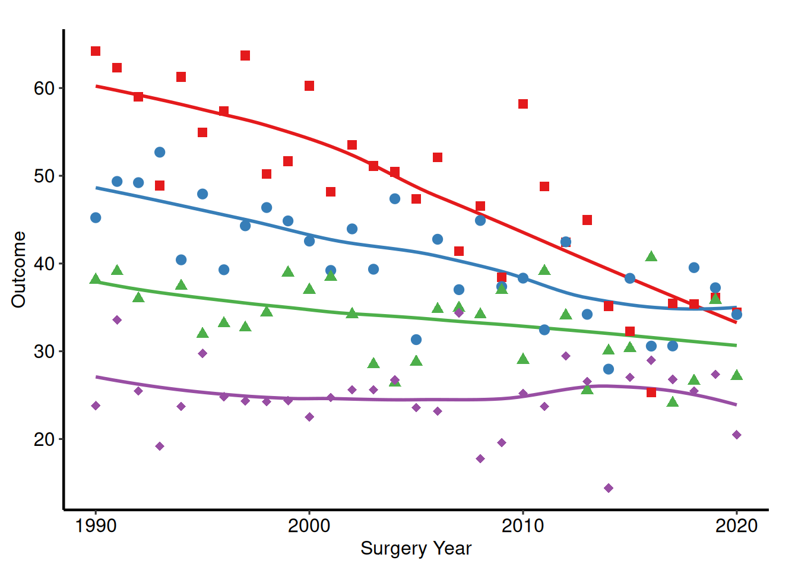
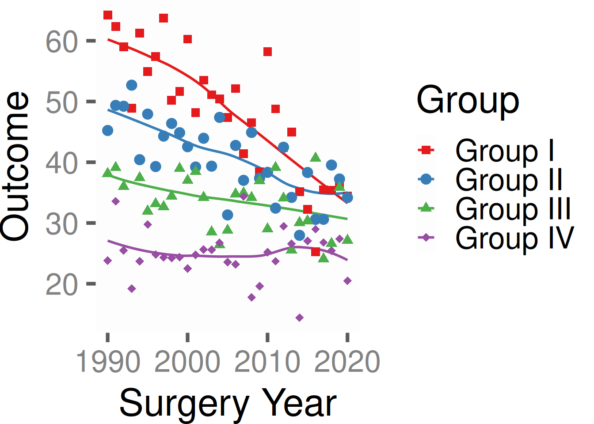
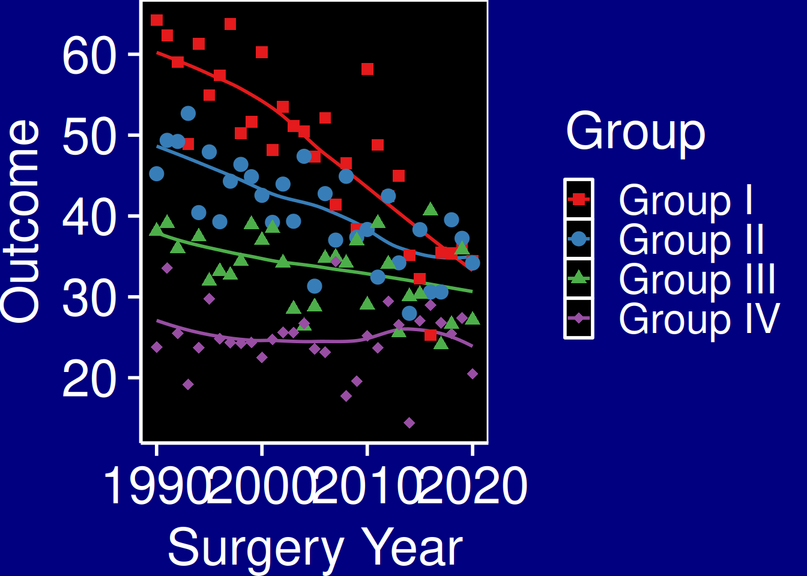
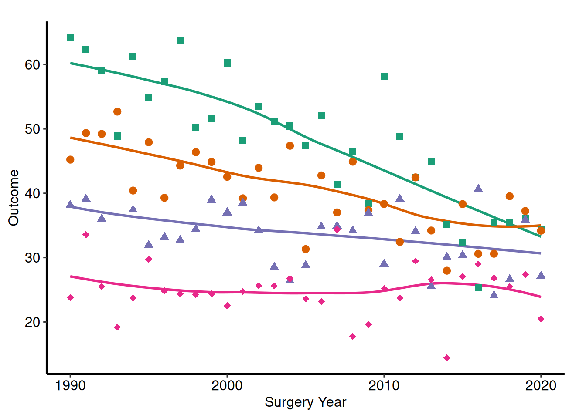
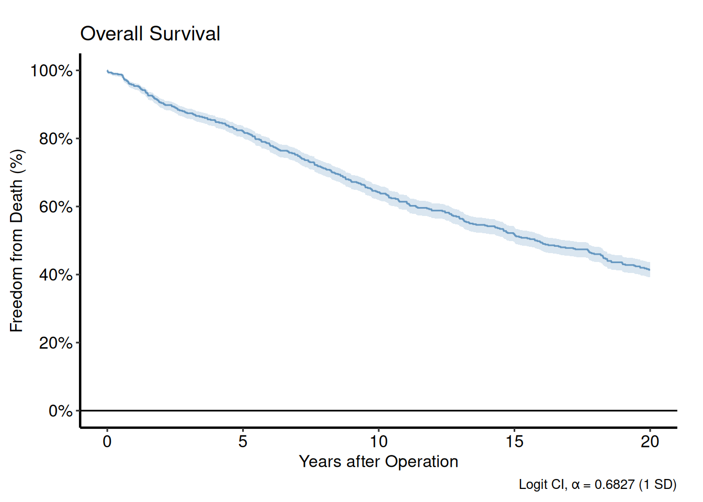
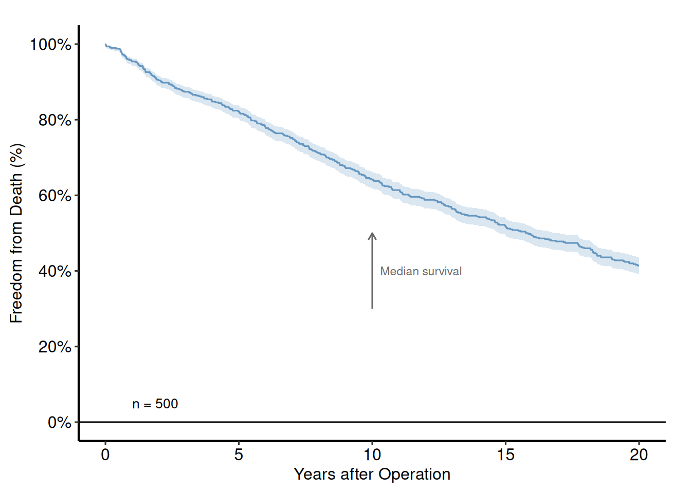
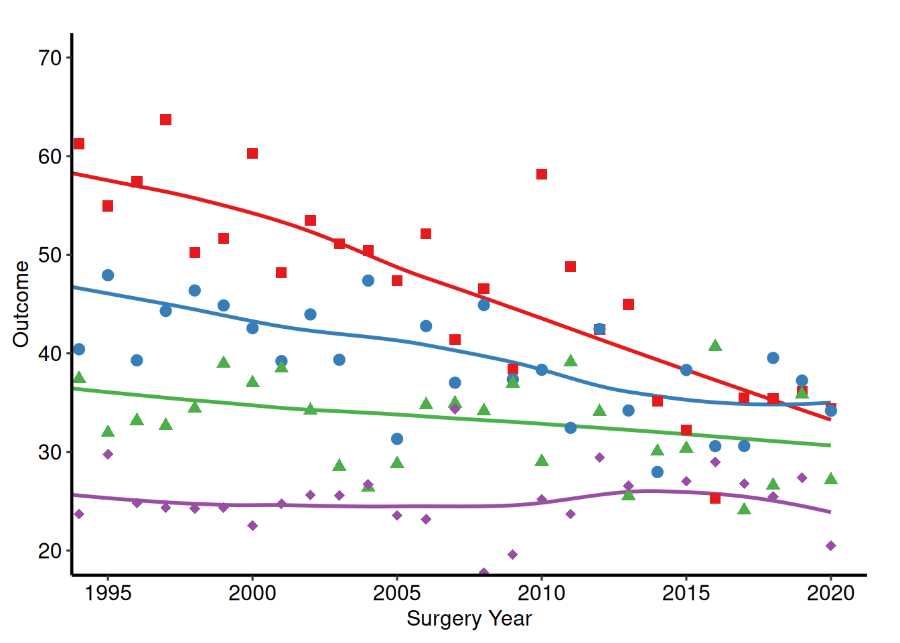

# Decorating and Saving hvtiPlotR Plots

``` r
local({
  r_libs <- trimws(Sys.getenv("R_LIBS"))
  if (nzchar(r_libs)) {
    sep   <- if (.Platform$OS.type == "windows") ";" else ":"
    paths <- strsplit(r_libs, sep, fixed = TRUE)[[1]]
    .libPaths(unique(c(paths, .libPaths())))
  }
})
library(ggplot2)
library(hvtiPlotR)
```

## The Composition Pattern

Every hvtiPlotR plot function returns a bare `ggplot` object — no colour
scales, axis labels, or theme are applied. Decoration is added by
chaining layers with `+`:

    bare_plot() +
      scale_colour_*() +   # data colours
      scale_fill_*()   +   # fill colours
      labs()           +   # axis labels, title, caption
      annotate()       +   # text/arrows placed on the panel
      coord_cartesian() +  # viewport cropping
      hvti_theme()         # non-data formatting

This vignette demonstrates each decorator in turn, using
[`trends_plot()`](https://ehrlinger.github.io/hvtiPlotR/reference/trends_plot.md)
and
[`survival_curve()`](https://ehrlinger.github.io/hvtiPlotR/reference/survival_curve.md)
as representative base plots.

``` r
# Trends data — multi-group continuous outcome over time
dta_trends <- sample_trends_data(n = 600, seed = 42)
p_base <- trends_plot(dta_trends)

# KM data — survival curve
dta_km  <- sample_survival_data(n = 500, seed = 42)
km      <- survival_curve(dta_km, alpha = 0.8)
```

## Themes

The **hvtiPlotR** package provides four themes via `hvti_theme(style)`.
The `style` argument selects the output target.

| Style          | Target                                  |
|----------------|-----------------------------------------|
| `"manuscript"` | Journal PDF, black-on-white             |
| `"poster"`     | Conference poster, slightly larger text |
| `"light_ppt"`  | PowerPoint on white/light background    |
| `"dark_ppt"`   | PowerPoint on dark/blue background      |

### Manuscript

``` r
p_base +
  scale_colour_brewer(palette = "Set1", name = "Group") +
  scale_shape_manual(
    values = c("Group I" = 15, "Group II" = 19,
               "Group III" = 17, "Group IV" = 18),
    name = "Group"
  ) +
  labs(x = "Surgery Year", y = "Outcome") +
  hvti_theme("manuscript")
```



### Poster

``` r
p_base +
  scale_colour_brewer(palette = "Set1", name = "Group") +
  scale_shape_manual(
    values = c("Group I" = 15, "Group II" = 19,
               "Group III" = 17, "Group IV" = 18),
    name = "Group"
  ) +
  labs(x = "Surgery Year", y = "Outcome") +
  hvti_theme("poster")
```


### Light PowerPoint

``` r
p_base +
  scale_colour_brewer(palette = "Set1", name = "Group") +
  scale_shape_manual(
    values = c("Group I" = 15, "Group II" = 19,
               "Group III" = 17, "Group IV" = 18),
    name = "Group"
  ) +
  labs(x = "Surgery Year", y = "Outcome") +
  hvti_theme("light_ppt")
```



### Dark PowerPoint

``` r
p_base +
  scale_colour_brewer(palette = "Set1", name = "Group") +
  scale_shape_manual(
    values = c("Group I" = 15, "Group II" = 19,
               "Group III" = 17, "Group IV" = 18),
    name = "Group"
  ) +
  labs(x = "Surgery Year", y = "Outcome") +
  hvti_theme("dark_ppt") +
  theme(plot.background = element_rect(fill = "navy", colour = "navy"))
```



## Colour Scales

`scale_colour_*` controls line and point colours; `scale_fill_*`
controls filled areas (ribbons, bars). Both share the same `name`
(legend title) and `guide` (legend display) arguments.

### Manual colours

Use
[`scale_colour_manual()`](https://ggplot2.tidyverse.org/reference/scale_manual.html)
when assigning specific brand or convention colours to known levels.

``` r
km$survival_plot +
  scale_color_manual(values = c(All = "steelblue"), guide = "none") +
  scale_fill_manual(values  = c(All = "steelblue"), guide = "none") +
  scale_y_continuous(breaks = seq(0, 100, 20),
                     labels = function(x) paste0(x, "%")) +
  scale_x_continuous(breaks = seq(0, 20, 5)) +
  coord_cartesian(xlim = c(0, 20), ylim = c(0, 100)) +
  labs(x = "Years after Operation", y = "Freedom from Death (%)") +
  hvti_theme("manuscript")
```


### ColorBrewer palettes

[`scale_colour_brewer()`](https://ggplot2.tidyverse.org/reference/scale_brewer.html)
applies a ColorBrewer palette — safe, perceptually uniform, and
print-friendly. Use `palette = "Set1"` for categorical data, `"RdYlGn"`
for diverging, `"Blues"` for sequential.

``` r
p_base +
  scale_colour_brewer(palette = "Set1", name = "Group") +
  scale_shape_manual(
    values = c("Group I" = 15, "Group II" = 19,
               "Group III" = 17, "Group IV" = 18),
    name = "Group"
  ) +
  labs(x = "Surgery Year", y = "Outcome") +
  hvti_theme("manuscript")
```


### Suppressing legends

Pass `guide = "none"` to any scale to remove its legend entry. Use this
when colour is self-evident from axis labels or annotations.

``` r
p_base +
  scale_colour_brewer(palette = "Dark2", guide = "none") +
  scale_shape_manual(
    values = c("Group I" = 15, "Group II" = 19,
               "Group III" = 17, "Group IV" = 18),
    guide = "none"
  ) +
  labs(x = "Surgery Year", y = "Outcome") +
  hvti_theme("manuscript")
```



## Labels and Annotations

### labs()

[`labs()`](https://ggplot2.tidyverse.org/reference/labs.html) sets the
axis, legend, title, subtitle, and caption text. Set axis labels here
rather than inside the plot function so they can be overridden per
project.

``` r
km$survival_plot +
  scale_color_manual(values = c(All = "steelblue"), guide = "none") +
  scale_fill_manual(values  = c(All = "steelblue"), guide = "none") +
  scale_y_continuous(breaks = seq(0, 100, 20),
                     labels = function(x) paste0(x, "%")) +
  scale_x_continuous(breaks = seq(0, 20, 5)) +
  coord_cartesian(xlim = c(0, 20), ylim = c(0, 100)) +
  labs(
    title   = "Overall Survival",
    x       = "Years after Operation",
    y       = "Freedom from Death (%)",
    caption = "Logit CI, \u03b1 = 0.6827 (1 SD)"
  ) +
  hvti_theme("manuscript")
```



### annotate()

[`annotate()`](https://ggplot2.tidyverse.org/reference/annotate.html)
places text, segments, or rectangles at fixed data coordinates. Use it
for sample size callouts, phase labels, or directional arrows.

``` r
km$survival_plot +
  scale_color_manual(values = c(All = "steelblue"), guide = "none") +
  scale_fill_manual(values  = c(All = "steelblue"), guide = "none") +
  scale_y_continuous(breaks = seq(0, 100, 20),
                     labels = function(x) paste0(x, "%")) +
  scale_x_continuous(breaks = seq(0, 20, 5)) +
  coord_cartesian(xlim = c(0, 20), ylim = c(0, 100)) +
  labs(x = "Years after Operation", y = "Freedom from Death (%)") +
  annotate("text",    x = 1,  y = 5,
           label = paste0("n = ", nrow(dta_km)),
           hjust = 0, size = 3.5) +
  annotate("segment", x = 10, xend = 10, y = 30, yend = 50,
           arrow = arrow(length = unit(0.2, "cm")), colour = "grey40") +
  annotate("text",    x = 10.3, y = 40,
           label = "Median survival", hjust = 0, size = 3, colour = "grey40") +
  hvti_theme("manuscript")
```



### coord_cartesian()

[`coord_cartesian()`](https://ggplot2.tidyverse.org/reference/coord_cartesian.html)
crops the viewport without dropping data, preserving LOESS fits computed
on the full range.

``` r
p_base +
  scale_colour_brewer(palette = "Set1", name = "Group") +
  scale_shape_manual(
    values = c("Group I" = 15, "Group II" = 19,
               "Group III" = 17, "Group IV" = 18),
    name = "Group"
  ) +
  labs(x = "Surgery Year", y = "Outcome") +
  coord_cartesian(xlim = c(1995, 2020), ylim = c(20, 70)) +
  hvti_theme("manuscript")
```



## Saving Figures

### Manuscript PDF

Use [`ggsave()`](https://ggplot2.tidyverse.org/reference/ggsave.html)
with `width = 11, height = 8.5` (US Letter landscape) for manuscript
figures. Assign the fully composed plot to a variable first so the same
object is both displayed in the session and written to disk.

``` r
p_ms <- p_base +
  scale_colour_brewer(palette = "Set1", name = "Group") +
  scale_shape_manual(
    values = c("Group I" = 15, "Group II" = 19,
               "Group III" = 17, "Group IV" = 18),
    name = "Group"
  ) +
  labs(x = "Surgery Year", y = "Outcome (%)") +
  hvti_theme("manuscript")

ggsave(
  filename = "../graphs/trends_manuscript.pdf",
  plot     = p_ms,
  width    = 11,
  height   = 8.5
)
```

### Poster PDF

Poster figures are typically larger and use `hvti_theme("poster")`.
Adjust dimensions to match the poster panel size.

``` r
p_poster <- p_base +
  scale_colour_brewer(palette = "Set1", name = "Group") +
  scale_shape_manual(
    values = c("Group I" = 15, "Group II" = 19,
               "Group III" = 17, "Group IV" = 18),
    name = "Group"
  ) +
  labs(x = "Surgery Year", y = "Outcome (%)") +
  hvti_theme("poster")

ggsave(
  filename = "../graphs/trends_poster.pdf",
  plot     = p_poster,
  width    = 14,
  height   = 10
)
```

### PowerPoint slides

[`save_ppt()`](https://ehrlinger.github.io/hvtiPlotR/reference/save_ppt.md)
from the **hvtiPlotR** package inserts a ggplot object into a PowerPoint
file as an editable vector graphic (via the `officer` and `rvg`
packages). Apply `hvti_theme("dark_ppt")` or `hvti_theme("light_ppt")`
before saving.

``` r
p_ppt <- p_base +
  scale_colour_brewer(palette = "Set1", name = "Group") +
  scale_shape_manual(
    values = c("Group I" = 15, "Group II" = 19,
               "Group III" = 17, "Group IV" = 18),
    name = "Group"
  ) +
  labs(x = "Surgery Year", y = "Outcome (%)") +
  hvti_theme("dark_ppt")

save_ppt(
  plot     = p_ppt,
  filename = "../graphs/trends_slides.pptx",
  width    = 10,
  height   = 7.5
)
```

### Multi-panel PDF (EDA batch output)

When generating multiple plots in a loop,
[`gridExtra::marrangeGrob()`](https://rdrr.io/pkg/gridExtra/man/arrangeGrob.html)
arranges them into a grid and
[`ggsave()`](https://ggplot2.tidyverse.org/reference/ggsave.html) writes
each page.

``` r
# Build a list of plots (e.g. from an eda_plot() lapply loop)
plot_list <- lapply(
  c("ef", "lv_mass", "peak_grad"),
  function(yv) {
    dta_eda <- sample_eda_data()
    eda_plot(dta_eda, x_col = "op_years", y_col = yv,
             y_label = yv) +
      scale_colour_manual(values = c("steelblue"), guide = "none") +
      labs(x = "Years") +
      hvti_theme("manuscript")
  }
)

per_page <- 9L
for (pg in seq(1, length(plot_list), by = per_page)) {
  idx  <- seq(pg, min(pg + per_page - 1L, length(plot_list)))
  grob <- gridExtra::marrangeGrob(plot_list[idx], nrow = 3, ncol = 3)
  ggsave(
    filename = sprintf("../graphs/eda_page%02d.pdf", ceiling(pg / per_page)),
    plot     = grob,
    width    = 14,
    height   = 14
  )
}
```
