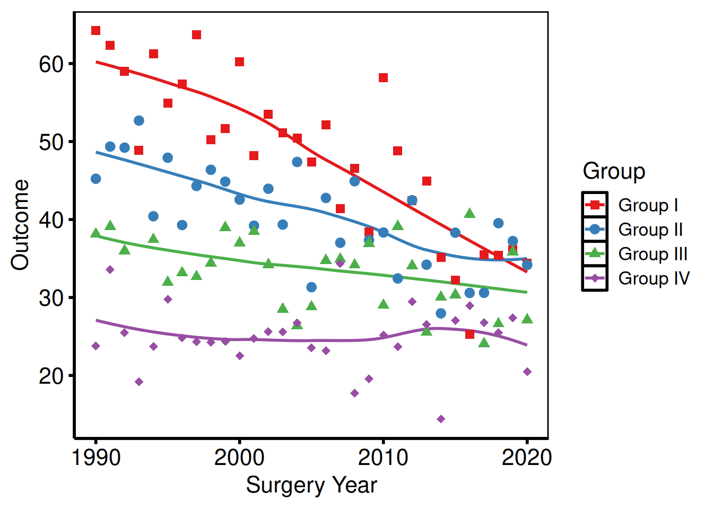
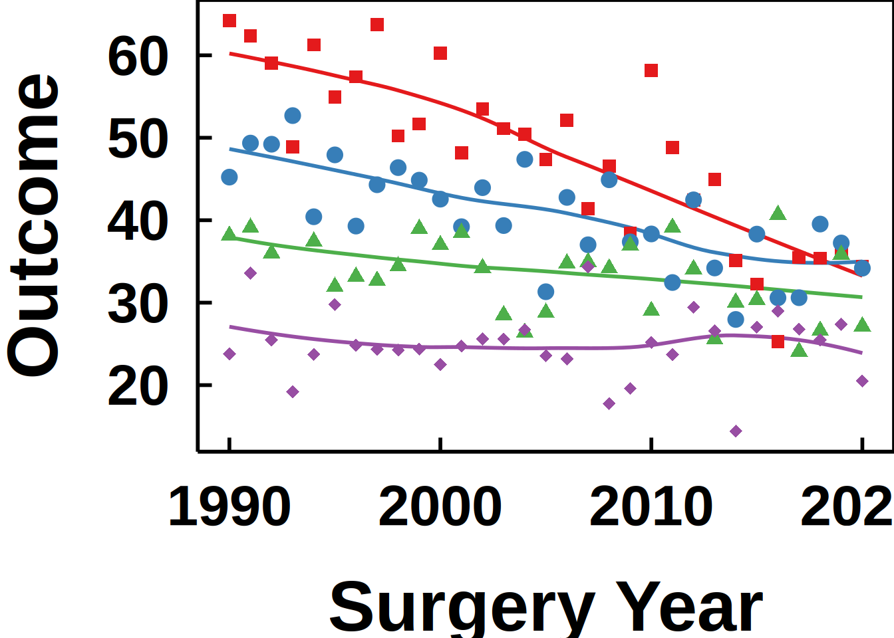
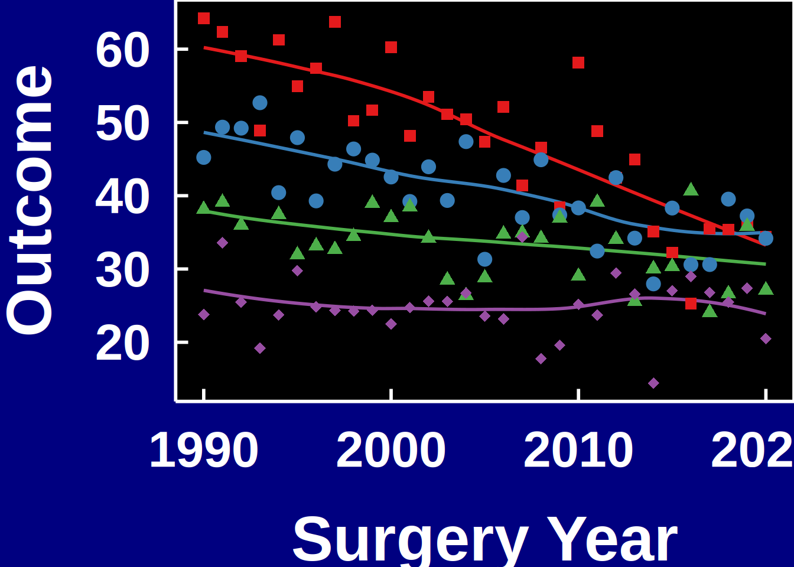

# Decorating and Saving hvtiPlotR Plots

``` r

local({
  r_libs <- trimws(Sys.getenv("R_LIBS"))
  if (nzchar(r_libs)) {
    sep   <- if (.Platform$OS.type == "windows") ";" else ":"
    paths <- strsplit(r_libs, sep, fixed = TRUE)[[1]]
    .libPaths(unique(c(paths, .libPaths())))
  }
})
library(ggplot2)
library(hvtiPlotR)
```

## The Composition Pattern

Every hvtiPlotR plot is built in two steps: a constructor (`hv_*()`)
that shapes the data, followed by
[`plot()`](https://rdrr.io/r/graphics/plot.default.html) that renders a
bare `ggplot` object. No colour scales, axis labels, or theme are
applied by either step — you add those by chaining layers with `+`:

    plot(hv_*(...)) +
      scale_colour_*() +   # data colours
      scale_fill_*()   +   # fill colours
      labs()           +   # axis labels, title, caption
      annotate()       +   # text/arrows placed on the panel
      coord_cartesian() +  # viewport cropping
      theme_hv_manuscript()         # non-data formatting

This vignette demonstrates each decorator in turn, using
[`hv_trends()`](https://ehrlinger.github.io/hvtiPlotR/reference/hv_trends.md)
and
[`hv_survival()`](https://ehrlinger.github.io/hvtiPlotR/reference/hv_survival.md)
as representative base plots.

``` r

# Trends data — multi-group continuous outcome over time
dta_trends <- sample_trends_data(n = 600, seed = 42)
p_base     <- plot(hv_trends(dta_trends))

# KM data — survival curve
dta_km <- sample_survival_data(n = 500, seed = 42)
km     <- hv_survival(dta_km)
```

## Themes

The **hvtiPlotR** package provides four themes via `theme_hv_*()`. The
`style` argument selects the output target.

| Style          | Target                                  |
|----------------|-----------------------------------------|
| `"manuscript"` | Journal PDF, black-on-white             |
| `"poster"`     | Conference poster, slightly larger text |
| `"light_ppt"`  | PowerPoint on white/light background    |
| `"dark_ppt"`   | PowerPoint on dark/blue background      |

### Manuscript

[`theme_hv_manuscript()`](https://ehrlinger.github.io/hvtiPlotR/reference/hvtiPlotR-themes.md)
is the default for journal submissions – white background, black text,
minimal chrome. Font sizes are tuned for 8.5 x 11 inch letter-size PDFs
where the figure may be reduced to a column width. Use this whenever the
figure ends up in a Word or PDF document sent to a journal.

``` r

p_ms <- p_base +
  scale_colour_brewer(palette = "Set1", name = "Group") +
  scale_shape_manual(
    values = c("Group I" = 15, "Group II" = 19,
               "Group III" = 17, "Group IV" = 18),
    name = "Group"
  ) +
  labs(x = "Surgery Year", y = "Outcome") +
  theme_hv_manuscript()

p_ms
```


### Poster

[`theme_hv_poster()`](https://ehrlinger.github.io/hvtiPlotR/reference/hvtiPlotR-themes.md)
bumps the axis text and tick weights up from the manuscript baseline and
removes the panel grid, so the figure reads clearly at arm’s length on a
36 x 48 inch foam board. It is also the go-to theme for in-room slide
presentations when you are not using the PowerPoint themes – the larger
tick labels and the boxed panel hold up on a projector better than the
manuscript variant. Pass `base_family = "sans"` (or another family) to
switch the font face.

``` r

p_poster <- p_base +
  scale_colour_brewer(palette = "Set1", name = "Group") +
  scale_shape_manual(
    values = c("Group I" = 15, "Group II" = 19,
               "Group III" = 17, "Group IV" = 18),
    name = "Group"
  ) +
  labs(x = "Surgery Year", y = "Outcome") +
  theme_hv_poster()

p_poster
```



### Light PowerPoint

[`theme_hv_ppt_light()`](https://ehrlinger.github.io/hvtiPlotR/reference/hvtiPlotR-themes.md)
matches slides with a white or light-grey background – the Cleveland
Clinic standard template, most default Office themes, and any deck where
the content area is light. Text and lines are dark, so the figure reads
without modification when placed on the light slide. Pair with
[`save_ppt()`](https://ehrlinger.github.io/hvtiPlotR/reference/save_ppt.md)
to insert it as editable DrawingML.

``` r

p_base +
  scale_colour_brewer(palette = "Set1", name = "Group") +
  scale_shape_manual(
    values = c("Group I" = 15, "Group II" = 19,
               "Group III" = 17, "Group IV" = 18),
    name = "Group"
  ) +
  labs(x = "Surgery Year", y = "Outcome") +
  theme_hv_ppt_light()
```



### Dark PowerPoint

[`theme_hv_ppt_dark()`](https://ehrlinger.github.io/hvtiPlotR/reference/hvtiPlotR-themes.md)
flips the palette for dark-background slides – navy or dark-blue
gradient decks where white-on-dark text is the convention. The theme
sets a transparent plot background, so the slide’s background shows
through behind the panel. The `plot.background` override in the chunk
below simulates that navy background in the rendered vignette; you would
omit it when saving to an actual `.pptx` file.

``` r

p_base +
  scale_colour_brewer(palette = "Set1", name = "Group") +
  scale_shape_manual(
    values = c("Group I" = 15, "Group II" = 19,
               "Group III" = 17, "Group IV" = 18),
    name = "Group"
  ) +
  labs(x = "Surgery Year", y = "Outcome") +
  theme_hv_ppt_dark() +
  theme(plot.background = element_rect(fill = "navy", colour = "navy"))
```



## Colour Scales

`scale_colour_*` controls line and point colours; `scale_fill_*`
controls filled areas (ribbons, bars). Both take the same `name` (legend
title) and `guide` (legend display) arguments — set them once and both
scales update.

### Manual colours

Use
[`scale_colour_manual()`](https://ggplot2.tidyverse.org/reference/scale_manual.html)
when assigning specific brand or convention colours to known levels.

``` r

plot(km) +
  scale_color_manual(values = c(All = "steelblue"), guide = "none") +
  scale_fill_manual(values  = c(All = "steelblue"), guide = "none") +
  scale_y_continuous(breaks = seq(0, 100, 20),
                     labels = function(x) paste0(x, "%")) +
  scale_x_continuous(breaks = seq(0, 20, 5)) +
  coord_cartesian(xlim = c(0, 20), ylim = c(0, 100)) +
  labs(x = "Years after Operation", y = "Freedom from Death (%)") +
  theme_hv_poster()
```


### ColorBrewer palettes

[`scale_colour_brewer()`](https://ggplot2.tidyverse.org/reference/scale_brewer.html)
applies a ColorBrewer palette — perceptually uniform and print-safe,
which matters when figures go to black-and-white PDF. Use
`palette = "Set1"` for categorical data, `"RdYlGn"` for diverging,
`"Blues"` for sequential.

``` r

p_base +
  scale_colour_brewer(palette = "Set1", name = "Group") +
  scale_shape_manual(
    values = c("Group I" = 15, "Group II" = 19,
               "Group III" = 17, "Group IV" = 18),
    name = "Group"
  ) +
  labs(x = "Surgery Year", y = "Outcome") +
  theme_hv_poster()
```


### Suppressing legends

Pass `guide = "none"` to any scale and that aesthetic drops out of the
legend. You’d do this when the axis labels or an annotation already name
the group — a redundant legend only takes up panel space.

``` r

p_base +
  scale_colour_brewer(palette = "Dark2", guide = "none") +
  scale_shape_manual(
    values = c("Group I" = 15, "Group II" = 19,
               "Group III" = 17, "Group IV" = 18),
    guide = "none"
  ) +
  labs(x = "Surgery Year", y = "Outcome") +
  theme_hv_poster()
```


## Labels and Annotations

### labs()

[`labs()`](https://ggplot2.tidyverse.org/reference/labs.html) sets axis
labels, the plot title, legend title, subtitle, and caption text. We set
these outside the constructor so you can override them per project
without touching the function itself.

``` r

plot(km) +
  scale_color_manual(values = c(All = "steelblue"), guide = "none") +
  scale_fill_manual(values  = c(All = "steelblue"), guide = "none") +
  scale_y_continuous(breaks = seq(0, 100, 20),
                     labels = function(x) paste0(x, "%")) +
  scale_x_continuous(breaks = seq(0, 20, 5)) +
  coord_cartesian(xlim = c(0, 20), ylim = c(0, 100)) +
  labs(
    title   = "Overall Survival",
    x       = "Years after Operation",
    y       = "Freedom from Death (%)",
    caption = "Logit CI, \u03b1 = 0.6827 (1 SD)"
  ) +
  theme_hv_poster()
```


### annotate()

[`annotate()`](https://ggplot2.tidyverse.org/reference/annotate.html)
places text, segments, rectangles, or arrows at fixed data coordinates —
useful for a sample-size callout in the corner or a label pointing to an
event of interest.

``` r

plot(km) +
  scale_color_manual(values = c(All = "steelblue"), guide = "none") +
  scale_fill_manual(values  = c(All = "steelblue"), guide = "none") +
  scale_y_continuous(breaks = seq(0, 100, 20),
                     labels = function(x) paste0(x, "%")) +
  scale_x_continuous(breaks = seq(0, 20, 5)) +
  coord_cartesian(xlim = c(0, 20), ylim = c(0, 100)) +
  labs(x = "Years after Operation", y = "Freedom from Death (%)") +
  annotate("text",    x = 1,  y = 5,
           label = paste0("n = ", nrow(dta_km)),
           hjust = 0, size = 3.5) +
  annotate("segment", x = 10, xend = 10, y = 30, yend = 50,
           arrow = arrow(length = unit(0.2, "cm")), colour = "grey40") +
  annotate("text",    x = 10.3, y = 40,
           label = "Median survival", hjust = 0, size = 3, colour = "grey40") +
  theme_hv_poster()
```


### coord_cartesian()

[`coord_cartesian()`](https://ggplot2.tidyverse.org/reference/coord_cartesian.html)
crops the viewport without dropping data, preserving LOESS fits computed
on the full range.

``` r

p_base +
  scale_colour_brewer(palette = "Set1", name = "Group") +
  scale_shape_manual(
    values = c("Group I" = 15, "Group II" = 19,
               "Group III" = 17, "Group IV" = 18),
    name = "Group"
  ) +
  labs(x = "Surgery Year", y = "Outcome") +
  coord_cartesian(xlim = c(1995, 2020), ylim = c(20, 70)) +
  theme_hv_poster()
```


## Saving Figures

### Manuscript PDF

Use [`ggsave()`](https://ggplot2.tidyverse.org/reference/ggsave.html)
with `width = 11, height = 8.5` (US Letter landscape) for manuscript
figures. Assign the fully composed plot to a variable first so the same
object is both displayed in the session and written to disk.

``` r

ggsave(
  filename = "../graphs/trends_manuscript.pdf",
  plot     = p_ms,
  width    = 11,
  height   = 8.5
)
```

### Poster PDF

Poster figures are typically larger and use
[`theme_hv_poster()`](https://ehrlinger.github.io/hvtiPlotR/reference/hvtiPlotR-themes.md).
Adjust dimensions to match the poster panel size.

``` r

ggsave(
  filename = "../graphs/trends_poster.pdf",
  plot     = p_poster,
  width    = 14,
  height   = 10
)
```

### PowerPoint slides

[`save_ppt()`](https://ehrlinger.github.io/hvtiPlotR/reference/save_ppt.md)
inserts ggplot objects into a PowerPoint file as **editable DrawingML
vector graphics** via the `officer` and `rvg` packages — shapes, lines,
and text remain selectable in PowerPoint after export.

Key arguments:

| Argument | Default | Notes |
|----|----|----|
| `object` | — | A single ggplot **or** a named/unnamed list of ggplots |
| `template` | `"../graphs/RD.pptx"` | Existing `.pptx` used as the slide template |
| `powerpoint` | `"../graphs/pptExample.pptx"` | Output file path |
| `slide_titles` | `"Plot"` | Character vector recycled to the number of plots |
| `layout` | `"Title and Content"` | Slide layout from the template |
| `width` / `height` | `10.1` / `5.8` | Plot area in inches |
| `left` / `top` | `0.0` / `1.2` | Position from slide edges, in inches |

Apply
[`theme_hv_ppt_dark()`](https://ehrlinger.github.io/hvtiPlotR/reference/hvtiPlotR-themes.md)
or
[`theme_hv_ppt_light()`](https://ehrlinger.github.io/hvtiPlotR/reference/hvtiPlotR-themes.md)
before saving to match the slide background.

#### Single slide

Build a fully themed plot –
[`theme_hv_ppt_dark()`](https://ehrlinger.github.io/hvtiPlotR/reference/hvtiPlotR-themes.md)
or
[`theme_hv_ppt_light()`](https://ehrlinger.github.io/hvtiPlotR/reference/hvtiPlotR-themes.md)
– then pass it as `object`. The `template` argument points to an
existing `.pptx` file whose slide master and layouts carry the brand
fonts and background;
[`save_ppt()`](https://ehrlinger.github.io/hvtiPlotR/reference/save_ppt.md)
appends a new slide rather than overwriting the template.

``` r

template <- system.file("ClevelandClinic.pptx", package = "hvtiPlotR")

p_ppt <- p_base +
  scale_colour_brewer(palette = "Set1", name = "Group") +
  scale_shape_manual(
    values = c("Group I" = 15, "Group II" = 19,
               "Group III" = 17, "Group IV" = 18),
    name = "Group"
  ) +
  labs(x = "Surgery Year", y = "Outcome (%)") +
  theme_hv_ppt_dark()

save_ppt(
  object       = p_ppt,
  template     = template,
  powerpoint   = here::here("graphs", "trends_slides.pptx"),
  slide_titles = "Temporal Trends by Group"
)
```

#### Multiple slides from a list

Pass a named list of plots and a matching vector of titles to produce
one slide per plot in a single call. This is the pattern we use for
batch-report decks where each outcome gets its own slide – the list
keeps plots in order and the names serve as a paper trail. Every plot in
the list should carry the same theme so the deck looks consistent.

``` r

dta_km2 <- sample_survival_data(n = 400, seed = 99)
km2     <- hv_survival(dta_km2)

p_km_ppt <- plot(km2) +
  scale_color_manual(values = c(All = "white"), guide = "none") +
  scale_fill_manual(values  = c(All = "white"), guide = "none") +
  scale_y_continuous(breaks = seq(0, 100, 20),
                     labels = function(x) paste0(x, "%")) +
  scale_x_continuous(breaks = seq(0, 20, 5)) +
  coord_cartesian(xlim = c(0, 20), ylim = c(0, 100)) +
  labs(x = "Years after Operation", y = "Freedom from Death (%)") +
  theme_hv_ppt_dark()

save_ppt(
  object       = list(trends = p_ppt, survival = p_km_ppt),
  template     = template,
  powerpoint   = here::here("graphs", "multi_slide_deck.pptx"),
  slide_titles = c("Temporal Trends by Group", "Overall Survival")
)
```

#### Fixed panel placement across slides

When plots have different y-axis ranges (“0-1” vs “0-10000”), the
axis-label widths differ, which shifts the plot panel inside a fixed
`ph_location()`. On dark PPT themes with a visible panel background
(black panel on a blue-gradient slide), that shift is visually jarring —
the box appears to move between slides.

Pass `panel_box = list(width, height, left, top)` to anchor the **panel
content area** at the same slide coordinates on every slide.
[`save_ppt()`](https://ehrlinger.github.io/hvtiPlotR/reference/save_ppt.md)
calls
[`hv_ph_location()`](https://ehrlinger.github.io/hvtiPlotR/reference/hv_ph_location.md)
for each plot, measures the axis/legend/title chrome around the panel,
and adjusts per-slide placement so the panel lands at the target
rectangle regardless of label width. Axis labels then extend outside the
panel box as needed; device dimensions vary per plot.

``` r

save_ppt(
  object       = list(trends = p_ppt, survival = p_km_ppt),
  template     = template,
  powerpoint   = here::here("graphs", "multi_slide_deck_aligned.pptx"),
  slide_titles = c("Temporal Trends by Group", "Overall Survival"),
  panel_box    = list(width = 10, height = 5, left = 1.5, top = 1.5)
)
```

Make `panel_left` / `panel_top` large enough to leave room for the
widest axis labels in the deck — otherwise
[`hv_ph_location()`](https://ehrlinger.github.io/hvtiPlotR/reference/hv_ph_location.md)
warns that the plot chrome spills off the slide edge.

### Multi-panel PDF (EDA batch output)

When generating multiple plots in a loop,
[`patchwork::wrap_plots()`](https://patchwork.data-imaginist.com/reference/wrap_plots.html)
arranges them into a grid and
[`ggsave()`](https://ggplot2.tidyverse.org/reference/ggsave.html) writes
each page. This is typical for EDA batches where you have a dozen or
more outcomes to inspect – you build the list with
[`lapply()`](https://rdrr.io/r/base/lapply.html), chunk it into pages of
9, and let the loop handle pagination. The `per_page` constant is easy
to adjust if you want a 2x2 or 4x4 grid instead.

``` r

# Build a list of plots (e.g. from an hv_eda() lapply loop)
plot_list <- lapply(
  c("ef", "lv_mass", "peak_grad"),
  function(yv) {
    dta_eda <- sample_eda_data()
    plot(hv_eda(dta_eda, x_col = "op_years", y_col = yv,
                 y_label = yv)) +
      scale_colour_manual(values = c("steelblue"), guide = "none") +
      labs(x = "Years") +
      theme_hv_poster()
  }
)

per_page <- 9L
for (pg in seq(1, length(plot_list), by = per_page)) {
  idx     <- seq(pg, min(pg + per_page - 1L, length(plot_list)))
  pg_plot <- patchwork::wrap_plots(plot_list[idx], nrow = 3, ncol = 3)
  ggsave(
    filename = sprintf(here::here("graphs", "eda_page%02d.pdf"),
                       ceiling(pg / per_page)),
    plot     = pg_plot,
    width    = 14,
    height   = 14
  )
}
```

## Legend Positioning

ggplot2 places the legend outside the panel by default. For publication
figures we usually move it inside or drop it — the axis labels often do
the identification work already.

### Inside the panel

Pass fractional coordinates `c(x, y)` to `legend.position` inside
[`theme()`](https://ggplot2.tidyverse.org/reference/theme.html).
`c(0, 0)` is the bottom-left corner; `c(1, 1)` is the top-right.

``` r

p_base +
  scale_colour_brewer(palette = "Set1", name = NULL) +
  scale_shape_manual(
    values = c("Group I" = 15, "Group II" = 19,
               "Group III" = 17, "Group IV" = 18),
    name = NULL
  ) +
  labs(x = "Surgery Year", y = "Outcome") +
  theme_hv_poster() +
  theme(
    legend.position  = c(0.15, 0.2),        # bottom-left of panel
    legend.background = element_rect(fill = "white", colour = "grey80",
                                     linewidth = 0.3)
  )
```


### Outside the panel (explicit sides)

Set `legend.position` to `"right"`, `"left"`, `"top"`, or `"bottom"` to
place the legend outside the panel area. `"bottom"` with
`legend.direction = "horizontal"` is the most common choice for
multi-group figures where a long label would crowd a corner inside the
panel.

``` r

p_base +
  scale_colour_brewer(palette = "Set1", name = "Group") +
  scale_shape_manual(
    values = c("Group I" = 15, "Group II" = 19,
               "Group III" = 17, "Group IV" = 18),
    name = "Group"
  ) +
  labs(x = "Surgery Year", y = "Outcome") +
  theme_hv_poster() +
  theme(
    legend.position = "bottom",             # "right" | "left" | "top" | "bottom"
    legend.direction = "horizontal"
  )
```


### Suppress all legends

Two ways to suppress legends, with slightly different scope.
`theme(legend.position = "none")` hides every legend for the plot in one
shot. `guide = "none"` on a `scale_*()` call drops only that aesthetic’s
legend — handy when you want a colour legend but no shape legend (or
vice versa). Both reclaim the panel width either way.

``` r

plot(km) +
  scale_color_manual(values = c(All = "steelblue"), guide = "none") +
  scale_fill_manual(values  = c(All = "steelblue"), guide = "none") +
  scale_y_continuous(breaks = seq(0, 100, 20),
                     labels = function(x) paste0(x, "%")) +
  scale_x_continuous(breaks = seq(0, 20, 5)) +
  coord_cartesian(xlim = c(0, 20), ylim = c(0, 100)) +
  labs(x = "Years after Operation", y = "Freedom from Death (%)") +
  theme_hv_poster()
```


`guide = "none"` on every `scale_*()` call removes all legend entries.
This is preferred over `theme(legend.position = "none")` when only some
aesthetics have legends and others do not.

### Legend text and key size

The legend inherits font size from the active theme, which is often
slightly larger than needed when the legend sits inside a crowded panel.
`legend.text` controls the label font; `legend.key.size` shrinks the
colour/shape swatch. Both accept any
[`element_text()`](https://ggplot2.tidyverse.org/reference/element.html)
or [`unit()`](https://rdrr.io/r/grid/unit.html) value.

``` r

p_base +
  scale_colour_brewer(palette = "Set1", name = "Group") +
  scale_shape_manual(
    values = c("Group I" = 15, "Group II" = 19,
               "Group III" = 17, "Group IV" = 18),
    name = "Group"
  ) +
  labs(x = "Surgery Year", y = "Outcome") +
  theme_hv_poster() +
  theme(
    legend.text  = element_text(size = 9),
    legend.key.size = unit(0.4, "cm")
  )
```


## Theme Overrides

[`theme_hv_manuscript()`](https://ehrlinger.github.io/hvtiPlotR/reference/hvtiPlotR-themes.md)
sets a complete non-data formatting baseline. Layer additional
[`theme()`](https://ggplot2.tidyverse.org/reference/theme.html) calls
after it to adjust individual elements without touching the rest.

### Axis text size

Override `axis.text` to resize tick labels and `axis.title` for the axis
title, independent of the rest of the theme. This is useful when a
figure is being resized for a different output target – for example,
scaling down for a two-column journal layout where the default
poster-sized text would be too large.

``` r

p_base +
  scale_colour_brewer(palette = "Set1", name = "Group") +
  scale_shape_manual(
    values = c("Group I" = 15, "Group II" = 19,
               "Group III" = 17, "Group IV" = 18),
    name = "Group"
  ) +
  labs(x = "Surgery Year", y = "Outcome") +
  theme_hv_poster() +
  theme(
    axis.text  = element_text(size = 10),   # tick labels
    axis.title = element_text(size = 12)    # axis titles
  )
```


### Removing minor grid lines

Minor grid lines (`panel.grid.minor`) add density without adding
precision – they can make a busy figure look cluttered, especially when
there are many data series. Setting
[`element_blank()`](https://ggplot2.tidyverse.org/reference/element.html)
removes them while keeping the major grid intact.

``` r

p_base +
  scale_colour_brewer(palette = "Set1", name = "Group") +
  scale_shape_manual(
    values = c("Group I" = 15, "Group II" = 19,
               "Group III" = 17, "Group IV" = 18),
    name = "Group"
  ) +
  labs(x = "Surgery Year", y = "Outcome") +
  theme_hv_poster() +
  theme(
    panel.grid.minor = element_blank()
  )
```


### Rotating x-axis labels

Useful for time-point labels or long category names. The combination of
`angle = 45`, `hjust = 1`, and `vjust = 1` keeps the rotated label
right-aligned to its tick mark; without the `hjust`/`vjust` corrections
the labels will float off-center.

``` r

p_base +
  scale_colour_brewer(palette = "Set1", name = "Group") +
  scale_shape_manual(
    values = c("Group I" = 15, "Group II" = 19,
               "Group III" = 17, "Group IV" = 18),
    name = "Group"
  ) +
  labs(x = "Surgery Year", y = "Outcome") +
  theme_hv_poster() +
  theme(
    axis.text.x = element_text(angle = 45, hjust = 1, vjust = 1)
  )
```


### Adding a plot title and subtitle

Titles are stripped from the base themes (they are rarely used in
journal figures), but can be added back:

``` r

plot(km) +
  scale_color_manual(values = c(All = "steelblue"), guide = "none") +
  scale_fill_manual(values  = c(All = "steelblue"), guide = "none") +
  scale_y_continuous(breaks = seq(0, 100, 20),
                     labels = function(x) paste0(x, "%")) +
  scale_x_continuous(breaks = seq(0, 20, 5)) +
  coord_cartesian(xlim = c(0, 20), ylim = c(0, 100)) +
  labs(
    title    = "Overall Survival",
    subtitle = paste0("n = ", nrow(dta_km), " patients"),
    x        = "Years after Operation",
    y        = "Freedom from Death (%)"
  ) +
  theme_hv_poster() +
  theme(
    plot.title    = element_text(size = 14, face = "bold", hjust = 0),
    plot.subtitle = element_text(size = 11, colour = "grey40", hjust = 0)
  )
```


### Expanding plot margins

Add breathing room around the panel – useful when a figure is placed
directly on a poster without a surrounding text frame, or when axis
labels clip against a tight device boundary. The
[`margin()`](https://ggplot2.tidyverse.org/reference/element.html)
arguments follow top / right / bottom / left order, matching CSS
convention.

``` r

p_base +
  scale_colour_brewer(palette = "Set1", name = "Group") +
  scale_shape_manual(
    values = c("Group I" = 15, "Group II" = 19,
               "Group III" = 17, "Group IV" = 18),
    name = "Group"
  ) +
  labs(x = "Surgery Year", y = "Outcome") +
  theme_hv_poster() +
  theme(
    plot.margin = margin(t = 10, r = 20, b = 10, l = 20, unit = "pt")
  )
```


## Multi-panel Figures with patchwork

The `patchwork` package composes multiple ggplot objects into a single
figure. The two patterns we reach for most are side-by-side comparisons
and a main plot stacked above a companion table or risk panel.

### Side-by-side plots

The `|` operator from patchwork places two plots next to each other in
the same row, sharing the figure height. This is the typical layout for
comparing two outcomes – trends and survival, for example – on a single
manuscript figure. Both panels are built independently and composed at
the last step, so you can adjust each one without touching the other.

``` r

library(patchwork)

p_ms <- p_base +
  scale_colour_brewer(palette = "Set1", name = "Group") +
  scale_shape_manual(
    values = c("Group I" = 15, "Group II" = 19,
               "Group III" = 17, "Group IV" = 18),
    name = "Group"
  ) +
  labs(x = "Surgery Year", y = "Outcome") +
  theme_hv_poster()

p_km_ms <- plot(km) +
  scale_color_manual(values = c(All = "steelblue"), guide = "none") +
  scale_fill_manual(values  = c(All = "steelblue"), guide = "none") +
  scale_y_continuous(breaks = seq(0, 100, 20),
                     labels = function(x) paste0(x, "%")) +
  scale_x_continuous(breaks = seq(0, 20, 5)) +
  coord_cartesian(xlim = c(0, 20), ylim = c(0, 100)) +
  labs(x = "Years after Operation", y = "Freedom from Death (%)") +
  theme_hv_poster()

p_ms | p_km_ms
```


`|` places plots side by side; `/` stacks them vertically.

### Controlling relative widths and heights

`plot_layout(widths = ...)` sets relative widths as a numeric vector –
`c(2, 1)` makes the left panel twice as wide as the right. Use `heights`
the same way for stacked layouts. This is the right tool when one panel
has a wide y-axis label or a tall legend that throws off a 50/50 split.

``` r

(p_ms | p_km_ms) +
  plot_layout(widths = c(2, 1))   # left panel twice as wide as right
```


### Stacking a plot above a risk table

A common pattern with survival curves is to pair the plot with a
numbers-at-risk panel.
[`hv_survival()`](https://ehrlinger.github.io/hvtiPlotR/reference/hv_survival.md)
stores the risk table as a data frame at `km$tables$risk` — columns
`strata`, `report_time`, `n.risk`. Build a ggplot text panel from it,
then stack with `/`.

``` r

risk_df <- km$tables$risk

rt_panel <- ggplot(risk_df,
                   aes(x = report_time, y = factor(strata),
                       label = n.risk)) +
  geom_text(size = 3) +
  scale_x_continuous(limits = c(0, 20), breaks = seq(0, 20, 5)) +
  labs(x = "Years after Operation", y = NULL) +
  theme_hv_poster() +
  theme(
    axis.line  = element_blank(),
    axis.ticks = element_blank()
  )

p_km_ms / rt_panel +
  plot_layout(heights = c(4, 1))
```


### Shared axis labels and panel tags

[`plot_annotation()`](https://patchwork.data-imaginist.com/reference/plot_annotation.html)
adds a shared title or panel tags (A, B, C…) across all panels. Tags are
required by most journals for multi-panel figures and are referenced in
the caption as “Panel A shows…” – setting `tag_levels = "A"` generates
them automatically. The `&` operator applies a shared
[`theme()`](https://ggplot2.tidyverse.org/reference/theme.html) call to
every panel at once, so you only need to set `plot.tag` formatting in
one place.

``` r

(p_ms | p_km_ms) +
  plot_annotation(
    title = "Figure 1. Outcomes after cardiac surgery",
    tag_levels = "A"
  ) &
  theme(plot.tag = element_text(size = 12, face = "bold"))
```


### Saving a patchwork composite

Assign the composed object to a variable and pass it to
[`ggsave()`](https://ggplot2.tidyverse.org/reference/ggsave.html). For
PowerPoint, save each panel individually with
[`save_ppt()`](https://ehrlinger.github.io/hvtiPlotR/reference/save_ppt.md)
— patchwork flattens everything into a single raster, so the shapes and
text are no longer editable in PowerPoint.

``` r

combined <- (p_ms | p_km_ms) +
  plot_annotation(tag_levels = "A") &
  theme(plot.tag = element_text(size = 12, face = "bold"))

ggsave(
  filename = here::here("graphs", "fig1_combined.pdf"),
  plot     = combined,
  width    = 14,
  height   = 7
)
```
