# Decorating and Saving hvtiPlotR Plots

``` r
local({
  r_libs <- trimws(Sys.getenv("R_LIBS"))
  if (nzchar(r_libs)) {
    sep   <- if (.Platform$OS.type == "windows") ";" else ":"
    paths <- strsplit(r_libs, sep, fixed = TRUE)[[1]]
    .libPaths(unique(c(paths, .libPaths())))
  }
})
library(ggplot2)
library(hvtiPlotR)
```

## The Composition Pattern

Every hvtiPlotR plot is built in two steps: a constructor (`hv_*()`)
that shapes the data, followed by
[`plot()`](https://rdrr.io/r/graphics/plot.default.html) that renders a
bare `ggplot` object. No colour scales, axis labels, or theme are
applied by either step. Decoration is added by chaining layers with `+`:

    plot(hv_*(...)) +
      scale_colour_*() +   # data colours
      scale_fill_*()   +   # fill colours
      labs()           +   # axis labels, title, caption
      annotate()       +   # text/arrows placed on the panel
      coord_cartesian() +  # viewport cropping
      hv_theme()         # non-data formatting

This vignette demonstrates each decorator in turn, using
[`hv_trends()`](https://ehrlinger.github.io/hvtiPlotR/reference/hv_trends.md)
and
[`hv_survival()`](https://ehrlinger.github.io/hvtiPlotR/reference/hv_survival.md)
as representative base plots.

``` r
# Trends data — multi-group continuous outcome over time
dta_trends <- sample_trends_data(n = 600, seed = 42)
p_base     <- plot(hv_trends(dta_trends))

# KM data — survival curve
dta_km <- sample_survival_data(n = 500, seed = 42)
km     <- hv_survival(dta_km)
```

## Themes

The **hvtiPlotR** package provides four themes via `hv_theme(style)`.
The `style` argument selects the output target.

| Style          | Target                                  |
|----------------|-----------------------------------------|
| `"manuscript"` | Journal PDF, black-on-white             |
| `"poster"`     | Conference poster, slightly larger text |
| `"light_ppt"`  | PowerPoint on white/light background    |
| `"dark_ppt"`   | PowerPoint on dark/blue background      |

### Manuscript

``` r
p_base +
  scale_colour_brewer(palette = "Set1", name = "Group") +
  scale_shape_manual(
    values = c("Group I" = 15, "Group II" = 19,
               "Group III" = 17, "Group IV" = 18),
    name = "Group"
  ) +
  labs(x = "Surgery Year", y = "Outcome") +
  hv_theme("manuscript")
```


### Poster

``` r
p_base +
  scale_colour_brewer(palette = "Set1", name = "Group") +
  scale_shape_manual(
    values = c("Group I" = 15, "Group II" = 19,
               "Group III" = 17, "Group IV" = 18),
    name = "Group"
  ) +
  labs(x = "Surgery Year", y = "Outcome") +
  hv_theme("poster")
```


### Light PowerPoint

``` r
p_base +
  scale_colour_brewer(palette = "Set1", name = "Group") +
  scale_shape_manual(
    values = c("Group I" = 15, "Group II" = 19,
               "Group III" = 17, "Group IV" = 18),
    name = "Group"
  ) +
  labs(x = "Surgery Year", y = "Outcome") +
  hv_theme("light_ppt")
```


### Dark PowerPoint

``` r
p_base +
  scale_colour_brewer(palette = "Set1", name = "Group") +
  scale_shape_manual(
    values = c("Group I" = 15, "Group II" = 19,
               "Group III" = 17, "Group IV" = 18),
    name = "Group"
  ) +
  labs(x = "Surgery Year", y = "Outcome") +
  hv_theme("dark_ppt") +
  theme(plot.background = element_rect(fill = "navy", colour = "navy"))
```


## Colour Scales

`scale_colour_*` controls line and point colours; `scale_fill_*`
controls filled areas (ribbons, bars). Both share the same `name`
(legend title) and `guide` (legend display) arguments.

### Manual colours

Use
[`scale_colour_manual()`](https://ggplot2.tidyverse.org/reference/scale_manual.html)
when assigning specific brand or convention colours to known levels.

``` r
plot(km) +
  scale_color_manual(values = c(All = "steelblue"), guide = "none") +
  scale_fill_manual(values  = c(All = "steelblue"), guide = "none") +
  scale_y_continuous(breaks = seq(0, 100, 20),
                     labels = function(x) paste0(x, "%")) +
  scale_x_continuous(breaks = seq(0, 20, 5)) +
  coord_cartesian(xlim = c(0, 20), ylim = c(0, 100)) +
  labs(x = "Years after Operation", y = "Freedom from Death (%)") +
  hv_theme("poster")
```


### ColorBrewer palettes

[`scale_colour_brewer()`](https://ggplot2.tidyverse.org/reference/scale_brewer.html)
applies a ColorBrewer palette — safe, perceptually uniform, and
print-friendly. Use `palette = "Set1"` for categorical data, `"RdYlGn"`
for diverging, `"Blues"` for sequential.

``` r
p_base +
  scale_colour_brewer(palette = "Set1", name = "Group") +
  scale_shape_manual(
    values = c("Group I" = 15, "Group II" = 19,
               "Group III" = 17, "Group IV" = 18),
    name = "Group"
  ) +
  labs(x = "Surgery Year", y = "Outcome") +
  hv_theme("poster")
```


### Suppressing legends

Pass `guide = "none"` to any scale to remove its legend entry. Use this
when colour is self-evident from axis labels or annotations.

``` r
p_base +
  scale_colour_brewer(palette = "Dark2", guide = "none") +
  scale_shape_manual(
    values = c("Group I" = 15, "Group II" = 19,
               "Group III" = 17, "Group IV" = 18),
    guide = "none"
  ) +
  labs(x = "Surgery Year", y = "Outcome") +
  hv_theme("poster")
```


## Labels and Annotations

### labs()

[`labs()`](https://ggplot2.tidyverse.org/reference/labs.html) sets the
axis, legend, title, subtitle, and caption text. Set axis labels here
rather than inside the plot function so they can be overridden per
project.

``` r
plot(km) +
  scale_color_manual(values = c(All = "steelblue"), guide = "none") +
  scale_fill_manual(values  = c(All = "steelblue"), guide = "none") +
  scale_y_continuous(breaks = seq(0, 100, 20),
                     labels = function(x) paste0(x, "%")) +
  scale_x_continuous(breaks = seq(0, 20, 5)) +
  coord_cartesian(xlim = c(0, 20), ylim = c(0, 100)) +
  labs(
    title   = "Overall Survival",
    x       = "Years after Operation",
    y       = "Freedom from Death (%)",
    caption = "Logit CI, \u03b1 = 0.6827 (1 SD)"
  ) +
  hv_theme("poster")
```


### annotate()

[`annotate()`](https://ggplot2.tidyverse.org/reference/annotate.html)
places text, segments, or rectangles at fixed data coordinates. Use it
for sample size callouts, phase labels, or directional arrows.

``` r
plot(km) +
  scale_color_manual(values = c(All = "steelblue"), guide = "none") +
  scale_fill_manual(values  = c(All = "steelblue"), guide = "none") +
  scale_y_continuous(breaks = seq(0, 100, 20),
                     labels = function(x) paste0(x, "%")) +
  scale_x_continuous(breaks = seq(0, 20, 5)) +
  coord_cartesian(xlim = c(0, 20), ylim = c(0, 100)) +
  labs(x = "Years after Operation", y = "Freedom from Death (%)") +
  annotate("text",    x = 1,  y = 5,
           label = paste0("n = ", nrow(dta_km)),
           hjust = 0, size = 3.5) +
  annotate("segment", x = 10, xend = 10, y = 30, yend = 50,
           arrow = arrow(length = unit(0.2, "cm")), colour = "grey40") +
  annotate("text",    x = 10.3, y = 40,
           label = "Median survival", hjust = 0, size = 3, colour = "grey40") +
  hv_theme("poster")
```


### coord_cartesian()

[`coord_cartesian()`](https://ggplot2.tidyverse.org/reference/coord_cartesian.html)
crops the viewport without dropping data, preserving LOESS fits computed
on the full range.

``` r
p_base +
  scale_colour_brewer(palette = "Set1", name = "Group") +
  scale_shape_manual(
    values = c("Group I" = 15, "Group II" = 19,
               "Group III" = 17, "Group IV" = 18),
    name = "Group"
  ) +
  labs(x = "Surgery Year", y = "Outcome") +
  coord_cartesian(xlim = c(1995, 2020), ylim = c(20, 70)) +
  hv_theme("poster")
```


## Saving Figures

### Manuscript PDF

Use [`ggsave()`](https://ggplot2.tidyverse.org/reference/ggsave.html)
with `width = 11, height = 8.5` (US Letter landscape) for manuscript
figures. Assign the fully composed plot to a variable first so the same
object is both displayed in the session and written to disk.

``` r
p_ms <- p_base +
  scale_colour_brewer(palette = "Set1", name = "Group") +
  scale_shape_manual(
    values = c("Group I" = 15, "Group II" = 19,
               "Group III" = 17, "Group IV" = 18),
    name = "Group"
  ) +
  labs(x = "Surgery Year", y = "Outcome (%)") +
  hv_theme("manuscript")

ggsave(
  filename = "../graphs/trends_manuscript.pdf",
  plot     = p_ms,
  width    = 11,
  height   = 8.5
)
```

### Poster PDF

Poster figures are typically larger and use `hv_theme("poster")`. Adjust
dimensions to match the poster panel size.

``` r
p_poster <- p_base +
  scale_colour_brewer(palette = "Set1", name = "Group") +
  scale_shape_manual(
    values = c("Group I" = 15, "Group II" = 19,
               "Group III" = 17, "Group IV" = 18),
    name = "Group"
  ) +
  labs(x = "Surgery Year", y = "Outcome (%)") +
  hv_theme("poster")

ggsave(
  filename = "../graphs/trends_poster.pdf",
  plot     = p_poster,
  width    = 14,
  height   = 10
)
```

### PowerPoint slides

[`save_ppt()`](https://ehrlinger.github.io/hvtiPlotR/reference/save_ppt.md)
inserts ggplot objects into a PowerPoint file as **editable DrawingML
vector graphics** via the `officer` and `rvg` packages — shapes, lines,
and text remain selectable in PowerPoint after export.

Key arguments:

| Argument           | Default                       | Notes                                                  |
|--------------------|-------------------------------|--------------------------------------------------------|
| `object`           | —                             | A single ggplot **or** a named/unnamed list of ggplots |
| `template`         | `"../graphs/RD.pptx"`         | Existing `.pptx` used as the slide template            |
| `powerpoint`       | `"../graphs/pptExample.pptx"` | Output file path                                       |
| `slide_titles`     | `"Plot"`                      | Character vector recycled to the number of plots       |
| `layout`           | `"Title and Content"`         | Slide layout from the template                         |
| `width` / `height` | `10.1` / `5.8`                | Plot area in inches                                    |
| `left` / `top`     | `0.0` / `1.2`                 | Position from slide edges, in inches                   |

Apply `hv_theme("dark_ppt")` or `hv_theme("light_ppt")` before saving to
match the slide background.

#### Single slide

``` r
template <- system.file("ClevelandClinic.pptx", package = "hvtiPlotR")

p_ppt <- p_base +
  scale_colour_brewer(palette = "Set1", name = "Group") +
  scale_shape_manual(
    values = c("Group I" = 15, "Group II" = 19,
               "Group III" = 17, "Group IV" = 18),
    name = "Group"
  ) +
  labs(x = "Surgery Year", y = "Outcome (%)") +
  hv_theme("dark_ppt")

save_ppt(
  object       = p_ppt,
  template     = template,
  powerpoint   = here::here("graphs", "trends_slides.pptx"),
  slide_titles = "Temporal Trends by Group"
)
```

#### Multiple slides from a list

Pass a named list of plots and a matching vector of titles to produce
one slide per plot in a single call.

``` r
dta_km2 <- sample_survival_data(n = 400, seed = 99)
km2     <- hv_survival(dta_km2)

p_km_ppt <- plot(km2) +
  scale_color_manual(values = c(All = "white"), guide = "none") +
  scale_fill_manual(values  = c(All = "white"), guide = "none") +
  scale_y_continuous(breaks = seq(0, 100, 20),
                     labels = function(x) paste0(x, "%")) +
  scale_x_continuous(breaks = seq(0, 20, 5)) +
  coord_cartesian(xlim = c(0, 20), ylim = c(0, 100)) +
  labs(x = "Years after Operation", y = "Freedom from Death (%)") +
  hv_theme("dark_ppt")

save_ppt(
  object       = list(trends = p_ppt, survival = p_km_ppt),
  template     = template,
  powerpoint   = here::here("graphs", "multi_slide_deck.pptx"),
  slide_titles = c("Temporal Trends by Group", "Overall Survival")
)
```

### Multi-panel PDF (EDA batch output)

When generating multiple plots in a loop,
[`gridExtra::marrangeGrob()`](https://rdrr.io/pkg/gridExtra/man/arrangeGrob.html)
arranges them into a grid and
[`ggsave()`](https://ggplot2.tidyverse.org/reference/ggsave.html) writes
each page.

``` r
# Build a list of plots (e.g. from an hv_eda() lapply loop)
plot_list <- lapply(
  c("ef", "lv_mass", "peak_grad"),
  function(yv) {
    dta_eda <- sample_eda_data()
    plot(hv_eda(dta_eda, x_col = "op_years", y_col = yv,
                 y_label = yv)) +
      scale_colour_manual(values = c("steelblue"), guide = "none") +
      labs(x = "Years") +
      hv_theme("poster")
  }
)

per_page <- 9L
for (pg in seq(1, length(plot_list), by = per_page)) {
  idx  <- seq(pg, min(pg + per_page - 1L, length(plot_list)))
  grob <- gridExtra::marrangeGrob(plot_list[idx], nrow = 3, ncol = 3)
  ggsave(
    filename = sprintf(here::here("graphs", "eda_page%02d.pdf"),
                       ceiling(pg / per_page)),
    plot     = grob,
    width    = 14,
    height   = 14
  )
}
```

## Legend Positioning

ggplot2 places the legend outside the panel by default. For publication
figures it is often cleaner to place it inside the panel or suppress it
entirely.

### Inside the panel

Pass fractional coordinates `c(x, y)` to `legend.position` inside
[`theme()`](https://ggplot2.tidyverse.org/reference/theme.html).
`c(0, 0)` is the bottom-left corner; `c(1, 1)` is the top-right.

``` r
p_base +
  scale_colour_brewer(palette = "Set1", name = NULL) +
  scale_shape_manual(
    values = c("Group I" = 15, "Group II" = 19,
               "Group III" = 17, "Group IV" = 18),
    name = NULL
  ) +
  labs(x = "Surgery Year", y = "Outcome") +
  hv_theme("poster") +
  theme(
    legend.position  = c(0.15, 0.2),        # bottom-left of panel
    legend.background = element_rect(fill = "white", colour = "grey80",
                                     linewidth = 0.3)
  )
```

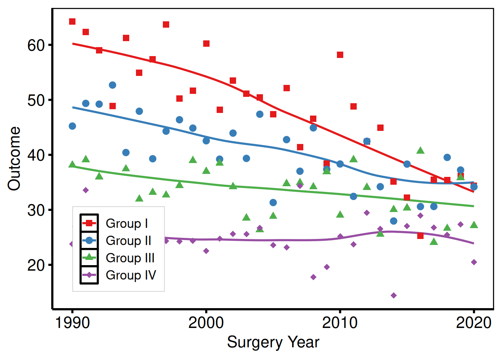

### Outside the panel (explicit sides)

``` r
p_base +
  scale_colour_brewer(palette = "Set1", name = "Group") +
  scale_shape_manual(
    values = c("Group I" = 15, "Group II" = 19,
               "Group III" = 17, "Group IV" = 18),
    name = "Group"
  ) +
  labs(x = "Surgery Year", y = "Outcome") +
  hv_theme("poster") +
  theme(
    legend.position = "bottom",             # "right" | "left" | "top" | "bottom"
    legend.direction = "horizontal"
  )
```

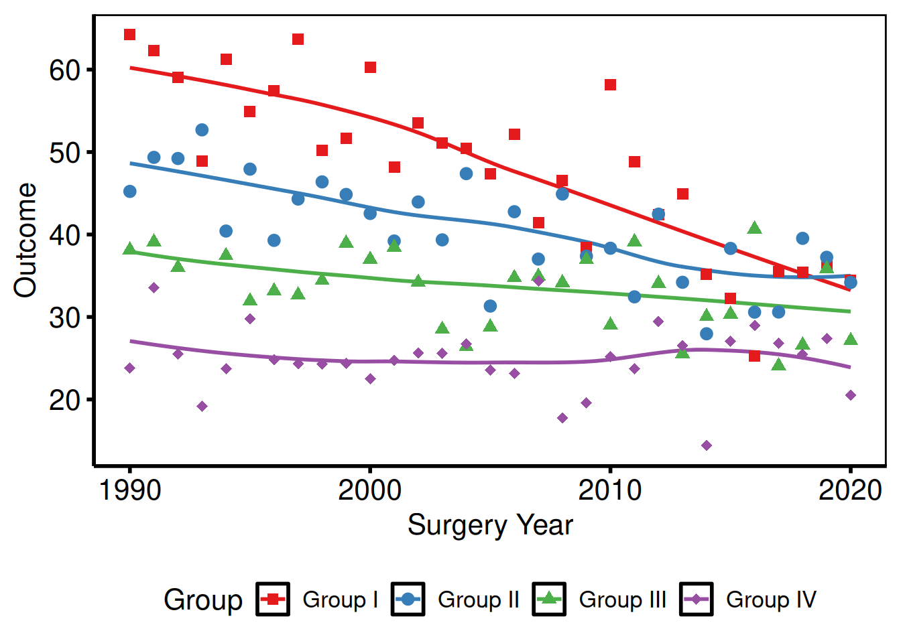

### Suppress all legends

``` r
plot(km) +
  scale_color_manual(values = c(All = "steelblue"), guide = "none") +
  scale_fill_manual(values  = c(All = "steelblue"), guide = "none") +
  scale_y_continuous(breaks = seq(0, 100, 20),
                     labels = function(x) paste0(x, "%")) +
  scale_x_continuous(breaks = seq(0, 20, 5)) +
  coord_cartesian(xlim = c(0, 20), ylim = c(0, 100)) +
  labs(x = "Years after Operation", y = "Freedom from Death (%)") +
  hv_theme("poster")
```

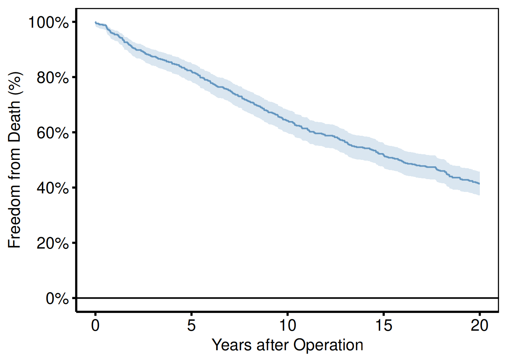

`guide = "none"` on every `scale_*()` call removes all legend entries.
This is preferred over `theme(legend.position = "none")` when only some
aesthetics have legends and others do not.

### Legend text and key size

``` r
p_base +
  scale_colour_brewer(palette = "Set1", name = "Group") +
  scale_shape_manual(
    values = c("Group I" = 15, "Group II" = 19,
               "Group III" = 17, "Group IV" = 18),
    name = "Group"
  ) +
  labs(x = "Surgery Year", y = "Outcome") +
  hv_theme("poster") +
  theme(
    legend.text  = element_text(size = 9),
    legend.key.size = unit(0.4, "cm")
  )
```

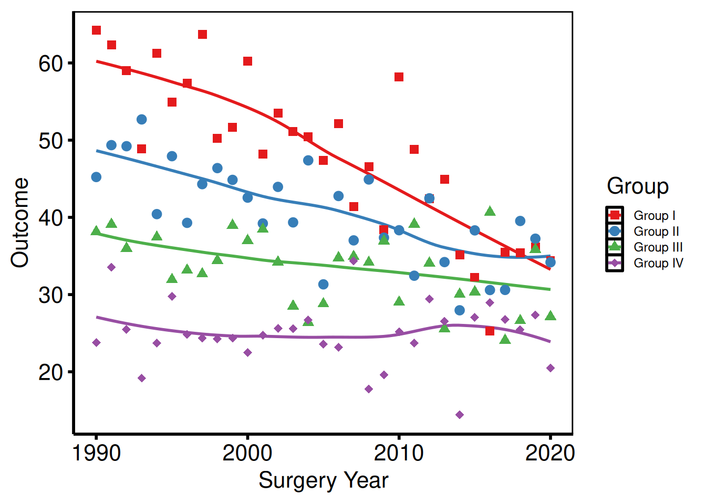

## Theme Overrides

[`hv_theme()`](https://ehrlinger.github.io/hvtiPlotR/reference/hv_theme.md)
sets a complete non-data formatting baseline. Layer additional
[`theme()`](https://ggplot2.tidyverse.org/reference/theme.html) calls
after it to adjust individual elements without touching the rest.

### Axis text size

``` r
p_base +
  scale_colour_brewer(palette = "Set1", name = "Group") +
  scale_shape_manual(
    values = c("Group I" = 15, "Group II" = 19,
               "Group III" = 17, "Group IV" = 18),
    name = "Group"
  ) +
  labs(x = "Surgery Year", y = "Outcome") +
  hv_theme("poster") +
  theme(
    axis.text  = element_text(size = 10),   # tick labels
    axis.title = element_text(size = 12)    # axis titles
  )
```

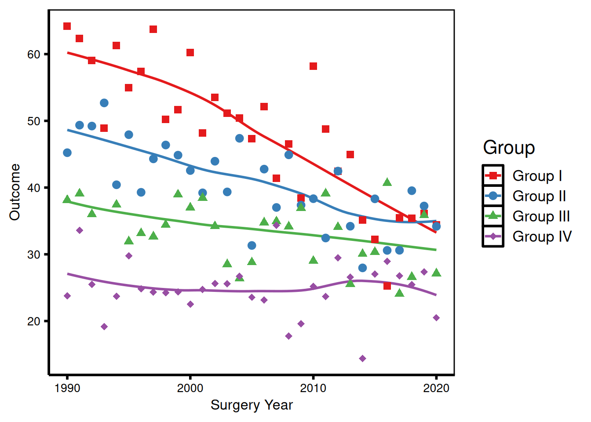

### Removing minor grid lines

``` r
p_base +
  scale_colour_brewer(palette = "Set1", name = "Group") +
  scale_shape_manual(
    values = c("Group I" = 15, "Group II" = 19,
               "Group III" = 17, "Group IV" = 18),
    name = "Group"
  ) +
  labs(x = "Surgery Year", y = "Outcome") +
  hv_theme("poster") +
  theme(
    panel.grid.minor = element_blank()
  )
```


### Rotating x-axis labels

Useful for time-point labels or long category names.

``` r
p_base +
  scale_colour_brewer(palette = "Set1", name = "Group") +
  scale_shape_manual(
    values = c("Group I" = 15, "Group II" = 19,
               "Group III" = 17, "Group IV" = 18),
    name = "Group"
  ) +
  labs(x = "Surgery Year", y = "Outcome") +
  hv_theme("poster") +
  theme(
    axis.text.x = element_text(angle = 45, hjust = 1, vjust = 1)
  )
```

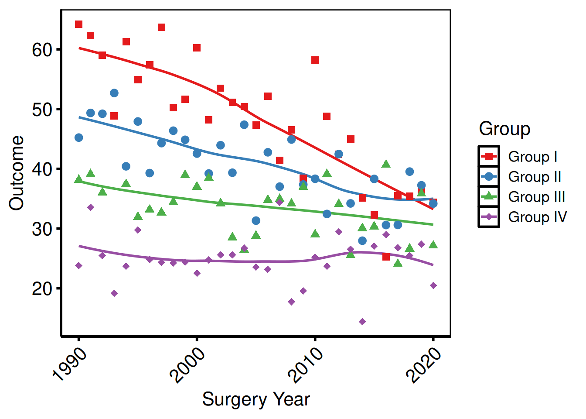

### Adding a plot title and subtitle

Titles are stripped from the base themes (they are rarely used in
journal figures), but can be added back:

``` r
plot(km) +
  scale_color_manual(values = c(All = "steelblue"), guide = "none") +
  scale_fill_manual(values  = c(All = "steelblue"), guide = "none") +
  scale_y_continuous(breaks = seq(0, 100, 20),
                     labels = function(x) paste0(x, "%")) +
  scale_x_continuous(breaks = seq(0, 20, 5)) +
  coord_cartesian(xlim = c(0, 20), ylim = c(0, 100)) +
  labs(
    title    = "Overall Survival",
    subtitle = paste0("n = ", nrow(dta_km), " patients"),
    x        = "Years after Operation",
    y        = "Freedom from Death (%)"
  ) +
  hv_theme("poster") +
  theme(
    plot.title    = element_text(size = 14, face = "bold", hjust = 0),
    plot.subtitle = element_text(size = 11, colour = "grey40", hjust = 0)
  )
```

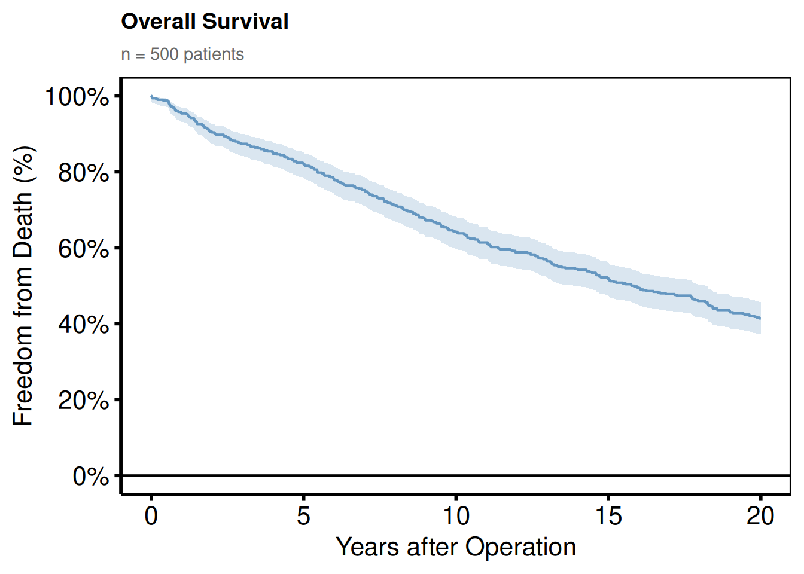

### Expanding plot margins

Add breathing room around the panel, for example when a figure is placed
directly on a poster without a surrounding text frame.

``` r
p_base +
  scale_colour_brewer(palette = "Set1", name = "Group") +
  scale_shape_manual(
    values = c("Group I" = 15, "Group II" = 19,
               "Group III" = 17, "Group IV" = 18),
    name = "Group"
  ) +
  labs(x = "Surgery Year", y = "Outcome") +
  hv_theme("poster") +
  theme(
    plot.margin = margin(t = 10, r = 20, b = 10, l = 20, unit = "pt")
  )
```

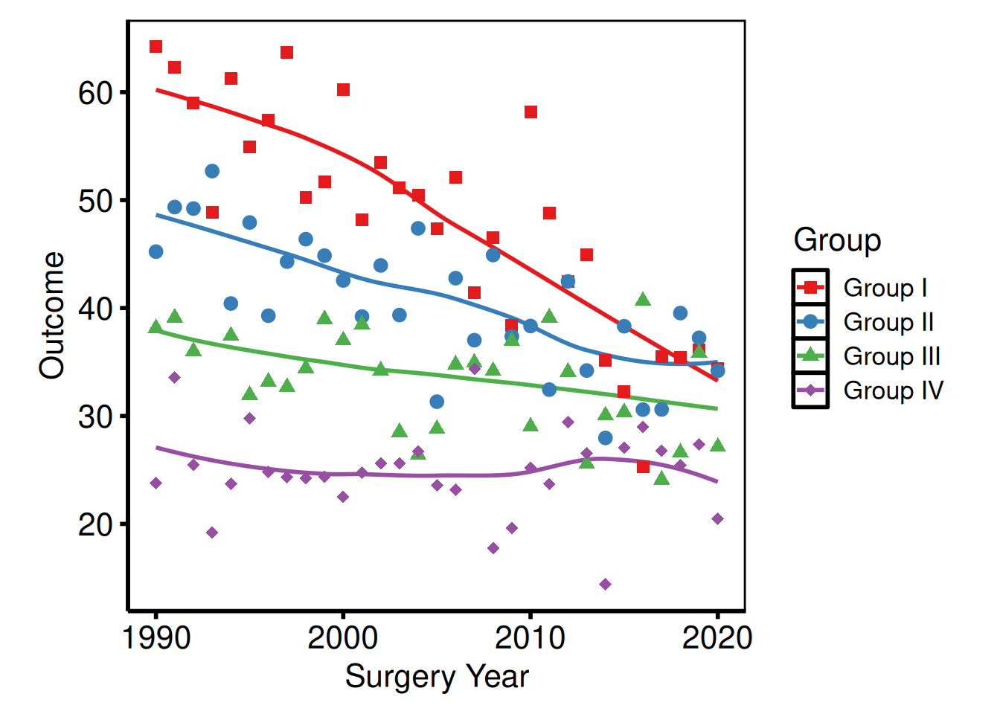

## Multi-panel Figures with patchwork

The `patchwork` package composes multiple ggplot objects into a single
figure. Use it to place two related plots side by side, or to stack a
main plot above a companion table or risk panel.

### Side-by-side plots

``` r
library(patchwork)

p_ms <- p_base +
  scale_colour_brewer(palette = "Set1", name = "Group") +
  scale_shape_manual(
    values = c("Group I" = 15, "Group II" = 19,
               "Group III" = 17, "Group IV" = 18),
    name = "Group"
  ) +
  labs(x = "Surgery Year", y = "Outcome") +
  hv_theme("poster")

p_km_ms <- plot(km) +
  scale_color_manual(values = c(All = "steelblue"), guide = "none") +
  scale_fill_manual(values  = c(All = "steelblue"), guide = "none") +
  scale_y_continuous(breaks = seq(0, 100, 20),
                     labels = function(x) paste0(x, "%")) +
  scale_x_continuous(breaks = seq(0, 20, 5)) +
  coord_cartesian(xlim = c(0, 20), ylim = c(0, 100)) +
  labs(x = "Years after Operation", y = "Freedom from Death (%)") +
  hv_theme("poster")

p_ms | p_km_ms
```

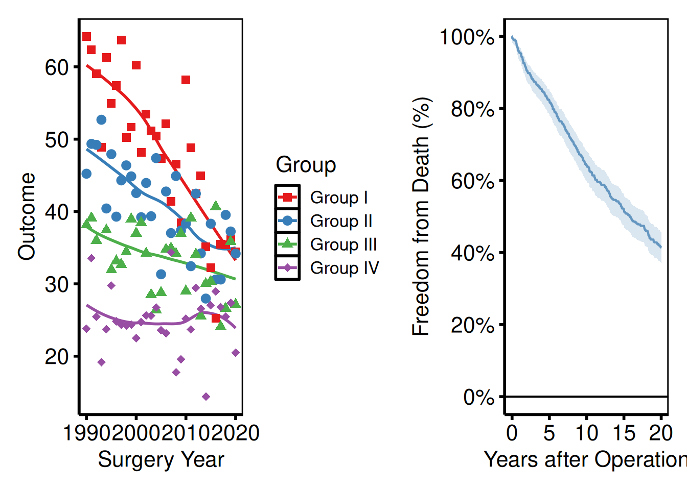

`|` places plots side by side; `/` stacks them vertically.

### Controlling relative widths and heights

``` r
(p_ms | p_km_ms) +
  plot_layout(widths = c(2, 1))   # left panel twice as wide as right
```

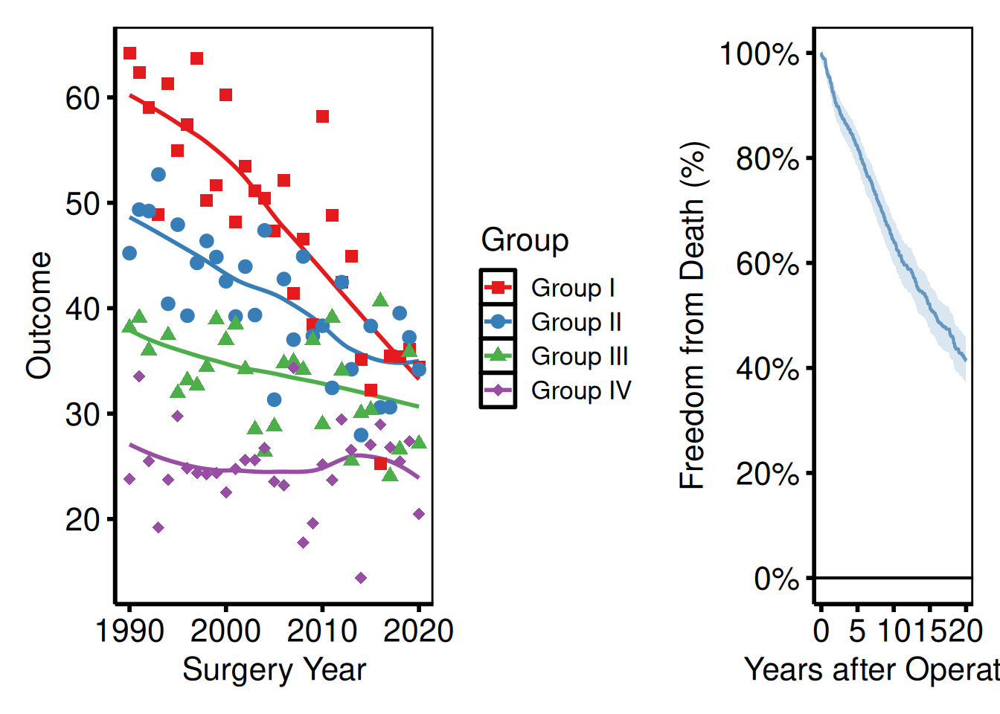

### Stacking a plot above a risk table

A common pattern with survival curves is to pair the plot with a
numbers-at-risk panel.
[`hv_survival()`](https://ehrlinger.github.io/hvtiPlotR/reference/hv_survival.md)
stores the risk table as a data frame at `km$tables$risk` — columns
`strata`, `report_time`, `n.risk`. Build a ggplot text panel from it,
then stack with `/`.

``` r
risk_df <- km$tables$risk

rt_panel <- ggplot(risk_df,
                   aes(x = report_time, y = factor(strata),
                       label = n.risk)) +
  geom_text(size = 3) +
  scale_x_continuous(limits = c(0, 20), breaks = seq(0, 20, 5)) +
  labs(x = "Years after Operation", y = NULL) +
  hv_theme("poster") +
  theme(
    axis.line  = element_blank(),
    axis.ticks = element_blank()
  )

p_km_ms / rt_panel +
  plot_layout(heights = c(4, 1))
```

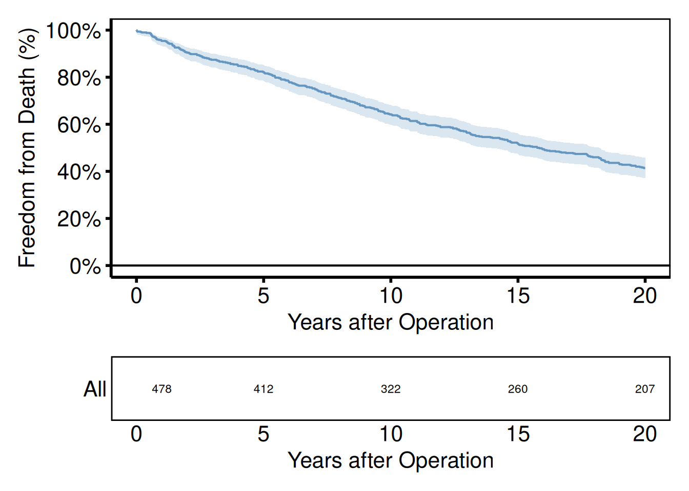

### Shared axis labels and panel tags

[`plot_annotation()`](https://patchwork.data-imaginist.com/reference/plot_annotation.html)
adds a shared title or tags (A, B, C…) across all panels.

``` r
(p_ms | p_km_ms) +
  plot_annotation(
    title = "Figure 1. Outcomes after cardiac surgery",
    tag_levels = "A"
  ) &
  theme(plot.tag = element_text(size = 12, face = "bold"))
```

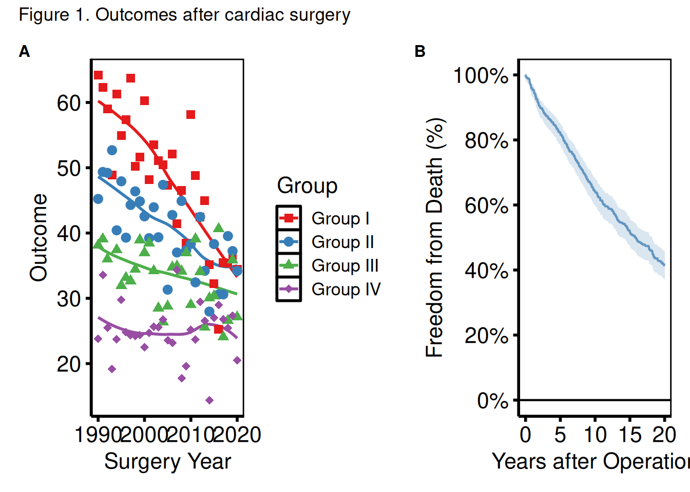

### Saving a patchwork composite

Assign the composed object to a variable and pass it to
[`ggsave()`](https://ggplot2.tidyverse.org/reference/ggsave.html). For
PowerPoint, save each panel individually with
[`save_ppt()`](https://ehrlinger.github.io/hvtiPlotR/reference/save_ppt.md)
(patchwork composites are not editable DrawingML objects).

``` r
combined <- (p_ms | p_km_ms) +
  plot_annotation(tag_levels = "A") &
  theme(plot.tag = element_text(size = 12, face = "bold"))

ggsave(
  filename = here::here("graphs", "fig1_combined.pdf"),
  plot     = combined,
  width    = 14,
  height   = 7
)
```
