# hvtiPlotR Plot Functions

``` r
local({
  r_libs <- trimws(Sys.getenv("R_LIBS"))
  if (nzchar(r_libs)) {
    sep   <- if (.Platform$OS.type == "windows") ";" else ":"
    paths <- strsplit(r_libs, sep, fixed = TRUE)[[1]]
    .libPaths(unique(c(paths, .libPaths())))
  }
})
library(ggplot2)
library(hvtiPlotR)
```

Each hvtiPlotR plot function returns a bare ggplot object with no colour
scales, axis labels, or theme applied. The caller composes those with
the usual + operator. See the companion vignette “Decorating and Saving
hvtiPlotR Plots” for full coverage of scale\_, labs(), annotate(),
themes, and ggsave() patterns.

## Template Reference Map

The table below maps each hvtiPlotR function to the original SAS and R
templates it ports. Functions marked with — have no direct predecessor
and were designed specifically for this package.

| hvtiPlotR Function                                                                                              | SAS Template(s)                                                                                                         | R Template(s)              |
|-----------------------------------------------------------------------------------------------------------------|-------------------------------------------------------------------------------------------------------------------------|----------------------------|
| [`mirror_histogram()`](https://ehrlinger.github.io/hvtiPlotR/reference/mirror_histogram.md)                     | —                                                                                                                       | —                          |
| [`stacked_histogram()`](https://ehrlinger.github.io/hvtiPlotR/reference/stacked_histogram.md)                   | —                                                                                                                       | —                          |
| [`covariate_balance()`](https://ehrlinger.github.io/hvtiPlotR/reference/covariate_balance.md)                   | —                                                                                                                       | —                          |
| [`goodness_followup()`](https://ehrlinger.github.io/hvtiPlotR/reference/goodness_followup.md)                   | `tp.dp.goodness_followup.*`                                                                                             | —                          |
| [`goodness_event_plot()`](https://ehrlinger.github.io/hvtiPlotR/reference/goodness_event_plot.md)               | `tp.dp.goodness_event.*`                                                                                                | —                          |
| [`survival_curve()`](https://ehrlinger.github.io/hvtiPlotR/reference/survival_curve.md)                         | `tp.hp.dead.sas` (basic)                                                                                                | `tp.hp.dead.number_risk.R` |
| [`hazard_plot()`](https://ehrlinger.github.io/hvtiPlotR/reference/hazard_plot.md)                               | `tp.hp.dead.*`, `tp.hp.event.weighted.sas`, `tp.hp.repeated*.sas`, `tp.hp.numtreat.survdiff.matched.sas`                | `tp.hp.dead.number_risk.R` |
| [`survival_difference_plot()`](https://ehrlinger.github.io/hvtiPlotR/reference/survival_difference_plot.md)     | `tp.hp.dead.life-gained.sas`, `tp.hp.numtreat.survdiff.matched.sas`                                                     | —                          |
| [`nnt_plot()`](https://ehrlinger.github.io/hvtiPlotR/reference/nnt_plot.md)                                     | `tp.hp.numtreat.survdiff.matched.sas`                                                                                   | —                          |
| [`nonparametric_curve_plot()`](https://ehrlinger.github.io/hvtiPlotR/reference/nonparametric_curve_plot.md)     | `tp.np.*.avrg_curv.*`, `tp.np.*.u.trend.*`, `tp.np.*.double.*`, `tp.np.*.mult.*`, `tp.np.*.phases.*`, `tp.np.z0axdpo.*` | —                          |
| [`nonparametric_ordinal_plot()`](https://ehrlinger.github.io/hvtiPlotR/reference/nonparametric_ordinal_plot.md) | `tp.np.*.ordinal.*`                                                                                                     | —                          |
| [`eda_plot()`](https://ehrlinger.github.io/hvtiPlotR/reference/eda_plot.md)                                     | —                                                                                                                       | —                          |
| [`spaghetti_plot()`](https://ehrlinger.github.io/hvtiPlotR/reference/spaghetti_plot.md)                         | —                                                                                                                       | —                          |
| [`trends_plot()`](https://ehrlinger.github.io/hvtiPlotR/reference/trends_plot.md)                               | —                                                                                                                       | —                          |
| [`longitudinal_counts_plot()`](https://ehrlinger.github.io/hvtiPlotR/reference/longitudinal_counts_plot.md)     | `tp.dp.longitudinal_patients_measures.*`                                                                                | —                          |
| [`longitudinal_counts_table()`](https://ehrlinger.github.io/hvtiPlotR/reference/longitudinal_counts_table.md)   | `tp.dp.longitudinal_patients_measures.*`                                                                                | —                          |
| [`alluvial_plot()`](https://ehrlinger.github.io/hvtiPlotR/reference/alluvial_plot.md)                           | —                                                                                                                       | —                          |
| [`upset_plot()`](https://ehrlinger.github.io/hvtiPlotR/reference/upset_plot.md)                                 | —                                                                                                                       | —                          |

## Mirrored Propensity Score Histogram

A common figure in propensity-matched analyses is the mirrored
histogram, which displays the propensity score distributions for two
treatment groups before and after matching. The **hvtiPlotR** package
provides the
[`mirror_histogram()`](https://ehrlinger.github.io/hvtiPlotR/reference/mirror_histogram.md)
function to generate this figure.

The function accepts a data frame with columns for the propensity score,
group indicator, and match indicator. The
[`sample_mirror_histogram_data()`](https://ehrlinger.github.io/hvtiPlotR/reference/sample_mirror_histogram_data.md)
function generates example data suitable for testing.

``` r
# Generate sample data for the mirrored histogram
mirror_dta <- sample_mirror_histogram_data(n = 2000)

# Generate the mirrored histogram
mhist <- mirror_histogram(
  data = mirror_dta,
  score_col = "prob_t",
  group_col = "tavr",
  match_col = "match",
  group_levels = c(0, 1),
  group_labels = c("SAVR", "TF-TAVR"),
  matched_value = 1,
  score_multiplier = 100,
  binwidth = 5,
  alpha = 0.8
)

# Display the plot
mhist$plot
```

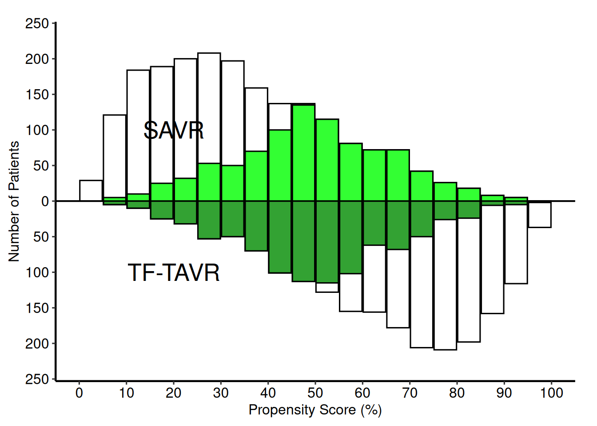

The lighter bars show the full (pre-match) propensity score distribution
for each group, while the darker overlaid bars show the matched subset.
The upper panel corresponds to the first group label and the lower panel
to the second.

The function also returns diagnostics summarising group counts and
standardized mean differences (SMD) before and after matching:

``` r
# Standardized mean difference before matching
mhist$diagnostics$smd_before
```

    [1] 1.563175

``` r
# Standardized mean difference after matching
mhist$diagnostics$smd_matched
```

    [1] 0.02714868

``` r
# Group counts before matching
mhist$diagnostics$group_counts_before
```

       0    1
    2000 2000 

``` r
# Group counts after matching
mhist$diagnostics$group_counts_matched
```

      0   1
    919 919 

## Stacked Histogram

A common exploratory figure is the stacked histogram, which shows how
the composition of a numeric variable changes over time or across
another grouping dimension. The **hvtiPlotR** package provides the
[`stacked_histogram()`](https://ehrlinger.github.io/hvtiPlotR/reference/stacked_histogram.md)
function to generate this figure.

The function returns a bare `ggplot` object — no colour scales, axis
labels, or theme are applied — so the caller can add those freely with
the usual `+` operator.

The
[`sample_stacked_histogram_data()`](https://ehrlinger.github.io/hvtiPlotR/reference/sample_stacked_histogram_data.md)
function generates a reproducible example dataset with `year` and
`category` columns.

``` r
# Generate sample data
hist_dta <- sample_stacked_histogram_data(n_years = 20, start_year = 2000,
                                           n_categories = 3)
head(hist_dta)
```

      year category
    1 2000        1
    2 2000        1
    3 2000        2
    4 2000        2
    5 2000        2
    6 2000        1

### Count histogram

The default `position = "stack"` shows raw counts within each bin,
equivalent to the `plot.sas` frequency histogram.

``` r
# Build the bare plot
p_count <- stacked_histogram(hist_dta, x_col = "year", group_col = "category")

# Layer on colour scales, labels, and a theme
p_count +
  scale_fill_brewer(palette = "Set1", name = "Category") +
  scale_color_brewer(palette = "Set1", name = "Category") +
  labs(x = "Year", y = "Count") +
  hvti_theme("manuscript")
```

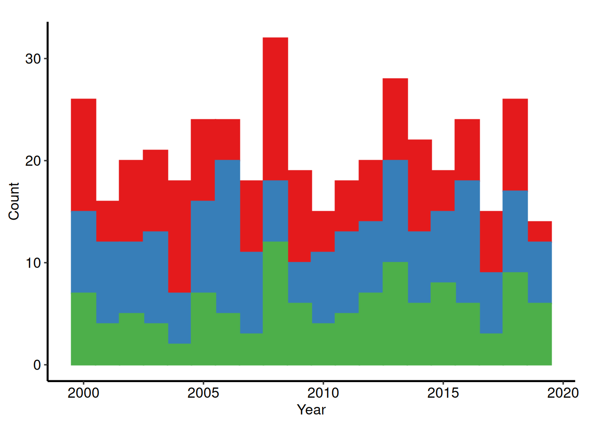

### Proportion (fill) histogram

Setting `position = "fill"` rescales each bin so the bars sum to 1,
making it easy to compare the relative composition across years.

``` r
# Build the proportional variant
p_fill <- stacked_histogram(hist_dta, x_col = "year", group_col = "category",
                             position = "fill")

# Use manual colours and custom legend labels
p_fill +
  scale_fill_manual(
    values = c("1" = "pink", "2" = "cyan", "3" = "orangered"),
    labels = c("1" = "Group A", "2" = "Group B", "3" = "Group C"),
    name   = "Category"
  ) +
  scale_color_manual(
    values = c("1" = "pink", "2" = "cyan", "3" = "orangered"),
    guide  = "none"
  ) +
  labs(x = "Year", y = "Proportion") +
  hvti_theme("manuscript")
```

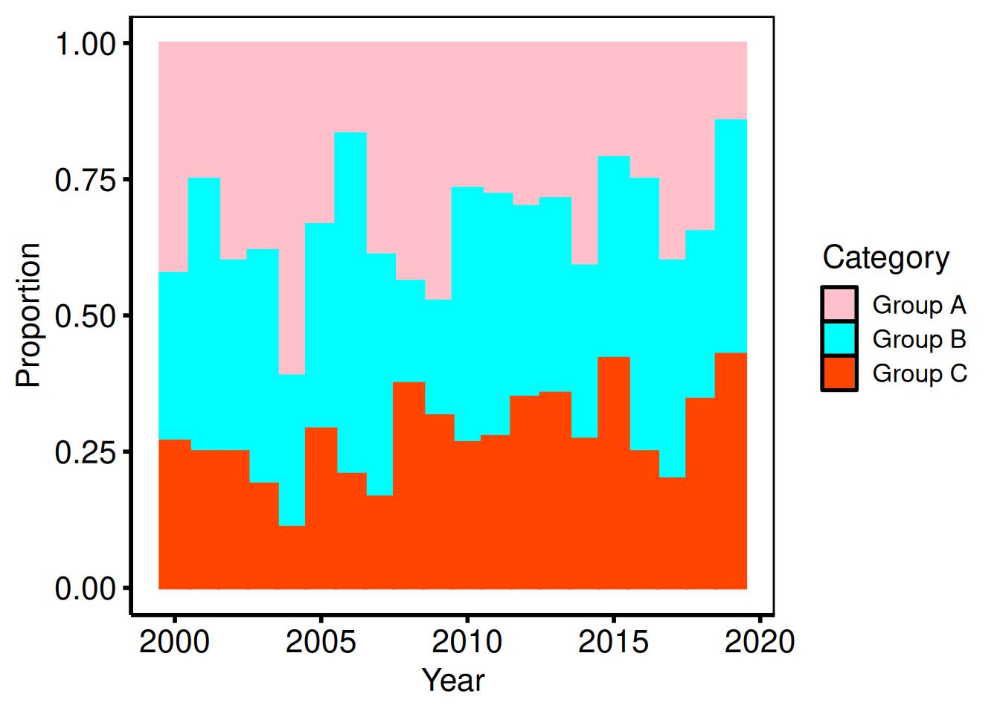

### Saving

``` r
p_final <- p_fill +
  scale_fill_manual(
    values = c("1" = "pink", "2" = "cyan", "3" = "orangered"),
    name   = "Category"
  ) +
  scale_color_manual(
    values = c("1" = "pink", "2" = "cyan", "3" = "orangered"),
    guide  = "none"
  ) +
  labs(x = "Year", y = "Proportion") +
  hvti_theme("manuscript")

ggsave(
  filename = "../graphs/stacked_histogram.pdf",
  plot     = p_final,
  width    = 11,
  height   = 8
)
```

## Goodness-of-Follow-Up Plot

The goodness-of-follow-up plot is a standard quality-control figure in
longitudinal outcome analyses. It displays each patient as a point at
their operation date (x-axis) and follow-up duration (y-axis), with a
short vertical tick below each point. A dashed diagonal line marks the
maximum potential follow-up given the study start, study end, and
follow-up closing date. The **hvtiPlotR** package provides
[`goodness_followup()`](https://ehrlinger.github.io/hvtiPlotR/reference/goodness_followup.md)
to build this figure.

The function returns a bare `ggplot` object with no colour, shape, axis,
or label scales applied — those are added by the caller with standard
`ggplot2` modifiers.

### Sample data

``` r
gfup_dta <- sample_goodness_followup_data(n = 300, seed = 42)
head(gfup_dta)
```

      iv_opyrs iv_dead  dead iv_event ev_event deads
    1  29.5694  2.0261 FALSE   2.0261    FALSE FALSE
    2   6.4834  6.9027  TRUE   4.0813     TRUE  TRUE
    3  14.4342  5.4468  TRUE   5.4468    FALSE  TRUE
    4  25.4324  6.1630 FALSE   0.6137     TRUE FALSE
    5   3.4251 13.1369  TRUE   6.9232     TRUE  TRUE
    6  24.1620  7.4334 FALSE   7.4334    FALSE FALSE

### Death follow-up plot

``` r
gfup <- goodness_followup(
  data        = gfup_dta,
  origin_year = 1990,
  study_start = as.Date("1990-01-01"),
  study_end   = as.Date("2019-12-31"),
  close_date  = as.Date("2021-08-06"),
  alpha       = 0.8
)

# Bare plot — no scales or labels yet
gfup$death_plot
```

    NULL

### Adding scales, labels, and annotations

Scale, label, and annotation layers are composed with the usual `+`
operator.
[`scale_color_manual()`](https://ggplot2.tidyverse.org/reference/scale_manual.html)
and
[`scale_shape_manual()`](https://ggplot2.tidyverse.org/reference/scale_manual.html)
map the binary alive/dead state to colours and point shapes.
[`annotate()`](https://ggplot2.tidyverse.org/reference/annotate.html)
places group-identifying text directly on the panel.

``` r
library(RColorBrewer)

gfup$death_plot +
  # Colour alive = blue, dead = red (Set1 palette positions 2 and 1)
  scale_color_manual(
    values   = brewer.pal(3, "Set1")[c(2, 1)],
    labels   = c("Alive", "Dead"),
    na.value = "black",
    drop     = FALSE
  ) +
  scale_shape_manual(
    values = c(1, 4),
    labels = c("Alive", "Dead")
  ) +
  # Axis tick placement
  scale_x_continuous(breaks = seq(1990, 2020, 3)) +
  scale_y_continuous(breaks = seq(0, 33,   3)) +
  # Clip the panel to the study window
  coord_cartesian(ylim = c(0, 33), xlim = c(1990, 2020)) +
  # Axis and legend labels
  labs(
    x     = "Operation Date",
    y     = "Follow-up (years)",
    color = "Status",
    shape = "Status"
  ) +
  # Annotate directly on the panel
  annotate("text", x = 1993, y = 31, label = "Alive at close",
           hjust = 0, size = 3.5) +
  annotate("text", x = 1993, y = 28, label = "Deceased",
           hjust = 0, size = 3.5, color = brewer.pal(3, "Set1")[1]) +
  theme(legend.position = "none")
```

    NULL

The diagonal dashed line represents the maximum potential follow-up.
Points sitting above the line indicate patients with longer follow-up
than expected from the study window, typically due to passive
surveillance supplementing active cross-sectional follow-up.

### Saving

``` r
gfup_final <- gfup$death_plot +
  scale_color_manual(
    values   = brewer.pal(3, "Set1")[c(2, 1)],
    labels   = c("Alive", "Dead"),
    na.value = "black",
    drop     = FALSE
  ) +
  scale_shape_manual(values = c(1, 4), labels = c("Alive", "Dead")) +
  scale_x_continuous(breaks = seq(1990, 2020, 3)) +
  scale_y_continuous(breaks = seq(0, 33, 3)) +
  coord_cartesian(ylim = c(0, 33), xlim = c(1990, 2020)) +
  labs(x = "Operation Date", y = "Follow-up (years)",
       color = "Status", shape = "Status") +
  annotate("text", x = 1993, y = 31, label = "Alive at close",
           hjust = 0, size = 3.5) +
  annotate("text", x = 1993, y = 28, label = "Deceased",
           hjust = 0, size = 3.5, color = brewer.pal(3, "Set1")[1]) +
  theme(legend.position = "none") +
  hvti_theme("manuscript")

ggsave(
  filename = "../graphs/dp_goodness-of-followup.pdf",
  plot     = gfup_final,
  height   = 6,
  width    = 6
)
```

### Non-fatal event panel

When the dataset includes a non-fatal competing event (e.g. relapse,
reoperation), pass `event_col`, `event_time_col`, and optionally
`death_for_event_col` to generate a second panel alongside the death
panel.

``` r
gfup_event_dta <- sample_goodness_followup_data(n = 300, seed = 42)
```

``` r
goodness_event_plot(
  gfup_event_dta,
  event_col           = "ev_event",
  event_time_col      = "iv_event",
  death_for_event_col = "deads",
  event_levels        = c("No event", "Relapse", "Death"),
  origin_year         = 1990,
  study_start         = as.Date("1990-01-01"),
  study_end           = as.Date("2019-12-31"),
  close_date          = as.Date("2021-08-06"),
  alpha               = 0.8
) +
  scale_color_manual(
    values = c("No event" = "blue", "Relapse" = "green3", "Death" = "red"),
    name   = NULL
  ) +
  scale_shape_manual(
    values = c("No event" = 1L, "Relapse" = 2L, "Death" = 4L),
    name   = NULL
  ) +
  scale_x_continuous(breaks = seq(1990, 2020, 3)) +
  scale_y_continuous(breaks = seq(0, 33, 3)) +
  coord_cartesian(ylim = c(0, 33), xlim = c(1990, 2020)) +
  labs(
    x = "Operation Date",
    y = "Follow-up (years)",
    color = "Event", shape = "Event"
  ) +
  annotate("text", x = 1993, y = 31,
           label = "Systematic follow-up", hjust = 0, size = 3.5) +
  theme(legend.position = c(0.85, 0.15)) +
  hvti_theme("manuscript")
```

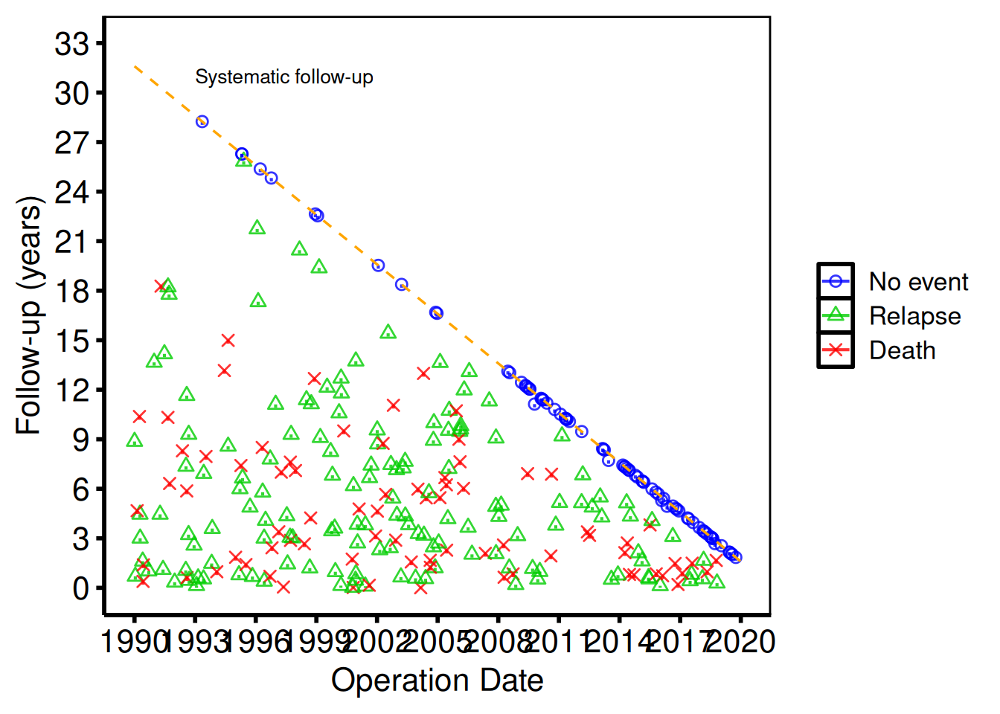

The death panel (from
[`goodness_followup()`](https://ehrlinger.github.io/hvtiPlotR/reference/goodness_followup.md))
and event panel (from
[`goodness_event_plot()`](https://ehrlinger.github.io/hvtiPlotR/reference/goodness_event_plot.md))
share the same diagonal reference line and can be saved individually
with [`ggsave()`](https://ggplot2.tidyverse.org/reference/ggsave.html).

## Covariate Balance Plot

The covariate balance plot is the standard quality-control figure for
propensity score matching and IPTW analyses. Each covariate occupies a
labelled row; points show the standardized mean difference (SMD) for
each comparison group (e.g. before and after matching). A solid vertical
line marks zero balance; dotted vertical lines mark an imbalance
threshold (default ±10%).

The **hvtiPlotR** package provides
[`covariate_balance()`](https://ehrlinger.github.io/hvtiPlotR/reference/covariate_balance.md)
to build this figure. It returns a bare `ggplot` object — no colour,
shape, axis labels, or theme applied — so all styling is added with the
usual `+` operator.

Input data must be in **long format**: one row per covariate × group
combination with columns for the covariate name, the group label, and
the numeric SMD value.

### Sample data

``` r
dta_cb <- sample_covariate_balance_data(n_vars = 12)
head(dta_cb)
```

               variable        group std_diff
    1               Age Before match      9.8
    2        Female sex Before match     25.4
    3      Hypertension Before match    -14.7
    4 Diabetes mellitus Before match     -8.9
    5              COPD Before match     -3.9
    6        Creatinine Before match     26.5

### Bare plot

``` r
covariate_balance(dta_cb, alpha = 0.8)
```

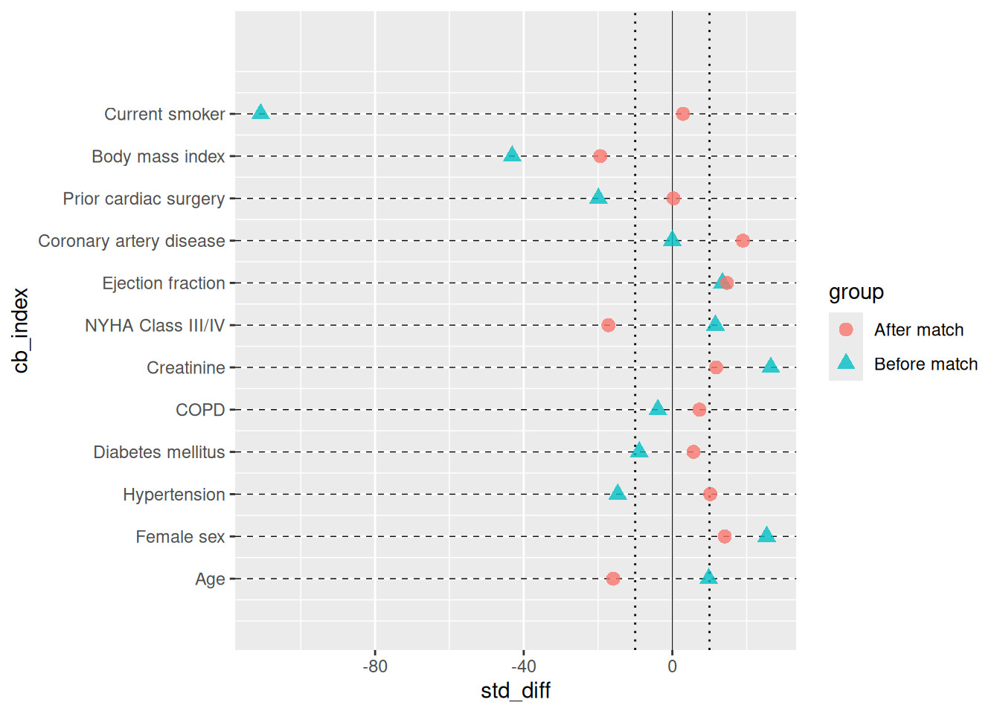

### Adding colour, shape, and axis scales

``` r
covariate_balance(dta_cb, alpha = 0.8) +
  scale_color_manual(
    values = c("Before match" = "red4", "After match" = "blue3"),
    name   = NULL
  ) +
  scale_shape_manual(
    values = c("Before match" = 17L, "After match" = 15L),
    name   = NULL
  ) +
  scale_x_continuous(
    limits = c(-45, 35),
    breaks = seq(-40, 30, 10)
  ) +
  labs(
    x = "Standardized difference (%)",
    y = ""
  ) +
  theme(legend.position = c(0.20, 0.95))
```

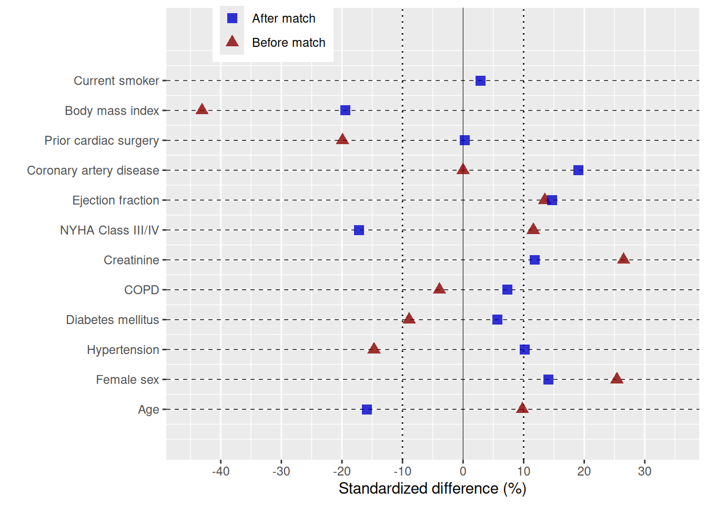

### Adding directional annotations and theme

[`annotate()`](https://ggplot2.tidyverse.org/reference/annotate.html)
places explanatory text directly on the panel to indicate which
direction of imbalance favours each group.

``` r
n_vars <- length(unique(dta_cb$variable))

covariate_balance(dta_cb, alpha = 0.8) +
  scale_color_manual(
    values = c("Before match" = "red4", "After match" = "blue3"),
    name   = NULL
  ) +
  scale_shape_manual(
    values = c("Before match" = 17L, "After match" = 15L),
    name   = NULL
  ) +
  scale_x_continuous(
    limits = c(-45, 35),
    breaks = seq(-40, 30, 10)
  ) +
  labs(
    x = "Standardized difference: Group A \u2013 Group B (%)",
    y = ""
  ) +
  annotate("text", x = -32, y = 0.4,        label = "More likely Group B", size = 4) +
  annotate("text", x =  22, y = n_vars + 1, label = "More likely Group A", size = 4) +
  theme(legend.position = c(0.20, 0.95)) +
  hvti_theme("manuscript")
```

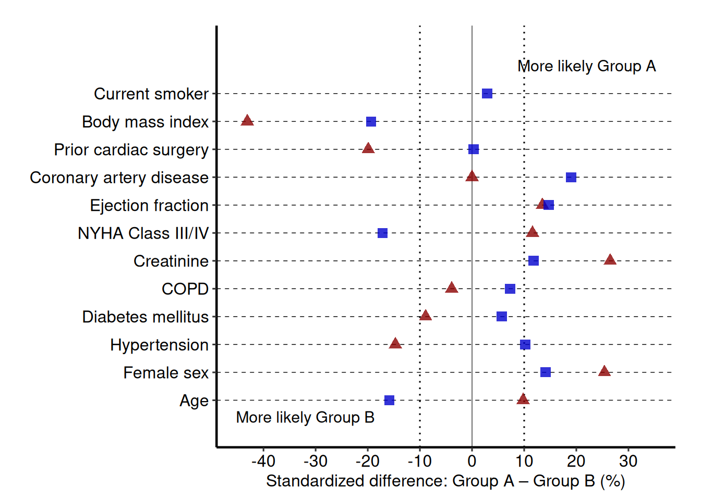

### Controlling covariate order

Pass `var_levels` to control the bottom-to-top display order of
covariates.

``` r
covariate_balance(
  dta_cb,
  var_levels = rev(unique(dta_cb$variable)),
  alpha      = 0.8
) +
  scale_color_manual(
    values = c("Before match" = "red4", "After match" = "blue3"),
    name   = NULL
  ) +
  scale_shape_manual(
    values = c("Before match" = 17L, "After match" = 15L),
    name   = NULL
  ) +
  labs(x = "Standardized difference (%)", y = "") +
  hvti_theme("manuscript")
```

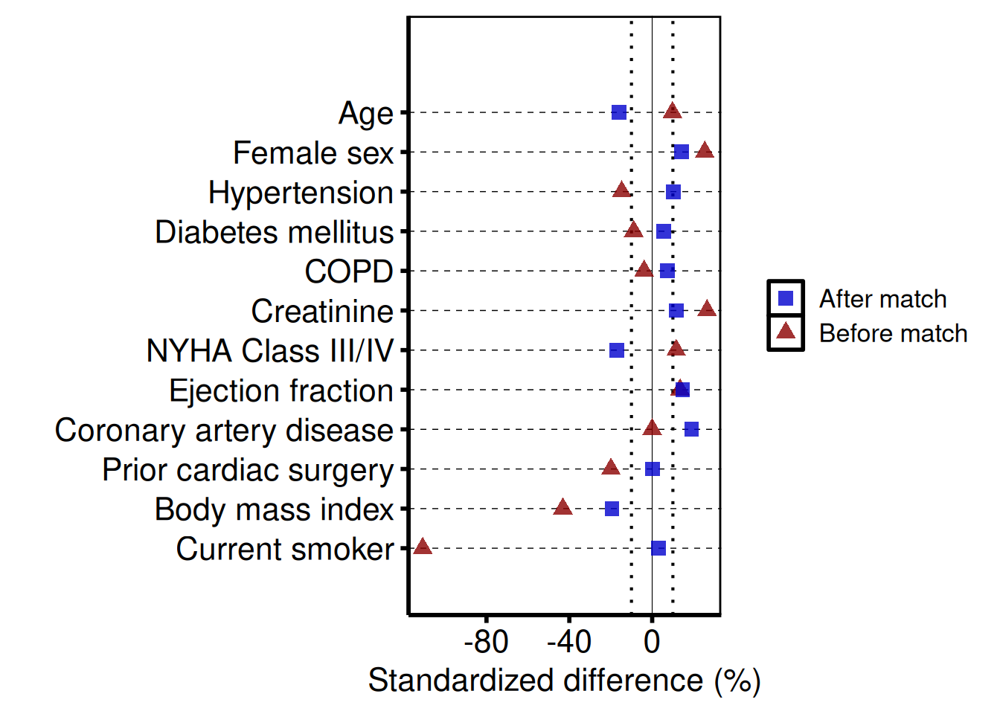

### Saving

``` r
cb_final <- covariate_balance(dta_cb, alpha = 0.8) +
  scale_color_manual(
    values = c("Before match" = "red4", "After match" = "blue3"),
    name   = NULL
  ) +
  scale_shape_manual(
    values = c("Before match" = 17L, "After match" = 15L),
    name   = NULL
  ) +
  scale_x_continuous(limits = c(-45, 35), breaks = seq(-40, 30, 10)) +
  labs(x = "Standardized difference (%)", y = "") +
  annotate("text", x = -32, y = 0.4,        label = "More likely Group B", size = 4) +
  annotate("text", x =  22, y = n_vars + 1, label = "More likely Group A", size = 4) +
  theme(legend.position = c(0.20, 0.95)) +
  hvti_theme("manuscript")

ggsave(
  filename = "../graphs/lp_cov-balance.pdf",
  plot     = cb_final,
  height   = 7,
  width    = 8
)
```

## Kaplan-Meier Survival Curve

[`survival_curve()`](https://ehrlinger.github.io/hvtiPlotR/reference/survival_curve.md)
estimates the Kaplan-Meier product-limit survival function and returns
five companion bare plots matching the SAS `%kaplan` macro output
(`PLOTS`, `PLOTC`, `PLOTH`, `PLOTL`), plus tidy data frames for tables
and further computation. Confidence intervals use the logit transform
with a default confidence level of 0.6827 (one standard deviation),
reproducing the SAS macro default.

### Sample data

``` r
dta_km <- sample_survival_data(n = 500, seed = 42)
head(dta_km)
```

        iv_dead  dead iv_opyrs age_at_op
    1  3.966736  TRUE 2003.503  58.08251
    2 13.217905  TRUE 2008.716  65.37466
    3  5.669821  TRUE 1990.072  58.80676
    4  0.763838  TRUE 2005.739  66.45205
    5  9.463533  TRUE 2006.139  75.84440
    6 20.000000 FALSE 1991.461  60.21944

### Survival curve (PLOTS=1)

``` r
km <- survival_curve(dta_km, alpha = 0.8)

# Bare plot — no scales or labels yet
km$survival_plot
```

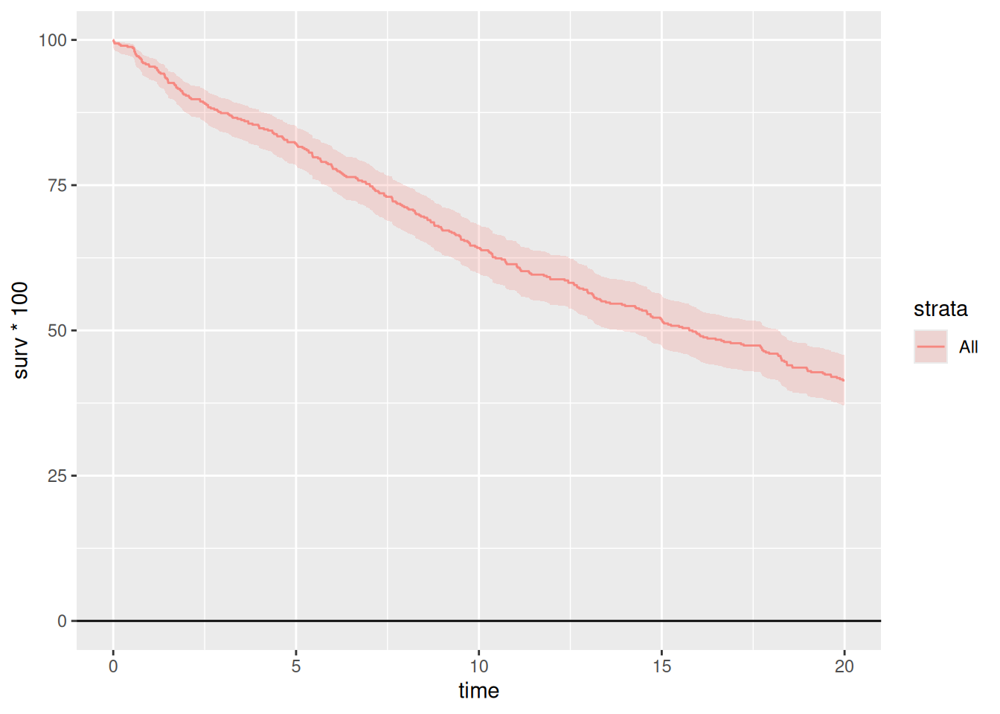

### Adding scales, labels, and annotations

``` r
km$survival_plot +
  scale_color_manual(values = c(All = "steelblue"), guide = "none") +
  scale_fill_manual(values  = c(All = "steelblue"), guide = "none") +
  scale_y_continuous(
    breaks = seq(0, 100, 20),
    labels = function(x) paste0(x, "%")
  ) +
  scale_x_continuous(breaks = seq(0, 20, 5)) +
  coord_cartesian(xlim = c(0, 20), ylim = c(0, 100)) +
  labs(
    x     = "Years after Operation",
    y     = "Freedom from Death (%)",
    title = "Overall Survival"
  ) +
  annotate("text", x = 1, y = 5,
           label = paste0("n = ", nrow(dta_km)),
           hjust = 0, size = 3.5) +
  hvti_theme("manuscript")
```

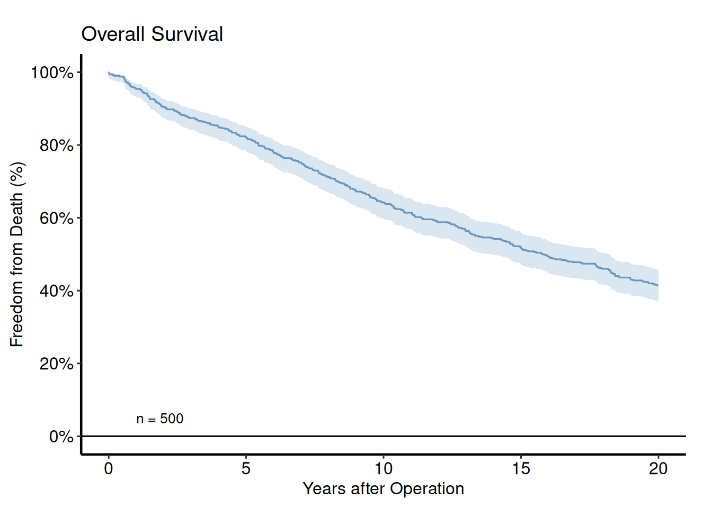

### Numbers at risk and report table

``` r
km$risk_table
```

      strata report_time n.risk
    1    All           1    478
    2    All           5    412
    3    All          10    322
    4    All          15    260
    5    All          20    207
    6    All          25    207

``` r
km$report_table
```

      strata report_time  surv     lower     upper n.risk n.event
    1    All           1 0.954 0.9436693 0.9625114    478       1
    2    All           5 0.822 0.8042449 0.8384681    412       1
    3    All          10 0.642 0.6202877 0.6631450    322       1
    4    All          15 0.518 0.4956322 0.5402959    260       1
    5    All          20 0.414 0.3921576 0.4361859    207       0
    6    All          25 0.414 0.3921576 0.4361859    207       0

### Saving

``` r
km_final <- km$survival_plot +
  scale_color_manual(values = c(All = "steelblue"), guide = "none") +
  scale_fill_manual(values  = c(All = "steelblue"), guide = "none") +
  scale_y_continuous(breaks = seq(0, 100, 20),
                     labels = function(x) paste0(x, "%")) +
  scale_x_continuous(breaks = seq(0, 20, 5)) +
  coord_cartesian(xlim = c(0, 20), ylim = c(0, 100)) +
  labs(x = "Years after Operation", y = "Freedom from Death (%)") +
  hvti_theme("manuscript")

ggsave("../graphs/km_survival.pdf", km_final, width = 8, height = 6)
```

### Stratified analysis

``` r
dta_km_s <- sample_survival_data(
  n             = 500,
  strata_levels = c("Type A", "Type B"),
  hazard_ratios = c(1, 1.4),
  seed          = 42
)

km_s <- survival_curve(dta_km_s, strata_col = "valve_type", alpha = 0.8)

km_s$survival_plot +
  scale_color_manual(
    values = c("Type A" = "steelblue", "Type B" = "firebrick"),
    name   = "Valve Type"
  ) +
  scale_fill_manual(
    values = c("Type A" = "steelblue", "Type B" = "firebrick"),
    name   = "Valve Type"
  ) +
  scale_y_continuous(breaks = seq(0, 100, 20),
                     labels = function(x) paste0(x, "%")) +
  scale_x_continuous(breaks = seq(0, 20, 5)) +
  coord_cartesian(xlim = c(0, 20), ylim = c(0, 100)) +
  labs(x = "Years after Operation", y = "Freedom from Death (%)",
       title = "Survival by Valve Type") +
  theme(legend.position = c(0.15, 0.20)) +
  hvti_theme("manuscript")
```

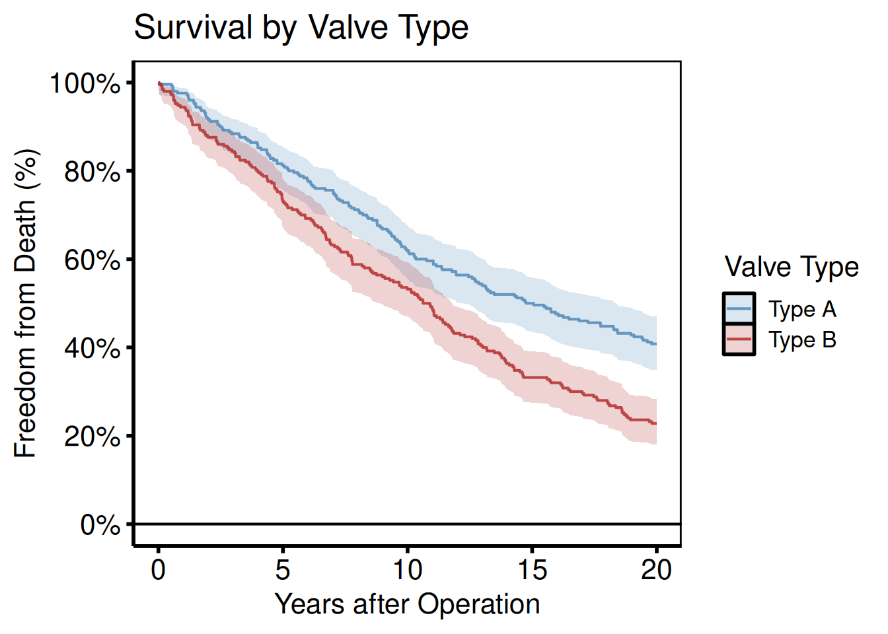

### Cumulative hazard (PLOTC=1)

``` r
km$cumhaz_plot +
  scale_x_continuous(breaks = seq(0, 20, 5)) +
  labs(x = "Years after Operation", y = "Cumulative Hazard H(t)",
       title = "Nelson-Aalen Cumulative Hazard") +
  scale_color_manual(values = c(All = "steelblue"), guide = "none") +
  hvti_theme("manuscript")
```

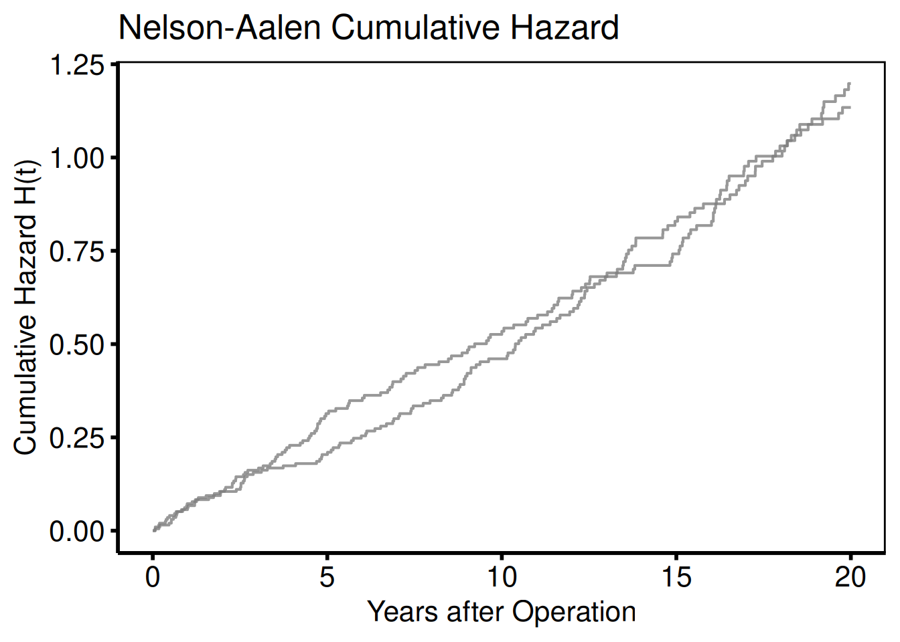

### Log-log survival plot (Weibull/PH check)

Parallel lines across strata indicate proportional hazards.

``` r
km_s$loglog_plot +
  scale_color_manual(
    values = c("Type A" = "steelblue", "Type B" = "firebrick"),
    name   = "Valve Type"
  ) +
  labs(x = "log(Years after Operation)", y = "log(-log S(t))",
       title = "Log-Log Survival — Proportional-Hazards Check") +
  hvti_theme("manuscript")
```

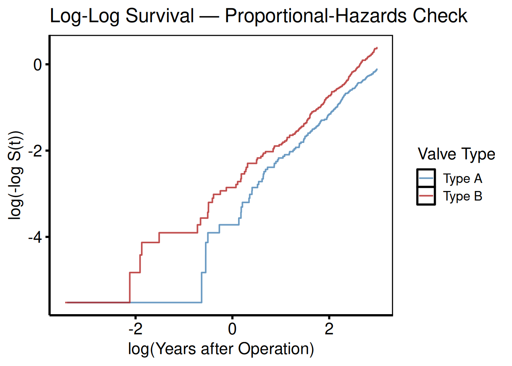

### Hazard rate (PLOTH=1)

The raw point estimates are noisy; add
[`geom_smooth()`](https://ggplot2.tidyverse.org/reference/geom_smooth.html)
for a publication-ready smoothed hazard curve.

``` r
km$hazard_plot +
  geom_smooth(
    aes(x = mid_time, y = hazard, color = strata),
    method = "loess", se = FALSE, span = 0.6
  ) +
  scale_color_manual(values = c(All = "steelblue"), guide = "none") +
  scale_x_continuous(breaks = seq(0, 20, 5)) +
  labs(x = "Years after Operation", y = "Instantaneous Hazard",
       title = "Hazard Rate") +
  hvti_theme("manuscript")
```

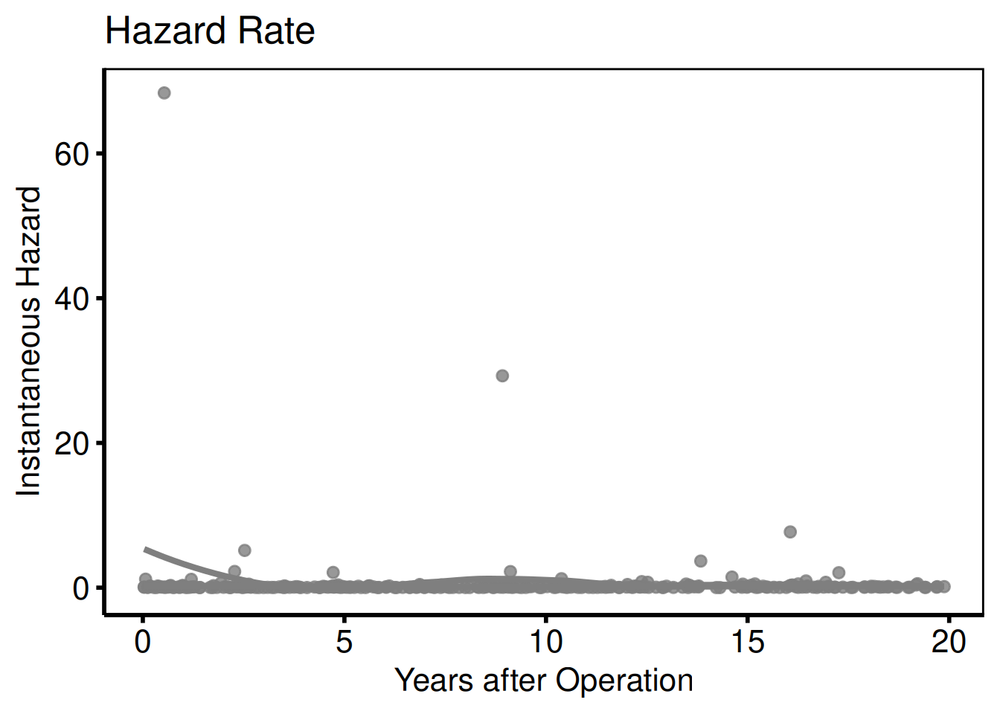

### Integrated survivorship / restricted mean survival (PLOTL=1)

``` r
km$life_plot +
  scale_color_manual(values = c(All = "steelblue"), guide = "none") +
  scale_x_continuous(breaks = seq(0, 20, 5)) +
  labs(x = "Years after Operation",
       y = "Restricted Mean Survival (years)",
       title = "Integral of Survivorship") +
  hvti_theme("manuscript")
```

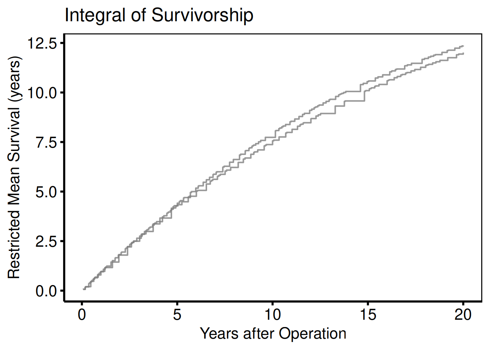

## EDA Barplots and Scatterplots

The **hvtiPlotR** package provides
[`eda_plot()`](https://ehrlinger.github.io/hvtiPlotR/reference/eda_plot.md)
for exploratory data analysis of all variables in a dataset against a
reference time axis. It replicates the `Function_DataPlotting()`
workflow from `tp.dp.EDA_barplots_scatterplots.R` and
`tp.dp.EDA_barplots_scatterplots_varnames.R`, replacing base-R graphics
with composable `ggplot2` objects.

Three helper functions support the workflow:

- [`eda_classify_var()`](https://ehrlinger.github.io/hvtiPlotR/reference/eda_classify_var.md)
  — detects whether a column is continuous (`"Cont"`),
  numeric-categorical (`"Cat_Num"`), or character-categorical
  (`"Cat_Char"`), matching the `UniqueLimit` logic from the template.
- [`eda_select_vars()`](https://ehrlinger.github.io/hvtiPlotR/reference/eda_select_vars.md)
  — subsets and reorders columns by name or space-separated string,
  replacing the `Order_Variables()` / `Mod_Data <- dta[, Order_Var]`
  pattern from the varnames template.
- [`sample_eda_data()`](https://ehrlinger.github.io/hvtiPlotR/reference/sample_eda_data.md)
  — generates a reproducible mixed-type dataset for demonstration.

[`eda_plot()`](https://ehrlinger.github.io/hvtiPlotR/reference/eda_plot.md)
always returns a bare `ggplot` object. Colour scales, axis labels,
annotations, and the
[`hvti_theme()`](https://ehrlinger.github.io/hvtiPlotR/reference/hvti_theme.md)
are added by the caller.

### Sample data

``` r
dta_eda <- sample_eda_data(n = 300, seed = 42)
head(dta_eda)
```

      year op_years male cabg nyha valve_morph   ef lv_mass peak_grad
    1 2005     0.48    1    0    2   Tricuspid 66.3    97.6      31.0
    2 2009     4.44    1    0    2   Unicuspid 52.0   121.1      38.0
    3 2005     0.06    0    0    2   Tricuspid   NA   129.7      25.2
    4 2013     8.32    1    0    3    Bicuspid 49.8   131.4      52.5
    5 2014     9.87    1    0    4   Tricuspid   NA   146.3        NA
    6 2008     3.92    1    1    1    Bicuspid 20.0   148.0      45.1

``` r
# Inspect auto-detected types for each column
sapply(dta_eda, eda_classify_var)
```

           year    op_years        male        cabg        nyha valve_morph
         "Cont"      "Cont"   "Cat_Num"   "Cat_Num"   "Cat_Num"  "Cat_Char"
             ef     lv_mass   peak_grad
         "Cont"      "Cont"      "Cont" 

### Binary categorical: count barplot

Numeric 0/1 columns are classified as `"Cat_Num"`. `NA` values appear as
an explicit `"(Missing)"` fill level so they can be coloured with
[`scale_fill_manual()`](https://ggplot2.tidyverse.org/reference/scale_manual.html).
The `y_label` argument sets the plot title and fill-legend name in place
of the raw column name.

``` r
eda_plot(dta_eda, x_col = "year", y_col = "male",
         y_label = "Sex") +
  scale_fill_manual(
    values = c("0" = "steelblue", "1" = "firebrick", "(Missing)" = "grey80"),
    labels = c("0" = "Female", "1" = "Male", "(Missing)" = "Missing"),
    name   = NULL
  ) +
  scale_x_discrete(breaks = seq(2005, 2020, 5)) +
  labs(x = "Surgery Year", y = "Count") +
  hvti_theme("manuscript")
```

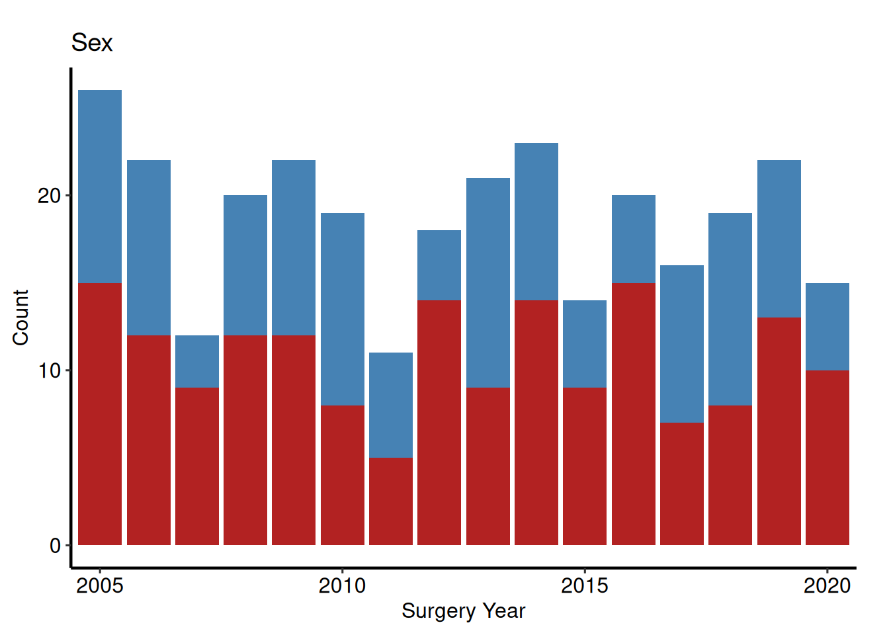

### Binary categorical: percentage barplot

Setting `show_percent = TRUE` switches
[`geom_bar()`](https://ggplot2.tidyverse.org/reference/geom_bar.html) to
`position = "fill"`.

``` r
eda_plot(dta_eda, x_col = "year", y_col = "cabg",
         y_label = "Concomitant CABG", show_percent = TRUE) +
  scale_fill_manual(
    values = c("0" = "grey70", "1" = "steelblue", "(Missing)" = "grey90"),
    labels = c("0" = "No CABG", "1" = "CABG", "(Missing)" = "Missing"),
    name   = NULL
  ) +
  scale_x_discrete(breaks = seq(2005, 2020, 5)) +
  scale_y_continuous(labels = scales::percent) +
  labs(x = "Surgery Year", y = "Proportion") +
  hvti_theme("manuscript")
```

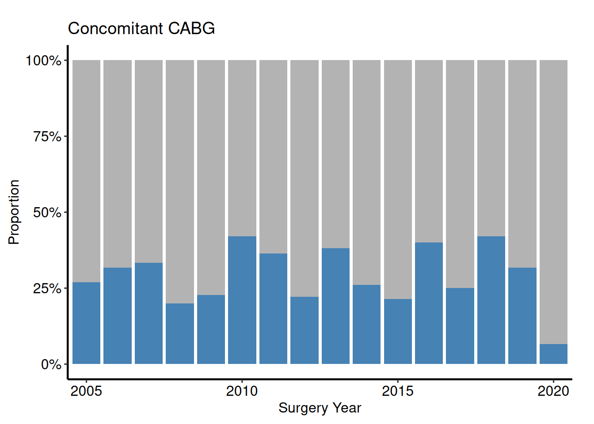

### Ordinal and multi-level categorical

``` r
eda_plot(dta_eda, x_col = "year", y_col = "nyha",
         y_label = "Preoperative NYHA Class") +
  scale_fill_brewer(
    palette = "RdYlGn", direction = -1,
    labels  = c("1" = "I", "2" = "II", "3" = "III", "4" = "IV",
                "(Missing)" = "Missing"),
    name    = "NYHA"
  ) +
  scale_x_discrete(breaks = seq(2005, 2020, 5)) +
  labs(x = "Surgery Year", y = "Count") +
  hvti_theme("manuscript")
```

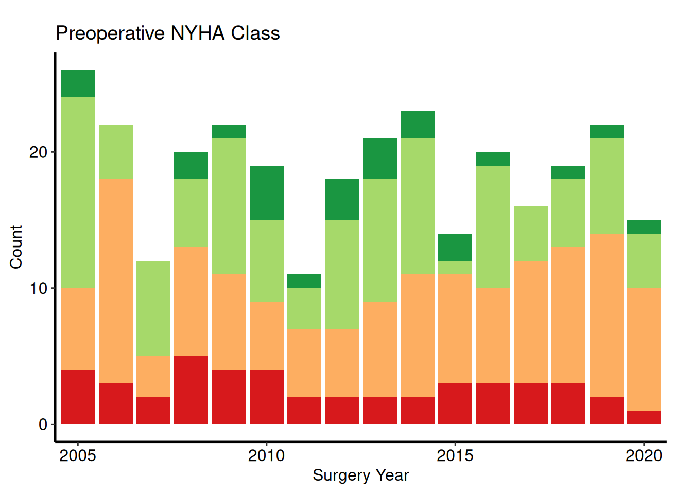

### Character categorical

``` r
eda_plot(dta_eda, x_col = "year", y_col = "valve_morph",
         y_label = "Valve Morphology") +
  scale_fill_manual(
    values = c(Bicuspid   = "steelblue",
               Tricuspid  = "firebrick",
               Unicuspid  = "goldenrod3",
               "(Missing)" = "grey80"),
    name = "Morphology"
  ) +
  scale_x_discrete(breaks = seq(2005, 2020, 5)) +
  labs(x = "Surgery Year", y = "Count") +
  hvti_theme("manuscript")
```

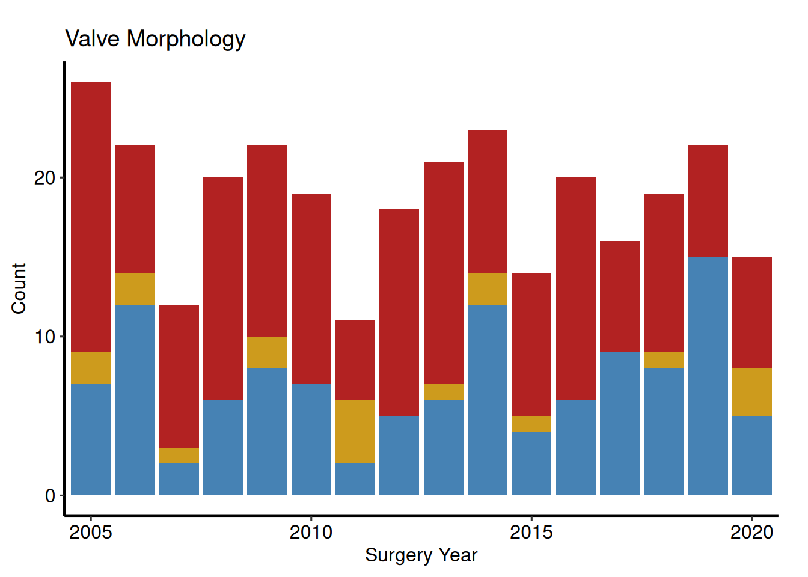

### Continuous: scatter + LOESS

Continuous columns produce a scatter plot with a LOESS smoother overlay.
Where `y_col` is `NA`, a rug mark is drawn on the x-axis.

``` r
eda_plot(dta_eda, x_col = "op_years", y_col = "ef",
         y_label = "Ejection Fraction (%)") +
  scale_colour_manual(values = c("firebrick"), guide = "none") +
  scale_x_continuous(breaks = seq(0, 15, 5)) +
  scale_y_continuous(limits = c(20, 80), breaks = seq(20, 80, 20)) +
  labs(x = "Years from First Surgery Year",
       caption = "Tick marks on x-axis: observations with missing EF") +
  hvti_theme("manuscript")
```

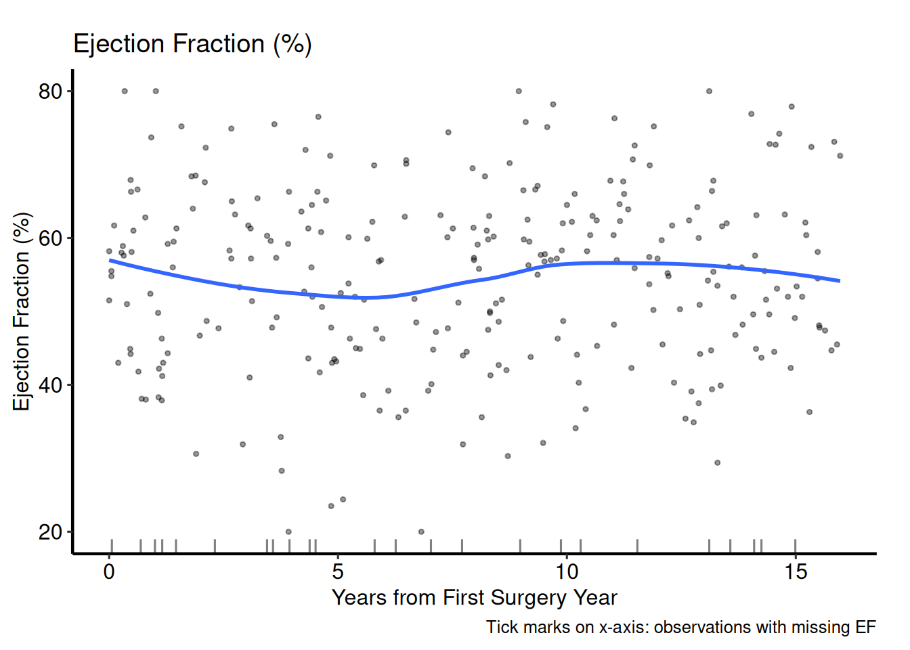

### Variable selection and labels (varnames template pattern)

[`eda_select_vars()`](https://ehrlinger.github.io/hvtiPlotR/reference/eda_select_vars.md)
subsets columns by name, matching the `Var_CatList` / `Var_ContList` +
`Order_Variables()` workflow. A named vector whose names are column
names and whose values are human-readable labels drives a single
[`lapply()`](https://rdrr.io/r/base/lapply.html) loop.

``` r
bin_vars <- c(male = "Sex (Male)", cabg = "Concomitant CABG")
sub_bin  <- eda_select_vars(dta_eda, c("year", names(bin_vars)))

p_bin <- lapply(names(bin_vars), function(cn) {
  eda_plot(sub_bin, x_col = "year", y_col = cn,
           y_label = bin_vars[[cn]]) +
    scale_fill_brewer(palette = "Set1", direction = -1, name = NULL) +
    scale_x_discrete(breaks = seq(2005, 2020, 5)) +
    labs(x = "Surgery Year", y = "Count") +
    hvti_theme("manuscript")
})
p_bin[[1]]
```

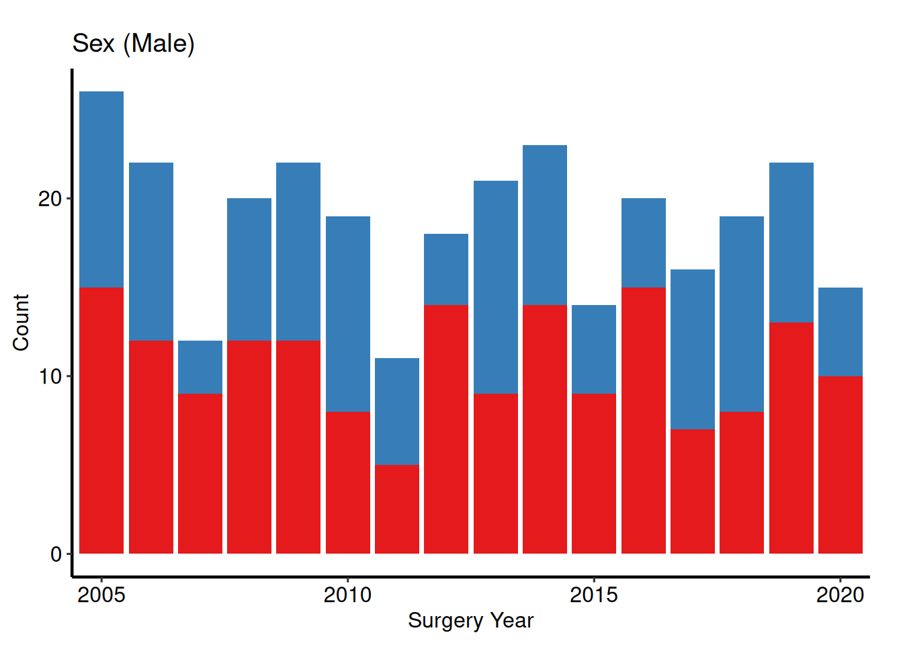

``` r
p_bin[[2]]
```

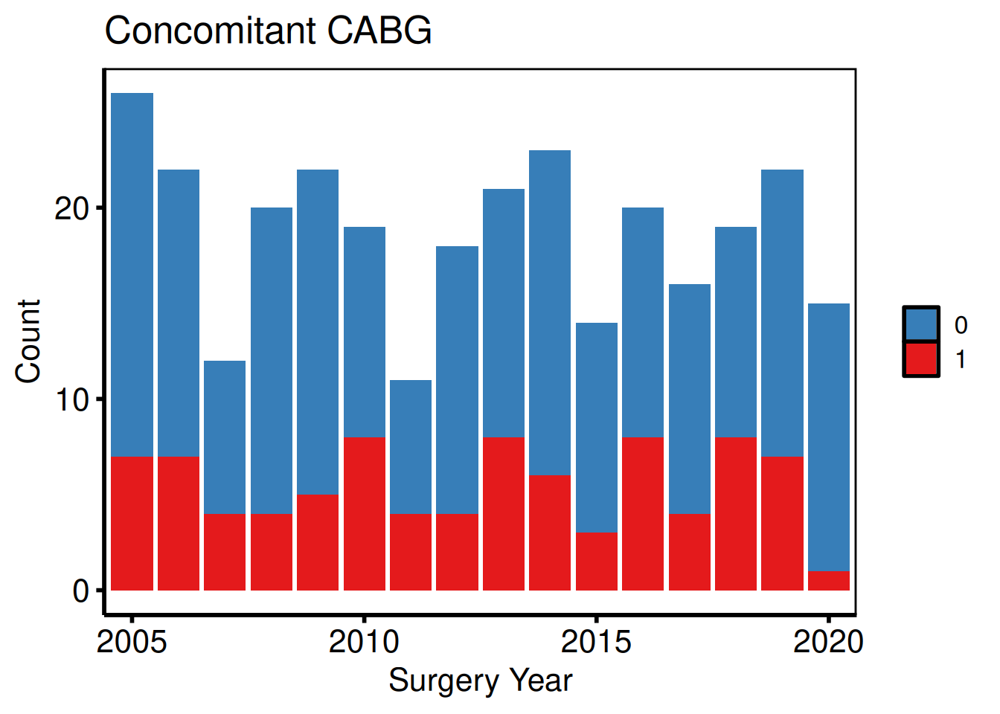

``` r
cat_vars <- c(nyha        = "NYHA Class",
              valve_morph = "Valve Morphology")
sub_cat <- eda_select_vars(dta_eda, c("year", names(cat_vars)))

p_cat <- lapply(names(cat_vars), function(cn) {
  eda_plot(sub_cat, x_col = "year", y_col = cn,
           y_label = cat_vars[[cn]]) +
    scale_fill_brewer(palette = "Set2", name = NULL) +
    scale_x_discrete(breaks = seq(2005, 2020, 5)) +
    labs(x = "Surgery Year", y = "Count") +
    hvti_theme("manuscript")
})
p_cat[[1]]
```

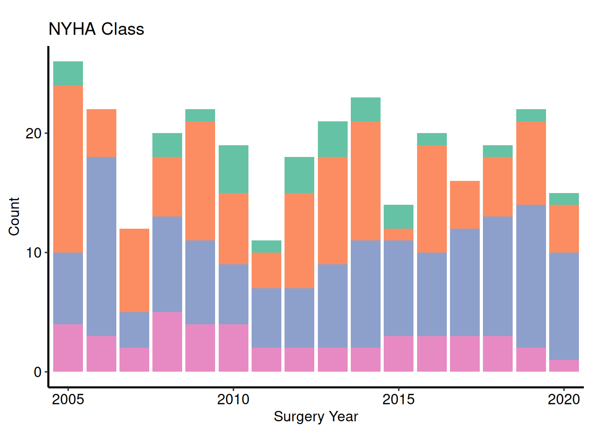

``` r
p_cat[[2]]
```

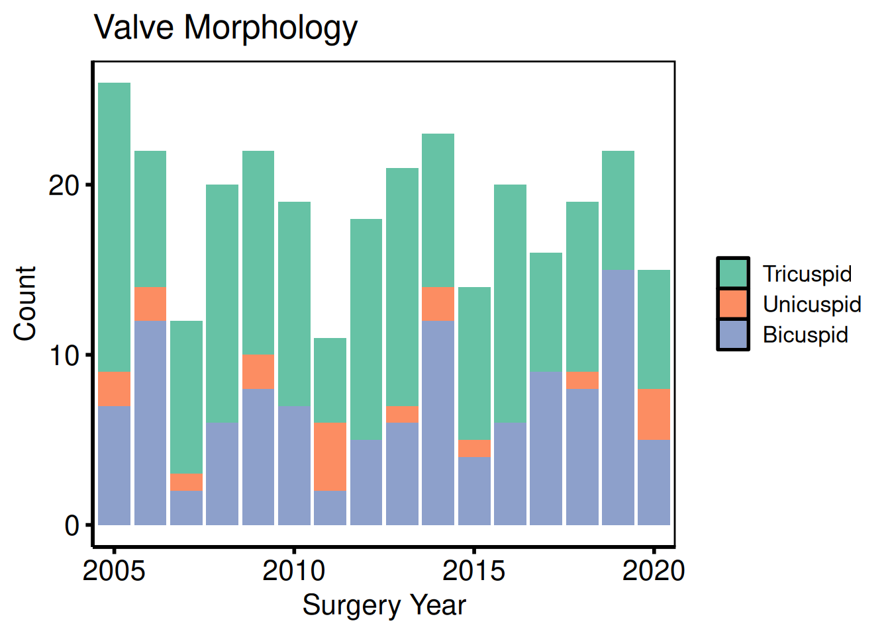

``` r
cont_vars <- c(ef        = "Ejection Fraction (%)",
               lv_mass   = "LV Mass Index (g/m\u00b2)",
               peak_grad = "Peak Gradient (mmHg)")
sub_cont <- eda_select_vars(dta_eda, c("op_years", names(cont_vars)))

p_cont <- lapply(names(cont_vars), function(cn) {
  eda_plot(sub_cont, x_col = "op_years", y_col = cn,
           y_label = cont_vars[[cn]]) +
    scale_colour_manual(values = c("steelblue"), guide = "none") +
    scale_x_continuous(breaks = seq(0, 15, 5)) +
    labs(x = "Years from First Surgery Year") +
    hvti_theme("manuscript")
})
p_cont[[1]]
```

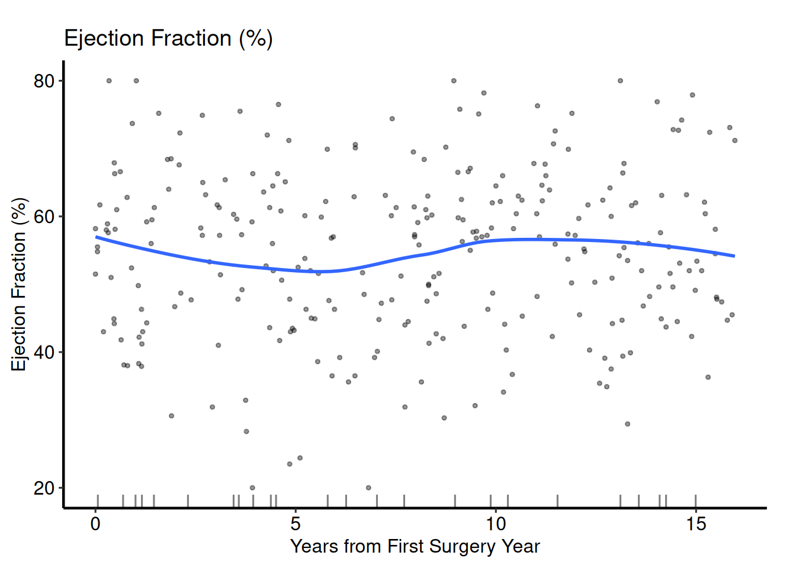

``` r
p_cont[[2]]
```

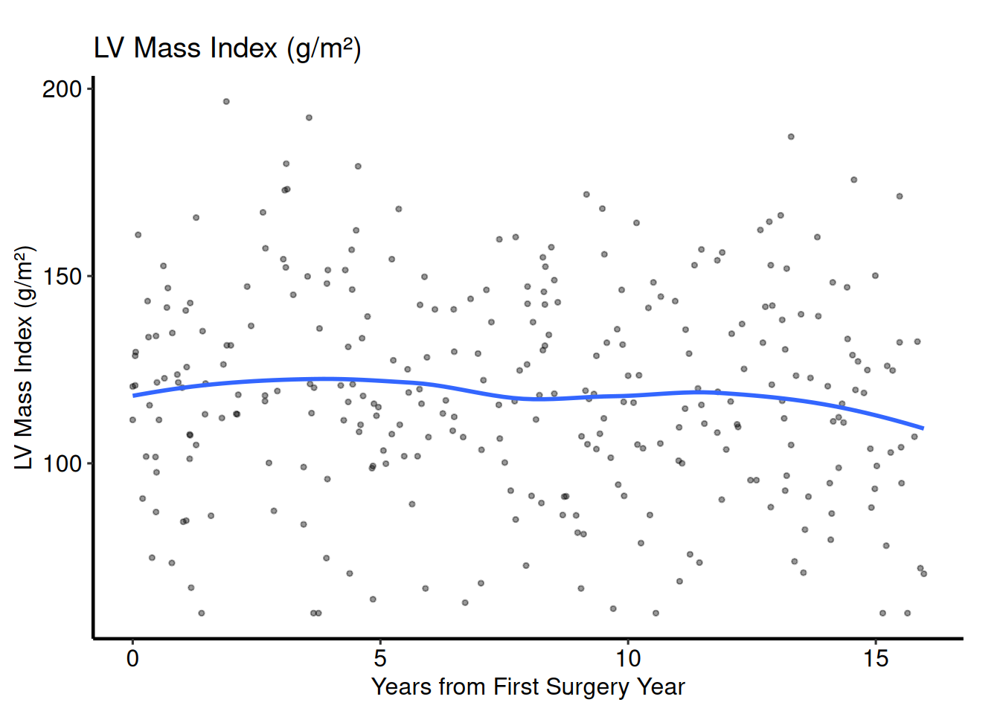

``` r
p_cont[[3]]
```

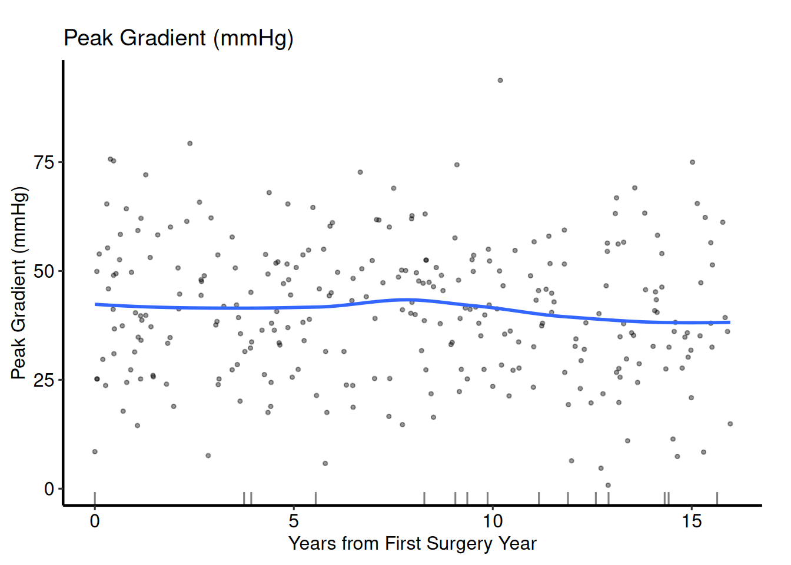

### Saving EDA plots

[`gridExtra::marrangeGrob()`](https://rdrr.io/pkg/gridExtra/man/arrangeGrob.html)
arranges multiple plots into a grid and
[`ggsave()`](https://ggplot2.tidyverse.org/reference/ggsave.html) writes
each page to a separate PDF file.

``` r
all_plots <- c(p_bin, p_cat, p_cont)
per_page  <- 9L  # 3 x 3 grid

for (pg in seq(1, length(all_plots), by = per_page)) {
  idx  <- seq(pg, min(pg + per_page - 1L, length(all_plots)))
  grob <- gridExtra::marrangeGrob(all_plots[idx], nrow = 3, ncol = 3)
  ggsave(
    filename = sprintf("../graphs/eda_page%02d.pdf", ceiling(pg / per_page)),
    plot     = grob,
    width    = 14,
    height   = 14
  )
}
```

## Alluvial (Sankey) Plot

[`alluvial_plot()`](https://ehrlinger.github.io/hvtiPlotR/reference/alluvial_plot.md)
produces an alluvial (Sankey-style) diagram using `ggalluvial`. Each row
of the input is a unique combination of axis values with an associated
patient count; flows are drawn proportional to that count. Ports
`tp.dp.female_bicus_preAR_sankey.R`.

### Sample data

``` r
dta_al  <- sample_alluvial_data(n = 300, seed = 42)
axes    <- c("pre_ar", "procedure", "post_ar")
head(dta_al)
```

        pre_ar   procedure post_ar freq
    1     Mild      Repair    Mild    3
    2 Moderate      Repair    Mild    7
    4   Severe      Repair    Mild    5
    5     Mild Replacement    Mild    3
    6 Moderate Replacement    Mild   25
    8   Severe Replacement    Mild   17

### Bare plot

``` r
alluvial_plot(dta_al, axes = axes, y_col = "freq")
```

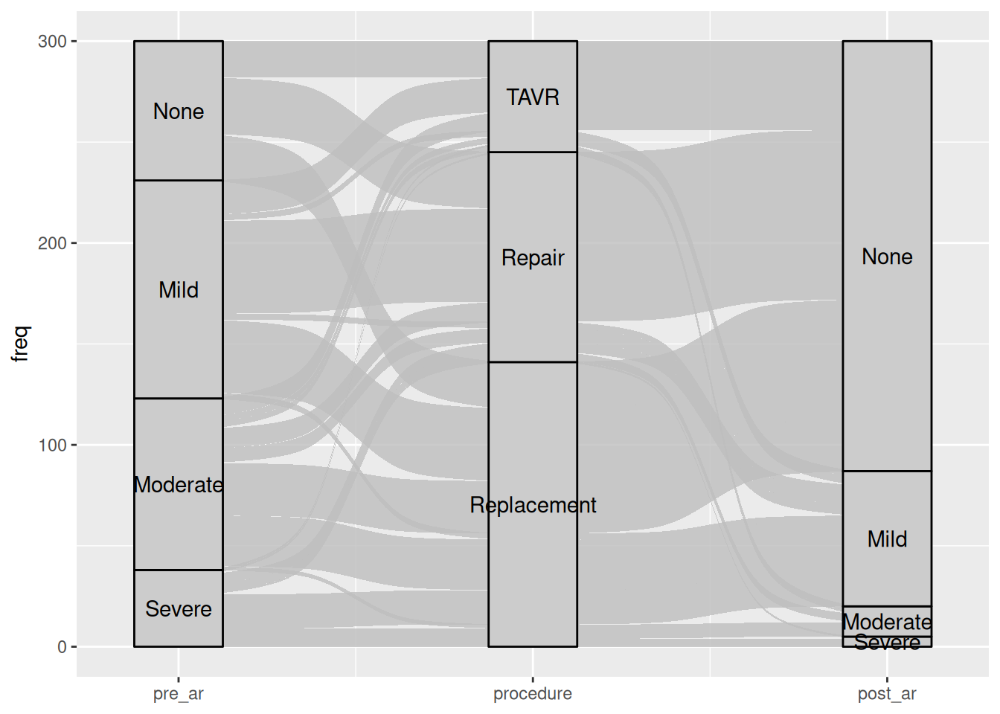

### Fill flows by pre-operative grade

``` r
alluvial_plot(dta_al, axes = axes, y_col = "freq",
              fill_col = "pre_ar") +
  scale_fill_manual(
    values = c(None     = "steelblue",
               Mild     = "goldenrod",
               Moderate = "darkorange",
               Severe   = "firebrick"),
    name = "Pre-op AR"
  ) +
  scale_colour_manual(
    values = c(None     = "steelblue",
               Mild     = "goldenrod",
               Moderate = "darkorange",
               Severe   = "firebrick"),
    guide = "none"
  ) +
  scale_x_continuous(
    breaks = 1:3,
    labels = c("Pre-op AR", "Procedure", "Post-op AR"),
    expand = c(0.05, 0.05)
  ) +
  labs(y = "Patients (n)",
       title = "AV Regurgitation: Pre- to Post-operative") +
  hvti_theme("manuscript")
```

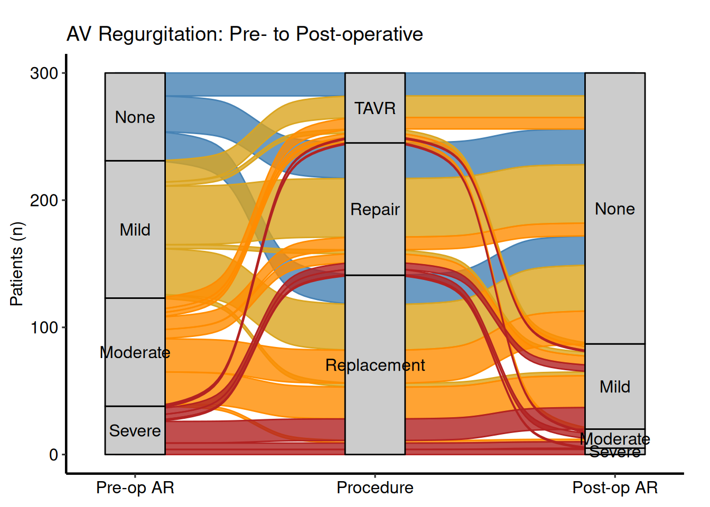

### Two-axis before / after comparison

``` r
alluvial_plot(
  dta_al,
  axes        = c("pre_ar", "post_ar"),
  y_col       = "freq",
  fill_col    = "pre_ar",
  axis_labels = c("Pre-operative", "Post-operative")
) +
  scale_fill_brewer(palette = "RdYlGn", direction = -1,
                    name = "AR Grade") +
  scale_colour_brewer(palette = "RdYlGn", direction = -1,
                      guide = "none") +
  annotate("text", x = 1.5, y = 250,
           label = "Improvement after surgery",
           size = 3.5, fontface = "italic") +
  labs(y = "Patients (n)",
       title = "AV Regurgitation Before and After Surgery") +
  hvti_theme("manuscript")
```

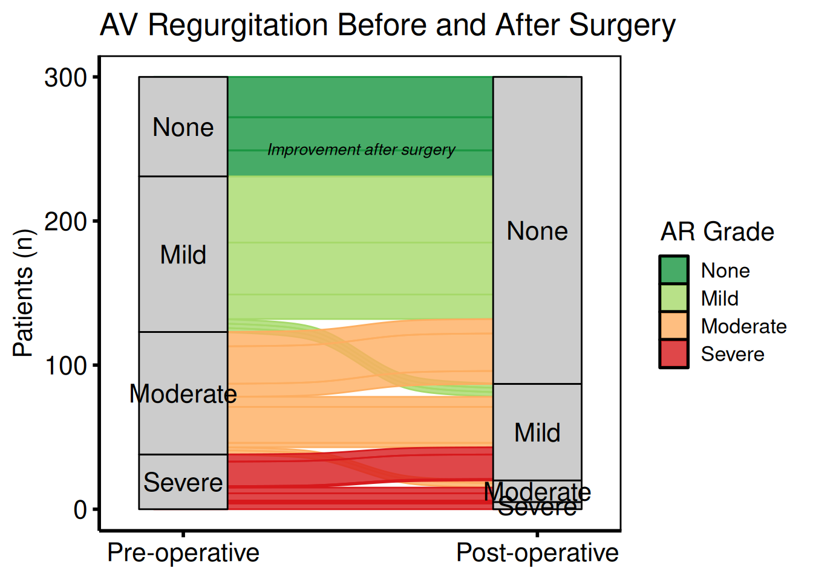

### Saving

``` r
p_al <- alluvial_plot(dta_al, axes = axes, y_col = "freq",
                      fill_col = "pre_ar") +
  scale_fill_brewer(palette = "RdYlGn", direction = -1) +
  scale_colour_brewer(palette = "RdYlGn", direction = -1, guide = "none") +
  labs(y = "Patients (n)") +
  hvti_theme("manuscript")

ggsave("../graphs/alluvial.pdf", p_al, width = 8, height = 6)
```

## Hazard Plot

[`hazard_plot()`](https://ehrlinger.github.io/hvtiPlotR/reference/hazard_plot.md)
plots pre-computed parametric survival, hazard, or cumulative-hazard
curves from a fitted Weibull (or other parametric) model, with optional
Kaplan-Meier empirical overlay and population life-table reference. It
ports the entire `tp.hp.dead.*` SAS template family.

The input data comes from two sources that map directly to the SAS
output:

| Column set                 | SAS dataset                                   | R function                                                                                                |
|----------------------------|-----------------------------------------------|-----------------------------------------------------------------------------------------------------------|
| Parametric prediction grid | `predict` (`SSURVIV`, `SCLLSURV`, `SCLUSURV`) | [`sample_hazard_data()`](https://ehrlinger.github.io/hvtiPlotR/reference/sample_hazard_data.md)           |
| KM empirical overlay       | `plout` (`CUM_SURV`, `CL_LOWER`, `CL_UPPER`)  | [`sample_hazard_empirical()`](https://ehrlinger.github.io/hvtiPlotR/reference/sample_hazard_empirical.md) |
| Population life table      | `smatched`                                    | [`sample_life_table()`](https://ehrlinger.github.io/hvtiPlotR/reference/sample_life_table.md)             |

### Sample data

``` r
dat_hp  <- sample_hazard_data(n = 500, time_max = 10)
emp_hp  <- sample_hazard_empirical(n = 500, time_max = 10, n_bins = 6)
head(dat_hp)
```

            time survival surv_lower surv_upper    hazard haz_lower haz_upper
    1 0.01000000 99.99558   99.93731        100 0.6629126 0.3996474  1.099602
    2 0.03002004 99.97702   99.84413        100 1.1485818 0.6924408  1.905203
    3 0.05004008 99.95054   99.75561        100 1.4829116 0.8939968  2.459770
    4 0.07006012 99.91808   99.66720        100 1.7546549 1.0578216  2.910523
    5 0.09008016 99.88059   99.57770        100 1.9896233 1.1994760  3.300275
    6 0.11010020 99.83868   99.48662        100 2.1996335 1.3260840  3.648628
           cumhaz cumhaz_lower cumhaz_upper
    1 0.004419417            0    0.5871202
    2 0.022986980            0    1.3519229
    3 0.049470012            0    1.9990187
    4 0.081954223            0    2.5912321
    5 0.119483723            0    3.1493081
    6 0.161453396            0    3.6834317

### Survival curve with KM overlay

The most common `tp.hp.dead.sas` output: smooth parametric survival with
confidence band plus discrete KM empirical circles and error bars.

``` r
hazard_plot(
  dat_hp,
  estimate_col  = "survival",
  lower_col     = "surv_lower",
  upper_col     = "surv_upper",
  empirical     = emp_hp,
  emp_lower_col = "lower",
  emp_upper_col = "upper"
) +
  scale_colour_manual(values = c("steelblue"), guide = "none") +
  scale_fill_manual(values = c("steelblue"), guide = "none") +
  scale_x_continuous(limits = c(0, 10), breaks = 0:10) +
  scale_y_continuous(limits = c(0, 100), breaks = seq(0, 100, 20),
                     labels = function(x) paste0(x, "%")) +
  labs(x = "Years", y = "Survival (%)") +
  hvti_theme("manuscript")
```

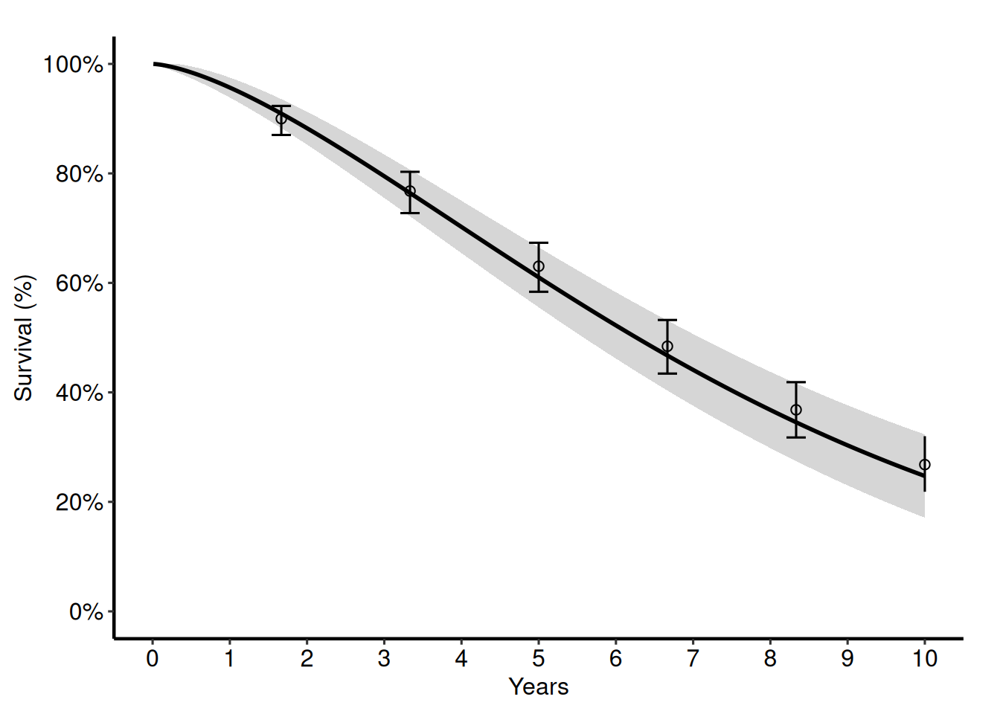

### Hazard rate curve

Switching `estimate_col` to `"hazard"` (and the matching CI columns)
shows the instantaneous hazard rate (%/year) instead of survival.

``` r
hazard_plot(
  dat_hp,
  estimate_col = "hazard",
  lower_col    = "haz_lower",
  upper_col    = "haz_upper"
) +
  scale_colour_manual(values = c("firebrick"), guide = "none") +
  scale_fill_manual(values = c("firebrick"), guide = "none") +
  scale_x_continuous(limits = c(0, 10), breaks = 0:10) +
  scale_y_continuous(limits = c(0, 30),
                     labels = function(x) paste0(x, "%/yr")) +
  labs(x = "Years", y = "Hazard (%/year)") +
  hvti_theme("manuscript")
```

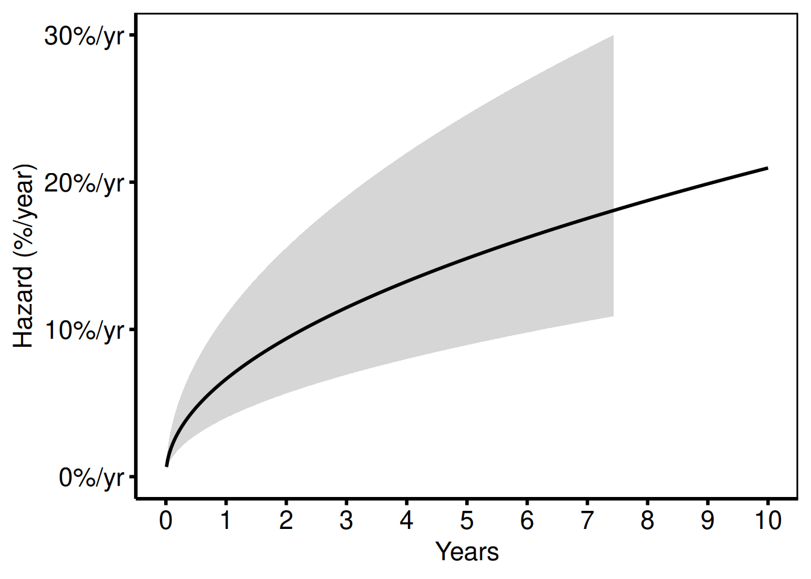

### Cumulative hazard

Used for readmission and repeated-event analyses
(`tp.hp.event.weighted.sas`, `tp.hp.repeated_events.sas`). The
`"cumhaz"` column equals `-log(S) * 100`.

``` r
hazard_plot(
  dat_hp,
  estimate_col  = "cumhaz",
  lower_col     = "cumhaz_lower",
  upper_col     = "cumhaz_upper"
) +
  scale_colour_manual(values = c("darkorange"), guide = "none") +
  scale_fill_manual(values = c("darkorange"), guide = "none") +
  scale_x_continuous(limits = c(0, 10), breaks = 0:10) +
  labs(x = "Years", y = "Cumulative Hazard (%)") +
  hvti_theme("manuscript")
```

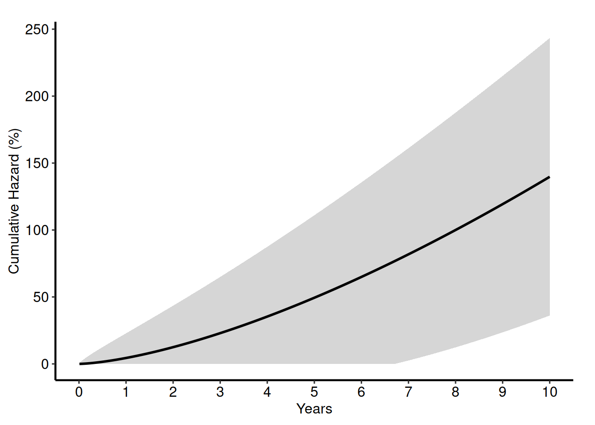

### Stratified by group

Pass `group_col` to compare two or more groups
(`tp.hp.dead.tkdn.stratified.sas`).

``` r
dat_strat <- sample_hazard_data(
  n = 400, time_max = 10,
  groups = c("No Takedown" = 1.0, "Takedown" = 0.65)
)
emp_strat <- sample_hazard_empirical(
  n = 400, time_max = 10, n_bins = 6,
  groups = c("No Takedown" = 1.0, "Takedown" = 0.65)
)

hazard_plot(
  dat_strat,
  estimate_col  = "survival",
  lower_col     = "surv_lower",
  upper_col     = "surv_upper",
  group_col     = "group",
  empirical     = emp_strat,
  emp_lower_col = "lower",
  emp_upper_col = "upper"
) +
  scale_colour_manual(
    values = c("No Takedown" = "steelblue", "Takedown" = "firebrick"),
    name   = NULL
  ) +
  scale_fill_manual(
    values = c("No Takedown" = "steelblue", "Takedown" = "firebrick"),
    guide  = "none"
  ) +
  scale_x_continuous(limits = c(0, 10), breaks = 0:10) +
  scale_y_continuous(limits = c(0, 100), breaks = seq(0, 100, 20),
                     labels = function(x) paste0(x, "%")) +
  labs(x = "Years after Esophagostomy", y = "Survival (%)") +
  hvti_theme("manuscript")
```

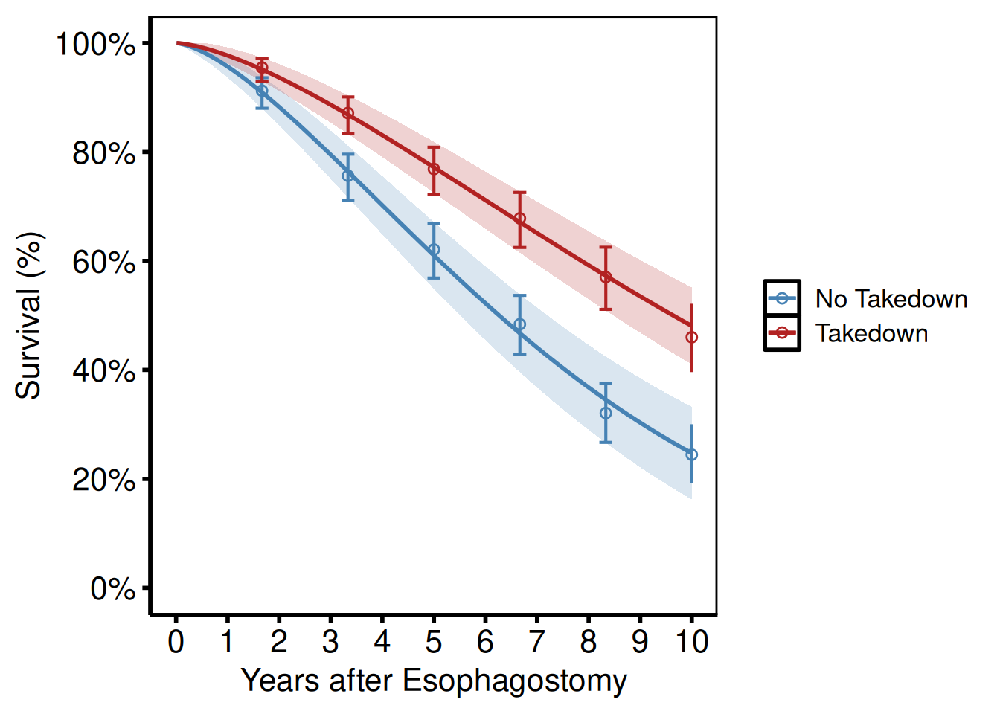

### Life-table overlay

`tp.hp.dead.age_with_population_life_table.sas` and
`tp.hp.dead.uslife.stratifed.sas` overlay US population life-table
survival (dashed lines) on age-stratified study curves. Pass the
life-table data frame to `reference` and set `ref_group_col` to vary the
linetype by age group.

``` r
dat_age <- sample_hazard_data(
  n = 600, time_max = 12,
  groups = c("<65" = 0.5, "65\u201380" = 1.0, "\u226580" = 1.8)
)
emp_age <- sample_hazard_empirical(
  n = 600, time_max = 12, n_bins = 6,
  groups = c("<65" = 0.5, "65\u201380" = 1.0, "\u226580" = 1.8)
)
lt <- sample_life_table(
  age_groups = c("<65", "65\u201380", "\u226580"),
  age_mids   = c(55, 72, 85),
  time_max   = 12
)

hazard_plot(
  dat_age,
  estimate_col     = "survival",
  lower_col        = "surv_lower",
  upper_col        = "surv_upper",
  group_col        = "group",
  empirical        = emp_age,
  emp_lower_col    = "lower",
  emp_upper_col    = "upper",
  reference        = lt,
  ref_estimate_col = "survival",
  ref_group_col    = "group"
) +
  scale_colour_manual(
    values = c("<65" = "steelblue", "65\u201380" = "forestgreen",
               "\u226580" = "firebrick"),
    name   = "Age group"
  ) +
  scale_fill_manual(
    values = c("<65" = "steelblue", "65\u201380" = "forestgreen",
               "\u226580" = "firebrick"),
    guide  = "none"
  ) +
  scale_x_continuous(limits = c(0, 12), breaks = seq(0, 12, 2)) +
  scale_y_continuous(limits = c(0, 100), breaks = seq(0, 100, 20),
                     labels = function(x) paste0(x, "%")) +
  labs(x = "Years", y = "Survival (%)",
       caption = "Dashed lines: US population life table") +
  hvti_theme("manuscript")
```

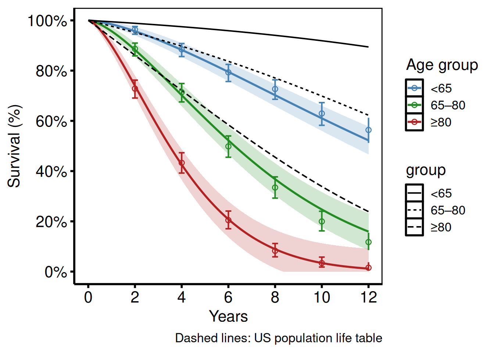

## Survival Difference (Life-Gained) Plot

[`survival_difference_plot()`](https://ehrlinger.github.io/hvtiPlotR/reference/survival_difference_plot.md)
plots the difference `S_2(t) - S_1(t)` between two groups over time,
with an optional confidence band. This ports
`tp.hp.dead.life-gained.sas` (HAZDIFL macro output).

### Sample data

``` r
diff_dat <- sample_survival_difference_data(
  n      = 500,
  groups = c("Control" = 1.0, "Treatment" = 0.70)
)
head(diff_dat)
```

            time  difference  diff_lower diff_upper group1_surv group2_surv
    1 0.01000000 0.001831068 -0.03739885 0.04106099    99.99558    99.99741
    2 0.03002004 0.009522643 -0.08737593 0.10642122    99.97702    99.98654
    3 0.05004008 0.020489267 -0.13072627 0.17170481    99.95054    99.97103
    4 0.07006012 0.033934691 -0.17121839 0.23908777    99.91808    99.95201
    5 0.09008016 0.049459769 -0.21006489 0.30898443    99.88059    99.93005
    6 0.11010020 0.066810699 -0.24784775 0.38146915    99.83868    99.90549

### Survival difference curve

``` r
survival_difference_plot(
  diff_dat,
  lower_col = "diff_lower",
  upper_col = "diff_upper"
) +
  scale_colour_manual(values = c("steelblue"), guide = "none") +
  scale_fill_manual(values = c("steelblue"), guide = "none") +
  ggplot2::geom_hline(yintercept = 0, linetype = "dashed",
                      colour = "grey50") +
  scale_x_continuous(limits = c(0, 10), breaks = 0:10) +
  scale_y_continuous(limits = c(-5, 40),
                     labels = function(x) paste0(x, "%")) +
  labs(x = "Years", y = "Survival Difference (%)") +
  hvti_theme("manuscript")
```

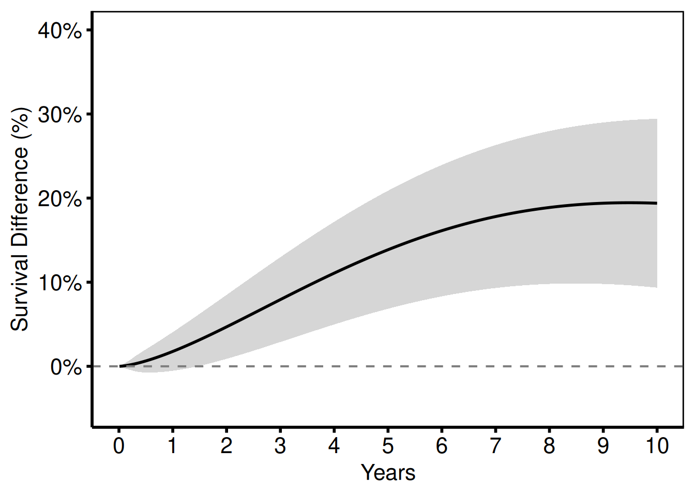

### Multiple comparisons

Combine several two-group differences into one long data frame and use
`group_col` to overlay them.

``` r
d1 <- sample_survival_difference_data(
  groups = c("Medical Mgmt" = 1.0, "TF-TAVR" = 0.70), seed = 1L
)
d1$comparison <- "TF-TAVR vs Medical Mgmt"

d2 <- sample_survival_difference_data(
  groups = c("TA-TAVR" = 0.90, "TF-TAVR" = 0.70), seed = 2L
)
d2$comparison <- "TF-TAVR vs TA-TAVR"

d3 <- sample_survival_difference_data(
  groups = c("AVR" = 0.80, "TF-TAVR" = 0.70), seed = 3L
)
d3$comparison <- "TF-TAVR vs AVR"

survival_difference_plot(rbind(d1, d2, d3),
                         group_col = "comparison") +
  scale_colour_brewer(palette = "Set1", name = NULL) +
  scale_fill_brewer(palette = "Set1", guide = "none") +
  ggplot2::geom_hline(yintercept = 0, linetype = "dashed",
                      colour = "grey50") +
  scale_x_continuous(limits = c(0, 10), breaks = 0:10) +
  labs(x = "Years", y = "Survival Difference (%)") +
  hvti_theme("manuscript")
```

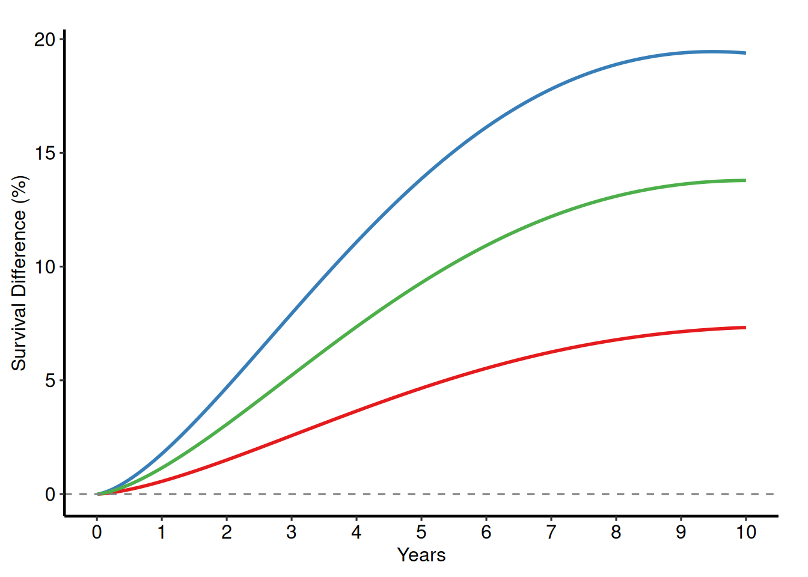

## Number Needed to Treat (NNT) Plot

[`nnt_plot()`](https://ehrlinger.github.io/hvtiPlotR/reference/nnt_plot.md)
plots the number needed to treat and absolute risk reduction over time,
porting the NNT component of `tp.hp.numtreat.survdiff.matched.sas`.

### Sample data

``` r
nnt_dat <- sample_nnt_data(
  n      = 500,
  time_max = 20,
  groups = c("SVG" = 1.0, "ITA" = 0.75)
)
head(nnt_dat)
```

            time         arr   arr_lower  arr_upper      nnt nnt_lower nnt_upper
    1 0.01000000 0.001548865 -0.03849194 0.04158967       NA        NA        NA
    2 0.05006012 0.017341632 -0.13725732 0.17194059       NA  581.5963        NA
    3 0.09012024 0.041863418 -0.22369142 0.30741825       NA  325.2897        NA
    4 0.13018036 0.072628007 -0.30691800 0.45217401       NA  221.1538        NA
    5 0.17024048 0.108520503 -0.38909707 0.60613807 921.4849  164.9789        NA
    6 0.21030060 0.148855060 -0.47112585 0.76883597 671.7944  130.0668        NA

### NNT curve

NNT decreases over time as the treatment benefit accumulates.

``` r
nnt_plot(
  nnt_dat,
  lower_col = "nnt_lower",
  upper_col = "nnt_upper"
) +
  scale_colour_manual(values = c("steelblue"), guide = "none") +
  scale_fill_manual(values = c("steelblue"), guide = "none") +
  scale_x_continuous(limits = c(0, 20), breaks = seq(0, 20, 5)) +
  scale_y_continuous(limits = c(0, 50), breaks = seq(0, 50, 10)) +
  labs(x = "Years", y = "Number Needed to Treat") +
  hvti_theme("manuscript")
```

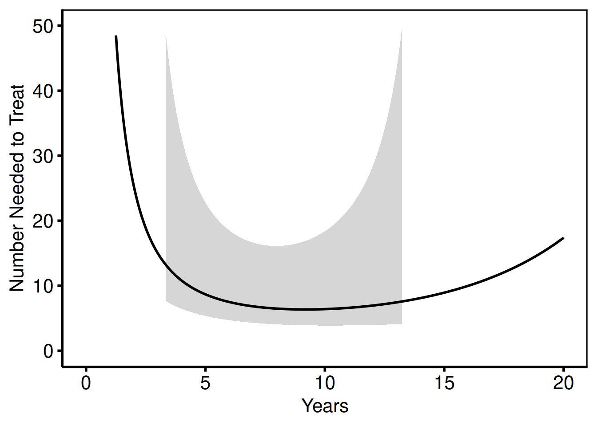

### Absolute risk reduction

The same data, plotted as ARR (%) instead of NNT.

``` r
nnt_plot(
  nnt_dat,
  estimate_col = "arr",
  lower_col    = "arr_lower",
  upper_col    = "arr_upper"
) +
  scale_colour_manual(values = c("firebrick"), guide = "none") +
  scale_fill_manual(values = c("firebrick"), guide = "none") +
  scale_x_continuous(limits = c(0, 20), breaks = seq(0, 20, 5)) +
  scale_y_continuous(limits = c(0, 50),
                     labels = function(x) paste0(x, "%")) +
  labs(x = "Years", y = "Absolute Risk Reduction (%)") +
  hvti_theme("manuscript")
```

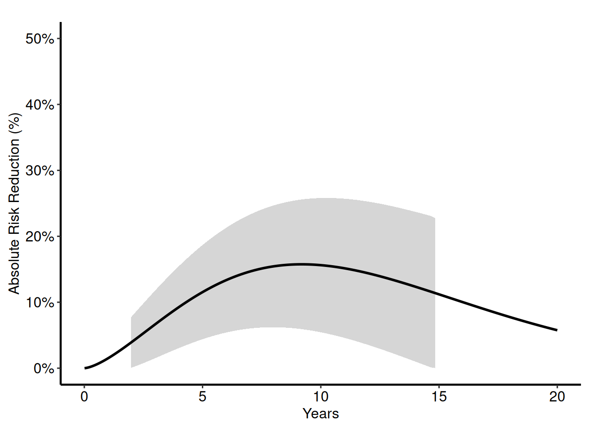

### Saving

``` r
p_hp <- hazard_plot(
  dat_hp,
  estimate_col  = "survival",
  lower_col     = "surv_lower",
  upper_col     = "surv_upper",
  empirical     = emp_hp,
  emp_lower_col = "lower",
  emp_upper_col = "upper"
) +
  scale_colour_manual(values = c("steelblue"), guide = "none") +
  scale_fill_manual(values = c("steelblue"), guide = "none") +
  labs(x = "Years", y = "Survival (%)") +
  hvti_theme("manuscript")

ggsave("../graphs/hazard_survival.pdf", p_hp, width = 11.5, height = 8)
```
