# hvtiPlotR Plot Functions

``` r

local({
  r_libs <- trimws(Sys.getenv("R_LIBS"))
  if (nzchar(r_libs)) {
    sep   <- if (.Platform$OS.type == "windows") ";" else ":"
    paths <- strsplit(r_libs, sep, fixed = TRUE)[[1]]
    .libPaths(unique(c(paths, .libPaths())))
  }
})
library(ggplot2)
library(hvtiPlotR)
```

All hvtiPlotR plot functions follow a two-step workflow. Call the
constructor (`hv_*()`) to validate and prepare data — it returns an S3
object of class `c("hv_<concept>", "hv_data")` — then call
[`plot()`](https://rdrr.io/r/graphics/plot.default.html) on the result
to get a bare `ggplot` with no colour scales, axis labels, or theme
applied yet. You add those with the usual `+` operator. See the
companion vignette “Decorating and Saving hvtiPlotR Plots” for full
coverage of `scale_()`,
[`labs()`](https://ggplot2.tidyverse.org/reference/labs.html),
[`annotate()`](https://ggplot2.tidyverse.org/reference/annotate.html),
themes, and
[`ggsave()`](https://ggplot2.tidyverse.org/reference/ggsave.html)
patterns.

## Template Reference Map

The table below maps each hvtiPlotR constructor to the original SAS and
R templates it ports. Functions marked with — have no direct predecessor
and were designed specifically for this package. All functions have
worked examples in the sections below.

| hvtiPlotR Constructor | SAS Template(s) | R Template(s) |
|----|----|----|
| [`hv_mirror_hist()`](https://ehrlinger.github.io/hvtiPlotR/reference/hv_mirror_hist.md) | — | `tp.lp.mirror-histogram_SAVR-TF-TAVR.R`, `tp.lp.mirror_histo_before_after_wt.R` |
| [`hv_stacked()`](https://ehrlinger.github.io/hvtiPlotR/reference/hv_stacked.md) | — | — |
| [`hv_balance()`](https://ehrlinger.github.io/hvtiPlotR/reference/hv_balance.md) | — | `tp.lp.propen.cov_balance.R` |
| [`hv_followup()`](https://ehrlinger.github.io/hvtiPlotR/reference/hv_followup.md) | `tp.dp.goodness_followup.*`, `tp.dp.goodness_event.*` | — |
| [`hv_survival()`](https://ehrlinger.github.io/hvtiPlotR/reference/hv_survival.md) | `tp.hp.dead.sas` (basic) | `tp.hp.dead.number_risk.R` |
| [`hazard_plot()`](https://ehrlinger.github.io/hvtiPlotR/reference/hazard_plot.md) | `tp.hp.dead.*`, `tp.hp.event.weighted.sas`, `tp.hp.repeated*.sas`, `tp.hp.numtreat.survdiff.matched.sas`, `tp.hs.dead.*`, `tp.hs.uslife_*` | `tp.hp.dead.number_risk.R` |
| [`survival_difference_plot()`](https://ehrlinger.github.io/hvtiPlotR/reference/survival_difference_plot.md) | `tp.hp.dead.life-gained.sas`, `tp.hp.numtreat.survdiff.matched.sas`, `tp.hs.dead.compare_benefit.setup.sas` | — |
| [`nnt_plot()`](https://ehrlinger.github.io/hvtiPlotR/reference/nnt_plot.md) | `tp.hp.numtreat.survdiff.matched.sas` | — |
| [`hv_nonparametric()`](https://ehrlinger.github.io/hvtiPlotR/reference/hv_nonparametric.md) | `tp.np.*.avrg_curv.*`, `tp.np.*.u.trend.*`, `tp.np.*.double.*`, `tp.np.*.mult.*`, `tp.np.*.phases.*`, `tp.np.z0axdpo.*` | — |
| [`hv_ordinal()`](https://ehrlinger.github.io/hvtiPlotR/reference/hv_ordinal.md) | `tp.np.*.ordinal.*` | — |
| [`hv_eda()`](https://ehrlinger.github.io/hvtiPlotR/reference/hv_eda.md) | — | — |
| [`hv_spaghetti()`](https://ehrlinger.github.io/hvtiPlotR/reference/hv_spaghetti.md) | — | `tp.dp.spaghetti.echo.R` |
| [`hv_trends()`](https://ehrlinger.github.io/hvtiPlotR/reference/hv_trends.md) | `tp.lp.trends.sas`, `tp.lp.trends.age.sas`, `tp.lp.trends.polytomous.sas`, `tp.rp.trends.sas` | `tp.dp.trends.R` |
| [`hv_longitudinal()`](https://ehrlinger.github.io/hvtiPlotR/reference/hv_longitudinal.md) | `tp.dp.longitudinal_patients_measures.*` | — |
| [`hv_alluvial()`](https://ehrlinger.github.io/hvtiPlotR/reference/hv_alluvial.md) | — | — |
| [`hv_sankey()`](https://ehrlinger.github.io/hvtiPlotR/reference/hv_sankey.md) | — | PAM cluster stability analysis |
| [`hv_consort()`](https://ehrlinger.github.io/hvtiPlotR/reference/hv_consort.md) | — | — |
| [`hv_upset()`](https://ehrlinger.github.io/hvtiPlotR/reference/hv_upset.md) | — | — |

Note:
[`hazard_plot()`](https://ehrlinger.github.io/hvtiPlotR/reference/hazard_plot.md),
[`survival_difference_plot()`](https://ehrlinger.github.io/hvtiPlotR/reference/survival_difference_plot.md),
and
[`nnt_plot()`](https://ehrlinger.github.io/hvtiPlotR/reference/nnt_plot.md)
retain the legacy single-call API pending migration to the two-step
constructor pattern.

: {tbl-colwidths=“\[28,44,28\]”}

## Mirrored Propensity Score Histogram

In propensity-matched analyses, we routinely produce a mirrored
histogram to show how well matching compressed the overlap between two
treatment groups.
[`hv_mirror_hist()`](https://ehrlinger.github.io/hvtiPlotR/reference/hv_mirror_hist.md)
prepares the data;
[`plot()`](https://rdrr.io/r/graphics/plot.default.html) hands you a
bare ggplot to dress with colour and labels.

The constructor accepts a data frame with columns for the propensity
score, group indicator, and match indicator. The
[`sample_mirror_histogram_data()`](https://ehrlinger.github.io/hvtiPlotR/reference/sample_mirror_histogram_data.md)
function generates example data suitable for testing.

Two display modes are selected by the arguments supplied to the
constructor. **Binary-match mode** (`match_col`) reproduces
`tp.lp.mirror-histogram_SAVR-TF-TAVR.R`: upper bars show all
observations before matching; overlaid bars show the matched subset.
**Weighted IPTW mode** (`weight_col`) reproduces
`tp.lp.mirror_histo_before_after_wt.R`: upper bars show raw counts;
overlaid bars show per-bin IPTW weight sums.

### Binary-match mode (SAVR vs. TF-TAVR)

[`sample_mirror_histogram_data()`](https://ehrlinger.github.io/hvtiPlotR/reference/sample_mirror_histogram_data.md)
simulates 2,000 patients with a continuous propensity score (`prob_t`),
a binary group indicator (`tavr`), and a match flag (`match`). Pass
`score_multiplier = 100` to put the score on a 0–100 percent scale, and
`binwidth = 5` to set 5-point bins.

``` r

mirror_dta <- sample_mirror_histogram_data(n = 2000, separation = 1.5)

mh <- hv_mirror_hist(
  data             = mirror_dta,
  score_col        = "prob_t",
  group_col        = "tavr",
  match_col        = "match",
  group_levels     = c(0, 1),
  group_labels     = c("SAVR", "TF-TAVR"),
  matched_value    = 1,
  score_multiplier = 100,
  binwidth         = 5
)
```

### Bare plot

The bare panel shows two mirrored bar charts – upper bars for the first
group, lower for the second – with white fill and no scale or labels
yet. Look for: upper and lower bars that are roughly symmetric before
matching, with the matched (darker) overlay narrowing the distribution;
if both panels look identical, `match_col` may not be mapping correctly.

``` r

p <- plot(mh, alpha = 0.8)
p
```

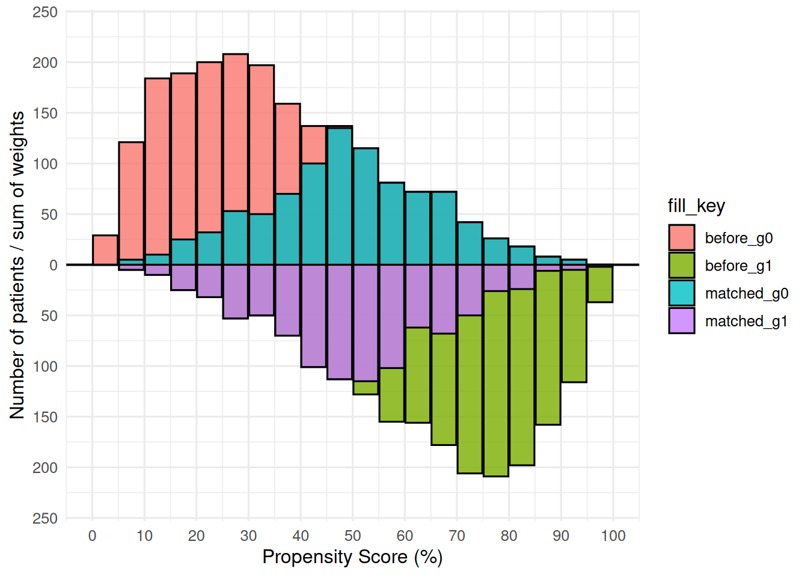

### Adding scales, labels, and theme

[`scale_fill_manual()`](https://ggplot2.tidyverse.org/reference/scale_manual.html)
maps the four internal fill levels (`before_g0`, `matched_g0`,
`before_g1`, `matched_g1`) to white (pre-match) and two greens (matched
subsets). The annotation calls use `y = Inf`/`-Inf` with `vjust` to
anchor labels at the panel edges;
[`theme_hv_poster()`](https://ehrlinger.github.io/hvtiPlotR/reference/hvtiPlotR-themes.md)
sizes text for a conference poster.

``` r

p +
  ggplot2::scale_fill_manual(
    values = c(
      before_g0  = "white",  matched_g0 = "green1",
      before_g1  = "white",  matched_g1 = "green4"
    ),
    guide = "none"
  ) +
  ggplot2::scale_x_continuous(
    limits = c(0, 100),
    breaks = seq(0, 100, 10)
  ) +
  ggplot2::scale_y_continuous(labels = abs) +
  ggplot2::annotate("text", x = 20, y =  Inf, vjust =  2,
                    label = mh$meta$group_labels[1], size = 7) +
  ggplot2::annotate("text", x = 20, y = -Inf, vjust = -1,
                    label = mh$meta$group_labels[2], size = 7) +
  ggplot2::labs(x = "Propensity Score (%)", y = "Number of Patients") +
  theme_hv_poster()
```

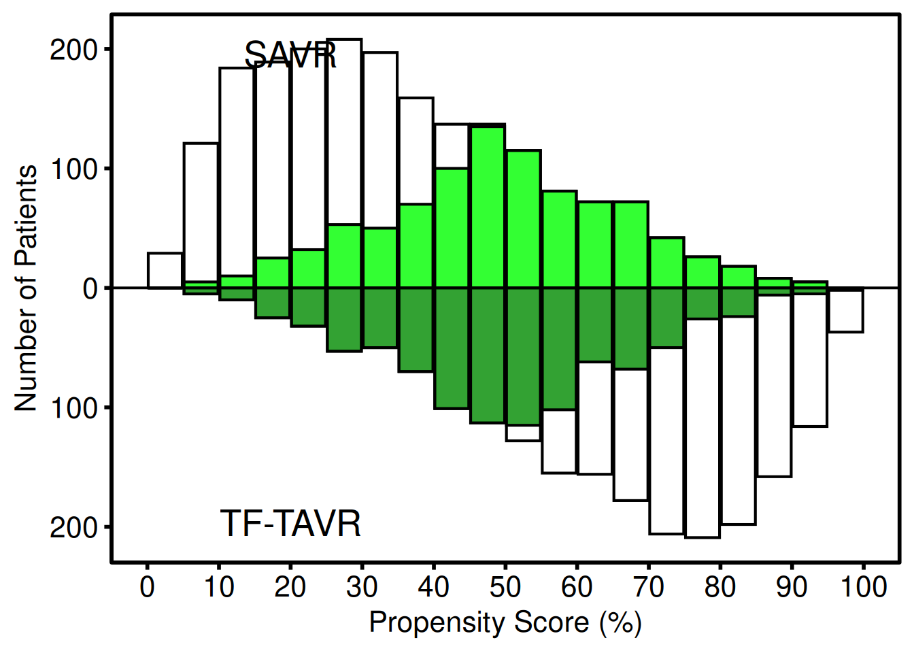

The lighter bars show the full (pre-match) distribution for each group;
the darker overlaid bars show the matched subset. Upper panel = first
group label; lower panel = second group label.
`scale_y_continuous(labels = abs)` converts the internal negative counts
to positive labels. `y = Inf`/`-Inf` with `vjust` anchors each
annotation near the panel edge regardless of data scale, so the
positions adapt automatically to different dataset sizes.

The constructor stores group counts and standardized mean differences
(SMD) before and after matching in `$tables$diagnostics`. You can read
those out directly:

``` r

mh$tables$diagnostics$smd_before
```

    [1] 1.563175

``` r

mh$tables$diagnostics$smd_matched
```

    [1] 0.02714868

``` r

mh$tables$diagnostics$group_counts_before
```


       0    1
    2000 2000 

``` r

mh$tables$diagnostics$group_counts_matched
```


      0   1
    919 919 

### Weighted IPTW mode (Limited vs. Extended)

When the analysis uses inverse probability of treatment weighting rather
than 1:1 matching, pass `weight_col` instead of `match_col`. Each bin’s
overlay height is the sum of IPTW weights in that bin rather than a raw
matched count. `add_weights = TRUE` in the sample-data generator
attaches an `mt_wt` column.

``` r

wt_dta <- sample_mirror_histogram_data(
  n = 2000, separation = 1.5, add_weights = TRUE
)

mh_wt <- hv_mirror_hist(
  data             = wt_dta,
  score_col        = "prob_t",
  group_col        = "tavr",
  group_levels     = c(0, 1),
  group_labels     = c("Limited", "Extended"),
  weight_col       = "mt_wt",
  score_multiplier = 100,
  binwidth         = 5
)
```

### Bare plot

The bare weighted panel looks the same as the binary-match bare plot –
white bars with an overlay – but the overlay encodes IPTW weight sums,
not counts. Look for: upper and lower overlay bars that are visually
balanced, indicating good weighting; bars that remain heavily one-sided
suggest extreme weights.

``` r

p_wt <- plot(mh_wt, alpha = 0.8)
p_wt
```

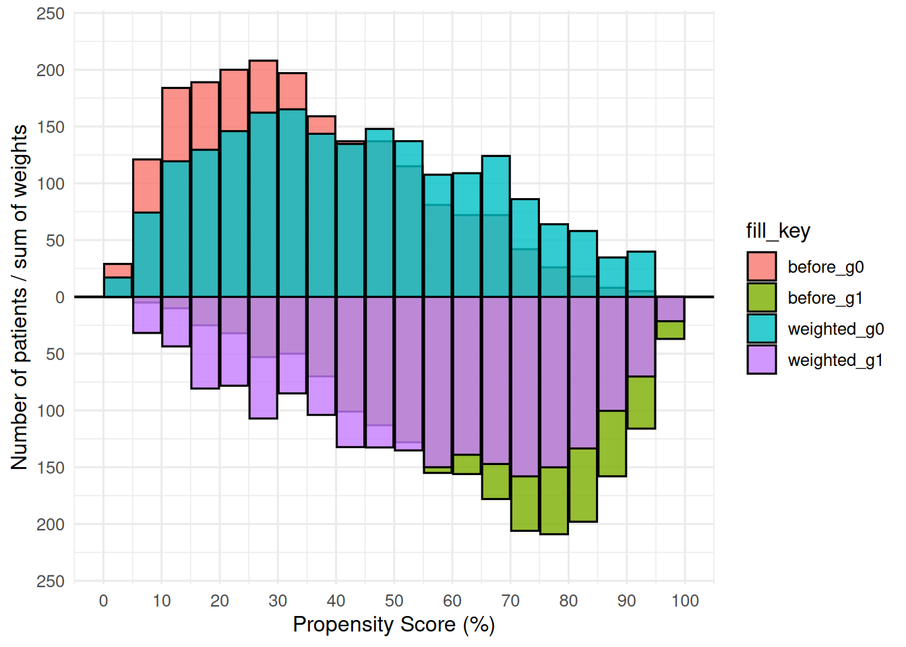

### Adding scales, labels, and theme

The IPTW variant uses blue/red for the Limited/Extended groups, with the
group labels coloured to match. The axis and annotation pattern is the
same as the binary-match version; swap
[`theme_hv_poster()`](https://ehrlinger.github.io/hvtiPlotR/reference/hvtiPlotR-themes.md)
for
[`theme_hv_manuscript()`](https://ehrlinger.github.io/hvtiPlotR/reference/hvtiPlotR-themes.md)
when preparing the figure for a journal submission.

``` r

p_wt +
  ggplot2::scale_fill_manual(
    values = c(
      before_g0   = "white", weighted_g0 = "blue",
      before_g1   = "white", weighted_g1 = "red"
    ),
    guide = "none"
  ) +
  ggplot2::scale_x_continuous(
    limits = c(0, 100),
    breaks = seq(0, 100, 10)
  ) +
  ggplot2::scale_y_continuous(labels = abs) +
  ggplot2::annotate("text", x = 30, y =  Inf, vjust =  2,
                    label = mh_wt$meta$group_labels[1], color = "blue", size = 5) +
  ggplot2::annotate("text", x = 30, y = -Inf, vjust = -1,
                    label = mh_wt$meta$group_labels[2], color = "red",  size = 5) +
  ggplot2::labs(x = "Propensity Score (%)", y = "#") +
  theme_hv_poster()
```

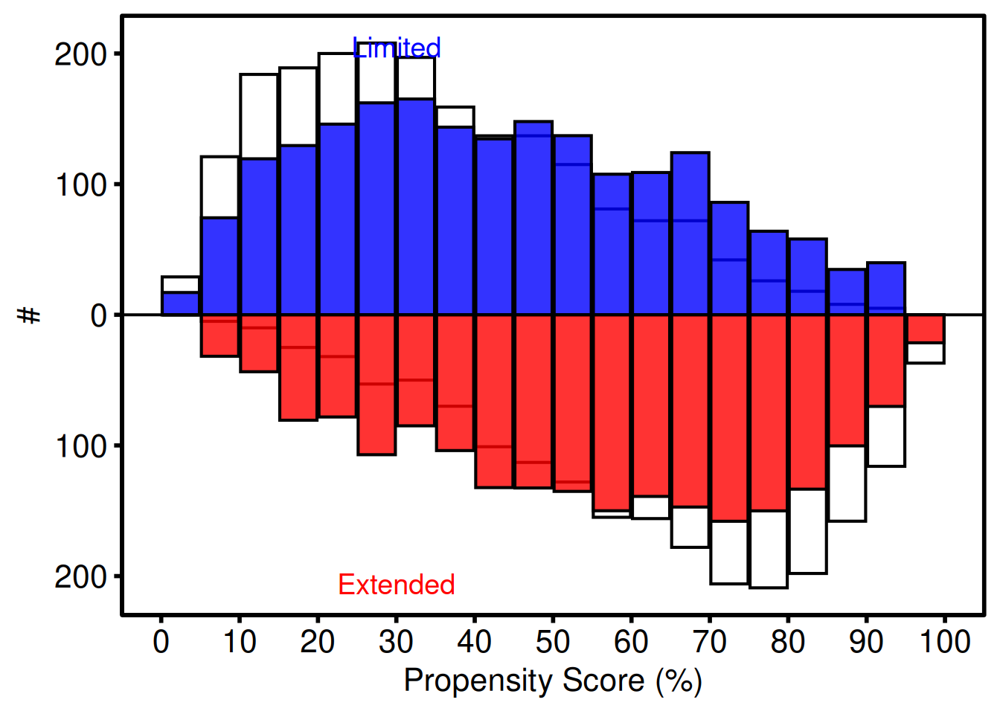

Weighted diagnostics include the effective N and weighted SMD:

``` r

mh_wt$tables$diagnostics$smd_weighted
```

    [1] 0.5434922

``` r

mh_wt$tables$diagnostics$effective_n_by_group
```

       0    1
    2000 2000 

## Stacked Histogram

The stacked histogram shows how the composition of a numeric variable
shifts over time or across a grouping dimension.
[`hv_stacked()`](https://ehrlinger.github.io/hvtiPlotR/reference/hv_stacked.md)
prepares the data;
[`plot()`](https://rdrr.io/r/graphics/plot.default.html) hands you a
bare ggplot to dress with colour and labels.

The
[`sample_stacked_histogram_data()`](https://ehrlinger.github.io/hvtiPlotR/reference/sample_stacked_histogram_data.md)
function generates a reproducible example dataset with `year` and
`category` columns.

``` r

# Generate sample data
hist_dta <- sample_stacked_histogram_data(n_years = 20, start_year = 2000,
                                           n_categories = 3)
head(hist_dta)
```

      year category
    1 2000        1
    2 2000        1
    3 2000        2
    4 2000        2
    5 2000        2
    6 2000        1

### Count histogram

The default `position = "stack"` shows raw counts within each bin,
equivalent to the `plot.sas` frequency histogram. Build the S3 object
with
[`hv_stacked()`](https://ehrlinger.github.io/hvtiPlotR/reference/hv_stacked.md),
then call [`plot()`](https://rdrr.io/r/graphics/plot.default.html) to
get a bare ggplot you dress with colour scales and a theme in one
pipeline.

``` r

# Build the S3 object, then render the bare plot
sh <- hv_stacked(hist_dta, x_col = "year", group_col = "category")
p_count <- plot(sh)

# Layer on colour scales, labels, and a theme
p_count +
  scale_fill_brewer(palette = "Set1", name = "Category") +
  scale_color_brewer(palette = "Set1", name = "Category") +
  labs(x = "Year", y = "Count") +
  theme_hv_poster()
```


### Proportion (fill) histogram

Setting `position = "fill"` rescales each bin so the bars sum to 1,
making it easy to compare the relative composition across years without
count differences obscuring the trend. Pass the composition variant to
[`hv_stacked()`](https://ehrlinger.github.io/hvtiPlotR/reference/hv_stacked.md)
at construction time, then layer in manual colour and axis labels.

``` r

# Build the proportional variant
sh2   <- hv_stacked(hist_dta, x_col = "year", group_col = "category",
                       position = "fill")
p_fill <- plot(sh2)

# Use manual colours and custom legend labels
p_final <- p_fill +
  scale_fill_manual(
    values = c("1" = "pink", "2" = "cyan", "3" = "orangered"),
    labels = c("1" = "Group A", "2" = "Group B", "3" = "Group C"),
    name   = "Category"
  ) +
  scale_color_manual(
    values = c("1" = "pink", "2" = "cyan", "3" = "orangered"),
    guide  = "none"
  ) +
  labs(x = "Year", y = "Proportion") +
  theme_hv_poster()

p_final
```


### Saving

[`ggsave()`](https://ggplot2.tidyverse.org/reference/ggsave.html) writes
the composed figure to a PDF at 11 x 8 inches, a standard landscape size
for posters. For an editable PowerPoint slide, use
[`save_ppt()`](https://ehrlinger.github.io/hvtiPlotR/reference/save_ppt.md)
instead; see the companion [Decorating and
Saving](https://ehrlinger.github.io/hvtiPlotR/articles/plot-decorators.md)
vignette.

``` r

ggsave(
  filename = "../graphs/stacked_histogram.pdf",
  plot     = p_final,
  width    = 11,
  height   = 8
)
```

## Goodness-of-Follow-Up Plot

The goodness-of-follow-up plot is a standard quality-control figure in
longitudinal outcome analyses. Each patient appears as a point at their
operation date (x-axis) and follow-up duration (y-axis), with a short
vertical tick below. A dashed diagonal line marks the maximum potential
follow-up given the study start, study end, and follow-up closing date —
points above the line have longer follow-up than that window alone
explains, typically because passive surveillance supplemented active
cross-sectional follow-up.

[`hv_followup()`](https://ehrlinger.github.io/hvtiPlotR/reference/hv_followup.md)
prepares the data;
[`plot()`](https://rdrr.io/r/graphics/plot.default.html) hands you a
bare ggplot with no colour, shape, axis, or label scales applied. Add
those with the usual `+` operator. The `type` argument selects the
panel: `"followup"` (default, the death/censoring scatter) or `"event"`
(competing non-fatal event panel).

### Sample data

[`sample_goodness_followup_data()`](https://ehrlinger.github.io/hvtiPlotR/reference/sample_goodness_followup_data.md)
generates 300 patients with operation dates, follow-up durations, vital
status, and a simulated non-fatal event column. The constructor needs
`study_start`, `study_end`, and `close_date` to draw the
maximum-follow-up diagonal line correctly.

``` r

gfup_dta <- sample_goodness_followup_data(n = 300, seed = 42)
head(gfup_dta)
```

      iv_opyrs iv_dead  dead iv_event ev_event deads
    1  29.5694  2.0261 FALSE   2.0261    FALSE FALSE
    2   6.4834  6.9027  TRUE   4.0813     TRUE  TRUE
    3  14.4342  5.4468  TRUE   5.4468    FALSE  TRUE
    4  25.4324  6.1630 FALSE   0.6137     TRUE FALSE
    5   3.4251 13.1369  TRUE   6.9232     TRUE  TRUE
    6  24.1620  7.4334 FALSE   7.4334    FALSE FALSE

### Death follow-up plot

The bare `plot(gf)` panel shows each patient as a point and tick without
scales, labels, or theme. Look for: a cloud of points below the
diagonal, with some above it (patients with longer follow-up than the
window explains); if all points fall exactly on the diagonal, the close
date may be set incorrectly.

``` r

gf <- hv_followup(
  data        = gfup_dta,
  origin_year = 1990,
  study_start = as.Date("1990-01-01"),
  study_end   = as.Date("2019-12-31"),
  close_date  = as.Date("2021-08-06")
)

# Bare plot — no scales or labels yet
plot(gf)
```

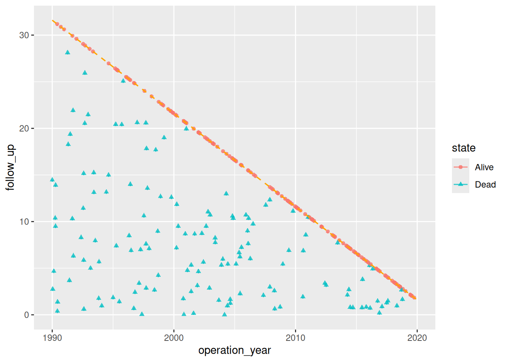

### Adding scales, labels, and annotations

Scale, label, and annotation layers are composed with the usual `+`
operator.
[`scale_color_manual()`](https://ggplot2.tidyverse.org/reference/scale_manual.html)
and
[`scale_shape_manual()`](https://ggplot2.tidyverse.org/reference/scale_manual.html)
map the binary alive/dead state to colours and point shapes.
[`annotate()`](https://ggplot2.tidyverse.org/reference/annotate.html)
places group-identifying text directly on the panel.

``` r

gfup_final <- plot(gf, alpha = 0.8) +
  # Colour alive = blue, dead = red (Set1 palette positions 2 and 1)
  scale_color_manual(
    values   = c("#377EB8", "#E41A1C"),
    labels   = c("Alive", "Dead"),
    na.value = "black",
    drop     = FALSE
  ) +
  scale_shape_manual(
    values = c(1, 4),
    labels = c("Alive", "Dead")
  ) +
  # Axis tick placement
  scale_x_continuous(breaks = seq(1990, 2020, 3)) +
  scale_y_continuous(breaks = seq(0, 33,   3)) +
  # Clip the panel to the study window
  coord_cartesian(ylim = c(0, 33), xlim = c(1990, 2020)) +
  # Axis and legend labels
  labs(
    x     = "Operation Date",
    y     = "Follow-up (years)",
    color = "Status",
    shape = "Status"
  ) +
  # Annotate directly on the panel
  annotate("text", x = 1993, y = 31, label = "Alive at close",
           hjust = 0, size = 3.5) +
  annotate("text", x = 1993, y = 28, label = "Deceased",
           hjust = 0, size = 3.5, color = "#E41A1C") +
  theme(legend.position = "none") +
  theme_hv_poster()

gfup_final
```

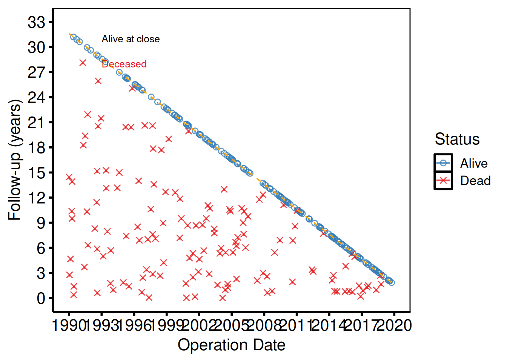

### Saving

[`ggsave()`](https://ggplot2.tidyverse.org/reference/ggsave.html) writes
the figure at 6 x 6 inches – square dimensions suit the scatter’s equal
x–y scale. For a PowerPoint version, see [Decorating and
Saving](https://ehrlinger.github.io/hvtiPlotR/articles/plot-decorators.md).

``` r

ggsave(
  filename = "../graphs/dp_goodness-of-followup.pdf",
  plot     = gfup_final,
  height   = 6,
  width    = 6
)
```

### Non-fatal event panel

When the dataset includes a non-fatal competing event (e.g. relapse,
reoperation), pass `event_col`, `event_time_col`, and optionally
`death_for_event_col` to the constructor and then call
[`plot()`](https://rdrr.io/r/graphics/plot.default.html) with
`type = "event"` to render the event panel.

``` r

gfup_event_dta <- sample_goodness_followup_data(n = 300, seed = 42)
```

``` r

gf2 <- hv_followup(
  gfup_event_dta,
  event_col           = "ev_event",
  event_time_col      = "iv_event",
  death_for_event_col = "deads",
  event_levels        = c("No event", "Relapse", "Death"),
  origin_year         = 1990,
  study_start         = as.Date("1990-01-01"),
  study_end           = as.Date("2019-12-31"),
  close_date          = as.Date("2021-08-06")
)

plot(gf2, type = "event", alpha = 0.8) +
  scale_color_manual(
    values = c("No event" = "blue", "Relapse" = "green3", "Death" = "red"),
    name   = NULL
  ) +
  scale_shape_manual(
    values = c("No event" = 1L, "Relapse" = 2L, "Death" = 4L),
    name   = NULL
  ) +
  scale_x_continuous(breaks = seq(1990, 2020, 3)) +
  scale_y_continuous(breaks = seq(0, 33, 3)) +
  coord_cartesian(ylim = c(0, 33), xlim = c(1990, 2020)) +
  labs(
    x = "Operation Date",
    y = "Follow-up (years)",
    color = "Event", shape = "Event"
  ) +
  annotate("text", x = 1993, y = 31,
           label = "Systematic follow-up", hjust = 0, size = 3.5) +
  theme(legend.position = c(0.85, 0.15)) +
  theme_hv_poster()
```


The default follow-up panel (`plot(gf)`) and the event panel
(`plot(gf2, type = "event")`) share the same diagonal reference line and
can be saved individually with
[`ggsave()`](https://ggplot2.tidyverse.org/reference/ggsave.html).

## Covariate Balance Plot

The covariate balance plot is the standard quality-control figure for
propensity score matching and IPTW analyses. Each covariate occupies a
labelled row; points show the standardized mean difference (SMD) for
each comparison group (e.g. before and after matching). A solid vertical
line marks zero balance; the dotted lines at ±10% give you a quick
visual threshold for acceptable balance.
[`hv_balance()`](https://ehrlinger.github.io/hvtiPlotR/reference/hv_balance.md)
prepares the data, superseding `tp.lp.propen.cov_balance.R`;
[`plot()`](https://rdrr.io/r/graphics/plot.default.html) hands you a
bare ggplot to style with the usual `+` operator.

Input data must be in **long format**: one row per covariate × group
combination with columns for the covariate name, the group label, and
the numeric SMD value. When the source dataset arrives in wide format
(one column per time-point, as the SAS export does), reshape it first:

``` r

# Simulate a wide-format export (e.g. from SAS or a summary table)
dta_wide <- data.frame(
  variable      = c("Age", "Female sex", "Hypertension", "Diabetes", "COPD"),
  `Before match` = c(22.1, -15.3,  18.7, -9.4,  11.2),
  `After match`  = c( 3.5,   2.1,  -1.8,  4.0,  -2.3),
  check.names = FALSE
)

dta_long <- reshape(
  dta_wide,
  direction = "long",
  varying   = c("Before match", "After match"),
  v.names   = "std_diff",
  timevar   = "group",
  times     = c("Before match", "After match"),
  idvar     = "variable"
)
head(dta_long)
```

                                  variable        group std_diff
    Age.Before match                   Age Before match     22.1
    Female sex.Before match     Female sex Before match    -15.3
    Hypertension.Before match Hypertension Before match     18.7
    Diabetes.Before match         Diabetes Before match     -9.4
    COPD.Before match                 COPD Before match     11.2
    Age.After match                    Age  After match      3.5

### Sample data

[`sample_covariate_balance_data()`](https://ehrlinger.github.io/hvtiPlotR/reference/sample_covariate_balance_data.md)
returns 12 covariates in the long format
[`hv_balance()`](https://ehrlinger.github.io/hvtiPlotR/reference/hv_balance.md)
expects: one row per covariate × group combination with `variable`,
`group`, and `std_diff` columns. Build the S3 object once and reuse it
across the styled variants below.

``` r

dta_cb <- sample_covariate_balance_data(n_vars = 12)
head(dta_cb)
```

               variable        group std_diff
    1               Age Before match      9.8
    2        Female sex Before match     25.4
    3      Hypertension Before match    -14.7
    4 Diabetes mellitus Before match     -8.9
    5              COPD Before match     -3.9
    6        Creatinine Before match     26.5

``` r

# Build the S3 object once; reuse for all plot variants below
cb <- hv_balance(dta_cb)
```

### Bare plot

The bare panel lays out one covariate per row with points at their SMD
values, but no colour, shape, axis limits, or theme yet. Look for:
points clustered near zero for the matched/weighted group and scattered
wider for the unmatched group; if both groups look identical, check that
`group` levels are distinct.

``` r

plot(cb, alpha = 0.8)
```


### Adding colour, shape, and axis scales

We map `"Before match"` to red triangles and `"After match"` to blue
squares – the same colour convention as `tp.lp.propen.cov_balance.R`.
Set the x-axis limits wide enough to include your largest pre-match SMD;
the symmetric breaks make the ±10 % threshold visually obvious.

``` r

plot(cb, alpha = 0.8) +
  scale_color_manual(
    values = c("Before match" = "red4", "After match" = "blue3"),
    name   = NULL
  ) +
  scale_shape_manual(
    values = c("Before match" = 17L, "After match" = 15L),
    name   = NULL
  ) +
  scale_x_continuous(
    limits = c(-45, 35),
    breaks = seq(-40, 30, 10)
  ) +
  labs(
    x = "Standardized difference (%)",
    y = ""
  ) +
  theme(legend.position = c(0.20, 0.95))
```


### Adding directional annotations and theme

[`annotate()`](https://ggplot2.tidyverse.org/reference/annotate.html)
places explanatory text directly on the panel to indicate which
direction of imbalance favours each group. The example below uses the
exact labels, x-scale, annotation positions, and legend placement from
`tp.lp.propen.cov_balance.R` (SAVR vs. TF-TAVR study).

``` r

n_vars <- length(unique(dta_cb$variable))

cb_final <- plot(cb, alpha = 0.8) +
  scale_color_manual(
    values = c("Before match" = "red4", "After match" = "blue3"),
    name   = NULL
  ) +
  scale_shape_manual(
    values = c("Before match" = 17L, "After match" = 15L),
    name   = NULL
  ) +
  scale_x_continuous(
    limits = c(-40, 30),
    breaks = seq(-40, 30, 10)
  ) +
  labs(x = "Standardized difference: SAVR - TF:TAVR (%)", y = "") +
  annotate("text", x = -30, y = 0,        label = "More likely TF-TAVR", size = 4.5) +
  annotate("text", x =  22, y = n_vars,   label = "More likely SAVR",    size = 4.5) +
  theme(legend.position = c(0.20, 0.935)) +
  theme_hv_poster()

cb_final
```


### Controlling covariate order

Pass `var_levels` to the constructor to control the bottom-to-top
display order of covariates. The example below reverses the default
order; supply any character vector that contains all covariate names in
the order you want them to appear.

``` r

cb_ord <- hv_balance(dta_cb, var_levels = rev(unique(dta_cb$variable)))

plot(cb_ord, alpha = 0.8) +
  scale_color_manual(
    values = c("Before match" = "red4", "After match" = "blue3"),
    name   = NULL
  ) +
  scale_shape_manual(
    values = c("Before match" = 17L, "After match" = 15L),
    name   = NULL
  ) +
  labs(x = "Standardized difference (%)", y = "") +
  theme_hv_poster()
```


### Saving

[`ggsave()`](https://ggplot2.tidyverse.org/reference/ggsave.html) writes
the figure at 8 x 7 inches – the extra width accommodates long covariate
labels on the y-axis. For a PowerPoint version, see [Decorating and
Saving](https://ehrlinger.github.io/hvtiPlotR/articles/plot-decorators.md).

``` r

ggsave(
  filename = here::here("graphs", "lp_cov-balance-SAVR_TF-TAVR.pdf"),
  plot     = cb_final,
  height   = 7,
  width    = 8
)
```

## Kaplan-Meier Survival Curve

[`hv_survival()`](https://ehrlinger.github.io/hvtiPlotR/reference/hv_survival.md)
estimates the Kaplan-Meier product-limit survival function and stores
all five companion plots’ data (matching the SAS `%kaplan` macro output
`PLOTS`, `PLOTC`, `PLOTH`, `PLOTL`) plus tidy summary tables in
`$tables`. Call [`plot()`](https://rdrr.io/r/graphics/plot.default.html)
with the `type` argument to render a bare ggplot for the selected panel
(default `"survival"`). Confidence intervals use the logit transform at
0.95 by default.

### Sample data

We work from a simulated cohort of 500 patients with a single follow-up
window and right-censoring.
[`sample_survival_data()`](https://ehrlinger.github.io/hvtiPlotR/reference/sample_survival_data.md)
builds the data frame in the long format
[`hv_survival()`](https://ehrlinger.github.io/hvtiPlotR/reference/hv_survival.md)
expects — one row per patient with a `time` and an `event` column. Build
the S3 object once and reuse it across the survival, hazard, log-log,
and report panels below.

``` r

dta_km <- sample_survival_data(n = 500, seed = 42)
head(dta_km)
```

        iv_dead  dead iv_opyrs age_at_op
    1  3.966736  TRUE 2003.503  58.08251
    2 13.217905  TRUE 2008.716  65.37466
    3  5.669821  TRUE 1990.072  58.80676
    4  0.763838  TRUE 2005.739  66.45205
    5  9.463533  TRUE 2006.139  75.84440
    6 20.000000 FALSE 1991.461  60.21944

``` r

# Build the S3 object once; reuse across all plot variants below
km <- hv_survival(dta_km)
```

### Survival curve (PLOTS=1)

The bare `plot(km)` panel is what `PLOTS=1` produces from the SAS
`%kaplan` macro — the survival curve with the logit-transform 95% CI
ribbon. No colour scale, axis labels, or theme yet; you add those in the
next subsection. Look for: a curve that starts at 100% and is
monotonically non-increasing, with the ribbon widening as the at-risk
population thins.

``` r

# Bare plot — no scales or labels yet
plot(km)
```


### Adding scales, labels, and annotations

To get a manuscript-ready figure, we layer scales, labels, and a theme
onto the bare plot with `+`. The pattern below is what we use most often
in CORR: a steelblue palette for single-cohort figures, percent labels
on the y-axis, the `n =` callout in the lower-left, and the poster-sized
theme. Swap
[`theme_hv_poster()`](https://ehrlinger.github.io/hvtiPlotR/reference/hvtiPlotR-themes.md)
for
[`theme_hv_manuscript()`](https://ehrlinger.github.io/hvtiPlotR/reference/hvtiPlotR-themes.md)
when you want the journal version.

``` r

km_final <- plot(km, alpha = 0.8) +
  scale_color_manual(values = c(All = "steelblue"), guide = "none") +
  scale_fill_manual(values  = c(All = "steelblue"), guide = "none") +
  scale_y_continuous(
    breaks = seq(0, 100, 20),
    labels = function(x) paste0(x, "%")
  ) +
  scale_x_continuous(breaks = seq(0, 20, 5)) +
  coord_cartesian(xlim = c(0, 20), ylim = c(0, 100)) +
  labs(
    x     = "Years after Operation",
    y     = "Freedom from Death (%)",
    title = "Overall Survival"
  ) +
  annotate("text", x = 1, y = 5,
           label = paste0("n = ", nrow(dta_km)),
           hjust = 0, size = 3.5) +
  theme_hv_poster()

km_final
```


### Numbers at risk and report table

[`hv_survival()`](https://ehrlinger.github.io/hvtiPlotR/reference/hv_survival.md)
stores the at-risk table and the per-time-point summary in `$tables`.
The risk table is the strip that goes under the plot in the SAS
`%kaplan` output; the report table is the per-year summary with point
estimates and CIs. Read either one out directly:

``` r

km$tables$risk
```

      strata report_time n.risk
    1    All           1    478
    2    All           5    412
    3    All          10    322
    4    All          15    260
    5    All          20    207
    6    All          25    207

``` r

km$tables$report
```

      strata report_time  surv     lower     upper n.risk n.event
    1    All           1 0.954 0.9317320 0.9692443    478       1
    2    All           5 0.822 0.7859710 0.8530976    412       1
    3    All          10 0.642 0.5989814 0.6828473    322       1
    4    All          15 0.518 0.4741762 0.5615486    260       1
    5    All          20 0.414 0.3715880 0.4577269    207       0
    6    All          25 0.414 0.3715880 0.4577269    207       0

### Saving

[`ggsave()`](https://ggplot2.tidyverse.org/reference/ggsave.html) writes
the composed figure to disk — the `width`/`height` here are tuned for
manuscript aspect ratios. For an editable PowerPoint slide use
[`save_ppt()`](https://ehrlinger.github.io/hvtiPlotR/reference/save_ppt.md)
instead; see the companion [Decorating and
Saving](https://ehrlinger.github.io/hvtiPlotR/articles/plot-decorators.md)
vignette.

``` r

ggsave("../graphs/km_survival.pdf", km_final, width = 8, height = 6)
```

### Stratified analysis

To compare survival across groups, pass `group_col` to
[`hv_survival()`](https://ehrlinger.github.io/hvtiPlotR/reference/hv_survival.md)
and the constructor fits a separate KM curve per stratum. Below we
simulate a two-arm valve-type cohort with a 1.4× hazard ratio, then
style the curves with
[`scale_color_manual()`](https://ggplot2.tidyverse.org/reference/scale_manual.html)
so the two groups are visually distinct. Look for: clearly separated
curves with non-overlapping CI ribbons in the windows where treatment
effects matter most.

``` r

dta_km_s <- sample_survival_data(
  n             = 500,
  strata_levels = c("Type A", "Type B"),
  hazard_ratios = c(1, 1.4),
  seed          = 42
)

km_s <- hv_survival(dta_km_s, group_col = "valve_type")

plot(km_s, alpha = 0.8) +
  scale_color_manual(
    values = c("Type A" = "steelblue", "Type B" = "firebrick"),
    name   = "Valve Type"
  ) +
  scale_fill_manual(
    values = c("Type A" = "steelblue", "Type B" = "firebrick"),
    name   = "Valve Type"
  ) +
  scale_y_continuous(breaks = seq(0, 100, 20),
                     labels = function(x) paste0(x, "%")) +
  scale_x_continuous(breaks = seq(0, 20, 5)) +
  coord_cartesian(xlim = c(0, 20), ylim = c(0, 100)) +
  labs(x = "Years after Operation", y = "Freedom from Death (%)",
       title = "Survival by Valve Type") +
  theme(legend.position = c(0.15, 0.20)) +
  theme_hv_poster()
```


### Cumulative hazard (PLOTC=1)

`PLOTC=1` from the SAS `%kaplan` macro is the Nelson-Aalen cumulative
hazard estimate `H(t) = -log S(t)`. Same KM object, different `type`
argument. Look for: a monotonically non-decreasing curve starting at
zero; the slope at any time point is the instantaneous hazard rate.

``` r

plot(km, type = "cumhaz") +
  scale_x_continuous(breaks = seq(0, 20, 5)) +
  labs(x = "Years after Operation", y = "Cumulative Hazard H(t)",
       title = "Nelson-Aalen Cumulative Hazard") +
  scale_color_manual(values = c(All = "steelblue"), guide = "none") +
  theme_hv_poster()
```


### Log-log survival plot (Weibull/PH check)

Parallel lines across strata indicate proportional hazards.

``` r

plot(km_s, type = "loglog") +
  scale_color_manual(
    values = c("Type A" = "steelblue", "Type B" = "firebrick"),
    name   = "Valve Type"
  ) +
  labs(x = "log(Years after Operation)", y = "log(-log S(t))",
       title = "Log-Log Survival — Proportional-Hazards Check") +
  theme_hv_poster()
```


### Hazard rate (PLOTH=1)

The raw point estimates are noisy; add
[`geom_smooth()`](https://ggplot2.tidyverse.org/reference/geom_smooth.html)
for a smoothed curve suitable for figures.

``` r

plot(km, type = "hazard") +
  geom_smooth(
    aes(x = mid_time, y = hazard, color = strata),
    method = "loess", se = FALSE, span = 0.6
  ) +
  scale_color_manual(values = c(All = "steelblue"), guide = "none") +
  scale_x_continuous(breaks = seq(0, 20, 5)) +
  labs(x = "Years after Operation", y = "Instantaneous Hazard",
       title = "Hazard Rate") +
  theme_hv_poster()
```


### Integrated survivorship / restricted mean survival (PLOTL=1)

`PLOTL=1` is the integrated survivorship — the area under the survival
curve up to time `t`, equivalent to restricted mean survival time (RMST)
at that horizon. Useful when the proportional-hazards assumption fails
and a single hazard ratio summary would mislead. Look for: a curve that
rises linearly while S(t) ≈ 1 and bends as event accumulation pulls the
mean down.

``` r

plot(km, type = "life") +
  scale_color_manual(values = c(All = "steelblue"), guide = "none") +
  scale_x_continuous(breaks = seq(0, 20, 5)) +
  labs(x = "Years after Operation",
       y = "Restricted Mean Survival (years)",
       title = "Integral of Survivorship") +
  theme_hv_poster()
```


## EDA Barplots and Scatterplots

The **hvtiPlotR** package provides
[`hv_eda()`](https://ehrlinger.github.io/hvtiPlotR/reference/hv_eda.md)
for exploratory data analysis of all variables in a dataset against a
reference time axis. It replicates the `Function_DataPlotting()`
workflow from `tp.dp.EDA_barplots_scatterplots.R` and
`tp.dp.EDA_barplots_scatterplots_varnames.R`, replacing base-R graphics
with composable `ggplot2` objects.

Three helpers support the workflow:
[`eda_classify_var()`](https://ehrlinger.github.io/hvtiPlotR/reference/eda_classify_var.md)
detects whether a column is continuous (`"Cont"`), numeric-categorical
(`"Cat_Num"`), or character-categorical (`"Cat_Char"`) (matching the
`UniqueLimit` logic from the template);
[`eda_select_vars()`](https://ehrlinger.github.io/hvtiPlotR/reference/eda_select_vars.md)
subsets and reorders columns by name or space-separated string,
replacing the `Order_Variables()` / `Mod_Data <- dta[, Order_Var]`
pattern from the varnames template; and
[`sample_eda_data()`](https://ehrlinger.github.io/hvtiPlotR/reference/sample_eda_data.md)
generates a reproducible mixed-type dataset for demonstration.

[`plot()`](https://rdrr.io/r/graphics/plot.default.html) on an `hv_eda`
object returns a bare `ggplot`. Add colour scales, axis labels,
annotations, and
[`theme_hv_manuscript()`](https://ehrlinger.github.io/hvtiPlotR/reference/hvtiPlotR-themes.md).

### Sample data

[`sample_eda_data()`](https://ehrlinger.github.io/hvtiPlotR/reference/sample_eda_data.md)
returns a mixed-type dataset of 300 patients with continuous, binary,
ordinal, and character columns spanning surgery years 2005–2020.
[`eda_classify_var()`](https://ehrlinger.github.io/hvtiPlotR/reference/eda_classify_var.md)
detects each column’s type before you build the plots, so you can
confirm the classification matches your expectations.

``` r

dta_eda <- sample_eda_data(n = 300, seed = 42)
head(dta_eda)
```

      year op_years male cabg nyha valve_morph   ef lv_mass peak_grad
    1 2005     0.48    1    0    2   Tricuspid 66.3    97.6      31.0
    2 2009     4.44    1    0    2   Unicuspid 52.0   121.1      38.0
    3 2005     0.06    0    0    2   Tricuspid   NA   129.7      25.2
    4 2013     8.32    1    0    3    Bicuspid 49.8   131.4      52.5
    5 2014     9.87    1    0    4   Tricuspid   NA   146.3        NA
    6 2008     3.92    1    1    1    Bicuspid 20.0   148.0      45.1

``` r

# Inspect auto-detected types for each column
sapply(dta_eda, eda_classify_var)
```

           year    op_years        male        cabg        nyha valve_morph
         "Cont"      "Cont"   "Cat_Num"   "Cat_Num"   "Cat_Num"  "Cat_Char"
             ef     lv_mass   peak_grad
         "Cont"      "Cont"      "Cont" 

### Binary categorical: count barplot

Numeric 0/1 columns are classified as `"Cat_Num"`. `NA` values appear as
an explicit `"(Missing)"` fill level so they can be coloured with
[`scale_fill_manual()`](https://ggplot2.tidyverse.org/reference/scale_manual.html).
The `y_label` argument sets the plot title and fill-legend name in place
of the raw column name.

``` r

plot(hv_eda(dta_eda, x_col = "year", y_col = "male",
              y_label = "Sex")) +
  scale_fill_manual(
    values = c("0" = "steelblue", "1" = "firebrick", "(Missing)" = "grey80"),
    labels = c("0" = "Female", "1" = "Male", "(Missing)" = "Missing"),
    name   = NULL
  ) +
  scale_x_discrete(breaks = seq(2005, 2020, 5)) +
  labs(x = "Surgery Year", y = "Count") +
  theme_hv_poster()
```


### Binary categorical: percentage barplot

Setting `show_percent = TRUE` switches
[`geom_bar()`](https://ggplot2.tidyverse.org/reference/geom_bar.html) to
`position = "fill"`.

``` r

plot(hv_eda(dta_eda, x_col = "year", y_col = "cabg",
              y_label = "Concomitant CABG", show_percent = TRUE)) +
  scale_fill_manual(
    values = c("0" = "grey70", "1" = "steelblue", "(Missing)" = "grey90"),
    labels = c("0" = "No CABG", "1" = "CABG", "(Missing)" = "Missing"),
    name   = NULL
  ) +
  scale_x_discrete(breaks = seq(2005, 2020, 5)) +
  scale_y_continuous(labels = scales::percent) +
  labs(x = "Surgery Year", y = "Proportion") +
  theme_hv_poster()
```


### Ordinal and multi-level categorical

Columns with more than two numeric levels are classified as `"Cat_Num"`
and rendered as stacked count bars, one level per fill colour. Use
[`scale_fill_brewer()`](https://ggplot2.tidyverse.org/reference/scale_brewer.html)
with a diverging palette (here `"RdYlGn"`, reversed) to signal grade
severity from green (low) through yellow to red (high).

``` r

plot(hv_eda(dta_eda, x_col = "year", y_col = "nyha",
              y_label = "Preoperative NYHA Class")) +
  scale_fill_brewer(
    palette = "RdYlGn", direction = -1,
    labels  = c("1" = "I", "2" = "II", "3" = "III", "4" = "IV",
                "(Missing)" = "Missing"),
    name    = "NYHA"
  ) +
  scale_x_discrete(breaks = seq(2005, 2020, 5)) +
  labs(x = "Surgery Year", y = "Count") +
  theme_hv_poster()
```


### Character categorical

String columns are classified as `"Cat_Char"` and produce stacked count
bars with one level per fill colour. Unlike `"Cat_Num"` columns, the
levels are ordered alphabetically by default – use
[`scale_fill_manual()`](https://ggplot2.tidyverse.org/reference/scale_manual.html)
to assign colours that carry clinical meaning (here, morphology type).

``` r

plot(hv_eda(dta_eda, x_col = "year", y_col = "valve_morph",
              y_label = "Valve Morphology")) +
  scale_fill_manual(
    values = c(Bicuspid   = "steelblue",
               Tricuspid  = "firebrick",
               Unicuspid  = "goldenrod3",
               "(Missing)" = "grey80"),
    name = "Morphology"
  ) +
  scale_x_discrete(breaks = seq(2005, 2020, 5)) +
  labs(x = "Surgery Year", y = "Count") +
  theme_hv_poster()
```


### Continuous: scatter + LOESS

Continuous columns produce a scatter plot with a LOESS smoother overlay.
Where `y_col` is `NA`, a rug mark is drawn on the x-axis.

``` r

plot(hv_eda(dta_eda, x_col = "op_years", y_col = "ef",
              y_label = "Ejection Fraction (%)")) +
  scale_colour_manual(values = c("firebrick"), guide = "none") +
  scale_x_continuous(breaks = seq(0, 15, 5)) +
  scale_y_continuous(limits = c(20, 80), breaks = seq(20, 80, 20)) +
  labs(x = "Years from First Surgery Year",
       caption = "Tick marks on x-axis: observations with missing EF") +
  theme_hv_poster()
```


### Variable selection and labels (varnames template pattern)

[`eda_select_vars()`](https://ehrlinger.github.io/hvtiPlotR/reference/eda_select_vars.md)
subsets columns by name, matching the `Var_CatList` / `Var_ContList` +
`Order_Variables()` workflow. A named vector whose names are column
names and whose values are human-readable labels drives a single
[`lapply()`](https://rdrr.io/r/base/lapply.html) loop.

``` r

bin_vars <- c(male = "Sex (Male)", cabg = "Concomitant CABG")
sub_bin  <- eda_select_vars(dta_eda, c("year", names(bin_vars)))

p_bin <- lapply(names(bin_vars), function(cn) {
  plot(hv_eda(sub_bin, x_col = "year", y_col = cn,
                y_label = bin_vars[[cn]])) +
    scale_fill_brewer(palette = "Set1", direction = -1, name = NULL) +
    scale_x_discrete(breaks = seq(2005, 2020, 5)) +
    labs(x = "Surgery Year", y = "Count") +
    theme_hv_poster()
})
p_bin[[1]]
```


``` r

p_bin[[2]]
```


``` r

cat_vars <- c(nyha        = "NYHA Class",
              valve_morph = "Valve Morphology")
sub_cat <- eda_select_vars(dta_eda, c("year", names(cat_vars)))

p_cat <- lapply(names(cat_vars), function(cn) {
  plot(hv_eda(sub_cat, x_col = "year", y_col = cn,
                y_label = cat_vars[[cn]])) +
    scale_fill_brewer(palette = "Set2", name = NULL) +
    scale_x_discrete(breaks = seq(2005, 2020, 5)) +
    labs(x = "Surgery Year", y = "Count") +
    theme_hv_poster()
})
p_cat[[1]]
```


``` r

p_cat[[2]]
```


``` r

cont_vars <- c(ef        = "Ejection Fraction (%)",
               lv_mass   = "LV Mass Index (g/m\u00b2)",
               peak_grad = "Peak Gradient (mmHg)")
sub_cont <- eda_select_vars(dta_eda, c("op_years", names(cont_vars)))

p_cont <- lapply(names(cont_vars), function(cn) {
  plot(hv_eda(sub_cont, x_col = "op_years", y_col = cn,
                y_label = cont_vars[[cn]])) +
    scale_colour_manual(values = c("steelblue"), guide = "none") +
    scale_x_continuous(breaks = seq(0, 15, 5)) +
    labs(x = "Years from First Surgery Year") +
    theme_hv_poster()
})
p_cont[[1]]
```


``` r

p_cont[[2]]
```


``` r

p_cont[[3]]
```


### Saving EDA plots

[`patchwork::wrap_plots()`](https://patchwork.data-imaginist.com/reference/wrap_plots.html)
arranges multiple plots into a grid and
[`ggsave()`](https://ggplot2.tidyverse.org/reference/ggsave.html) writes
each page to a separate PDF file.

``` r

all_plots <- c(p_bin, p_cat, p_cont)
per_page  <- 9L  # 3 x 3 grid

for (pg in seq(1, length(all_plots), by = per_page)) {
  idx     <- seq(pg, min(pg + per_page - 1L, length(all_plots)))
  pg_plot <- patchwork::wrap_plots(all_plots[idx], nrow = 3, ncol = 3)
  ggsave(
    filename = sprintf("../graphs/eda_page%02d.pdf", ceiling(pg / per_page)),
    plot     = pg_plot,
    width    = 14,
    height   = 14
  )
}
```

## Alluvial (Sankey) Plot

[`hv_alluvial()`](https://ehrlinger.github.io/hvtiPlotR/reference/hv_alluvial.md)
prepares an alluvial (Sankey-style) diagram using `ggalluvial`, so you
can see how patients flow between states across time points or treatment
stages. Each row of the input is a unique combination of axis values
with an associated patient count;
[`plot()`](https://rdrr.io/r/graphics/plot.default.html) draws flows
proportional to that count. Ports `tp.dp.female_bicus_preAR_sankey.R`.

### Sample data

[`sample_alluvial_data()`](https://ehrlinger.github.io/hvtiPlotR/reference/sample_alluvial_data.md)
simulates 300 patients with pre-operative AR grade, procedure type, and
post-operative AR grade columns. The `axes` vector defines the
left-to-right display order; each unique combination of axis values
becomes one band, sized by its `freq` count.

``` r

dta_al  <- sample_alluvial_data(n = 300, seed = 42)
axes    <- c("pre_ar", "procedure", "post_ar")
head(dta_al)
```

        pre_ar   procedure post_ar freq
    1     Mild      Repair    Mild    3
    2 Moderate      Repair    Mild    7
    4   Severe      Repair    Mild    5
    5     Mild Replacement    Mild    3
    6 Moderate Replacement    Mild   25
    8   Severe Replacement    Mild   17

### Bare plot

The bare panel shows flows between the three axis stages with uniform
fill and no colour, labels, or theme. Look for: bands that connect every
level of `pre_ar` through `procedure` to every level of `post_ar`, with
band widths proportional to the `freq` column; missing bands indicate a
combination that does not occur in the data.

``` r

al <- hv_alluvial(dta_al, axes = axes, y_col = "freq")
plot(al)
```


### Fill flows by pre-operative grade

Pass `fill_col` to the constructor to colour each flow band by the value
of a categorical column. Here pre-operative AR grade colours the bands
so you can trace how each grade distributes across procedure types and
post-operative outcomes. Swap
[`scale_fill_manual()`](https://ggplot2.tidyverse.org/reference/scale_manual.html)
for
[`scale_fill_brewer()`](https://ggplot2.tidyverse.org/reference/scale_brewer.html)
when your levels map naturally to a diverging palette.

``` r

al_filled <- hv_alluvial(dta_al, axes = axes, y_col = "freq",
                            fill_col = "pre_ar")

plot(al_filled) +
  scale_fill_manual(
    values = c(None     = "steelblue",
               Mild     = "goldenrod",
               Moderate = "darkorange",
               Severe   = "firebrick"),
    name = "Pre-op AR"
  ) +
  scale_colour_manual(
    values = c(None     = "steelblue",
               Mild     = "goldenrod",
               Moderate = "darkorange",
               Severe   = "firebrick"),
    guide = "none"
  ) +
  scale_x_continuous(
    breaks = 1:3,
    labels = c("Pre-op AR", "Procedure", "Post-op AR"),
    expand = c(0.05, 0.05)
  ) +
  labs(y = "Patients (n)",
       title = "AV Regurgitation: Pre- to Post-operative") +
  theme_hv_poster()
```


### Two-axis before / after comparison

When you only need to compare two time points (pre- and post-operative),
drop the middle axis and pass just two columns to `axes`. Use custom
`axis_labels` to replace the raw column names with readable stage
labels, and
[`annotate()`](https://ggplot2.tidyverse.org/reference/annotate.html) to
call out the direction of change directly on the panel.

``` r

al2 <- hv_alluvial(
  dta_al,
  axes        = c("pre_ar", "post_ar"),
  y_col       = "freq",
  fill_col    = "pre_ar",
  axis_labels = c("Pre-operative", "Post-operative")
)

plot(al2) +
  scale_fill_brewer(palette = "RdYlGn", direction = -1,
                    name = "AR Grade") +
  scale_colour_brewer(palette = "RdYlGn", direction = -1,
                      guide = "none") +
  annotate("text", x = 1.5, y = 250,
           label = "Improvement after surgery",
           size = 3.5, fontface = "italic") +
  labs(y = "Patients (n)",
       title = "AV Regurgitation Before and After Surgery") +
  theme_hv_poster()
```


### Saving

[`ggsave()`](https://ggplot2.tidyverse.org/reference/ggsave.html) writes
the alluvial figure at 8 x 6 inches – wider than tall to give the
horizontal flow diagram room. For a PowerPoint version, see [Decorating
and
Saving](https://ehrlinger.github.io/hvtiPlotR/articles/plot-decorators.md).

``` r

p_al <- plot(al_filled) +
  scale_fill_brewer(palette = "RdYlGn", direction = -1) +
  scale_colour_brewer(palette = "RdYlGn", direction = -1, guide = "none") +
  labs(y = "Patients (n)") +
  theme_hv_poster()

ggsave("../graphs/alluvial.pdf", p_al, width = 8, height = 6)
```

## Cluster Stability Sankey Plot

[`hv_sankey()`](https://ehrlinger.github.io/hvtiPlotR/reference/hv_sankey.md)
prepares a Sankey diagram that lets you watch how patient cluster
assignments shift as you increase K — a visual test of cluster
stability. Where the bands stay wide and orderly, the solution holds;
where they cross and fragment, K has grown past what the data supports.
It ports the PAM cluster stability figure from the HVTI clustering
analysis pipeline. Each column represents one value of K (default K = 2
to 9); each band shows the fraction of patients whose assignment changes
between consecutive K values. Node labels show the cluster letter and
count.

**Requires `ggsankey`** (not on CRAN):

``` r

remotes::install_github("davidsjoberg/ggsankey")
```

### Sample data

[`sample_cluster_sankey_data()`](https://ehrlinger.github.io/hvtiPlotR/reference/sample_cluster_sankey_data.md)
returns 300 patients with nine cluster-assignment columns (`C2` through
`C9`), where each column gives the PAM cluster label at that K.
`table(dta_san$C9)` confirms the marginal counts at K = 9 before you
pass the data to the constructor.

``` r

dta_san <- sample_cluster_sankey_data(n = 300, seed = 42)
head(dta_san)
```

      C2 C3 C4 C5 C6 C7 C8 C9
    1  B  B  B  B  F  F  H  H
    2  B  B  B  B  F  F  H  H
    3  A  A  A  A  A  A  A  A
    4  A  A  A  A  A  G  G  G
    5  B  B  D  D  D  D  D  D
    6  B  B  B  B  F  F  F  F

``` r

table(dta_san$C9)
```


     B  F  H  D  I  C  E  G  A
    59 39 22 26 11 42 38 22 41 

### Default plot (K = 2 to 9)

[`hv_sankey()`](https://ehrlinger.github.io/hvtiPlotR/reference/hv_sankey.md)
reads the nine cluster-assignment columns (`C2` through `C9`) and builds
the Sankey data automatically. Call
[`plot()`](https://rdrr.io/r/graphics/plot.default.html) and add a title
and theme; the default Set1 palette assigns one colour per cluster
letter. Look for: wide bands that stay intact across K values,
indicating a stable partition; heavy crossing and fragmentation signal
that K has grown past what the data supports.

``` r

sk <- hv_sankey(dta_san)
plot(sk) +
  labs(title = "Cluster Stability: K = 2 to 9") +
  theme_hv_poster()
```

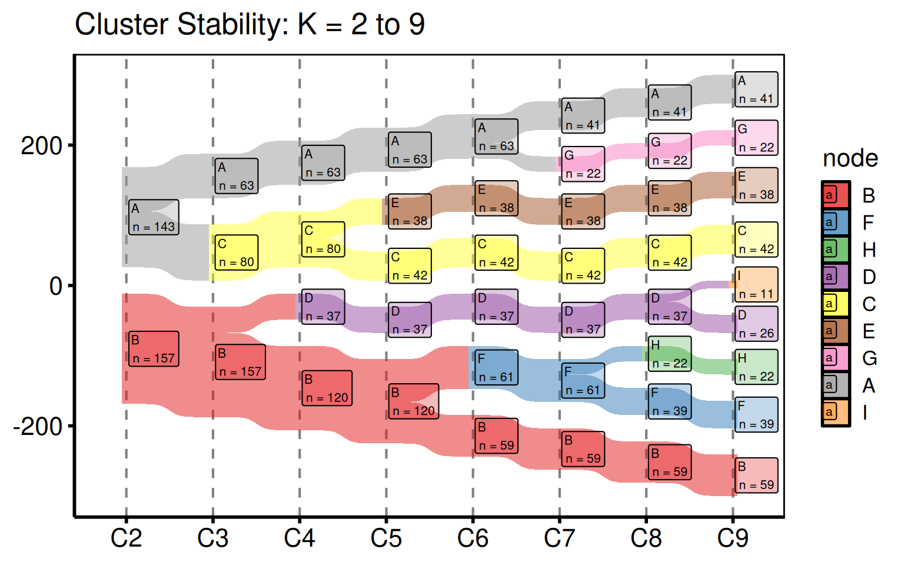

### Custom colour palette

Replace the default Set1 colours with a fully custom named vector. Names
must match the node labels in the data.

``` r

my_cols <- c(
  A = "#1f77b4", B = "#ff7f0e", C = "#2ca02c", D = "#d62728",
  E = "#9467bd", F = "#8c564b", G = "#e377c2", H = "#7f7f7f",
  I = "#bcbd22"
)
sk_custom <- hv_sankey(dta_san, node_colours = my_cols)
plot(sk_custom) +
  labs(title = "Cluster Stability: K = 2 to 9") +
  theme_hv_poster()
```

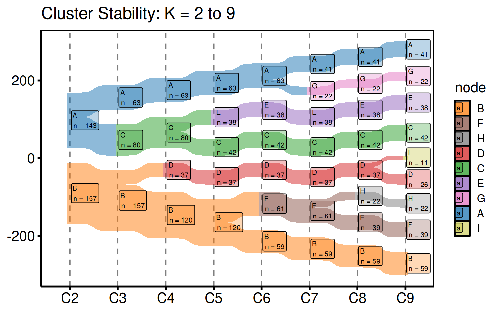

### Subset of K values

Pass a shorter `cluster_cols` vector to the constructor to show only a
range of K. This is useful when a stability plateau is already evident
and you want to focus the figure on, say, K = 2 to 6 for a manuscript
panel.

``` r

sk_sub <- hv_sankey(dta_san, cluster_cols = paste0("C", 2:6))
plot(sk_sub) +
  labs(title = "Cluster Stability: K = 2 to 6") +
  theme_hv_poster()
```

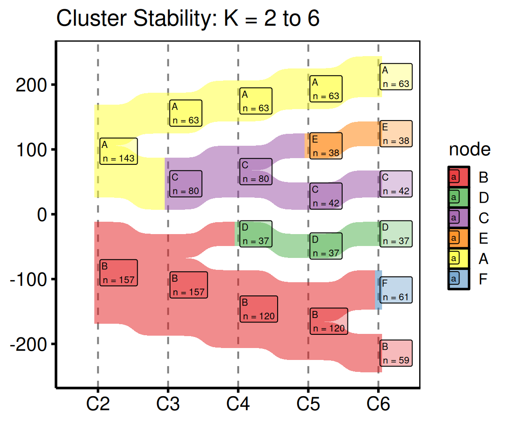

### Saving

[`ggsave()`](https://ggplot2.tidyverse.org/reference/ggsave.html) writes
the figure at 8 x 5 inches – wide enough to spread K = 2 through K = 9
across the panel. For a PowerPoint version, see [Decorating and
Saving](https://ehrlinger.github.io/hvtiPlotR/articles/plot-decorators.md).

``` r

p_san <- plot(sk) +
  labs(title = "PAM Cluster Stability") +
  theme_hv_poster()

ggsave("../graphs/sankey_clusters.pdf", p_san, width = 8, height = 5)
```

## CONSORT Patient Flow Diagram

[`hv_consort()`](https://ehrlinger.github.io/hvtiPlotR/reference/hv_consort.md)
builds a CONSORT-style patient-flow diagram via a **three-step API**:
[`hv_consort_start()`](https://ehrlinger.github.io/hvtiPlotR/reference/hv_consort_start.md)
initializes a patient-level tracker,
[`hv_consort_exclude()`](https://ehrlinger.github.io/hvtiPlotR/reference/hv_consort_exclude.md)
adds exclusion stages, and
[`hv_consort()`](https://ehrlinger.github.io/hvtiPlotR/reference/hv_consort.md)
renders the result. Because the diagram is drawn by the `consort`
package (grid graphics), it is not a `ggplot` and you don’t decorate it
with `+`.

### Sample data

The quickest way to see a finished tracker is
[`sample_consort_data()`](https://ehrlinger.github.io/hvtiPlotR/reference/sample_consort_data.md),
which simulates a cardiac-surgery cohort and returns a three-stage
`hv_consort_tracker`.

``` r

tracker <- sample_consort_data(n = 300, seed = 42)
tracker
```

    <hv_consort_tracker>
      Patients   : 300
      ID column  : patient_id
      Stages     : 3
        [screened] Screened -- N = 300
          -> excl [excl_screen]: 73
        [eligible] Eligible -- N = 227
          -> excl [excl_eligible]: 41
        [analyzed] Analyzed -- N = 186

### Building a tracker from your own data

Start from a data frame with one row per patient.
[`hv_consort_start()`](https://ehrlinger.github.io/hvtiPlotR/reference/hv_consort_start.md)
records the patient identifier and marks every patient as screened; each
[`hv_consort_exclude()`](https://ehrlinger.github.io/hvtiPlotR/reference/hv_consort_exclude.md)
call adds an exclusion stage. Exclusion rules are two-sided formulas —
`<condition> ~ "<reason>"` — evaluated against the data. The first
matching rule wins, and patients dropped in an earlier stage are
automatically skipped in later ones, so each stage operates only on the
survivors of the last.

``` r

set.seed(42)
cohort <- data.frame(
  mrn         = paste0("P", 1:300),
  age         = sample(12:85, 300, replace = TRUE),
  had_surgery = sample(c(TRUE, FALSE), 300, replace = TRUE, prob = c(0.9, 0.1)),
  echo        = sample(c(TRUE, FALSE), 300, replace = TRUE, prob = c(0.85, 0.15))
)

tracker2 <- hv_consort_start(cohort, patient_id = mrn, label = "Screened") |>
  hv_consort_exclude(
    label        = "Eligible",
    col          = "excl_screen",
    age < 18     ~ "Age < 18",
    !had_surgery ~ "No qualifying surgery"
  ) |>
  hv_consort_exclude(
    label = "Analyzed",
    col   = "excl_eligible",
    !echo ~ "Missing echocardiogram"
  )
tracker2
```

    <hv_consort_tracker>
      Patients   : 300
      ID column  : mrn
      Stages     : 3
        [screened] Screened -- N = 300
          -> excl [excl_screen]: 59
        [eligible] Eligible -- N = 241
          -> excl [excl_eligible]: 32
        [analyzed] Analyzed -- N = 209

### The diagram

[`hv_consort()`](https://ehrlinger.github.io/hvtiPlotR/reference/hv_consort.md)
derives the box layout from the tracker’s stage metadata and renders the
diagram; [`plot()`](https://rdrr.io/r/graphics/plot.default.html) draws
it. By default every exclusion column is shown as a side box — pass a
character vector to `side_box` to select specific ones.

``` r

fig <- hv_consort(tracker)
plot(fig)
```

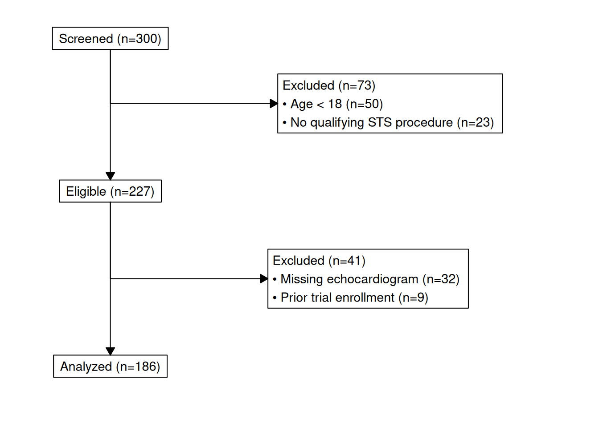

### Auditing the cohort

Two helpers keep the tracker auditable.
[`hv_consort_summary()`](https://ehrlinger.github.io/hvtiPlotR/reference/hv_consort_summary.md)
returns a per-stage count table suitable for a methods section:

``` r

hv_consort_summary(tracker)
```

         label include_col n_included      excl_col n_excluded
    1 Screened    screened        300   excl_screen         73
    2 Eligible    eligible        227 excl_eligible         41
    3 Analyzed    analyzed        186          <NA>         NA

[`hv_consort_patients()`](https://ehrlinger.github.io/hvtiPlotR/reference/hv_consort_patients.md)
returns the patient IDs active at a stage, or the subset excluded for a
specific reason:

``` r

# IDs still in the analysed cohort
head(hv_consort_patients(tracker, "Analyzed"))
```

    [1] "PT0001" "PT0002" "PT0003" "PT0004" "PT0005" "PT0007"

``` r

# IDs dropped at screening for being under 18
head(hv_consort_patients(tracker, "Screened", reason = "Age < 18"))
```

    [1] "PT0008" "PT0018" "PT0022" "PT0025" "PT0035" "PT0037"

### Saving

[`save_ppt()`](https://ehrlinger.github.io/hvtiPlotR/reference/save_ppt.md)
accepts an `hv_consort` object and writes the diagram to a slide as an
editable vector graphic. The slide dimensions come from the object
itself (set at
[`hv_consort()`](https://ehrlinger.github.io/hvtiPlotR/reference/hv_consort.md)
time), so `width`/`height` are not needed here.

``` r

save_ppt(
  object       = hv_consort(tracker),
  template     = "../graphs/RD.pptx",
  powerpoint   = "../graphs/consort.pptx",
  slide_titles = "CONSORT Patient Flow"
)
```

## Hazard Plot

[`hazard_plot()`](https://ehrlinger.github.io/hvtiPlotR/reference/hazard_plot.md)
plots pre-computed parametric curves — survival, hazard, or cumulative
hazard — from a fitted Weibull or other parametric model, with optional
Kaplan-Meier empirical overlay and population life-table reference. It
ports the entire `tp.hp.dead.*` SAS template family.

The input data comes from two sources that map directly to the SAS
output:

| Column set | SAS dataset | R function |
|----|----|----|
| Parametric prediction grid | `predict` (`SSURVIV`, `SCLLSURV`, `SCLUSURV`) | [`sample_hazard_data()`](https://ehrlinger.github.io/hvtiPlotR/reference/sample_hazard_data.md) |
| KM empirical overlay | `plout` (`CUM_SURV`, `CL_LOWER`, `CL_UPPER`) | [`sample_hazard_empirical()`](https://ehrlinger.github.io/hvtiPlotR/reference/sample_hazard_empirical.md) |
| Population life table | `smatched` | [`sample_life_table()`](https://ehrlinger.github.io/hvtiPlotR/reference/sample_life_table.md) |

### Sample data

[`sample_hazard_data()`](https://ehrlinger.github.io/hvtiPlotR/reference/sample_hazard_data.md)
generates the parametric prediction grid (one row per time point) with
`survival`, `hazard`, and `cumhaz` columns plus their CI bounds – the
same shape as the SAS `predict` dataset.
[`sample_hazard_empirical()`](https://ehrlinger.github.io/hvtiPlotR/reference/sample_hazard_empirical.md)
generates the KM empirical overlay with 6 binned time intervals,
matching the `plout` dataset. Both use the same cohort size so the
overlay aligns.

``` r

dat_hp  <- sample_hazard_data(n = 500, time_max = 10)
emp_hp  <- sample_hazard_empirical(n = 500, time_max = 10, n_bins = 6)
head(dat_hp)
```

            time survival surv_lower surv_upper    hazard haz_lower haz_upper
    1 0.01000000 99.99558   99.93731        100 0.6629126 0.3996474  1.099602
    2 0.03002004 99.97702   99.84413        100 1.1485818 0.6924408  1.905203
    3 0.05004008 99.95054   99.75561        100 1.4829116 0.8939968  2.459770
    4 0.07006012 99.91808   99.66720        100 1.7546549 1.0578216  2.910523
    5 0.09008016 99.88059   99.57770        100 1.9896233 1.1994760  3.300275
    6 0.11010020 99.83868   99.48662        100 2.1996335 1.3260840  3.648628
           cumhaz cumhaz_lower cumhaz_upper
    1 0.004419417            0    0.5871202
    2 0.022986980            0    1.3519229
    3 0.049470012            0    1.9990187
    4 0.081954223            0    2.5912321
    5 0.119483723            0    3.1493081
    6 0.161453396            0    3.6834317

### Survival curve with KM overlay

The most common `tp.hp.dead.sas` output: smooth parametric survival with
confidence band plus discrete KM empirical circles and error bars.

``` r

hazard_plot(
  dat_hp,
  estimate_col  = "survival",
  lower_col     = "surv_lower",
  upper_col     = "surv_upper",
  empirical     = emp_hp,
  emp_lower_col = "lower",
  emp_upper_col = "upper"
) +
  scale_colour_manual(values = c("steelblue"), guide = "none") +
  scale_fill_manual(values = c("steelblue"), guide = "none") +
  scale_x_continuous(limits = c(0, 10), breaks = 0:10) +
  scale_y_continuous(limits = c(0, 100), breaks = seq(0, 100, 20),
                     labels = function(x) paste0(x, "%")) +
  labs(x = "Years", y = "Survival (%)") +
  theme_hv_poster()
```


### Hazard rate curve

Switching `estimate_col` to `"hazard"` (and the matching CI columns)
shows the instantaneous hazard rate (%/year) instead of survival.

``` r

hazard_plot(
  dat_hp,
  estimate_col = "hazard",
  lower_col    = "haz_lower",
  upper_col    = "haz_upper"
) +
  scale_colour_manual(values = c("firebrick"), guide = "none") +
  scale_fill_manual(values = c("firebrick"), guide = "none") +
  scale_x_continuous(limits = c(0, 10), breaks = 0:10) +
  scale_y_continuous(limits = c(0, 30),
                     labels = function(x) paste0(x, "%/yr")) +
  labs(x = "Years", y = "Hazard (%/year)") +
  theme_hv_poster()
```


### Cumulative hazard

Used for readmission and repeated-event analyses
(`tp.hp.event.weighted.sas`, `tp.hp.repeated_events.sas`). The
`"cumhaz"` column equals `-log(S) * 100`.

``` r

hazard_plot(
  dat_hp,
  estimate_col  = "cumhaz",
  lower_col     = "cumhaz_lower",
  upper_col     = "cumhaz_upper"
) +
  scale_colour_manual(values = c("darkorange"), guide = "none") +
  scale_fill_manual(values = c("darkorange"), guide = "none") +
  scale_x_continuous(limits = c(0, 10), breaks = 0:10) +
  labs(x = "Years", y = "Cumulative Hazard (%)") +
  theme_hv_poster()
```


### Stratified by group

Pass `group_col` to compare two or more groups
(`tp.hp.dead.tkdn.stratified.sas`).

``` r

dat_strat <- sample_hazard_data(
  n = 400, time_max = 10,
  groups = c("No Takedown" = 1.0, "Takedown" = 0.65)
)
emp_strat <- sample_hazard_empirical(
  n = 400, time_max = 10, n_bins = 6,
  groups = c("No Takedown" = 1.0, "Takedown" = 0.65)
)

hazard_plot(
  dat_strat,
  estimate_col  = "survival",
  lower_col     = "surv_lower",
  upper_col     = "surv_upper",
  group_col     = "group",
  empirical     = emp_strat,
  emp_lower_col = "lower",
  emp_upper_col = "upper"
) +
  scale_colour_manual(
    values = c("No Takedown" = "steelblue", "Takedown" = "firebrick"),
    name   = NULL
  ) +
  scale_fill_manual(
    values = c("No Takedown" = "steelblue", "Takedown" = "firebrick"),
    guide  = "none"
  ) +
  scale_x_continuous(limits = c(0, 10), breaks = 0:10) +
  scale_y_continuous(limits = c(0, 100), breaks = seq(0, 100, 20),
                     labels = function(x) paste0(x, "%")) +
  labs(x = "Years after Esophagostomy", y = "Survival (%)") +
  theme_hv_poster()
```


### Life-table overlay

`tp.hp.dead.age_with_population_life_table.sas` and
`tp.hp.dead.uslife.stratifed.sas` overlay US population life-table
survival (dashed lines) on age-stratified study curves. Pass the
life-table data frame to `reference` and set `ref_group_col` to vary the
linetype by age group.

``` r

dat_age <- sample_hazard_data(
  n = 600, time_max = 12,
  groups = c("<65" = 0.5, "65\u201380" = 1.0, "\u226580" = 1.8)
)
emp_age <- sample_hazard_empirical(
  n = 600, time_max = 12, n_bins = 6,
  groups = c("<65" = 0.5, "65\u201380" = 1.0, "\u226580" = 1.8)
)
lt <- sample_life_table(
  age_groups = c("<65", "65\u201380", "\u226580"),
  age_mids   = c(55, 72, 85),
  time_max   = 12
)

hazard_plot(
  dat_age,
  estimate_col     = "survival",
  lower_col        = "surv_lower",
  upper_col        = "surv_upper",
  group_col        = "group",
  empirical        = emp_age,
  emp_lower_col    = "lower",
  emp_upper_col    = "upper",
  reference        = lt,
  ref_estimate_col = "survival",
  ref_group_col    = "group"
) +
  scale_colour_manual(
    values = c("<65" = "steelblue", "65\u201380" = "forestgreen",
               "\u226580" = "firebrick"),
    name   = "Age group"
  ) +
  scale_fill_manual(
    values = c("<65" = "steelblue", "65\u201380" = "forestgreen",
               "\u226580" = "firebrick"),
    guide  = "none"
  ) +
  scale_x_continuous(limits = c(0, 12), breaks = seq(0, 12, 2)) +
  scale_y_continuous(limits = c(0, 100), breaks = seq(0, 100, 20),
                     labels = function(x) paste0(x, "%")) +
  labs(x = "Years", y = "Survival (%)",
       caption = "Dashed lines: US population life table") +
  theme_hv_poster()
```


## Survival Difference (Life-Gained) Plot

[`survival_difference_plot()`](https://ehrlinger.github.io/hvtiPlotR/reference/survival_difference_plot.md)
plots the difference `S_2(t) - S_1(t)` between two groups over time,
with an optional confidence band. This ports
`tp.hp.dead.life-gained.sas` (HAZDIFL macro output).

### Sample data

[`sample_survival_difference_data()`](https://ehrlinger.github.io/hvtiPlotR/reference/sample_survival_difference_data.md)
generates two groups with a specified hazard-ratio contrast and returns
the point-wise difference `S_2(t) - S_1(t)` with bootstrap CI bounds,
matching the `HAZDIFL` macro output columns. Both control and treatment
groups are simulated at the same n to keep the CI width realistic.

``` r

diff_dat <- sample_survival_difference_data(
  n      = 500,
  groups = c("Control" = 1.0, "Treatment" = 0.70)
)
head(diff_dat)
```

            time  difference  diff_lower diff_upper group1_surv group2_surv
    1 0.01000000 0.001831068 -0.03739885 0.04106099    99.99558    99.99741
    2 0.03002004 0.009522643 -0.08737593 0.10642122    99.97702    99.98654
    3 0.05004008 0.020489267 -0.13072627 0.17170481    99.95054    99.97103
    4 0.07006012 0.033934691 -0.17121839 0.23908777    99.91808    99.95201
    5 0.09008016 0.049459769 -0.21006489 0.30898443    99.88059    99.93005
    6 0.11010020 0.066810699 -0.24784775 0.38146915    99.83868    99.90549

### Survival difference curve

[`survival_difference_plot()`](https://ehrlinger.github.io/hvtiPlotR/reference/survival_difference_plot.md)
takes the pre-computed difference and CI columns directly – no grouping
argument needed for the two-group case. The dashed horizontal line at
zero makes the no-benefit baseline immediately visible; a positive
difference means the treatment group has higher survival.

``` r

survival_difference_plot(
  diff_dat,
  lower_col = "diff_lower",
  upper_col = "diff_upper"
) +
  scale_colour_manual(values = c("steelblue"), guide = "none") +
  scale_fill_manual(values = c("steelblue"), guide = "none") +
  ggplot2::geom_hline(yintercept = 0, linetype = "dashed",
                      colour = "grey50") +
  scale_x_continuous(limits = c(0, 10), breaks = 0:10) +
  scale_y_continuous(limits = c(-5, 40),
                     labels = function(x) paste0(x, "%")) +
  labs(x = "Years", y = "Survival Difference (%)") +
  theme_hv_poster()
```


### Multiple comparisons

Combine several two-group differences into one long data frame and use
`group_col` to overlay them.

``` r

d1 <- sample_survival_difference_data(
  groups = c("Medical Mgmt" = 1.0, "TF-TAVR" = 0.70), seed = 1L
)
d1$comparison <- "TF-TAVR vs Medical Mgmt"

d2 <- sample_survival_difference_data(
  groups = c("TA-TAVR" = 0.90, "TF-TAVR" = 0.70), seed = 2L
)
d2$comparison <- "TF-TAVR vs TA-TAVR"

d3 <- sample_survival_difference_data(
  groups = c("AVR" = 0.80, "TF-TAVR" = 0.70), seed = 3L
)
d3$comparison <- "TF-TAVR vs AVR"

survival_difference_plot(rbind(d1, d2, d3),
                         group_col = "comparison") +
  scale_colour_brewer(palette = "Set1", name = NULL) +
  scale_fill_brewer(palette = "Set1", guide = "none") +
  ggplot2::geom_hline(yintercept = 0, linetype = "dashed",
                      colour = "grey50") +
  scale_x_continuous(limits = c(0, 10), breaks = 0:10) +
  labs(x = "Years", y = "Survival Difference (%)") +
  theme_hv_poster()
```


## Number Needed to Treat (NNT) Plot

[`nnt_plot()`](https://ehrlinger.github.io/hvtiPlotR/reference/nnt_plot.md)
plots the number needed to treat and absolute risk reduction over time,
porting the NNT component of `tp.hp.numtreat.survdiff.matched.sas`.

### Sample data

[`sample_nnt_data()`](https://ehrlinger.github.io/hvtiPlotR/reference/sample_nnt_data.md)
generates two survival curves with a specified hazard-ratio contrast and
computes NNT and ARR at each time point with CI bounds, matching the
structure of the `tp.hp.numtreat.survdiff.matched.sas` output. The
`groups` argument sets the group names and their hazard multipliers.

``` r

nnt_dat <- sample_nnt_data(
  n      = 500,
  time_max = 20,
  groups = c("SVG" = 1.0, "ITA" = 0.75)
)
head(nnt_dat)
```

            time         arr   arr_lower  arr_upper      nnt nnt_lower nnt_upper
    1 0.01000000 0.001548865 -0.03849194 0.04158967       NA        NA        NA
    2 0.05006012 0.017341632 -0.13725732 0.17194059       NA  581.5963        NA
    3 0.09012024 0.041863418 -0.22369142 0.30741825       NA  325.2897        NA
    4 0.13018036 0.072628007 -0.30691800 0.45217401       NA  221.1538        NA
    5 0.17024048 0.108520503 -0.38909707 0.60613807 921.4849  164.9789        NA
    6 0.21030060 0.148855060 -0.47112585 0.76883597 671.7944  130.0668        NA

### NNT curve

NNT decreases over time as the treatment benefit accumulates — early in
follow-up you need to treat many patients to prevent one event; by later
years the survival gap has widened enough that fewer do.

``` r

nnt_plot(
  nnt_dat,
  lower_col = "nnt_lower",
  upper_col = "nnt_upper"
) +
  scale_colour_manual(values = c("steelblue"), guide = "none") +
  scale_fill_manual(values = c("steelblue"), guide = "none") +
  scale_x_continuous(limits = c(0, 20), breaks = seq(0, 20, 5)) +
  scale_y_continuous(limits = c(0, 50), breaks = seq(0, 50, 10)) +
  labs(x = "Years", y = "Number Needed to Treat") +
  theme_hv_poster()
```


### Absolute risk reduction

The same data, plotted as ARR (%) instead of NNT.

``` r

nnt_plot(
  nnt_dat,
  estimate_col = "arr",
  lower_col    = "arr_lower",
  upper_col    = "arr_upper"
) +
  scale_colour_manual(values = c("firebrick"), guide = "none") +
  scale_fill_manual(values = c("firebrick"), guide = "none") +
  scale_x_continuous(limits = c(0, 20), breaks = seq(0, 20, 5)) +
  scale_y_continuous(limits = c(0, 50),
                     labels = function(x) paste0(x, "%")) +
  labs(x = "Years", y = "Absolute Risk Reduction (%)") +
  theme_hv_poster()
```


### Saving

[`ggsave()`](https://ggplot2.tidyverse.org/reference/ggsave.html) writes
the parametric survival figure at 11.5 x 8 inches, the standard
landscape size for the SAS template output. For a PowerPoint version,
see [Decorating and
Saving](https://ehrlinger.github.io/hvtiPlotR/articles/plot-decorators.md).

``` r

p_hp <- hazard_plot(
  dat_hp,
  estimate_col  = "survival",
  lower_col     = "surv_lower",
  upper_col     = "surv_upper",
  empirical     = emp_hp,
  emp_lower_col = "lower",
  emp_upper_col = "upper"
) +
  scale_colour_manual(values = c("steelblue"), guide = "none") +
  scale_fill_manual(values = c("steelblue"), guide = "none") +
  labs(x = "Years", y = "Survival (%)") +
  theme_hv_poster()

ggsave("../graphs/hazard_survival.pdf", p_hp, width = 11.5, height = 8)
```

## Temporal Trend Plot

[`hv_trends()`](https://ehrlinger.github.io/hvtiPlotR/reference/hv_trends.md)
ports the pattern from five SAS/R templates:

| Template | Study | Key pattern |
|----|----|----|
| `tp.rp.trends.sas` | Tricuspid valve replacement, 1968–2000 | Single continuous outcome vs operation year |
| `tp.lp.trends.sas` | Post-infarct VSD, 1969–2000 | Binary % outcomes, x 1970–2000 by 10, y 0–100 |
| `tp.lp.trends.age.sas` | Mitral valve surgery, 1990–1999 | Binary % vs **age** (not year), x 25–85 by 10 |
| `tp.lp.trends.polytomous.sas` | Tricuspid valve repair, 1990–1999 | Polytomous (≥3) groups, x 1990–1999 by 1 |
| `tp.dp.trends.R` | Mitral degeneration, 1985–2015 | NYHA %, LV mass, %CHF, case volume, LOS |

The constructor accepts patient-level data and computes annual summaries
(mean or median) internally.
[`plot()`](https://rdrr.io/r/graphics/plot.default.html) returns a bare
ggplot; add scales, labels, annotations, and
[`theme_hv_manuscript()`](https://ehrlinger.github.io/hvtiPlotR/reference/hvtiPlotR-themes.md).

### Sample data

[`sample_trends_data()`](https://ehrlinger.github.io/hvtiPlotR/reference/sample_trends_data.md)
generates patient-level data that
[`hv_trends()`](https://ehrlinger.github.io/hvtiPlotR/reference/hv_trends.md)
then aggregates by year. The `year_range` and `groups` arguments mirror
the study period and group structure from the SAS template you’re
porting; the 1968–2000 window below matches `tp.rp.trends.sas`.

``` r

# year_range matches the 1968-2000 Tricuspid Valve Replacement study in the
# SAS template (tp.rp.trends.sas)
dta_tr <- sample_trends_data(
  n          = 600,
  year_range = c(1968L, 2000L),
  groups     = c("Group I", "Group II", "Group III", "Group IV")
)
head(dta_tr)
```

      year value    group
    1 1975 68.94  Group I
    2 1973 58.54  Group I
    3 1977 42.45  Group I
    4 1994 42.06  Group I
    5 1987 35.46 Group II
    6 1992 27.59 Group IV

### Single variable: cases/year

The SAS template plots annual case volume against operation year with
`axisx order=(1968 to 2000 by 4)` and `axisy order=(0 to 10 by 2)`.

``` r

one_grp <- dta_tr[dta_tr$group == "Group I", ]
tr1 <- hv_trends(one_grp, group_col = NULL)
```

#### Bare plot

The bare `plot(tr1)` panel shows the annual mean with connecting
segments and no colour, axis limits, or theme. Look for: a line that
traces the operation year on the x-axis against the summary statistic on
the y-axis; if the line is flat, the `group_col = NULL` single-group
path may be grouping incorrectly.

``` r

p_tr1 <- plot(tr1)
p_tr1
```

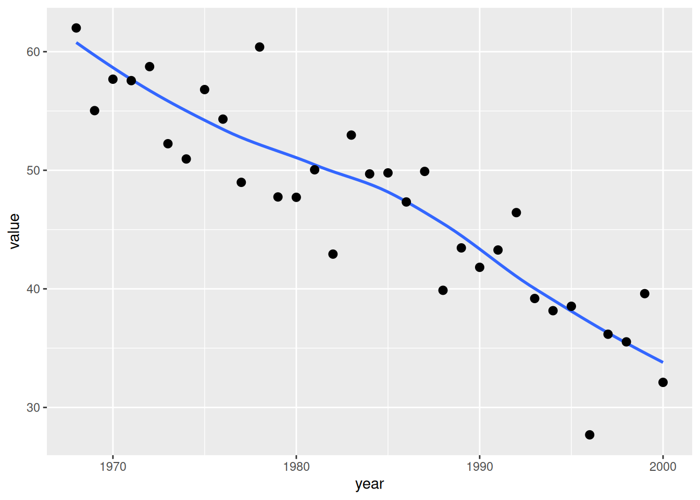

#### Adding scales, labels, and theme

Lay on axis limits and breaks that match the SAS template (x: 1968–2000
by 4; y: 0–10 by 2), then add axis labels and the poster theme. Swap
[`theme_hv_poster()`](https://ehrlinger.github.io/hvtiPlotR/reference/hvtiPlotR-themes.md)
for
[`theme_hv_manuscript()`](https://ehrlinger.github.io/hvtiPlotR/reference/hvtiPlotR-themes.md)
for a journal-ready version.

``` r

p_tr1 +
  scale_x_continuous(limits = c(1968, 2000), breaks = seq(1968, 2000, 4)) +
  scale_y_continuous(limits = c(0, 10),      breaks = seq(0, 10, 2)) +
  labs(x = "Year", y = "Cases/year") +
  theme_hv_poster()
```

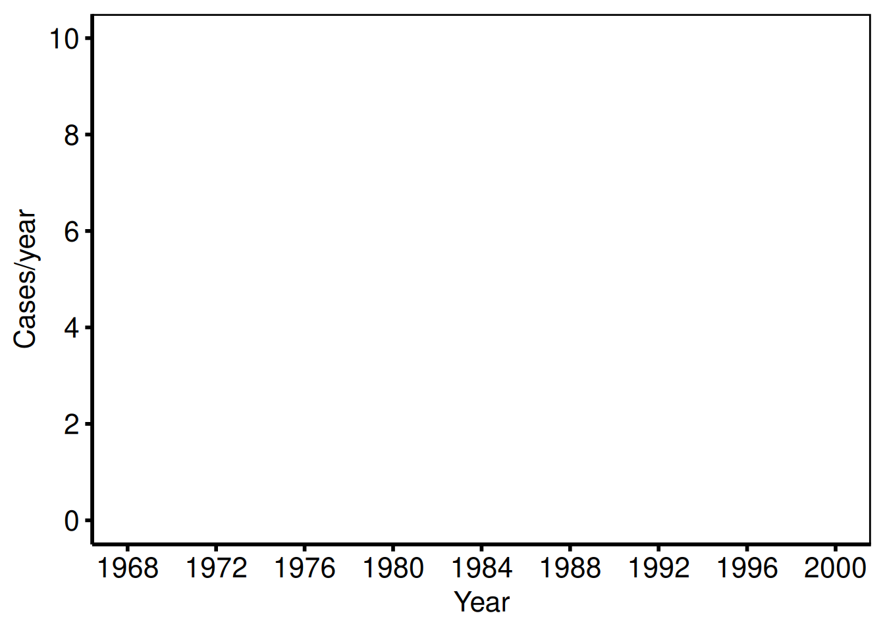

### Single variable: age

The age figure uses the same x-axis and `axisy order=(30 to 70 by 10)`.

``` r

plot(tr1) +
  scale_x_continuous(limits = c(1968, 2000), breaks = seq(1968, 2000, 4)) +
  scale_y_continuous(limits = c(30, 70),     breaks = seq(30, 70, 10)) +
  labs(x = "Year", y = "Age (years)") +
  theme_hv_poster()
```

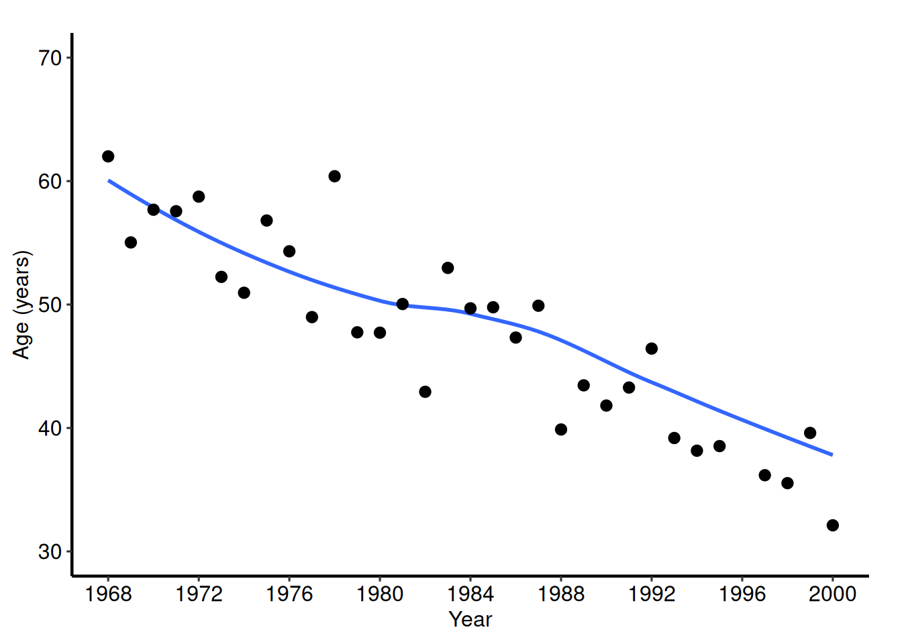

### Multiple groups with `scale_colour_brewer`

When `group_col` is set, the constructor computes per-group annual means
and [`plot()`](https://rdrr.io/r/graphics/plot.default.html) draws one
line per group.
[`scale_colour_brewer()`](https://ggplot2.tidyverse.org/reference/scale_brewer.html)
and
[`scale_shape_manual()`](https://ggplot2.tidyverse.org/reference/scale_manual.html)
together give each group a distinct colour and marker shape, which keeps
the figure readable in greyscale print.

``` r

tr <- hv_trends(dta_tr)
plot(tr) +
  scale_colour_brewer(palette = "Set1", name = "Group") +
  scale_shape_manual(
    values = c("Group I" = 15L, "Group II" = 19L,
               "Group III" = 17L, "Group IV" = 18L),
    name = "Group"
  ) +
  scale_x_continuous(limits = c(1968, 2000), breaks = seq(1968, 2000, 4)) +
  labs(x = "Year", y = "Outcome (%)") +
  theme_hv_poster()
```

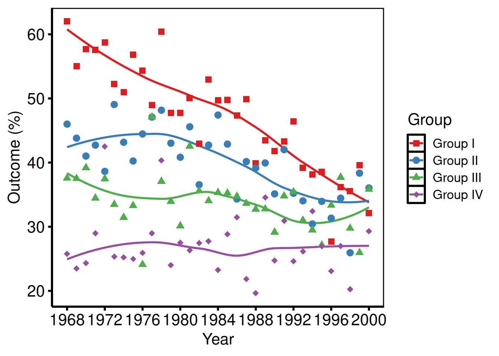

### Median summary + manual colours (NYHA style)

Pass `summary_fn = "median"` when the outcome distribution is skewed and
the median is more interpretable than the mean – typical for NYHA class
percentage trends. Manual colours let you assign clinically meaningful
hues (here, one colour per NYHA class).

``` r

tr_med <- hv_trends(dta_tr, summary_fn = "median")
plot(tr_med) +
  scale_colour_manual(
    values = c(
      "Group I"   = "steelblue",
      "Group II"  = "firebrick",
      "Group III" = "forestgreen",
      "Group IV"  = "goldenrod3"
    ),
    name = "NYHA Class"
  ) +
  scale_shape_manual(
    values = c("Group I" = 15L, "Group II" = 19L,
               "Group III" = 17L, "Group IV" = 18L),
    name = "NYHA Class"
  ) +
  scale_x_continuous(limits = c(1968, 2000), breaks = seq(1968, 2000, 4)) +
  scale_y_continuous(limits = c(0, 80),      breaks = seq(0, 80, 20)) +
  labs(x = "Year", y = "%", title = "Preoperative NYHA Class Over Time") +
  annotate("text", x = 1980, y = 75,
           label = "Trend: Preoperative NYHA", size = 4) +
  theme_hv_poster()
```

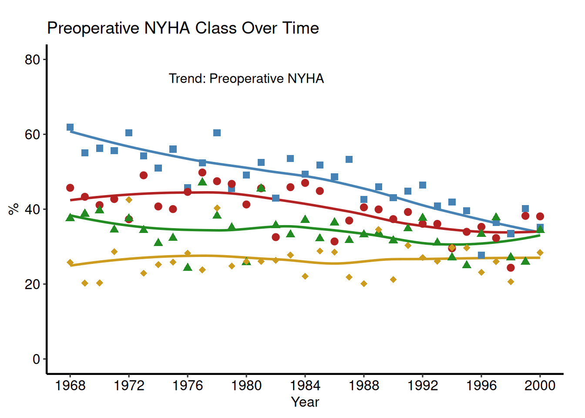

### With confidence ribbon

Pass `se = TRUE` to
[`plot()`](https://rdrr.io/r/graphics/plot.default.html) to add a
[`geom_ribbon()`](https://ggplot2.tidyverse.org/reference/geom_ribbon.html)
around the mean line. The `alpha` argument controls the ribbon opacity –
0.2 keeps the band visible without obscuring the line itself.

``` r

plot(tr1, se = TRUE, alpha = 0.2) +
  scale_x_continuous(limits = c(1968, 2000), breaks = seq(1968, 2000, 4)) +
  labs(x = "Year", y = "Cases/year") +
  theme_hv_poster()
```

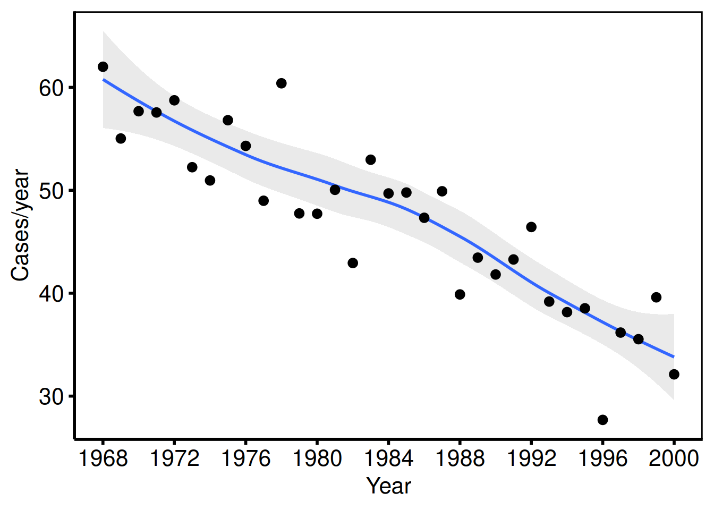

### Binary % outcomes (tp.lp.trends.sas)

The VSD template plots multiple binary outcomes (cardiogenic shock %,
pre-op IABP %, inotropes %) on the same axes:
`axisx order=(1970 to 2000 by 10)`, `axisy order=(0 to 100 by 10)`. Each
outcome becomes a group.

``` r

dta_lp <- sample_trends_data(
  n          = 800,
  year_range = c(1970L, 2000L),
  groups     = c("Shock %", "Pre-op IABP %", "Inotropes %")
)

plot(hv_trends(dta_lp)) +
  scale_colour_manual(
    values = c("Shock %"       = "steelblue",
               "Pre-op IABP %" = "firebrick",
               "Inotropes %"   = "forestgreen"),
    name = NULL
  ) +
  scale_shape_manual(
    values = c("Shock %" = 16L, "Pre-op IABP %" = 15L, "Inotropes %" = 17L),
    name = NULL
  ) +
  scale_x_continuous(limits = c(1970, 2000), breaks = seq(1970, 2000, 10)) +
  scale_y_continuous(limits = c(0, 100),     breaks = seq(0, 100, 10)) +
  coord_cartesian(xlim = c(1970, 2000), ylim = c(0, 100)) +
  labs(x = "Year", y = "Percent (%)") +
  theme_hv_poster()
```

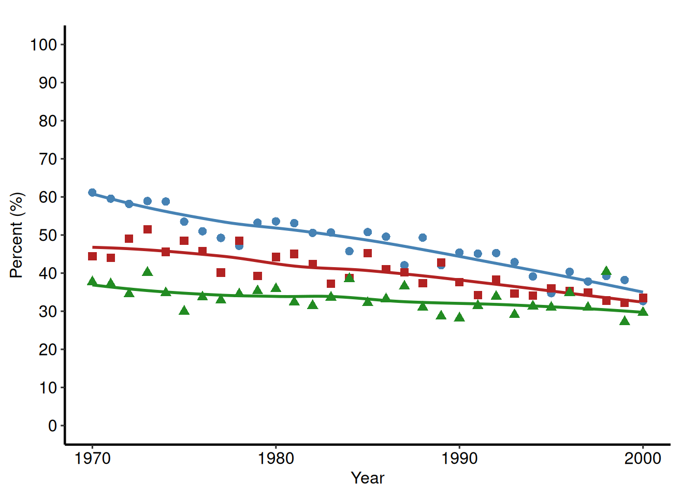

### Age as x-axis (tp.lp.trends.age.sas)

The mitral valve template uses patient age (not year) on the x-axis:
`axisx order=(25 to 85 by 10)`, `axisy order=(0 to 100 by 20)`. Pass
real data with an `age` column and set `x_col = "age"`. The example
below uses the sample data’s `year` column relabelled for illustration.

``` r

# With real data: x_col = "age", x_col_data has values ~25 to 85
# Illustration using sample_trends_data() with year_range spanning age range:
dta_age <- sample_trends_data(
  n          = 600,
  year_range = c(25L, 85L),
  groups     = c("Repair %", "Bioprosthesis %"),
  seed       = 7L
)

plot(hv_trends(dta_age)) +
  scale_colour_manual(
    values = c("Repair %" = "steelblue", "Bioprosthesis %" = "firebrick"),
    name   = NULL
  ) +
  scale_shape_manual(
    values = c("Repair %" = 16L, "Bioprosthesis %" = 15L),
    name   = NULL
  ) +
  scale_x_continuous(limits = c(25, 85), breaks = seq(25, 85, 10)) +
  scale_y_continuous(limits = c(0, 100), breaks = seq(0, 100, 20)) +
  coord_cartesian(xlim = c(25, 85), ylim = c(0, 100)) +
  labs(x = "Age (years)", y = "Percent (%)") +
  theme_hv_poster()
```

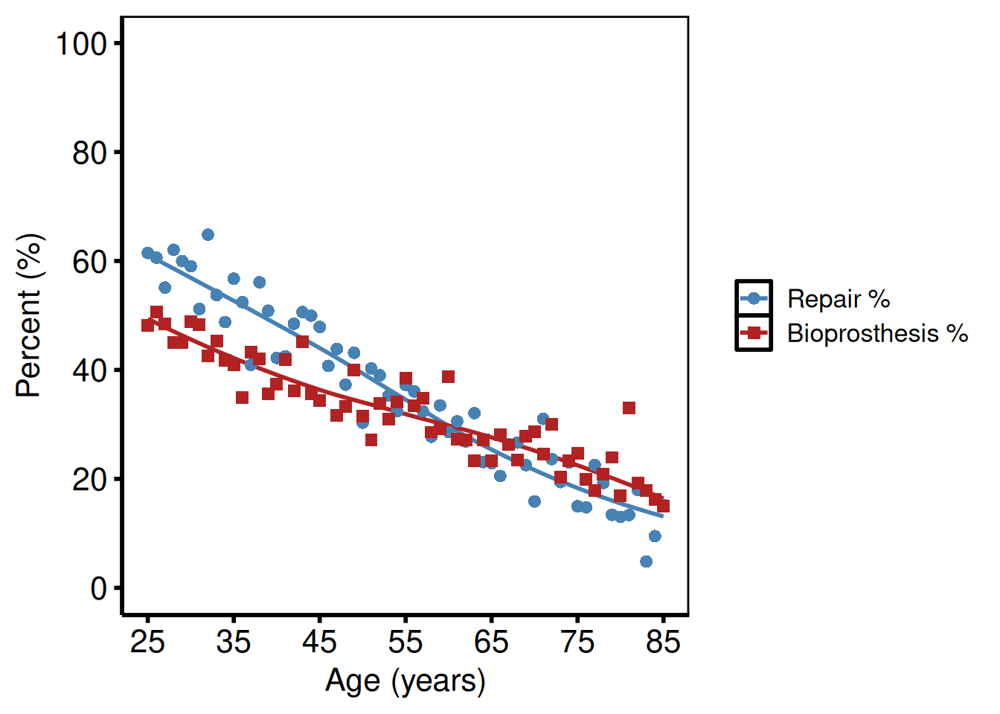

### Polytomous groups — repair types (tp.lp.trends.polytomous.sas)

Four repair categories over a short study period (1990–1999): the SAS
template uses `axisx order=(1990 to 1999 by 1)` for fine year breaks.

``` r

dta_poly <- sample_trends_data(
  n          = 800,
  year_range = c(1990L, 1999L),
  groups     = c("CE", "Cosgrove", "Periguard", "DeVega"),
  seed       = 5L
)

plot(hv_trends(dta_poly)) +
  scale_colour_manual(
    values = c(CE        = "steelblue",
               Cosgrove  = "firebrick",
               Periguard = "forestgreen",
               DeVega    = "goldenrod3"),
    name = "Repair type"
  ) +
  scale_shape_manual(
    values = c(CE = 15L, Cosgrove = 19L, Periguard = 17L, DeVega = 18L),
    name = "Repair type"
  ) +
  scale_x_continuous(limits = c(1990, 1999), breaks = seq(1990, 1999, 1)) +
  scale_y_continuous(limits = c(0, 100),     breaks = seq(0, 100, 10)) +
  coord_cartesian(xlim = c(1990, 1999), ylim = c(0, 100)) +
  labs(x = "Year", y = "Percent (%)") +
  theme_hv_poster()
```

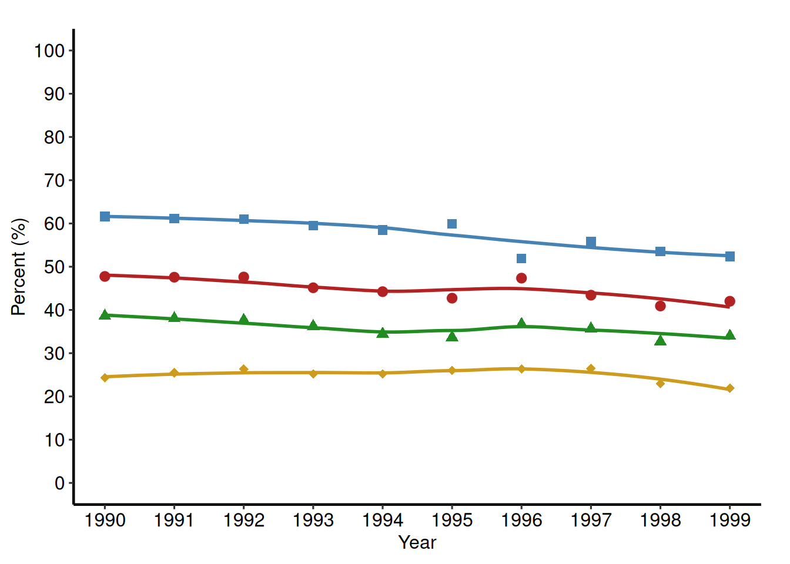

### LV mass index (tp.dp.trends.R — plot2)

Continuous outcome with a larger y range:
`scale_y_continuous(breaks=seq(0, 200, 50))`,
`coord_cartesian(xlim = c(1995, 2016), ylim = c(0, 200))`.

``` r

dta_lv <- sample_trends_data(
  n          = 800,
  year_range = c(1995L, 2015L),
  groups     = NULL,
  seed       = 3L
)

plot(hv_trends(dta_lv, group_col = NULL)) +
  scale_x_continuous(limits = c(1995, 2015), breaks = seq(1995, 2015, 5)) +
  scale_y_continuous(limits = c(0, 200),     breaks = seq(0, 200, 50)) +
  coord_cartesian(xlim = c(1995, 2015), ylim = c(0, 200)) +
  labs(x = "Years", y = "LV Mass Index") +
  theme_hv_poster()
```

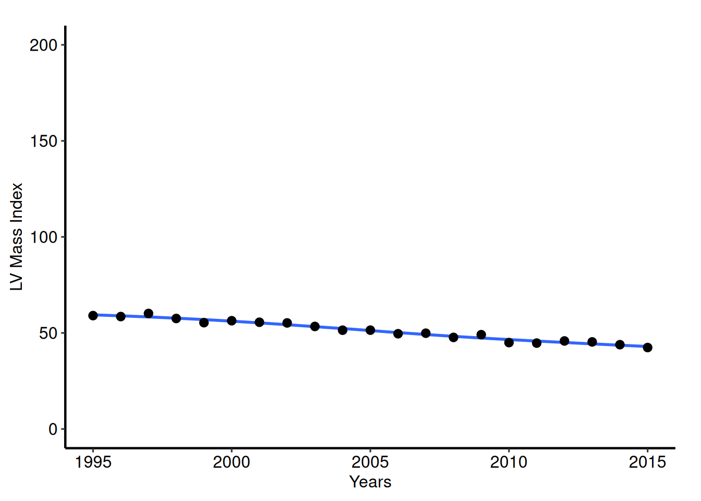

### Case volume / total surgeries per year (tp.dp.trends.R — plot4)

The annual case-volume figure uses a y-axis that runs 0–400 by 50,
matching the mitral degeneration study’s scale from `tp.dp.trends.R`. A
single `group_col = NULL` call collapses all patients into one series.

``` r

dta_vol <- sample_trends_data(
  n          = 1000,
  year_range = c(1985L, 2015L),
  groups     = NULL,
  seed       = 9L
)

plot(hv_trends(dta_vol, group_col = NULL)) +
  scale_x_continuous(limits = c(1985, 2015), breaks = seq(1985, 2015, 5)) +
  scale_y_continuous(limits = c(0, 400),     breaks = seq(0, 400, 50)) +
  coord_cartesian(xlim = c(1985, 2015), ylim = c(0, 400)) +
  labs(x = "Years", y = "Surgeries (#)") +
  theme_hv_poster()
```

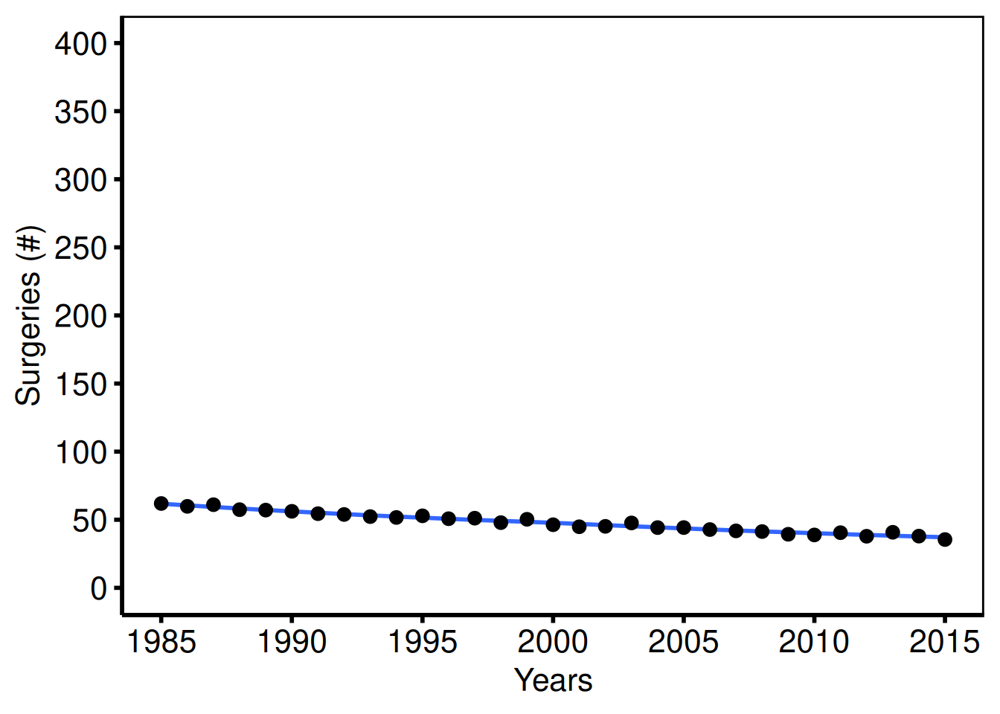

### Annotated trend — hospital LOS (tp.dp.trends.R — plot5)

Template: `coord_cartesian(ylim = c(0, 20))`,
`annotate("text", 1995, 18, label="Trend: Hospital Length of Stay", size=4.5)`.

``` r

dta_los <- sample_trends_data(
  n          = 800,
  year_range = c(1985L, 2015L),
  groups     = NULL,
  seed       = 11L
)

plot(hv_trends(dta_los, group_col = NULL)) +
  scale_x_continuous(limits = c(1985, 2015), breaks = seq(1985, 2015, 5)) +
  scale_y_continuous(limits = c(0, 20),      breaks = seq(0, 20, 5)) +
  coord_cartesian(xlim = c(1985, 2015), ylim = c(0, 20)) +
  annotate("text", x = 1995, y = 18,
           label = "Trend: Hospital Length of Stay", size = 4.5) +
  labs(x = "Years", y = "Hospital LOS (Days)") +
  theme_hv_poster()
```

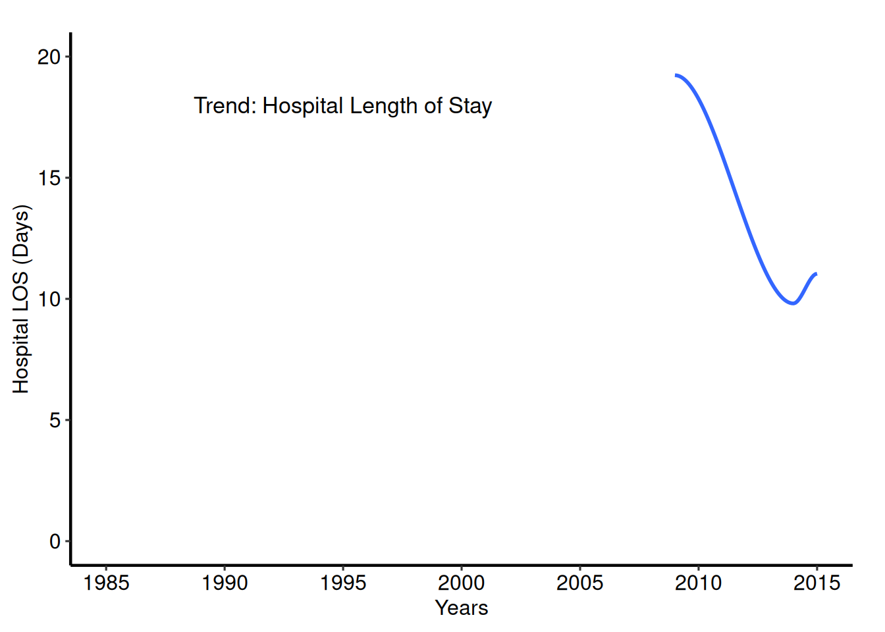

### Saving

[`ggsave()`](https://ggplot2.tidyverse.org/reference/ggsave.html) writes
the trends figure at 11.5 x 8 inches. For a PowerPoint version, see
[Decorating and
Saving](https://ehrlinger.github.io/hvtiPlotR/articles/plot-decorators.md).

``` r

p_tr <- plot(tr) +
  scale_colour_brewer(palette = "Set1", name = "Group") +
  scale_shape_manual(
    values = c("Group I" = 15L, "Group II" = 19L,
               "Group III" = 17L, "Group IV" = 18L),
    name = "Group"
  ) +
  scale_x_continuous(limits = c(1968, 2000), breaks = seq(1968, 2000, 4)) +
  labs(x = "Year", y = "Outcome (%)") +
  theme_hv_poster()

ggsave(here::here("graphs", "rp.trends.pdf"), p_tr, width = 11.5, height = 8)
```

## Spaghetti / Profile Plot

[`hv_spaghetti()`](https://ehrlinger.github.io/hvtiPlotR/reference/hv_spaghetti.md)
ports the pattern from `tp.dp.spaghetti.echo.R`: one trajectory line per
subject over time, with optional stratification by a grouping variable.
[`plot()`](https://rdrr.io/r/graphics/plot.default.html) accepts
`add_smooth = TRUE` for an optional LOESS overlay and returns a bare
ggplot you can dress with
[`theme_hv_manuscript()`](https://ehrlinger.github.io/hvtiPlotR/reference/hvtiPlotR-themes.md).
The original template covers nine figures — unstratified and
sex-stratified variants of three echo outcomes (AV mean gradient, AV
area, DVI) plus an ordinal MV regurgitation grade plot.

### Sample data

[`sample_spaghetti_data()`](https://ehrlinger.github.io/hvtiPlotR/reference/sample_spaghetti_data.md)
generates 150 patients with up to 6 observations each, stratified by a
named proportion vector that mirrors the Female/Male `MALE` column in
the original template. Build both the unstratified and colour-stratified
S3 objects here for reuse across the variants below.

``` r

# groups mirrors the Female/Male sex stratification in the template (MALE column)
dta_sp <- sample_spaghetti_data(
  n_patients = 150,
  max_obs    = 6,
  groups     = c(Female = 0.45, Male = 0.55),
  seed       = 42L
)
head(dta_sp)
```

      id time value  group
    1  1 0.44 22.12 Female
    2  1 0.67 27.20 Female
    3  1 0.91 29.24 Female
    4  1 1.29 18.95 Female
    5  1 1.96 24.00 Female
    6  2 2.04 25.16 Female

``` r

# Build S3 objects for reuse below
sp     <- hv_spaghetti(dta_sp)
sp_col <- hv_spaghetti(dta_sp, colour_col = "group")
```

### Bare plot

The bare `plot(sp)` panel draws one thin trajectory per patient over
time with no colour, axis limits, or theme. Look for: a dense bundle of
lines that gives a visual impression of the distribution’s shape; if
lines are missing or the x-axis is wrong, check that the `time_col` and
`id_col` arguments match the data structure.

``` r

p_sp <- plot(sp)
p_sp
```

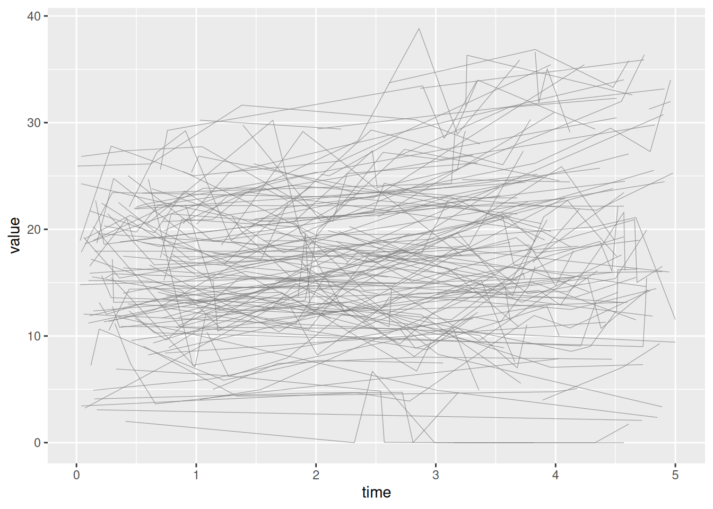

### Unstratified — AV mean gradient, full range (plot_1)

Template: `scale_y_continuous(breaks=seq(0, 80, 20))`,
`coord_cartesian(xlim = c(0, 5), ylim = c(0, 80))`.

``` r

plot(sp) +
  scale_x_continuous(breaks = seq(0, 5, 1)) +
  scale_y_continuous(breaks = seq(0, 80, 20)) +
  coord_cartesian(xlim = c(0, 5), ylim = c(0, 80)) +
  labs(x = "Years", y = "AV Mean Gradient (mmHg)") +
  theme_hv_poster()
```

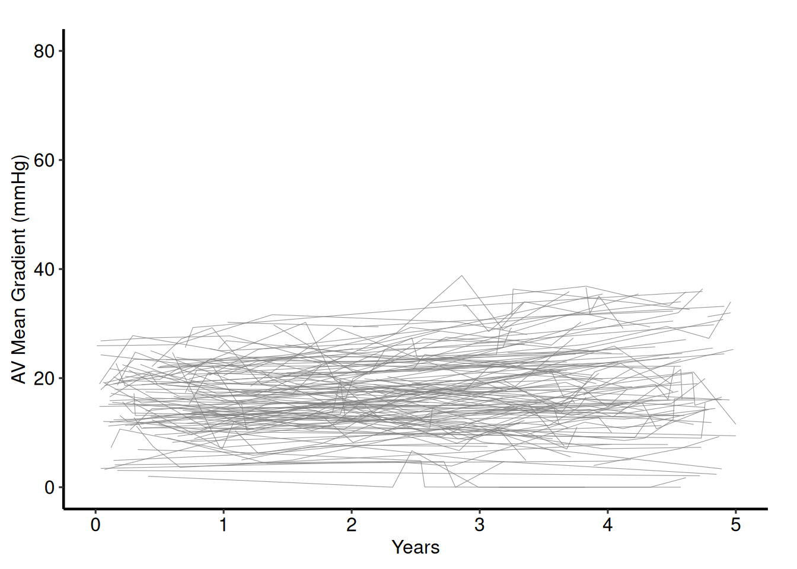

### Unstratified — zoomed y-axis (plot_3)

Template: `scale_y_continuous(breaks=seq(0, 30, 10))`,
`coord_cartesian(ylim = c(0, 30))`.

``` r

plot(sp) +
  scale_x_continuous(breaks = seq(0, 5, 1)) +
  scale_y_continuous(breaks = seq(0, 30, 10)) +
  coord_cartesian(xlim = c(0, 5), ylim = c(0, 30)) +
  labs(x = "Years", y = "AV Mean Gradient (mmHg)") +
  theme_hv_poster()
```

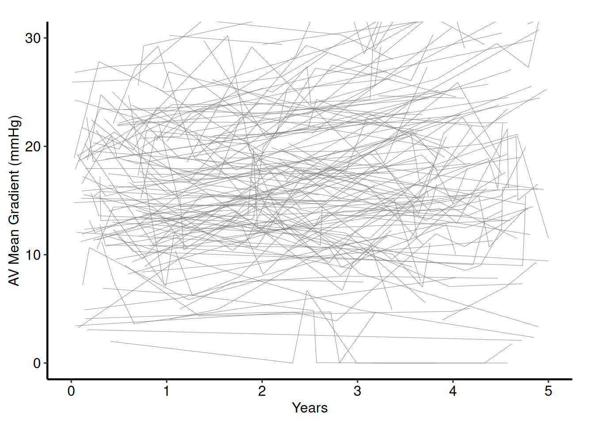

### Stratified by sex — AV mean gradient (plot_2 / plot_4)

Template:
`scale_color_manual(breaks = c("0", "1"), values=c("red", "blue"))`. The
quick-start in the template header uses the modernised `"firebrick"` /
`"steelblue"` equivalents.

``` r

p_sp <- plot(sp_col) +
  scale_colour_manual(
    values = c(Female = "firebrick", Male = "steelblue"),
    name   = NULL
  ) +
  scale_x_continuous(breaks = seq(0, 5, 1)) +
  scale_y_continuous(breaks = seq(0, 80, 20)) +
  coord_cartesian(xlim = c(0, 5), ylim = c(0, 80)) +
  labs(x = "Years", y = "AV Mean Gradient (mmHg)") +
  theme_hv_poster()

p_sp
```

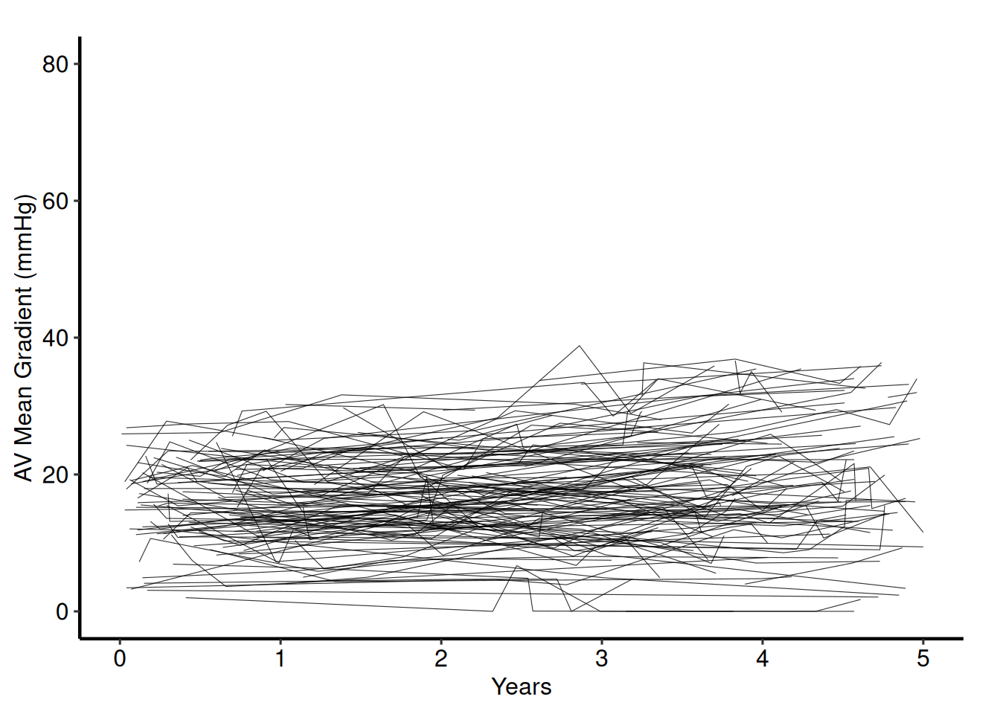

### AV area y-scale (plot_5 / plot_6)

Template: `scale_y_continuous(breaks=seq(0, 5, 1))`,
`coord_cartesian(ylim = c(0, 5))`, `ylab('AV Area (EOA) (cm^2)')`.

``` r

plot(sp_col) +
  scale_colour_manual(
    values = c(Female = "firebrick", Male = "steelblue"),
    name   = NULL
  ) +
  scale_x_continuous(breaks = seq(0, 5, 1)) +
  scale_y_continuous(breaks = seq(0, 5, 1)) +
  coord_cartesian(xlim = c(0, 5), ylim = c(0, 5)) +
  labs(x = "Years", y = "AV Area (EOA) (cm\u00b2)") +
  theme_hv_poster()
```

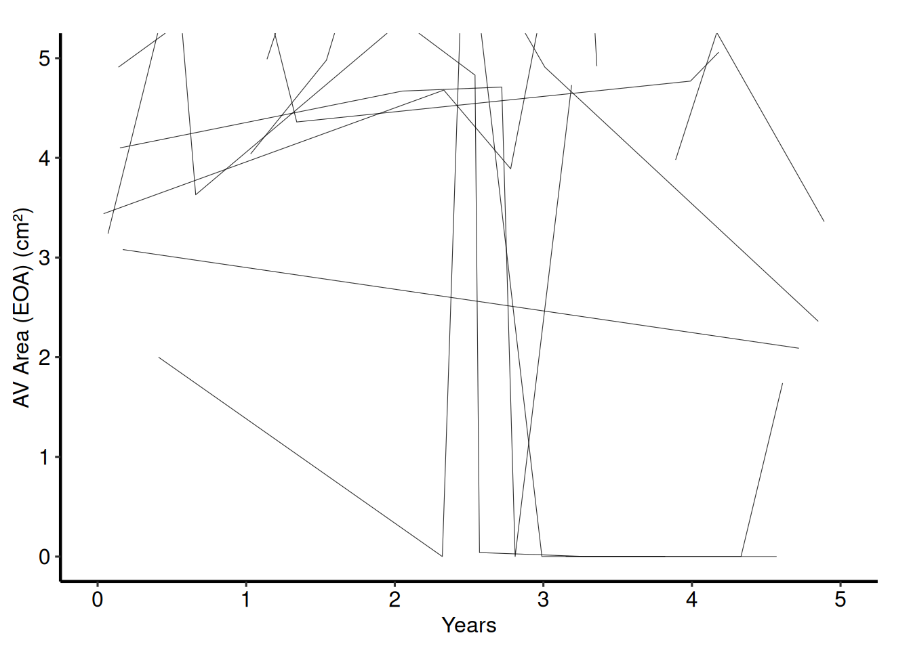

### DVI y-scale (plot_7 / plot_8)

Template: `scale_y_continuous(breaks=seq(0, 1.25, 0.25))`,
`coord_cartesian(ylim = c(0, 1.25))`, `ylab('DVI')`.

``` r

plot(sp_col) +
  scale_colour_manual(
    values = c(Female = "firebrick", Male = "steelblue"),
    name   = NULL
  ) +
  scale_x_continuous(breaks = seq(0, 5, 1)) +
  scale_y_continuous(breaks = seq(0, 1.25, 0.25)) +
  coord_cartesian(xlim = c(0, 5), ylim = c(0, 1.25)) +
  labs(x = "Years", y = "DVI") +
  theme_hv_poster()
```

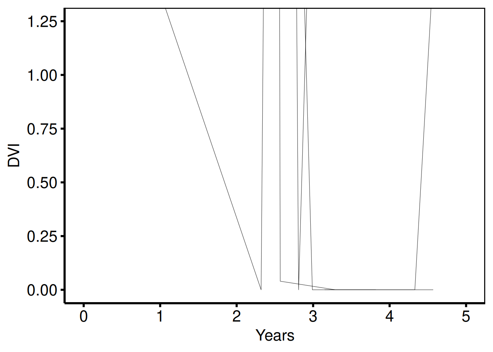

### Ordinal y-axis — MV regurgitation grade (plot_9)

Template:
`scale_y_continuous(labels=c("None", "Mild", "Moderate", "Severe"))`,
`coord_cartesian(xlim = c(0, 6), ylim = c(0, 3))`, two colour groups for
early (blue) and late (red2) cohorts.

``` r

dta_ord        <- dta_sp
dta_ord$value  <- round(pmin(3, pmax(0, dta_sp$value / 12)))
levels(dta_ord$group) <- c("Early", "Late")

sp_ord <- hv_spaghetti(dta_ord, colour_col = "group")

plot(sp_ord, y_labels = c(None = 0, Mild = 1, Moderate = 2, Severe = 3)) +
  scale_colour_manual(
    values = c(Early = "steelblue", Late = "red2"),
    name   = NULL
  ) +
  scale_x_continuous(breaks = seq(0, 6, 1)) +
  coord_cartesian(xlim = c(0, 6), ylim = c(0, 3)) +
  labs(x = "Years after Procedure", y = "MV Regurgitation Grade") +
  theme_hv_poster()
```

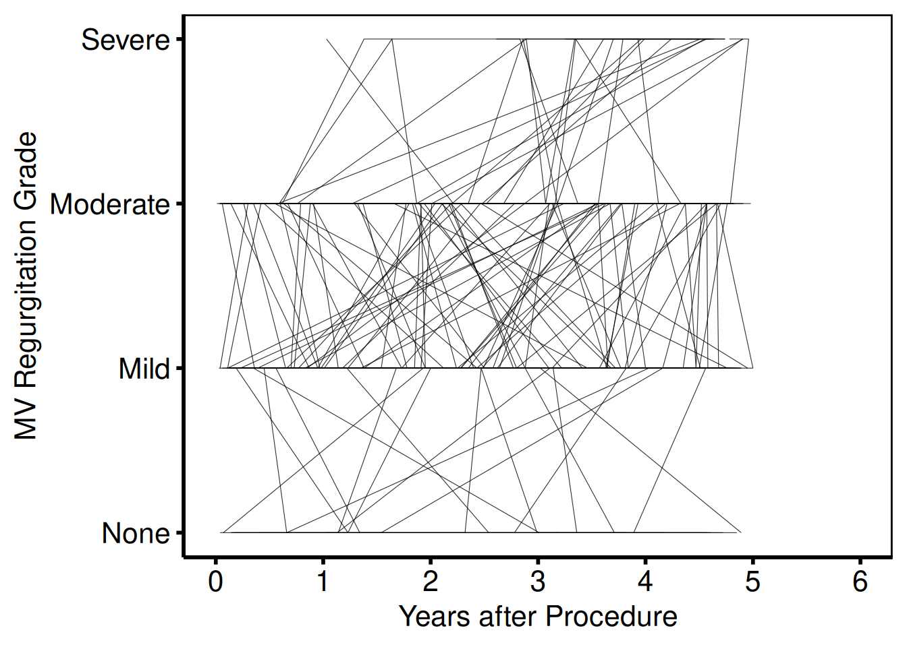

### With LOESS smooth overlay

Pass `add_smooth = TRUE` to
[`plot()`](https://rdrr.io/r/graphics/plot.default.html) to add a LOESS
trend line per group over the individual trajectories. The smoother uses
[`geom_smooth()`](https://ggplot2.tidyverse.org/reference/geom_smooth.html)
defaults; the `alpha` argument on the line layer controls individual
trajectory opacity so the trend line stands out.

``` r

plot(sp_col, add_smooth = TRUE) +
  scale_colour_manual(
    values = c(Female = "firebrick", Male = "steelblue"),
    name   = NULL
  ) +
  scale_x_continuous(breaks = seq(0, 5, 1)) +
  scale_y_continuous(breaks = seq(0, 80, 20)) +
  coord_cartesian(xlim = c(0, 5), ylim = c(0, 80)) +
  labs(x = "Years", y = "AV Mean Gradient (mmHg)") +
  theme_hv_poster()
```

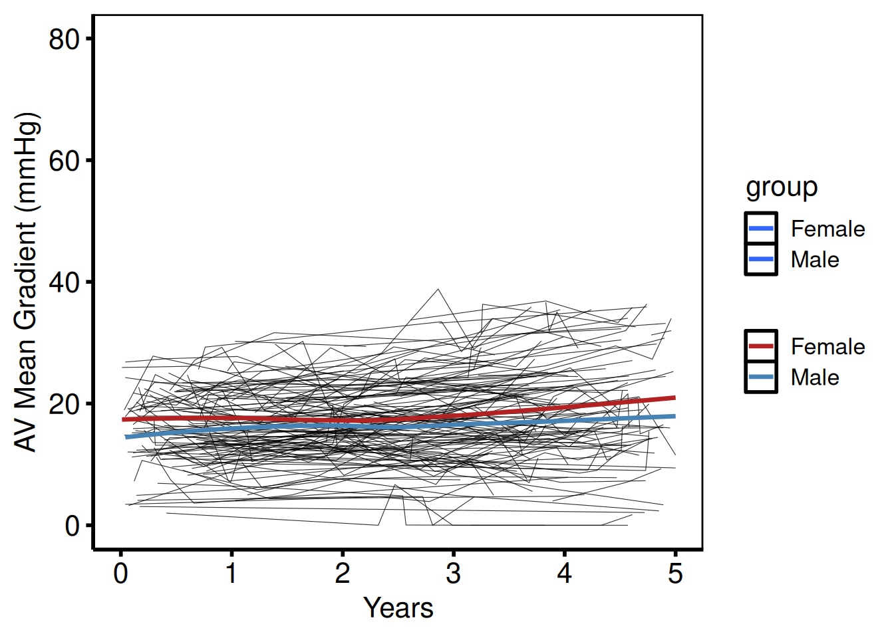

### Saving

Template uses `wid = 11, hei = 8.5` in
[`pdf()`](https://rdrr.io/r/grDevices/pdf.html).

``` r

ggsave(here::here("graphs", "mp.amngrd_profile.pdf"),
       p_sp, width = 11, height = 8.5)
```

## Nonparametric Temporal Trend Curve

[`hv_nonparametric()`](https://ehrlinger.github.io/hvtiPlotR/reference/hv_nonparametric.md)
prepares pre-computed average curves from a two-phase nonparametric
temporal trend model — the R equivalent of the SAS `tp.np.*.avrg_curv.*`
and `tp.np.*.u.trend.*` template family.

Pass the SAS `mean_curv` and `boots_ci` datasets (read in with
[`read.csv()`](https://rdrr.io/r/utils/read.table.html)) and call
[`plot()`](https://rdrr.io/r/graphics/plot.default.html) for a bare
ggplot you can dress with colour, labels, and
[`theme_hv_manuscript()`](https://ehrlinger.github.io/hvtiPlotR/reference/hvtiPlotR-themes.md).

### Sample data

[`sample_nonparametric_curve_data()`](https://ehrlinger.github.io/hvtiPlotR/reference/sample_nonparametric_curve_data.md)
generates the average-curve and bootstrap CI dataset;
[`sample_nonparametric_curve_points()`](https://ehrlinger.github.io/hvtiPlotR/reference/sample_nonparametric_curve_points.md)
generates the binned summary points that overlay the curve. Both mirror
the structure of the SAS `mean_curv` and `boots_ci` output from the
nonparametric temporal trend model.

``` r

curve_dat <- sample_nonparametric_curve_data(
  n            = 500,
  time_max     = 12,
  outcome_type = "probability",
  ci_level     = 0.68       # 68 % CI — one SE, matching SAS cll_p68/clu_p68
)
pts_dat <- sample_nonparametric_curve_points(n = 500, time_max = 12)
head(curve_dat)
```

            time  estimate     lower     upper
    1 0.05000000 0.2395042 0.2148392 0.2660414
    2 0.05055219 0.2395916 0.2149201 0.2661351
    3 0.05111048 0.2396798 0.2150019 0.2662297
    4 0.05167493 0.2397690 0.2150845 0.2663253
    5 0.05224562 0.2398592 0.2151680 0.2664220
    6 0.05282261 0.2399503 0.2152524 0.2665196

### Single average curve with 68 % CI ribbon

Build the S3 object once – pass `lower_col`/`upper_col` that match the
CI columns in your data, and optionally `data_points` for the summary
overlay. The bare plot and the decorated plot share the same object.

``` r

np <- hv_nonparametric(
  curve_data  = curve_dat,
  lower_col   = "lower",
  upper_col   = "upper",
  data_points = pts_dat
)
```

#### Bare plot

The bare panel shows the average curve with its CI ribbon and the binned
summary points in default colours and no axis formatting. Look for: a
smooth curve passing through the binned points, with the ribbon widening
at the extremes where the bootstrap sample thins; a flat curve suggests
the `outcome_type` or CI columns may be misspecified.

``` r

p_np_bare <- plot(np)
p_np_bare
```

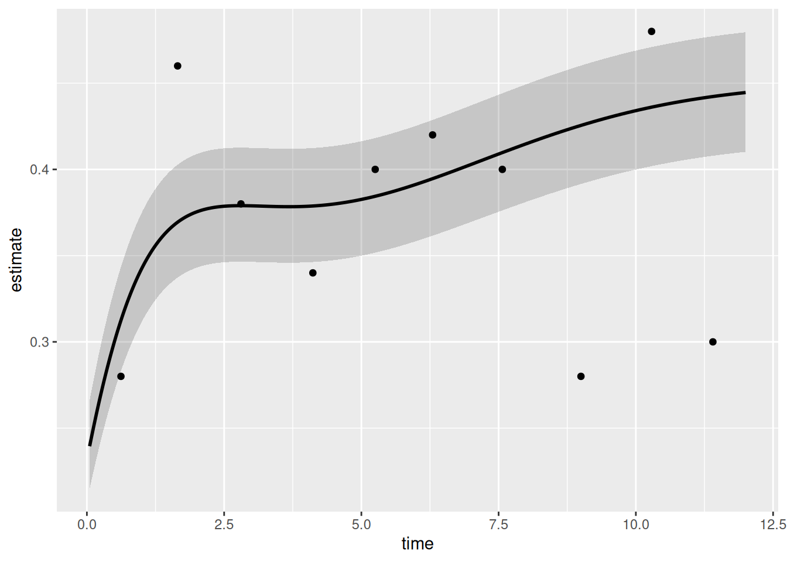

#### Adding scales, labels, and theme

Layer on colour scales that match your analysis context, then set axis
limits and labels to match the SAS template breaks. The example uses
percent labels on the y-axis via
[`scales::percent`](https://scales.r-lib.org/reference/percent_format.html);
swap to raw units for a continuous outcome.

``` r

p_np <- p_np_bare +
  ggplot2::scale_colour_manual(values = c("steelblue"), guide = "none") +
  ggplot2::scale_fill_manual(values   = c("steelblue"), guide = "none") +
  ggplot2::scale_x_continuous(
    limits = c(0, 12),
    breaks = seq(0, 12, 2),
    labels = function(x) paste(x, "yr")
  ) +
  ggplot2::scale_y_continuous(
    limits = c(0, 1),
    breaks = seq(0, 1, 0.2),
    labels = scales::percent
  ) +
  ggplot2::labs(x = "Follow-up (years)", y = "Prevalence (%)") +
  theme_hv_poster()

p_np
```

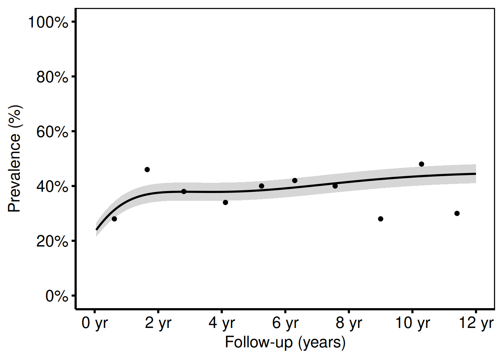

The shaded ribbon shows the 68 % bootstrap CI (one standard error),
matching `cll_p68`/`clu_p68` in the SAS template. Switch to
`ci_level = 0.95` in
[`sample_nonparametric_curve_data()`](https://ehrlinger.github.io/hvtiPlotR/reference/sample_nonparametric_curve_data.md)
for 95 % CI bands.

### Two-group comparison (analogous to tp.np.avpkgrad_ozak_ind_mtwt.sas)

Pass `group_col` to the constructor to compare two average curves in a
single panel, one per valve type (Ozaki vs. CE-Pericardial). Each group
gets its own CI ribbon;
[`scale_colour_manual()`](https://ggplot2.tidyverse.org/reference/scale_manual.html)
and
[`scale_fill_manual()`](https://ggplot2.tidyverse.org/reference/scale_manual.html)
assign the colours consistently between the line and the ribbon.

``` r

curve_grp <- sample_nonparametric_curve_data(
  n      = 400,
  time_max = 7,
  groups   = c("Ozaki" = 0.7, "CE-Pericardial" = 1.3),
  outcome_type = "continuous",
  ci_level = 0.68
)
pts_grp <- sample_nonparametric_curve_points(
  n = 400, time_max = 7,
  groups = c("Ozaki" = 0.7, "CE-Pericardial" = 1.3),
  outcome_type = "continuous"
)

np_grp <- hv_nonparametric(
  curve_data  = curve_grp,
  group_col   = "group",
  lower_col   = "lower",
  upper_col   = "upper",
  data_points = pts_grp
)

plot(np_grp) +
  ggplot2::scale_colour_manual(
    values = c("Ozaki" = "steelblue", "CE-Pericardial" = "firebrick"),
    name   = NULL
  ) +
  ggplot2::scale_fill_manual(
    values = c("Ozaki" = "steelblue", "CE-Pericardial" = "firebrick"),
    guide  = "none"
  ) +
  ggplot2::scale_x_continuous(limits = c(0, 7), breaks = 0:7) +
  ggplot2::labs(
    x = "Follow-up (years)",
    y = "AV Peak Gradient (mmHg)"
  ) +
  theme_hv_poster() +
  ggplot2::theme(legend.position = c(0.15, 0.85))
```

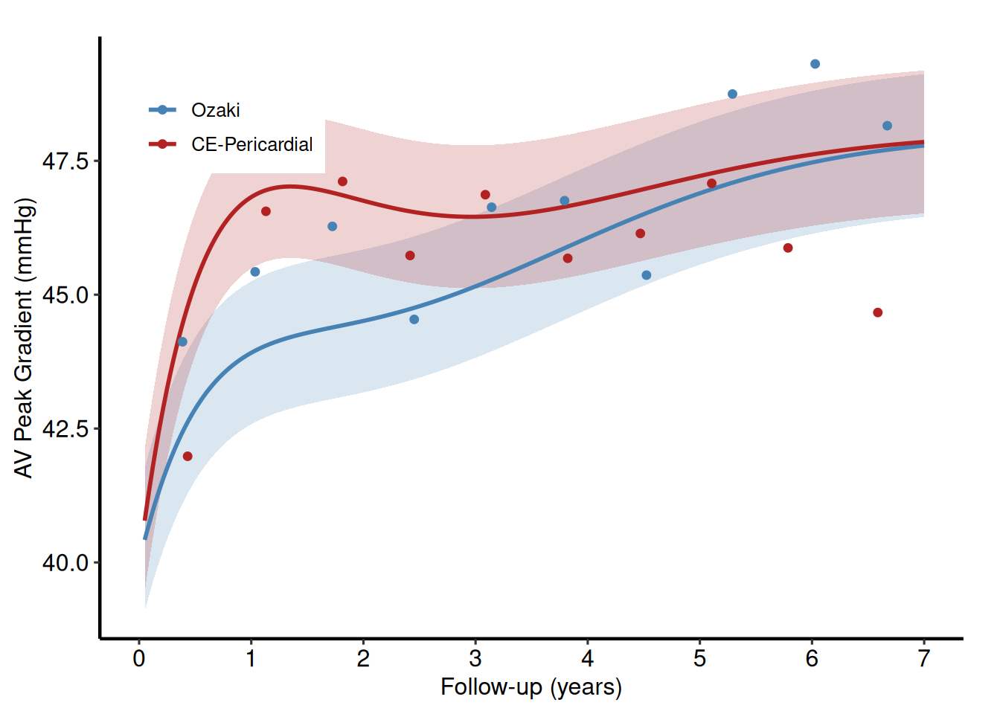

### Saving

[`ggsave()`](https://ggplot2.tidyverse.org/reference/ggsave.html) writes
the manuscript PDF at 11 x 8.5 inches;
[`save_ppt()`](https://ehrlinger.github.io/hvtiPlotR/reference/save_ppt.md)
writes the same figure to an editable PowerPoint slide using the
Cleveland Clinic template. See [Decorating and
Saving](https://ehrlinger.github.io/hvtiPlotR/articles/plot-decorators.md)
for
[`save_ppt()`](https://ehrlinger.github.io/hvtiPlotR/reference/save_ppt.md)
options.

``` r

# Manuscript PDF
ggsave(here::here("graphs", "np_afib_prevalence.pdf"),
       p_np, width = 11, height = 8.5)

# Editable PowerPoint
save_ppt(p_np,
         template   = system.file("extdata", "hv_ppt_template.pptx", package = "hvtiPlotR"),
         powerpoint = here::here("graphs", "np_afib_prevalence.pptx"))
```

## Nonparametric Ordinal Outcome Curve

[`hv_ordinal()`](https://ehrlinger.github.io/hvtiPlotR/reference/hv_ordinal.md)
prepares pre-computed grade-specific probability curves from a
cumulative proportional-odds model — the R equivalent of
`tp.np.*.ordinal.*` SAS templates (e.g. TR grade prevalence, AR
severity).

The SAS `predict` dataset stores one column per grade (`p0`, `p1`, `p2`,
`p3`). You’ll need to reshape it to long format before passing it to the
constructor:

``` r

library(tidyr)
long <- pivot_longer(
  predict_wide,
  cols      = c(p0, p1, p2, p3),
  names_to  = "grade",
  values_to = "estimate"
)
```

### Sample data

[`sample_nonparametric_ordinal_data()`](https://ehrlinger.github.io/hvtiPlotR/reference/sample_nonparametric_ordinal_data.md)
generates grade-specific probability curves in long format (one row per
time × grade combination) and
[`sample_nonparametric_ordinal_points()`](https://ehrlinger.github.io/hvtiPlotR/reference/sample_nonparametric_ordinal_points.md)
generates the binned summary points. Both mirror the `predict` and
`means` SAS datasets from `tp.np.*.ordinal.*`.

``` r

ord_dat <- sample_nonparametric_ordinal_data(
  n            = 800,
  time_max     = 5,
  grade_labels = c("None", "Mild", "Moderate", "Severe")
)
ord_pts <- sample_nonparametric_ordinal_points(
  n            = 800,
  time_max     = 5,
  grade_labels = c("None", "Mild", "Moderate", "Severe")
)
head(ord_dat)
```

            time  estimate grade
    1 0.01000000 0.6276258  None
    2 0.01012532 0.6276898  None
    3 0.01025221 0.6277545  None
    4 0.01038069 0.6278200  None
    5 0.01051078 0.6278864  None
    6 0.01064250 0.6279535  None

### Grade probability curves with data summary points

Build the S3 object once with
[`hv_ordinal()`](https://ehrlinger.github.io/hvtiPlotR/reference/hv_ordinal.md),
passing both the curve data and the summary points. The same object
drives the bare and decorated plots below.

``` r

np_ord <- hv_ordinal(curve_data = ord_dat, data_points = ord_pts)
```

#### Bare plot

The bare panel draws one line per grade with overlaid summary points and
no colour, axis formatting, or theme. Look for: four lines that sum to
approximately 1.0 at every time point, with the `"None"` line starting
high and declining; if lines cross or drift above 1.0, check that the
grade probability columns were correctly reshaped to long format.

``` r

p_ord_bare <- plot(np_ord)
p_ord_bare
```

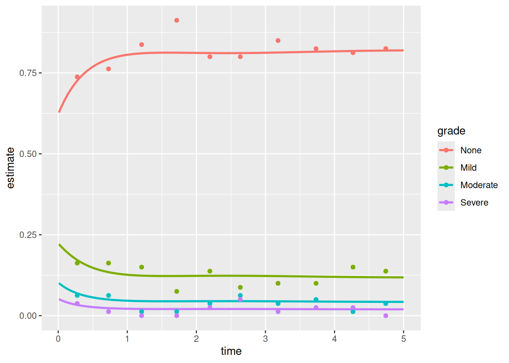

#### Adding scales, labels, and theme

Assign clinically meaningful colours (grey for None, graduated colours
for increasing severity) and format the y-axis as a percentage. Use
`theme(legend.position = c(...))` to anchor the legend inside the panel
where white space permits.

``` r

p_ord <- p_ord_bare +
  ggplot2::scale_colour_manual(
    values = c(
      "None"     = "grey40",
      "Mild"     = "steelblue",
      "Moderate" = "darkorange",
      "Severe"   = "firebrick"
    ),
    name = "AR Grade"
  ) +
  ggplot2::scale_x_continuous(limits = c(0, 5), breaks = 0:5) +
  ggplot2::scale_y_continuous(
    limits = c(0, 1),
    breaks = seq(0, 1, 0.2),
    labels = scales::percent
  ) +
  ggplot2::labs(
    x = "Follow-up (years)",
    y = "Grade prevalence (%)"
  ) +
  theme_hv_poster() +
  ggplot2::theme(legend.position = c(0.75, 0.6))

p_ord
```

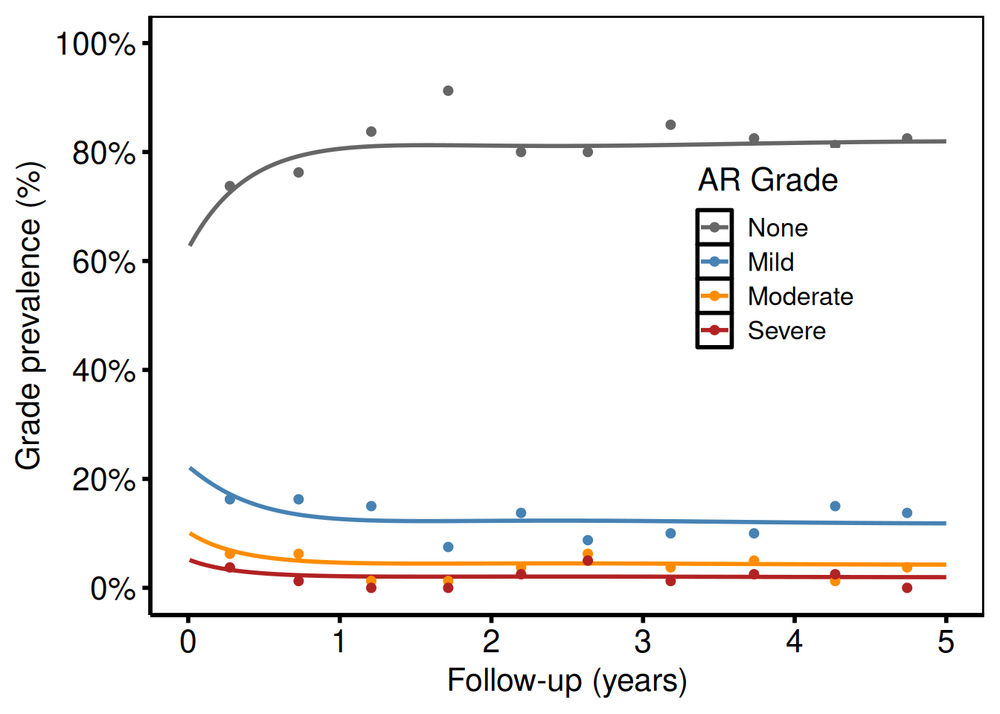

Each line is one grade level. Points show binned data summary values
(analogous to the SAS `means` dataset with `smntr0`–`smntr3` columns).

### Combined mild + moderate (p34 = p3 + p4 pattern)

For analyses that collapse higher grades (e.g. Moderate + Severe
combined), subset and re-label before passing to the constructor:

``` r

ord_collapsed <- ord_dat
# Merge Moderate and Severe into one level
ord_collapsed <- subset(ord_collapsed, grade %in% c("None", "Mild", "Moderate/Severe"))

# If your data has Moderate and Severe as separate rows, combine with:
# library(dplyr)
# ord_collapsed <- ord_dat |>
#   dplyr::filter(grade %in% c("Moderate", "Severe")) |>
#   dplyr::summarise(estimate = sum(estimate), .by = time) |>
#   dplyr::mutate(grade = "Moderate/Severe") |>
#   dplyr::bind_rows(dplyr::filter(ord_dat, grade %in% c("None", "Mild")))

# Show three-level version using only two grades from sample data
ord_two <- subset(ord_dat, grade %in% c("None", "Severe"))

plot(hv_ordinal(curve_data = ord_two)) +
  ggplot2::scale_colour_manual(
    values = c("None" = "steelblue", "Severe" = "firebrick"),
    name   = NULL
  ) +
  ggplot2::scale_x_continuous(limits = c(0, 5), breaks = 0:5) +
  ggplot2::scale_y_continuous(limits = c(0, 1), breaks = seq(0, 1, 0.2),
                               labels = scales::percent) +
  ggplot2::labs(x = "Follow-up (years)", y = "Grade prevalence (%)") +
  theme_hv_poster()
```

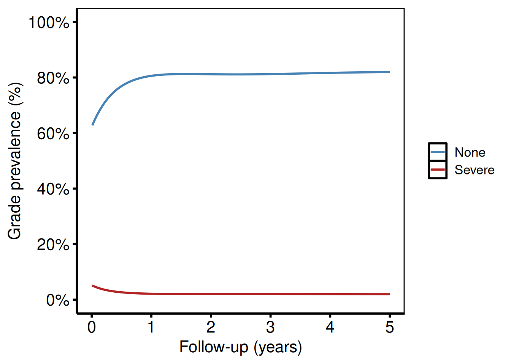

### Saving

[`ggsave()`](https://ggplot2.tidyverse.org/reference/ggsave.html) writes
the ordinal curve figure at 11 x 8.5 inches to match the SAS template
output dimensions.

``` r

ggsave(here::here("graphs", "np_tr_ordinal.pdf"),
       p_ord, width = 11, height = 8.5)
```

## Longitudinal Participation Counts

[`hv_longitudinal()`](https://ehrlinger.github.io/hvtiPlotR/reference/hv_longitudinal.md)
reproduces the two-panel layout from
`tp.dp.longitudinal_patients_measures.*`: a grouped bar chart of
patients and measurements at each follow-up window, paired with a
numeric summary table below. Call `plot(lc)` for the bar chart and
`plot(lc, type = "table")` for the table panel. Compose the two panels
with `patchwork`.

Input must be **pre-aggregated long-format data** (one row per
time-window × series combination). Use
[`sample_longitudinal_counts_data()`](https://ehrlinger.github.io/hvtiPlotR/reference/sample_longitudinal_counts_data.md)
to derive this from patient-level data, or build it yourself from your
registry data.

### Sample data

[`sample_longitudinal_counts_data()`](https://ehrlinger.github.io/hvtiPlotR/reference/sample_longitudinal_counts_data.md)
derives pre-aggregated long-format data from a simulated patient-level
registry of 300 patients: one row per time-window × series (Patients,
Measurements) combination with a count column. Build the S3 object once
and use it for both the bar-chart and table panels.

``` r

lc_dat <- sample_longitudinal_counts_data(n_patients = 300, seed = 42L)
lc_dat
```

       time_label       series count
    1     ≥0 Days     Patients    19
    2    ≥1 Month     Patients    47
    3   ≥3 Months     Patients    49
    4   ≥6 Months     Patients   100
    5     ≥1 Year     Patients   159
    6    ≥2 Years     Patients   101
    7  ≥2.5 Years     Patients   276
    8     ≥0 Days Measurements    19
    9    ≥1 Month Measurements    50
    10  ≥3 Months Measurements    56
    11  ≥6 Months Measurements   118
    12    ≥1 Year Measurements   217
    13   ≥2 Years Measurements   113
    14 ≥2.5 Years Measurements   620

``` r

# Build the S3 object once; use for both panels
lc <- hv_longitudinal(lc_dat)
```

### Bare plot

The bare `plot(lc)` panel shows grouped bars at each follow-up window
with no fill colour, axis scale, or theme. Look for: paired bars at each
time window with Patients always \>= Measurements; if the two series are
equal, check that the `series_col` argument maps to the right column.

``` r

p_lc_bare <- plot(lc)
p_lc_bare
```

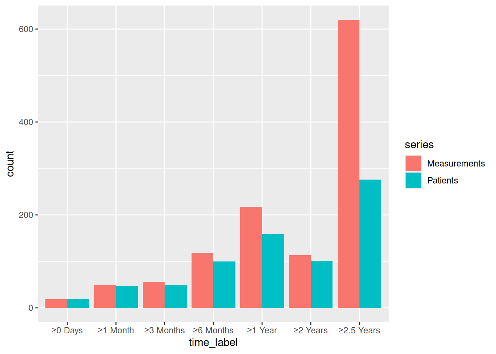

### Bar chart

Layer fill colours onto the bare plot to distinguish Patients from
Measurements, then expand the y-axis with
[`ggplot2::coord_cartesian()`](https://ggplot2.tidyverse.org/reference/coord_cartesian.html)
to leave room for labels above the tallest bar.

``` r

p_lc_bar <- plot(lc) +
  ggplot2::scale_fill_manual(
    values = c(Patients = "steelblue", Measurements = "firebrick"),
    name   = NULL
  ) +
  ggplot2::scale_y_continuous(
    breaks = seq(0, 2000, 500),
    expand = c(0, 0)
  ) +
  ggplot2::coord_cartesian(ylim = c(0, 2200)) +
  ggplot2::labs(x = NULL, y = "Count (n)") +
  theme_hv_poster() +
  ggplot2::theme(legend.position = c(0.85, 0.85))

p_lc_bar
```

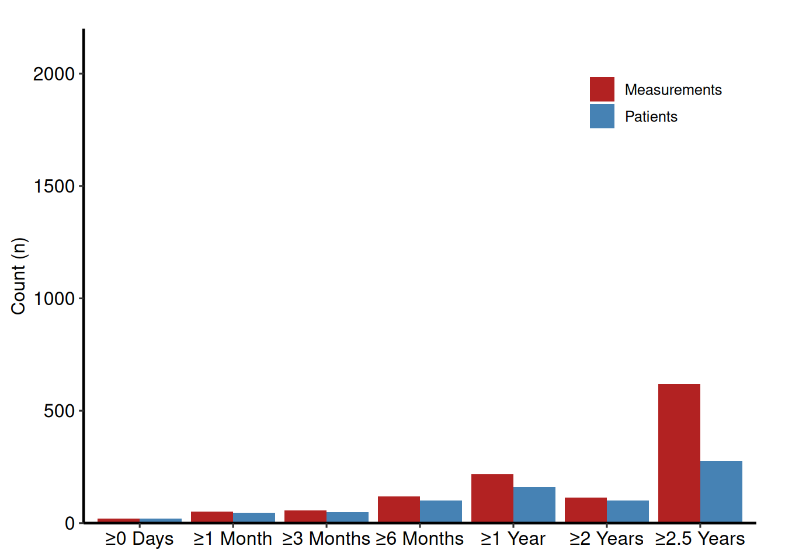

### Numeric table panel

Call `plot(lc, type = "table")` to get the numeric summary panel – the
same counts the bar chart shows, rendered as coloured text below the
x-axis labels. This panel is intended to be composed with `patchwork`
below the bar chart, so keep the theme consistent.

``` r

p_lc_tbl <- plot(lc, type = "table") +
  ggplot2::scale_colour_manual(
    values = c(Patients = "steelblue", Measurements = "firebrick"),
    guide  = "none"
  ) +
  theme_hv_poster()

p_lc_tbl
```

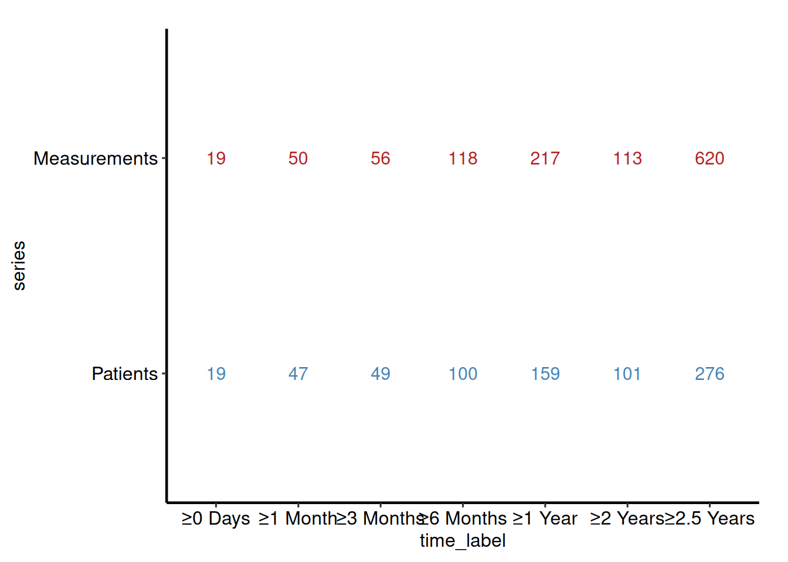

### Two-panel layout with patchwork

Stack the bar chart above the table panel with `/` and use
`patchwork::plot_layout(heights = c(3, 1))` to give the bar chart three
times the vertical space. This ratio matches the original SAS template
layout.

``` r

library(patchwork)

p_lc_bar / p_lc_tbl +
  patchwork::plot_layout(heights = c(3, 1))
```

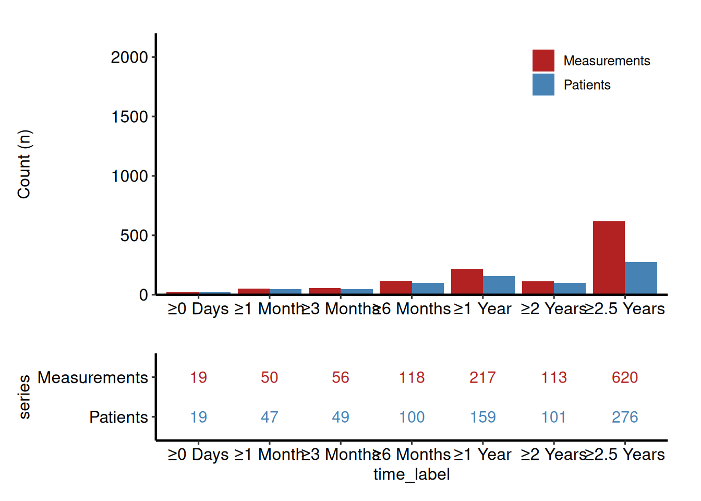

### Saving the combined figure

[`ggsave()`](https://ggplot2.tidyverse.org/reference/ggsave.html) writes
the patchwork composite at 11 x 6 inches.
[`save_ppt()`](https://ehrlinger.github.io/hvtiPlotR/reference/save_ppt.md)
takes the bar chart alone – patchwork composites may need
[`ggsave()`](https://ggplot2.tidyverse.org/reference/ggsave.html) first
– and writes it to a PowerPoint slide. See [Decorating and
Saving](https://ehrlinger.github.io/hvtiPlotR/articles/plot-decorators.md)
for details.

``` r

combined <- p_lc_bar / p_lc_tbl +
  patchwork::plot_layout(heights = c(3, 1))

ggsave(here::here("graphs", "longitudinal_participation.pdf"),
       combined, width = 11, height = 6)

# PowerPoint (bar chart only — patchwork composites may need ggsave first)
save_ppt(p_lc_bar,
         template   = system.file("extdata", "hv_ppt_template.pptx", package = "hvtiPlotR"),
         powerpoint = here::here("graphs", "longitudinal_participation.pptx"))
```

## UpSet Plot

[`hv_upset()`](https://ehrlinger.github.io/hvtiPlotR/reference/hv_upset.md)
builds an UpSet diagram via
[`ggupset::scale_x_upset()`](https://rdrr.io/pkg/ggupset/man/scale_x_upset.html)
to visualise surgical procedure co-occurrences or any set membership
data. Where a Venn diagram breaks down past three or four sets, UpSet
scales cleanly to seven or more.

[`plot.hv_upset()`](https://ehrlinger.github.io/hvtiPlotR/reference/plot.hv_upset.md)
returns a **ggplot** when `set_size = FALSE`, or a **patchwork
composite** of an intersection-bar plot + a set-size sidebar when
`set_size = TRUE` (the default). For the bare ggplot path, themes apply
via `+` like every other hvtiPlotR plot; for the patchwork path, use
patchwork’s `&` operator to theme every sub-panel:

``` r

plot(hu) & theme_hv_poster()                  # default (patchwork)
plot(hu, set_size = FALSE) + theme_hv_poster() # single ggplot
```

### Sample data

[`sample_upset_data()`](https://ehrlinger.github.io/hvtiPlotR/reference/sample_upset_data.md)
returns a binary indicator matrix: one column per procedure, one row per
patient, with 1 indicating the procedure was performed. Pass the column
names to `intersect` in the constructor to define the set membership
axes. [`colSums()`](https://rdrr.io/r/base/colSums.html) confirms the
marginal counts before you build.

``` r

sets <- c("AV_Replacement", "AV_Repair", "MV_Replacement", "MV_Repair",
          "TV_Repair", "Aorta", "CABG")

upset_dta <- sample_upset_data(n = 400, seed = 42)
head(upset_dta)
```

      AV_Replacement AV_Repair MV_Replacement MV_Repair TV_Repair Aorta  CABG
    1          FALSE     FALSE          FALSE      TRUE     FALSE FALSE FALSE
    2          FALSE     FALSE          FALSE      TRUE     FALSE FALSE FALSE
    3          FALSE     FALSE          FALSE     FALSE     FALSE FALSE  TRUE
    4          FALSE      TRUE          FALSE     FALSE     FALSE FALSE FALSE
    5          FALSE     FALSE           TRUE     FALSE      TRUE FALSE FALSE
    6           TRUE     FALSE          FALSE     FALSE     FALSE FALSE  TRUE

``` r

colSums(upset_dta)
```

    AV_Replacement      AV_Repair MV_Replacement      MV_Repair      TV_Repair
               127             50             56             49             42
             Aorta           CABG
                56            147 

``` r

hu <- hv_upset(upset_dta, intersect = sets)
```

### Default plot

Intersection bars (top 10 by frequency) with a set-size sidebar on the
right. `set_size = TRUE` returns a patchwork composite, so theme it with
`&` to cover both sub-panels:

``` r

plot(hu) &
  theme_hv_poster()
```

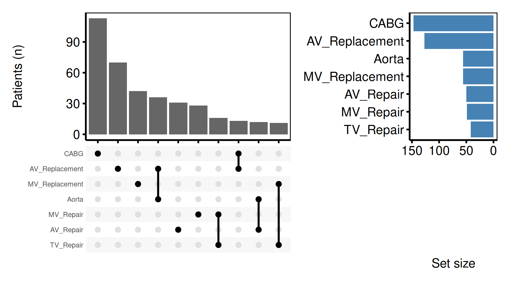

### Custom intersection bar colour

The intersection bars are a standard
[`geom_bar()`](https://ggplot2.tidyverse.org/reference/geom_bar.html) —
change the colour via the `bar_fill` argument (or set `set_size = FALSE`
to return just the intersection-bar ggplot for full customisation).

``` r

plot(hu, bar_fill = "steelblue", set_size = FALSE) +
  ggplot2::labs(y = "Patients (n)") +
  theme_hv_poster()
```

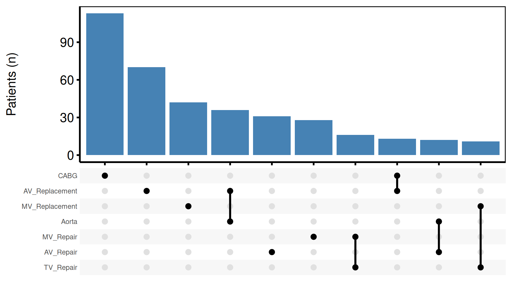

### Colour bars by era

Pass `fill_col` to fill the intersection bars by a grouping column on
the input data. Combine with
[`scale_fill_manual()`](https://ggplot2.tidyverse.org/reference/scale_manual.html)
for explicit colour assignment.

``` r

upset_dta$era <- ifelse(seq_len(nrow(upset_dta)) <= 200, "Early", "Recent")
hu_era <- hv_upset(upset_dta, intersect = sets)

plot(hu_era, fill_col = "era", set_size = FALSE) +
  ggplot2::scale_fill_manual(
    values = c("Early" = "grey60", "Recent" = "steelblue"),
    name   = "Era"
  ) +
  ggplot2::labs(y = "Patients (n)") +
  theme_hv_poster()
```

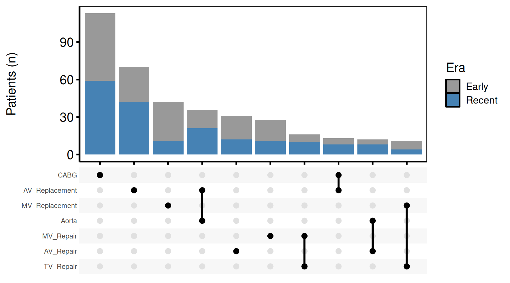

### Saving

[`ggsave()`](https://ggplot2.tidyverse.org/reference/ggsave.html)
handles a patchwork composite the same as a bare ggplot – write it at 11
x 6 inches, wide enough for the intersection bars plus the set-size
sidebar. For a PowerPoint version, see [Decorating and
Saving](https://ehrlinger.github.io/hvtiPlotR/articles/plot-decorators.md).

``` r

p_upset <- plot(hu) & theme_hv_poster()

# UpSet plot is a patchwork composite when set_size = TRUE (the default);
# ggsave() handles it the same as any ggplot.
ggplot2::ggsave(here::here("graphs", "procedure_cooccurrence.pdf"),
                p_upset, width = 11, height = 6)
```

## Draft Footnotes

[`make_footnote()`](https://ehrlinger.github.io/hvtiPlotR/reference/make_footnote.md)
writes a small annotation to the **bottom-right corner** of the current
graphics device using grid. Call it *after* printing a plot to mark the
figure as a work-in-progress during analysis. When you’re ready for
final output, omit the call — the plot object itself is untouched.

    # During analysis                   # For publication
    print(p)                             ggsave("fig1.pdf", p, ...)
    make_footnote("R/analysis.R")        # <- no footnote call

### Draft annotation pattern

Build any hvtiPlotR figure as usual, then call
[`print()`](https://rdrr.io/r/base/print.html) followed by
[`make_footnote()`](https://ehrlinger.github.io/hvtiPlotR/reference/make_footnote.md)
to stamp the bottom-right corner with the source file path and a
timestamp. The ggplot object itself is unchanged – only the rendered
device gets the annotation.

``` r

dta_fn <- sample_hazard_data(n = 300, time_max = 10)
emp_fn <- sample_hazard_empirical(n = 300, time_max = 10, n_bins = 5)

p_draft <- hazard_plot(
  dta_fn,
  estimate_col  = "survival",
  lower_col     = "surv_lower",
  upper_col     = "surv_upper",
  empirical     = emp_fn,
  emp_lower_col = "lower",
  emp_upper_col = "upper"
) +
  scale_colour_manual(values = c("steelblue"), guide = "none") +
  scale_fill_manual(values = c("steelblue"), guide = "none") +
  scale_x_continuous(limits = c(0, 10), breaks = 0:10) +
  scale_y_continuous(limits = c(0, 100), breaks = seq(0, 100, 20),
                     labels = function(x) paste0(x, "%")) +
  labs(x = "Years", y = "Survival (%)") +
  theme_hv_poster()

print(p_draft)
make_footnote("vignettes/plot-functions.qmd")
```

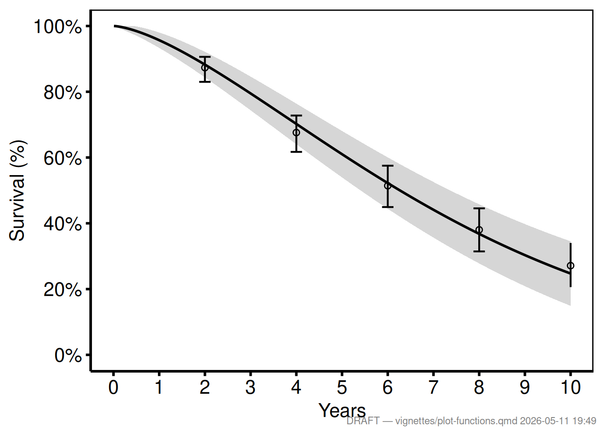

### Custom analyst tag

Pass any string as `text` and set `timestamp = FALSE` for a stable
label.

``` r

print(p_draft)
make_footnote(
  text      = paste("J. Ehrlinger |", Sys.Date()),
  timestamp = FALSE,
  prefix    = ""
)
```

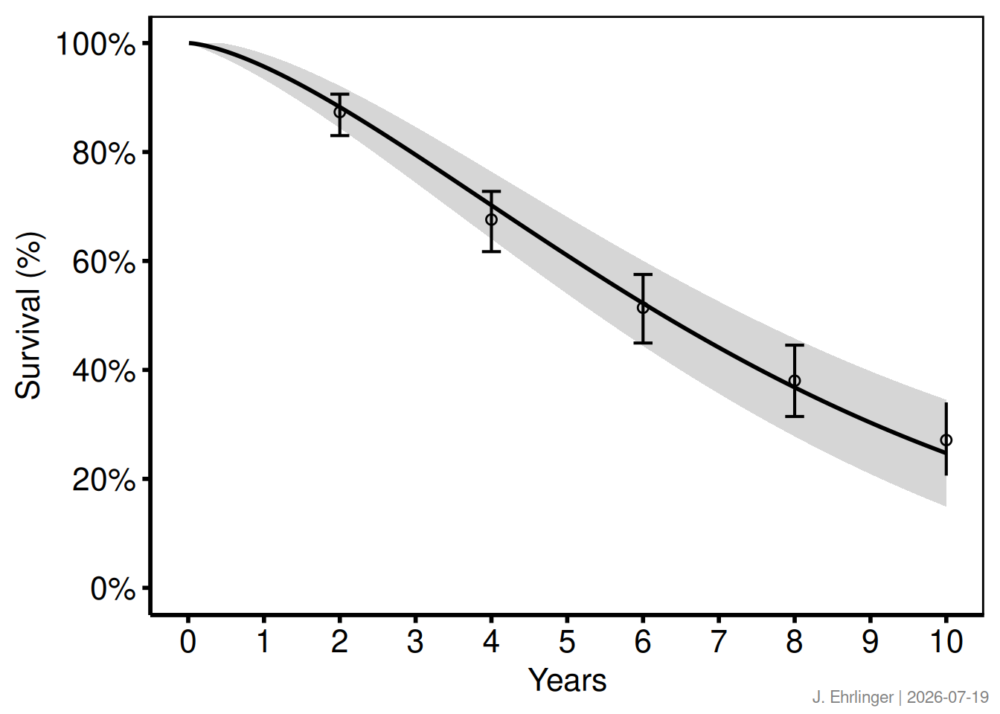

### Saving without the footnote

The [`ggsave()`](https://ggplot2.tidyverse.org/reference/ggsave.html)
call writes the ggplot object directly —
[`make_footnote()`](https://ehrlinger.github.io/hvtiPlotR/reference/make_footnote.md)
is never called, so the saved file is clean.

``` r

ggsave("../graphs/fig1_survival.pdf", p_draft, width = 11, height = 8.5)
```
