# SAS Template Migration Guide: Finding Your Plot in R

## Overview

This guide maps every SAS template in the HVTI statistics group template
library to its R equivalent in the **hvtiPlotR** package. If you know
the SAS template name (e.g.,
`tp.np.afib.ivwristm.avrg_curv.binary.sas`), look it up in the table
below and jump to the corresponding section for a working R example.

The guide is organized by template family (the two-letter prefix after
`tp.`). New ports are added to this document as they become available.

### Key concepts for SAS users

**ggplot2 builds plots in layers.** Instead of one macro call with many
`color=`, `xaxis=`, and `footnote=` options, you chain `+` operations:

``` r
nonparametric_curve_plot(dat, ...) +
  scale_colour_manual(values = c("black", "gray40")) +
  scale_x_continuous(breaks = 0:12) +
  labs(x = "Years after Operation", y = "Prevalence (%)") +
  hvti_theme("manuscript")
```

**[`hvti_theme()`](https://ehrlinger.github.io/hvtiPlotR/reference/hvti_theme.md)
replaces SAS `device=` / style options.** Use `"dark_ppt"` / `"ppt"` for
PowerPoint slides, `"light_ppt"` for light-background slides,
`"manuscript"` for journal figures, and `"poster"` for conference
posters.

**Functions return a ggplot object; they do not display it.** Call the
plot object at the top level (or use
[`print()`](https://rdrr.io/r/base/print.html)) to render it, or save
with [`ggsave()`](https://ggplot2.tidyverse.org/reference/ggsave.html) /
[`save_ppt()`](https://ehrlinger.github.io/hvtiPlotR/reference/save_ppt.md).

**Pre-fitted models, not raw data.** Most functions accept the *output*
of a statistical model (curve datasets, probability estimates) rather
than individual patient records — mirroring the SAS workflow where
`%decompos()` or `%kaplan` computes estimates and a separate template
step produces the figure.

------------------------------------------------------------------------

## Template lookup table

| SAS Template                                    | Family | R Function                                                                                                      | Section                                              |
|-------------------------------------------------|--------|-----------------------------------------------------------------------------------------------------------------|------------------------------------------------------|
| `tp.np.afib.ivwristm.avrg_curv.binary.sas`      | np     | [`nonparametric_curve_plot()`](https://ehrlinger.github.io/hvtiPlotR/reference/nonparametric_curve_plot.md)     | [Average curve — binary](#np-binary-avg)             |
| `tp.np.afib.ivwristm.pt_spec_phases.binary.sas` | np     | [`nonparametric_curve_plot()`](https://ehrlinger.github.io/hvtiPlotR/reference/nonparametric_curve_plot.md)     | [Phase decomposition](#np-phases)                    |
| `tp.np.afib.ivwristm.pt_specific.binary.sas`    | np     | [`nonparametric_curve_plot()`](https://ehrlinger.github.io/hvtiPlotR/reference/nonparametric_curve_plot.md)     | [Average curve — binary](#np-binary-avg)             |
| `tp.np.afib.mult.avrg_curv.binary.sas`          | np     | [`nonparametric_curve_plot()`](https://ehrlinger.github.io/hvtiPlotR/reference/nonparametric_curve_plot.md)     | [Multi-group comparison](#np-multigroup)             |
| `tp.np.afib.mult.pt_spec.binary.sas`            | np     | [`nonparametric_curve_plot()`](https://ehrlinger.github.io/hvtiPlotR/reference/nonparametric_curve_plot.md)     | [Multi-group comparison](#np-multigroup)             |
| `tp.np.avpkgrad_ozak_ind_mtwt.sas`              | np     | [`nonparametric_curve_plot()`](https://ehrlinger.github.io/hvtiPlotR/reference/nonparametric_curve_plot.md)     | [Multi-group comparison](#np-multigroup)             |
| `tp.np.fev.double.univariate.continuous.sas`    | np     | [`nonparametric_curve_plot()`](https://ehrlinger.github.io/hvtiPlotR/reference/nonparametric_curve_plot.md)     | [Continuous outcome](#np-continuous)                 |
| `tp.np.fev.multivariate.continuous.sas`         | np     | [`nonparametric_curve_plot()`](https://ehrlinger.github.io/hvtiPlotR/reference/nonparametric_curve_plot.md)     | [Multi-group comparison](#np-multigroup)             |
| `tp.np.fev.u.trend.continuous.sas`              | np     | [`nonparametric_curve_plot()`](https://ehrlinger.github.io/hvtiPlotR/reference/nonparametric_curve_plot.md)     | [Continuous outcome](#np-continuous)                 |
| `tp.np.tr.icdpr.avg_curv.sas`                   | np     | [`nonparametric_curve_plot()`](https://ehrlinger.github.io/hvtiPlotR/reference/nonparametric_curve_plot.md)     | [Average curve — binary](#np-binary-avg)             |
| `tp.np.tr.ivecho.average_curv.ordinal.sas`      | np     | [`nonparametric_ordinal_plot()`](https://ehrlinger.github.io/hvtiPlotR/reference/nonparametric_ordinal_plot.md) | [Ordinal outcomes](#np-ordinal)                      |
| `tp.np.tr.ivecho.independence.sas`              | np     | [`nonparametric_ordinal_plot()`](https://ehrlinger.github.io/hvtiPlotR/reference/nonparametric_ordinal_plot.md) | [Ordinal independence](#np-ordinal-independence)     |
| `tp.np.tr.ivecho.u.phases.sas`                  | np     | [`nonparametric_ordinal_plot()`](https://ehrlinger.github.io/hvtiPlotR/reference/nonparametric_ordinal_plot.md) | [Ordinal phases](#np-ordinal-phases)                 |
| `tp.np.po_ar.u_multi.ordinal.sas`               | np     | [`nonparametric_ordinal_plot()`](https://ehrlinger.github.io/hvtiPlotR/reference/nonparametric_ordinal_plot.md) | [Ordinal multi-scenario](#np-ordinal-multi)          |
| `tp.np.z0axdpo.continuous.bmi_xaxis.sas`        | np     | [`nonparametric_curve_plot()`](https://ehrlinger.github.io/hvtiPlotR/reference/nonparametric_curve_plot.md)     | [Covariate x-axis](#np-covariate-xaxis)              |
| `tp.ac.dead.sas` (via `%kaplan` / `%nelsont`)   | ac     | [`survival_curve()`](https://ehrlinger.github.io/hvtiPlotR/reference/survival_curve.md)                         | [Kaplan–Meier survival](#ac-dead)                    |
| `tp.cp.dead.sas`                                | cp     | [`survival_curve()`](https://ehrlinger.github.io/hvtiPlotR/reference/survival_curve.md)                         | [Kaplan–Meier survival](#ac-dead)                    |
| `tp.dp.gfup.R`                                  | dp     | [`goodness_followup()`](https://ehrlinger.github.io/hvtiPlotR/reference/goodness_followup.md)                   | [Goodness of follow-up](#dp-gfup)                    |
| `tp.lp.propen.cov_balance.R`                    | lp     | [`covariate_balance()`](https://ehrlinger.github.io/hvtiPlotR/reference/covariate_balance.md)                   | [Covariate balance](#lp-covbal)                      |
| `tp.dp.female_bicus_preAR_sankey.R`             | dp     | [`alluvial_plot()`](https://ehrlinger.github.io/hvtiPlotR/reference/alluvial_plot.md)                           | [Alluvial](#dp-sankey)                               |
| `tp.complexUpset.R`                             | dp     | [`upset_plot()`](https://ehrlinger.github.io/hvtiPlotR/reference/upset_plot.md)                                 | [UpSet plot](#dp-upset)                              |
| `tp.dp.spaghetti.echo.R`                        | dp     | [`spaghetti_plot()`](https://ehrlinger.github.io/hvtiPlotR/reference/spaghetti_plot.md)                         | [Spaghetti / individual trajectories](#dp-spaghetti) |
| `tp.dp.trends.R`                                | dp     | [`trends_plot()`](https://ehrlinger.github.io/hvtiPlotR/reference/trends_plot.md)                               | [Trends over time](#dp-trends)                       |
| `tp.dp.longitudinal_patients_measures.R`        | dp     | [`longitudinal_counts_plot()`](https://ehrlinger.github.io/hvtiPlotR/reference/longitudinal_counts_plot.md)     | [Longitudinal counts](#dp-long-counts)               |
| Mirror histogram (propensity matching)          | dp     | [`mirror_histogram()`](https://ehrlinger.github.io/hvtiPlotR/reference/mirror_histogram.md)                     | [Mirror histogram](#dp-mirror)                       |
| Stacked histogram                               | dp     | [`stacked_histogram()`](https://ehrlinger.github.io/hvtiPlotR/reference/stacked_histogram.md)                   | [Stacked histogram](#dp-stacked)                     |

------------------------------------------------------------------------

## Nonparametric temporal trends (`tp.np.*`)

All `tp.np.*` templates share a common SAS workflow:

1.  Fit patient-specific temporal profiles with `%decompos()`.
2.  Average profiles across patients with `PROC SUMMARY` → `mean_curv`
    dataset.
3.  Optionally compute bootstrap confidence intervals → `boots_ci`
    dataset.
4.  Compute binned patient-level summaries (deciles/quintiles) → `means`
    dataset.
5.  Call the plotting template.

The R port replaces step 5. Steps 1–4 still run in SAS; export the
resulting datasets to CSV and read them into R:

``` r
curve_data <- read.csv("mean_curv.csv")   # or boots_ci if CI bands are needed
data_pts   <- read.csv("means.csv")       # optional binned data points
```

### SAS column name mapping

| SAS column                          | R argument     | Notes                 |
|-------------------------------------|----------------|-----------------------|
| `iv_echo` / `iv_wristm` / `iv_fyrs` | `x_col`        | Time variable         |
| `prev` / `mnprev` / `_p_` / `est`   | `estimate_col` | Curve estimate        |
| `cll_p68` / `cll_p95`               | `lower_col`    | CI lower band         |
| `clu_p68` / `clu_p95`               | `upper_col`    | CI upper band         |
| Grouping variable (e.g., `group`)   | `group_col`    | NULL for single curve |
| `mtime` / `mmtime` (means dataset)  | `dp_x_col`     | Binned point x        |
| `mprev` / `mnprev` (means dataset)  | `dp_y_col`     | Binned point y        |

### Average curve — binary outcome

**Ports:** `tp.np.afib.ivwristm.avrg_curv.binary.sas`,
`tp.np.afib.ivwristm.pt_specific.binary.sas`,
`tp.np.tr.icdpr.avg_curv.sas`

``` r
dat     <- sample_nonparametric_curve_data(
  n            = 500,
  time_max     = 12,
  outcome_type = "probability"
)
dat_pts <- sample_nonparametric_curve_points(n = 500, time_max = 12)

# Minimal plot
nonparametric_curve_plot(dat) +
  scale_x_continuous(breaks = seq(0, 12, 2)) +
  scale_y_continuous(
    limits = c(0, 1),
    breaks = seq(0, 1, 0.2),
    labels = scales::percent
  ) +
  labs(
    x     = "Years after operation",
    y     = "Prevalence (%)",
    title = "Atrial Fibrillation Prevalence"
  ) +
  hvti_theme("manuscript")
```

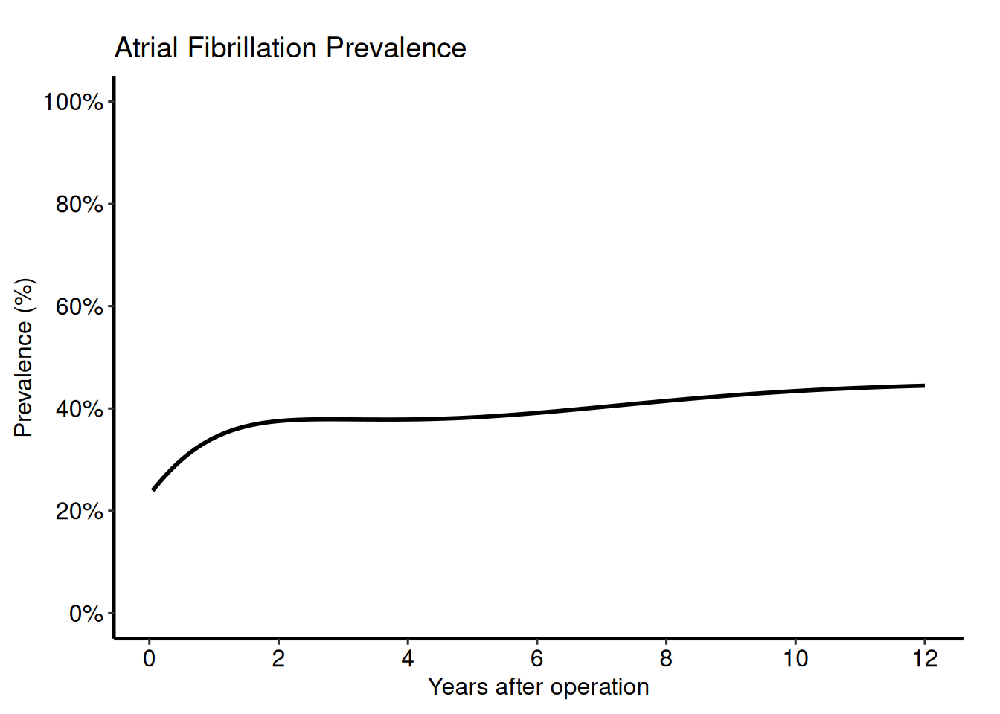

Add 68% CI bands (one standard error; matches SAS `boots_ci` with
`cll_p68` / `clu_p68`):

``` r
nonparametric_curve_plot(
  dat,
  lower_col = "lower",
  upper_col = "upper"
) +
  scale_x_continuous(breaks = seq(0, 12, 2)) +
  scale_y_continuous(
    limits = c(0, 1),
    breaks = seq(0, 1, 0.2),
    labels = scales::percent
  ) +
  labs(
    x     = "Years after operation",
    y     = "Prevalence (%)",
    title = "Atrial Fibrillation — 68% CI"
  ) +
  hvti_theme("manuscript")
```

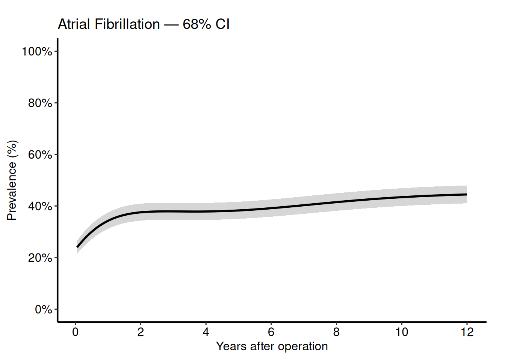

Add binned data summary points (matches the SAS `means` dataset):

``` r
nonparametric_curve_plot(
  dat,
  lower_col   = "lower",
  upper_col   = "upper",
  data_points = dat_pts
) +
  scale_x_continuous(breaks = seq(0, 12, 2)) +
  scale_y_continuous(
    limits = c(0, 1),
    breaks = seq(0, 1, 0.2),
    labels = scales::percent
  ) +
  labs(
    x     = "Years after operation",
    y     = "Prevalence (%)",
    title = "Atrial Fibrillation with Binned Observations"
  ) +
  hvti_theme("manuscript")
```

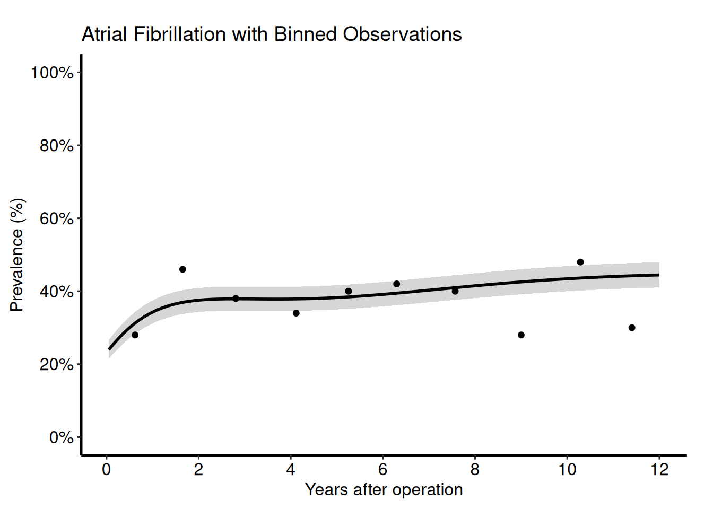

### Continuous outcome

**Ports:** `tp.np.fev.double.univariate.continuous.sas`,
`tp.np.fev.u.trend.continuous.sas`

For continuous outcomes (FEV1, AV peak gradient) set
`outcome_type = "continuous"`. The y-axis label and scale change
accordingly; everything else is identical.

``` r
dat_cont     <- sample_nonparametric_curve_data(
  n            = 400,
  time_max     = 10,
  outcome_type = "continuous"
)
dat_cont_pts <- sample_nonparametric_curve_points(
  n            = 400,
  time_max     = 10,
  outcome_type = "continuous"
)

nonparametric_curve_plot(
  dat_cont,
  lower_col   = "lower",
  upper_col   = "upper",
  data_points = dat_cont_pts
) +
  scale_x_continuous(breaks = seq(0, 10, 2)) +
  scale_y_continuous(limits = c(0, 4)) +
  labs(
    x     = "Years after operation",
    y     = expression(FEV[1] ~ (L)),
    title = "FEV\u2081 Temporal Trend"
  ) +
  annotate("text",
    x = 9, y = 3.5,
    label = "68% CI band",
    hjust = 1, size = 3
  ) +
  hvti_theme("manuscript")
```

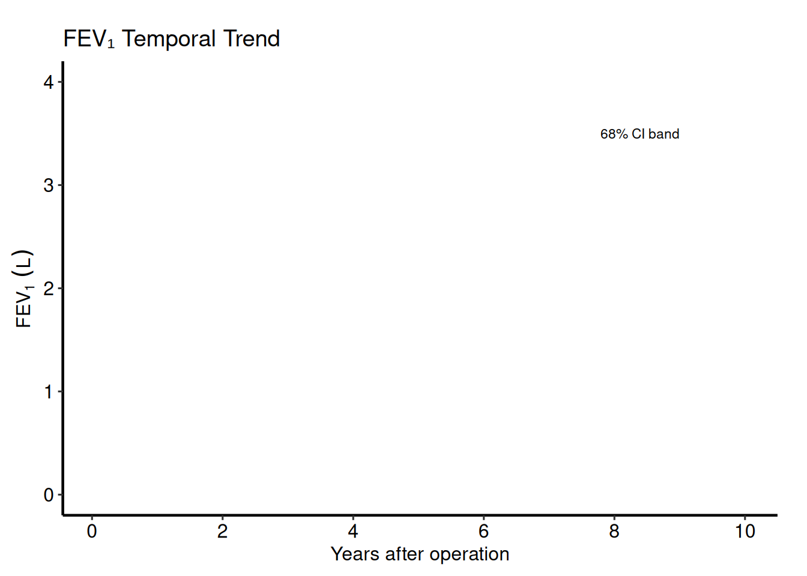

### Multi-group comparison

**Ports:** `tp.np.afib.mult.avrg_curv.binary.sas`,
`tp.np.afib.mult.pt_spec.binary.sas`,
`tp.np.avpkgrad_ozak_ind_mtwt.sas`,
`tp.np.fev.multivariate.continuous.sas`

Provide a named vector to `groups` when generating sample data, or set
`group_col` when supplying your own curve data.

``` r
grp_def <- c("Ozaki" = 0.7, "CE-Pericardial" = 1.1, "Homograft" = 1.4)
dat_grp     <- sample_nonparametric_curve_data(
  n        = 600,
  time_max = 12,
  groups   = grp_def
)
dat_grp_pts <- sample_nonparametric_curve_points(
  n        = 600,
  time_max = 12,
  groups   = grp_def
)

nonparametric_curve_plot(
  dat_grp,
  group_col   = "group",
  lower_col   = "lower",
  upper_col   = "upper",
  data_points = dat_grp_pts
) +
  scale_colour_manual(
    values = c("Ozaki" = "#003087", "CE-Pericardial" = "#CC0000", "Homograft" = "#666666")
  ) +
  scale_fill_manual(
    values = c("Ozaki" = "#003087", "CE-Pericardial" = "#CC0000", "Homograft" = "#666666")
  ) +
  scale_x_continuous(breaks = seq(0, 12, 2)) +
  scale_y_continuous(
    limits = c(0, 1),
    breaks = seq(0, 1, 0.2),
    labels = scales::percent
  ) +
  labs(
    x      = "Years after operation",
    y      = "Prevalence (%)",
    colour = "Valve type",
    fill   = "Valve type",
    title  = "Atrial Fibrillation by Valve Type"
  ) +
  hvti_theme("manuscript")
```

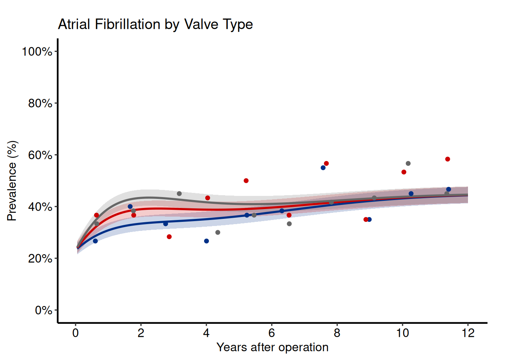

### Phase decomposition

**Ports:** `tp.np.afib.ivwristm.pt_spec_phases.binary.sas`,
`tp.np.tr.ivecho.u.phases.sas`

Phase plots separate the early (bell-shaped, incomplete hazard) and late
(Weibull CDF, complete hazard) components. Supply a `group_col` whose
levels label the phases.

``` r
dat_phase <- sample_nonparametric_curve_data(
  n      = 500,
  groups = c("Early phase" = 1.5, "Late phase" = 0.6, "Overall" = 1.0)
)

nonparametric_curve_plot(
  dat_phase,
  group_col = "group"
) +
  scale_colour_manual(
    values = c("Early phase" = "#CC0000",
               "Late phase"  = "#003087",
               "Overall"     = "black")
  ) +
  scale_linetype_manual(
    values = c("Early phase" = "dashed",
               "Late phase"  = "dashed",
               "Overall"     = "solid")
  ) +
  scale_x_continuous(breaks = seq(0, 12, 2)) +
  scale_y_continuous(
    limits = c(0, 1),
    breaks = seq(0, 1, 0.2),
    labels = scales::percent
  ) +
  labs(
    x      = "Years after operation",
    y      = "Prevalence (%)",
    colour = NULL,
    title  = "AF — Early and Late Phase Decomposition"
  ) +
  hvti_theme("manuscript")
```

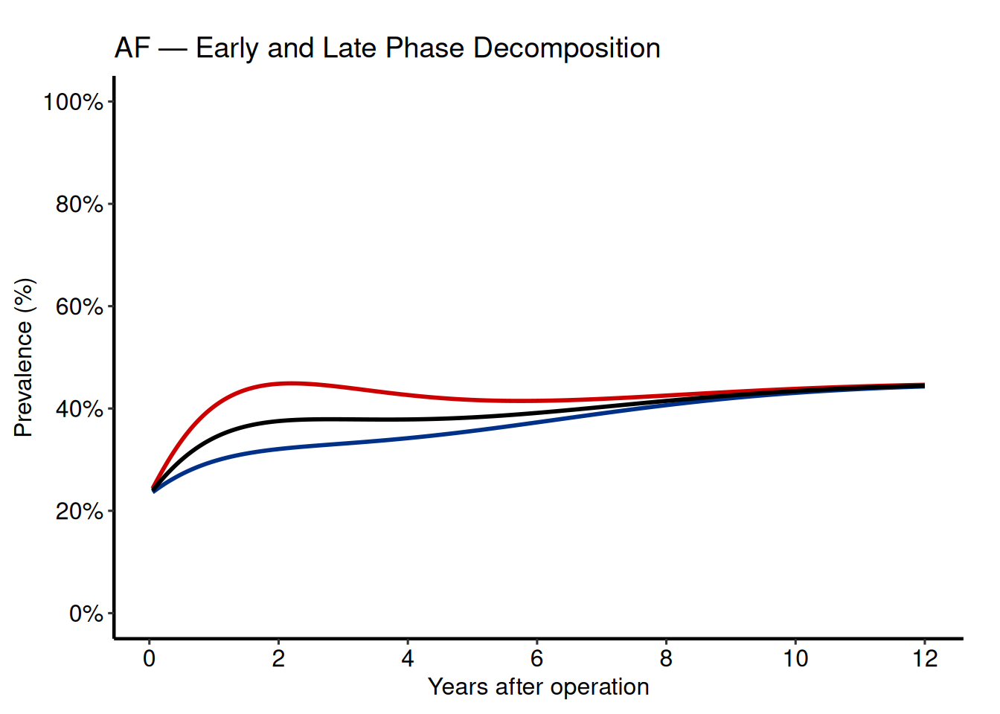

### Covariate on the x-axis

**Port:** `tp.np.z0axdpo.continuous.bmi_xaxis.sas`

When BMI or another continuous covariate (rather than time) is on the
x-axis, the function signature is identical — simply pass the covariate
column name to `x_col`.

``` r
# Simulate covariate (BMI) x-axis data
set.seed(42)
n_pts  <- 300
bmi    <- seq(18, 45, length.out = n_pts)
est    <- plogis(-3 + 0.08 * bmi)
se     <- sqrt(est * (1 - est) / 50)
bmi_curve <- data.frame(
  bmi   = bmi,
  est   = est,
  lower = pmax(0, est - qnorm(0.84) * se),
  upper = pmin(1, est + qnorm(0.84) * se)
)

nonparametric_curve_plot(
  bmi_curve,
  x_col        = "bmi",
  estimate_col = "est",
  lower_col    = "lower",
  upper_col    = "upper"
) +
  scale_x_continuous(
    breaks = seq(18, 45, 3),
    limits = c(18, 45)
  ) +
  scale_y_continuous(
    limits = c(0, 1),
    breaks = seq(0, 1, 0.1),
    labels = scales::percent
  ) +
  labs(
    x     = expression(BMI ~ (kg/m^2)),
    y     = "Estimated Probability",
    title = "Outcome Probability vs. BMI at Operation"
  ) +
  hvti_theme("manuscript")
```

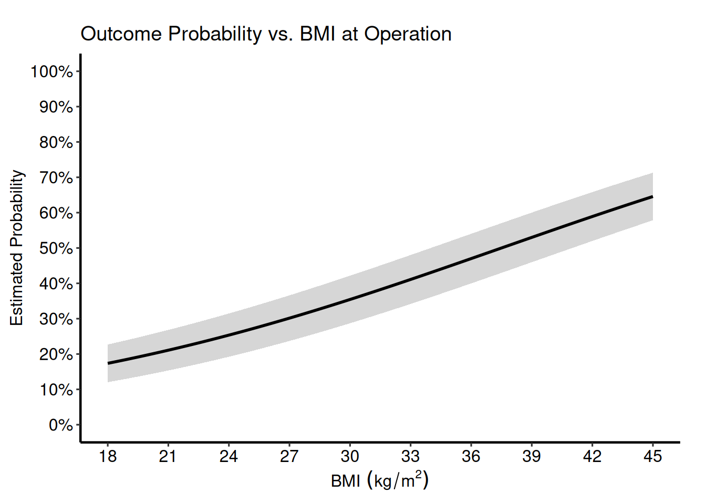

### Ordinal outcomes

**Port:** `tp.np.tr.ivecho.average_curv.ordinal.sas`

Ordinal templates (TR grade, AR grade) use
[`nonparametric_ordinal_plot()`](https://ehrlinger.github.io/hvtiPlotR/reference/nonparametric_ordinal_plot.md).
The critical migration step is reshaping the SAS wide-format `predict`
dataset (one column per grade) to long format.

**SAS reshape (do this before reading into R):**

``` sas
/* SAS wide format: p0, p1, p2, p3 */
data predict_wide;
  set predict;
run;
```

**R reshape:**

``` r
library(tidyr)
long <- pivot_longer(
  predict_wide,
  cols      = c(p0, p1, p2, p3),
  names_to  = "grade",
  values_to = "estimate"
)
```

``` r
ord_labels <- c("None", "Mild", "Moderate", "Severe")
dat_ord     <- sample_nonparametric_ordinal_data(
  n            = 1000,
  time_max     = 5,
  grade_labels = ord_labels
)
dat_ord_pts <- sample_nonparametric_ordinal_points(
  n            = 1000,
  time_max     = 5,
  grade_labels = ord_labels
)

nonparametric_ordinal_plot(
  dat_ord,
  grade_col   = "grade",
  data_points = dat_ord_pts
) +
  scale_colour_manual(
    values = c(
      "None"     = "#003087",
      "Mild"     = "#55A51C",
      "Moderate" = "#FFA500",
      "Severe"   = "#CC0000"
    )
  ) +
  scale_x_continuous(breaks = 0:5) +
  scale_y_continuous(
    limits = c(0, 1),
    breaks = seq(0, 1, 0.2),
    labels = scales::percent
  ) +
  labs(
    x      = "Years after operation",
    y      = "Grade probability",
    colour = "TR Grade",
    title  = "Tricuspid Regurgitation Grade"
  ) +
  hvti_theme("manuscript")
```

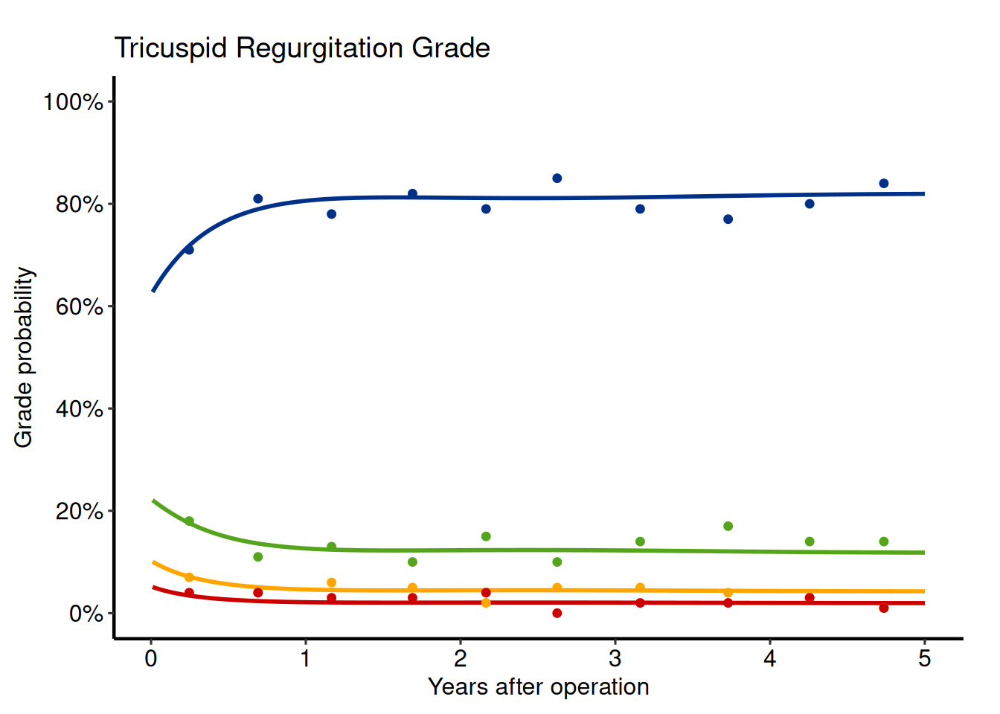

#### Ordinal multi-scenario comparison

**Port:** `tp.np.po_ar.u_multi.ordinal.sas`

``` r
dat_ar1 <- sample_nonparametric_ordinal_data(seed = 1)
dat_ar2 <- sample_nonparametric_ordinal_data(seed = 99)

dat_ar1$scenario <- "Before repair"
dat_ar2$scenario <- "After repair"
combined <- rbind(dat_ar1, dat_ar2)

nonparametric_ordinal_plot(combined, grade_col = "grade") +
  facet_wrap(~scenario) +
  scale_x_continuous(breaks = 0:5) +
  scale_y_continuous(
    limits = c(0, 1),
    labels = scales::percent
  ) +
  labs(
    x      = "Years",
    y      = "Grade probability",
    colour = "AR Grade",
    title  = "AR Grade — Before vs. After Repair"
  ) +
  hvti_theme("manuscript")
```

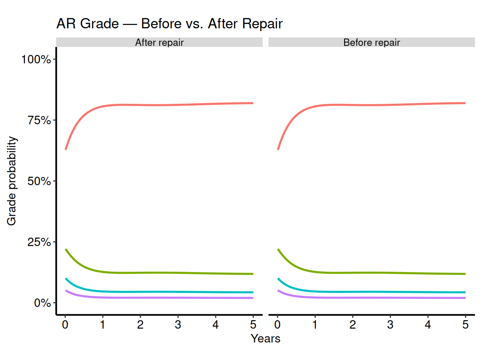

#### Ordinal phase independence

**Port:** `tp.np.tr.ivecho.independence.sas`

To examine a single grade in isolation, filter the long-format curve
before passing it to the function:

``` r
dat_ind    <- sample_nonparametric_ordinal_data(n = 800)
pts_ind    <- sample_nonparametric_ordinal_points(n = 800)
grade_2    <- dat_ind[dat_ind$grade == "Grade 2", ]
dp_grade_2 <- pts_ind[pts_ind$grade == "Grade 2", ]

nonparametric_ordinal_plot(
  grade_2,
  grade_col   = "grade",
  data_points = dp_grade_2
) +
  scale_colour_manual(values = c("Grade 2" = "#CC0000")) +
  scale_x_continuous(breaks = seq(0, 5, 1)) +
  scale_y_continuous(
    limits = c(0, 0.5),
    labels = scales::percent
  ) +
  labs(
    x     = "Years after operation",
    y     = "Probability",
    title = "Probability of TR Grade 2"
  ) +
  hvti_theme("manuscript")
```

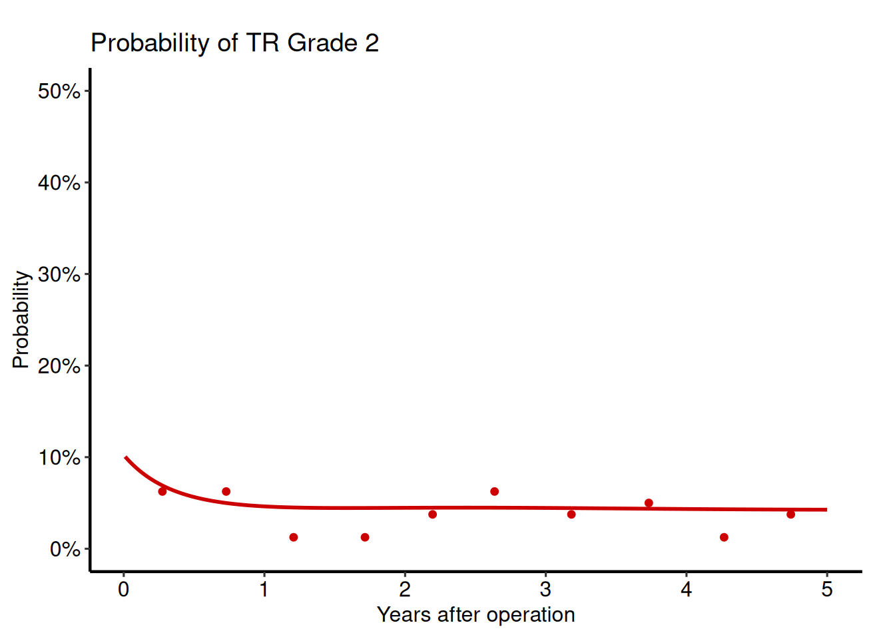

#### Ordinal phases

**Port:** `tp.np.tr.ivecho.u.phases.sas`

Phase-decomposed ordinal plots combine phase labels with grade colours.
Create the figure by plotting grade-specific curves and annotating early
vs. late phase regions:

``` r
dat_ph <- sample_nonparametric_ordinal_data(n = 800, seed = 7)

nonparametric_ordinal_plot(dat_ph, grade_col = "grade") +
  annotate("rect",
    xmin = 0, xmax = 2,  ymin = -Inf, ymax = Inf,
    fill = "steelblue", alpha = 0.07
  ) +
  annotate("text",
    x = 1, y = 0.95, label = "Early\nphase",
    size = 3, colour = "steelblue", fontface = "italic"
  ) +
  annotate("rect",
    xmin = 2, xmax = 5, ymin = -Inf, ymax = Inf,
    fill = "tomato", alpha = 0.07
  ) +
  annotate("text",
    x = 3.5, y = 0.95, label = "Late\nphase",
    size = 3, colour = "tomato", fontface = "italic"
  ) +
  scale_x_continuous(breaks = 0:5) +
  scale_y_continuous(labels = scales::percent) +
  labs(
    x      = "Years after operation",
    y      = "Grade probability",
    colour = "TR Grade",
    title  = "TR Grade — Early and Late Phase"
  ) +
  hvti_theme("manuscript")
```

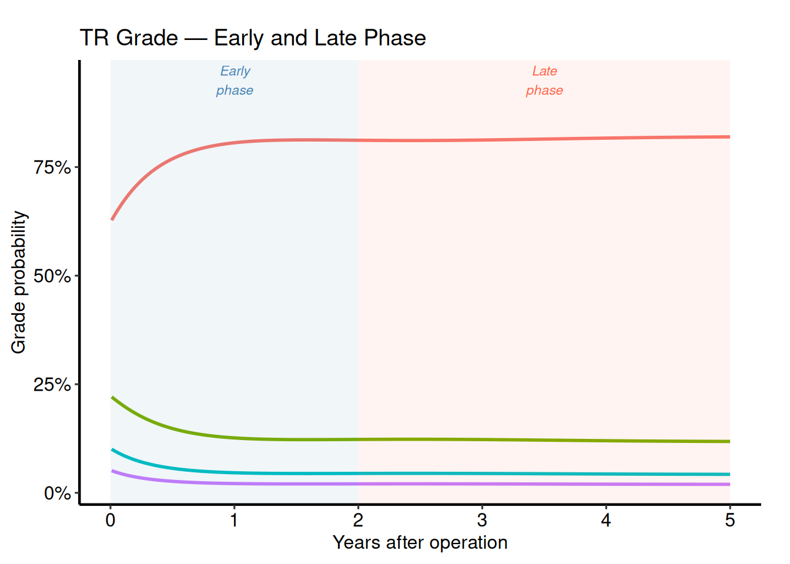

------------------------------------------------------------------------

## Survival analysis (`tp.ac.dead.*`, `tp.cp.dead.*`)

**Ports:** `tp.ac.dead.sas`, `tp.cp.dead.sas`

**R equivalent:**
[`survival_curve()`](https://ehrlinger.github.io/hvtiPlotR/reference/survival_curve.md)

[`survival_curve()`](https://ehrlinger.github.io/hvtiPlotR/reference/survival_curve.md)
wraps `survfit()` from the **survival** package and returns a named list
of ggplot objects matching the SAS `%kaplan` / `%nelsont` macro output
flags (`PLOTS`, `PLOTC`, `PLOTH`, `PLOTL`).

``` r
dta    <- sample_survival_data(n = 500, seed = 42)
result <- survival_curve(dta)

# Kaplan–Meier survival (PLOTS)
result$survival_plot +
  scale_y_continuous(
    breaks = seq(0, 100, 20),
    labels = function(x) paste0(x, "%")
  ) +
  scale_x_continuous(breaks = seq(0, 20, 5)) +
  coord_cartesian(xlim = c(0, 20), ylim = c(0, 100)) +
  labs(
    x     = "Years after operation",
    y     = "Survival (%)",
    title = "Freedom from Death"
  ) +
  hvti_theme("manuscript")
```

#### SAS → R argument mapping

| SAS `%kaplan` option | R argument                | Notes                              |
|----------------------|---------------------------|------------------------------------|
| `data=`              | `data`                    | Patient-level data frame           |
| `time=`              | `time_col`                | Time-to-event column name          |
| `event=`             | `event_col`               | Event indicator column (1 = event) |
| `group=`             | `group_col`               | Stratification variable            |
| `method=kaplan`      | `method = "kaplan-meier"` | Default                            |
| `method=nelsont`     | `method = "nelson-aalen"` | Fleming–Harrington                 |
| `alpha=0.05`         | `conf_int = 0.95`         | 1 – alpha                          |
| `tp=0 1 2 3 5 7 10`  | `report_times`            | Table time points                  |

------------------------------------------------------------------------

## Goodness of follow-up (`tp.dp.gfup.R`)

**Port:** `tp.dp.gfup.R`

**R equivalent:**
[`goodness_followup()`](https://ehrlinger.github.io/hvtiPlotR/reference/goodness_followup.md)

``` r
dta <- sample_goodness_followup_data(n = 300)

goodness_followup(dta) +
  labs(title = "Goodness of Follow-Up") +
  hvti_theme("manuscript")
```

------------------------------------------------------------------------

## Covariate balance (`tp.lp.propen.cov_balance.R`)

**Port:** `tp.lp.propen.cov_balance.R`

**R equivalent:**
[`covariate_balance()`](https://ehrlinger.github.io/hvtiPlotR/reference/covariate_balance.md)

``` r
dta <- sample_covariate_balance_data(n_vars = 15)

covariate_balance(dta) +
  labs(title = "Standardised Mean Differences Before and After Matching") +
  hvti_theme("manuscript")
```

------------------------------------------------------------------------

## Alluvial flow (`tp.dp.female_bicus_preAR_sankey.R`)

**Port:** `tp.dp.female_bicus_preAR_sankey.R`

**R equivalent:**
[`alluvial_plot()`](https://ehrlinger.github.io/hvtiPlotR/reference/alluvial_plot.md)

``` r
dta <- sample_alluvial_data(n = 200)

alluvial_plot(dta, show_labels = TRUE) +
  scale_fill_brewer(palette = "Set2") +
  labs(title = "Patient Flow Between States") +
  hvti_theme("manuscript")
```

------------------------------------------------------------------------

## UpSet plot (`tp.complexUpset.R`)

**Port:** `tp.complexUpset.R`

**R equivalent:**
[`upset_plot()`](https://ehrlinger.github.io/hvtiPlotR/reference/upset_plot.md)

``` r
sets <- c("CABG", "Valve", "MAZE", "Aorta")
dta  <- sample_upset_data(n = 300, sets = sets)

upset_plot(data = dta, intersect = sets)
```

------------------------------------------------------------------------

## Spaghetti / individual trajectories (`tp.dp.spaghetti.echo.R`)

**Port:** `tp.dp.spaghetti.echo.R`

**R equivalent:**
[`spaghetti_plot()`](https://ehrlinger.github.io/hvtiPlotR/reference/spaghetti_plot.md)

``` r
dta <- sample_spaghetti_data(n_patients = 60, n_visits = 5)

spaghetti_plot(dta) +
  scale_colour_viridis_c(option = "plasma") +
  labs(
    x      = "Years after operation",
    y      = "LVEF (%)",
    colour = "Age",
    title  = "Individual LV Ejection Fraction Trajectories"
  ) +
  hvti_theme("manuscript")
```

------------------------------------------------------------------------

## Trends over time (`tp.dp.trends.R`)

**Port:** `tp.dp.trends.R`

**R equivalent:**
[`trends_plot()`](https://ehrlinger.github.io/hvtiPlotR/reference/trends_plot.md)

``` r
dta <- sample_trends_data(n = 200)

trends_plot(dta) +
  scale_fill_brewer(palette = "Blues") +
  labs(
    x     = "Operation year",
    y     = "Count",
    fill  = "Procedure",
    title = "Procedure Volume by Year"
  ) +
  hvti_theme("manuscript")
```

------------------------------------------------------------------------

## Longitudinal patient counts (`tp.dp.longitudinal_patients_measures.R`)

**Port:** `tp.dp.longitudinal_patients_measures.R`

**R equivalent:**
[`longitudinal_counts_plot()`](https://ehrlinger.github.io/hvtiPlotR/reference/longitudinal_counts_plot.md)

``` r
dta <- sample_longitudinal_counts_data(n_patients = 150)

longitudinal_counts_plot(dta) +
  scale_x_continuous(breaks = 0:10) +
  labs(
    x     = "Years after operation",
    y     = "Patients with measurement",
    title = "Follow-Up Echocardiogram Availability"
  ) +
  hvti_theme("manuscript")
```

------------------------------------------------------------------------

## Mirror histogram (propensity score)

**R equivalent:**
[`mirror_histogram()`](https://ehrlinger.github.io/hvtiPlotR/reference/mirror_histogram.md)

Used for propensity score overlap plots before and after matching or
weighting. No direct SAS template equivalent — this replaces ad-hoc SAS
histogram code common in propensity analyses.

``` r
dta <- sample_mirror_histogram_data(n = 400)

mirror_histogram(dta) +
  scale_x_continuous(limits = c(0, 1), breaks = seq(0, 1, 0.1)) +
  labs(
    x     = "Propensity score",
    y     = "Count",
    title = "Propensity Score Distribution Before and After Matching"
  ) +
  hvti_theme("manuscript")
```

------------------------------------------------------------------------

## Stacked histogram

**R equivalent:**
[`stacked_histogram()`](https://ehrlinger.github.io/hvtiPlotR/reference/stacked_histogram.md)

``` r
dta <- sample_stacked_histogram_data()

stacked_histogram(dta) +
  scale_fill_brewer(palette = "Set1") +
  labs(
    x     = "Operation year",
    y     = "Count",
    fill  = "Group",
    title = "Annual Case Volume by Group"
  ) +
  hvti_theme("manuscript")
```

------------------------------------------------------------------------

## Using themes

All plot functions return an unstyled ggplot object. Add a theme as the
final layer:

| Context                | Call                       | Equivalent SAS device              |
|------------------------|----------------------------|------------------------------------|
| Dark PowerPoint slide  | `hvti_theme("dark_ppt")`   | `device=ppt`                       |
| Light PowerPoint slide | `hvti_theme("light_ppt")`  | `device=ppt` with white background |
| Journal manuscript     | `hvti_theme("manuscript")` | `device=eps` / PDF                 |
| Conference poster      | `hvti_theme("poster")`     | Large-font poster                  |

You can pass `base_size` to any theme to scale all text simultaneously:

``` r
p + hvti_theme("manuscript", base_size = 10)   # smaller text for double-column
p + hvti_theme("poster",     base_size = 24)   # larger text for A0 poster
```

------------------------------------------------------------------------

## Saving figures

### PowerPoint

``` r
save_ppt(p, file = "figures/afib_prevalence.pptx")
```

### PDF / TIFF for journals

``` r
ggsave("figures/afib_prevalence.pdf",  p, width = 3.5, height = 3.5, units = "in")
ggsave("figures/afib_prevalence.tiff", p, width = 3.5, height = 3.5,
       units = "in", dpi = 600)
```

------------------------------------------------------------------------

## Adding new ports

As additional SAS templates are ported to R, update this guide:

1.  **Add a row** to the lookup table at the top of this file with the
    SAS template name, family prefix, R function, and section anchor.

2.  **Add a section** following the existing pattern: name the port,
    describe the SAS workflow, show the R equivalent with a runnable
    example, and document any column name mapping differences.

3.  **Register the new R function** in `R/generics.R` under
    [`hvti_plot()`](https://ehrlinger.github.io/hvtiPlotR/reference/hvti_plot.md)
    if it is a new plot type.

4.  **Update `DESCRIPTION`** if a new package dependency is required.

Templates currently planned for porting:

- `tp.hp.dead.*` hazard-function plots →
  [`hazard_plot()`](https://ehrlinger.github.io/hvtiPlotR/reference/hazard_plot.md)
  (pending)
- `tp.ce.states.*` competing-events / state-occupancy → (pending)
- `tp.gp.*` grouped longitudinal ordinal models → (pending)

------------------------------------------------------------------------

## Session info

``` r
sessionInfo()
```

    R version 4.5.3 (2026-03-11)
    Platform: x86_64-pc-linux-gnu
    Running under: Ubuntu 24.04.3 LTS

    Matrix products: default
    BLAS:   /usr/lib/x86_64-linux-gnu/openblas-pthread/libblas.so.3
    LAPACK: /usr/lib/x86_64-linux-gnu/openblas-pthread/libopenblasp-r0.3.26.so;  LAPACK version 3.12.0

    locale:
     [1] LC_CTYPE=C.UTF-8       LC_NUMERIC=C           LC_TIME=C.UTF-8
     [4] LC_COLLATE=C.UTF-8     LC_MONETARY=C.UTF-8    LC_MESSAGES=C.UTF-8
     [7] LC_PAPER=C.UTF-8       LC_NAME=C              LC_ADDRESS=C
    [10] LC_TELEPHONE=C         LC_MEASUREMENT=C.UTF-8 LC_IDENTIFICATION=C

    time zone: UTC
    tzcode source: system (glibc)

    attached base packages:
    [1] stats     graphics  grDevices utils     datasets  methods   base

    other attached packages:
    [1] ggplot2_4.0.2        hvtiPlotR_2.0.0.9000

    loaded via a namespace (and not attached):
     [1] generics_0.1.4          tidyr_1.3.2             fontLiberation_0.1.0
     [4] xml2_1.5.2              lattice_0.22-9          digest_0.6.39
     [7] magrittr_2.0.4          evaluate_1.0.5          grid_4.5.3
    [10] RColorBrewer_1.1-3      fastmap_1.2.0           Matrix_1.7-4
    [13] jsonlite_2.0.0          zip_2.3.3               survival_3.8-6
    [16] purrr_1.2.1             scales_1.4.0            fontBitstreamVera_0.1.1
    [19] textshaping_1.0.5       cli_3.6.5               rlang_1.1.7
    [22] fontquiver_0.2.1        splines_4.5.3           withr_3.0.2
    [25] yaml_2.3.12             otel_0.2.0              gdtools_0.5.0
    [28] tools_4.5.3             officer_0.7.3           uuid_1.2-2
    [31] dplyr_1.2.0             colorspace_2.1-2        ComplexUpset_1.3.3
    [34] vctrs_0.7.1             R6_2.6.1                lifecycle_1.0.5
    [37] ragg_1.5.1              pkgconfig_2.0.3         pillar_1.11.1
    [40] gtable_0.3.6            glue_1.8.0              Rcpp_1.1.1
    [43] systemfonts_1.3.2       xfun_0.56               rvg_0.4.1
    [46] tibble_3.3.1            tidyselect_1.2.1        knitr_1.51
    [49] farver_2.1.2            htmltools_0.5.9         patchwork_1.3.2
    [52] labeling_0.4.3          rmarkdown_2.30          ggalluvial_0.12.6
    [55] compiler_4.5.3          S7_0.2.1                askpass_1.2.1
    [58] openssl_2.3.5          
