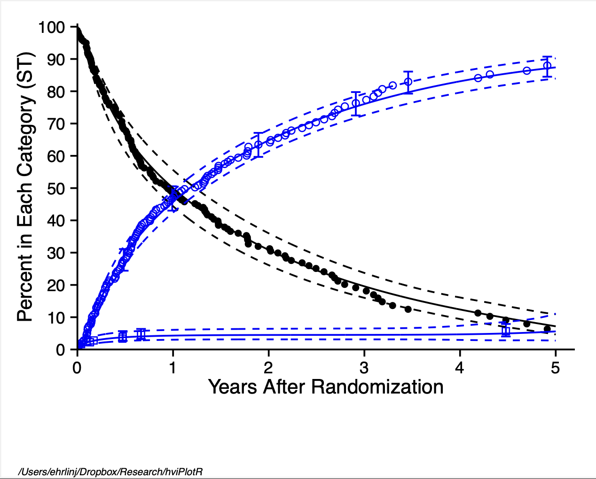

# Abstract

We introduce the R package **hvtiPlotR**, tools for creating publication quality graphics in R for the Heart & Vascular Institute Cardiovascular Outcomes Registries and Research (CORR) statistics group at the Cleveland Clinic. The **hvtiPlotR** package contains a tutorial for generating figures (this vignette) and small set of functions for formatting and saving those figures. These tools describe how to generate figures in R to replace the `plot.sas` macro we currently use in SAS.

This package vignette is a tutorial for generating our standard figures using the `ggplot2` package commands in R. The tutorial presents a series of R recipes for generating figures. The **hvtiPlotR** package includes a set of themes designed to format those figures for inclusion in manuscript and PowerPoint targets.

This document is included with the **hvtiPlotR** package as a package vignette. The vignette is installed into R when the **hvtiPlotR** package is installed, and viewable using the command: `vignette("hvtiPlotR", package="hvtiPlotR")`.

The goal of the vignette is as a tutorial to document the best practices of creating our publication quality graphics for both manuscripts and power point presentations. It is our intent to update this vignette as our standards and the **hvtiPlotR** package are modified.

Keywords: *publication graphics, powerpoint, ggplot2, plot.sas*.

Companion vignettes cover individual plot functions ([hvtiPlotR Plot Functions](plot-functions.html)) and plot decoration and saving ([Decorating and Saving hvtiPlotR Plots](plot-decorators.html)).

# About this document

This package vignette is an introduction to the R package **hvtiPlotR**, and a tutorial for creating publication quality graphics in R. The package and this document describe the process of creating graphics in R that conform to the standards of the clinical investigations statistics group within The Heart & Vascular Institute (HVTI) at the Cleveland Clinic. These graphics are analogous to those generated with the `plot.sas` macro in SAS.

The document is a package vignette for the **hvtiPlotR** package, and is the primary documentation for the package. The latest version of the document can be obtained with the following command:

`vignette("hvtiPlotR", package = "hvtiPlotR")`

The goal is to update this vignette as the package, and our graphing standards, are updated. A development version of the **hvtiPlotR** package is also available on Github (https://github.com/ehrlinger/hvtiPlotR)

The package can be installed using `remotes::install_github("ehrlinger/hvtiPlotR")`

We invite comments, feature requests and bug reports for this package at https://github.com/ehrlinger/hvtiPlotR/issues

 **Figure 1:** Demonstration figure

# Introduction

For many years, the mainstay for generating graphics for manuscripts and presentations in the statistics group in The Heart & Vascular Institute has been the `plot.sas` macro using SAS. However, we have had issues migrating this macro to newer versions of SAS (\> 8.0) and Microsoft Office products (\> 2003).

In an effort to alleviate these version issues, and to standardize the generation of figures within R, we have developed the **hvtiPlotR** R package. The goal of the package, and this vignette, is simplify the creation of publication quality graphics in R. We are specifically encoding the best practices of the HVTI Clinical Outcomes Research and Registries (CORR) formatting, so that our statisticians will be able to create graphics for publications and presentations with a minimal amount of effort.

The **hvtiPlotR** package implements best practices for R graphics by leveraging the `ggplot2` package (Wickham 2009). The `ggplot2` package is an implementation of the Grammar of Graphics (Wilkinson 2005), which is a formalization of graphical concepts, and the building of graphical objects from a sequence of independent components. These components can be combined in many different ways.

The `plot.sas` macro is also an implementation of a graphics grammar. The grammar `plot.sas` is derived from the ZETA pen plotters, which used GML (Graphics Machine Language) to control between 4 and and 8 colored pens for generating color line and point figures.

``` sas
%let STUDY=/studies/cardiac/valves/aortic/replacement/partner_publication_office/partner1b/mortality_5y
*****************************************************************************;
* Bring in PostScript plot macro ;
filename plt "! MACROS /plot.sas "; %inc plt;
filename gsasfile pipe 'lp ';
*____________________________________________________________________________;
* ;
* P O S T S C R I P T P L O T S
*____________________________________________________________________________;
* Multiple decrement , nonparametric and parametric ;
filename gsasfile "&STUDY / graphs /ce. states .ST.ps";
*____________________________________________________________________________;
* Create the figure here ! ;
*____________________________________________________________________________;
%plot( goptions gsfmode =replace , device =pscolor , gaccess = gsasfile end;
id l="&STUDY / graphs /ce. states .ST.sas percent ", end;
labelx l=" Years After Randomization ", end;
axisx order =(0 to 5 by 1), minor=none , end;
labely l=" Percent in Each Category (ST)", end;
axisy order =(0 to 100 by 10) , minor=none , end;
```

**Listing 1:** `plot.sas` commands: Figure setup.

Because both systems use a graphics language it is a straight forward exercise to translate commands between the two systems.

This document outlines how to generate figures using the `ggplot2` package in **R**. Our approach is to demonstrate the **R** commands to generate the same elements created with `plot.sas` commands. Section 2 gives an overview of the methodology of the `plot.sas` macro and

Section 3 details how to create line and point plots with similar `ggplot2` commands. The **hvtiPlotR** package contains custom themes for figures. Once a figure has been created using `ggplot2` commands, Section 4 details how to use the themes contained in the **hvtiPlotR** package to get the formatting correct for manuscripts or presentations. Section 5 describes how to save these figures to simplify the import into publication documents.

# The `plot.sas` macro

We first look at some example code using the `plot.sas` macro. This code is intended to generate a figure for manuscript publication and was modified to generate Figure 1. We will walk through this example code in this section to help us understand the steps for generating these figures in R.

Note the first line of the code block in Listing 1 indicates the path to the specific example file location. The filename statements bring in the `plot.sas` macro, indicate how to print, and where to save the graphics file. The `plot.sas` macro call starts with the %plot command.

The goptions statement in the first line sets global graphic values, including the filename (`gaccess=`) where the figure will be saved (see Section 5). Each plot.sas command is terminated with the end; statement. We'll look at each of the remaining command type individually.

``` sas
******NON - PARAMETRIC : SYMBOLS AND CONFIDENCE BARS *******
tuple set=green , symbol =dot , symbsize =1/2, linepe =0, linecl =0,
  ebarsize =3/4, ebar =1, x=iv_state , y=sginit , cll=stlinit , 
  clu=stuinit , color=black , 
  end;

tuple set=green , symbol =circle , symbsize =1/2, linepe =0, linecl =0, 
  ebarsize =3/4, ebar =1, x=iv \_state , y=sgdead1 , cll=stldead1 , 
  clu=studead1 , color=blue , end; tuple set=green , symbol =square , 
  symbsize =1/2, linepe =0, linecl =0, ebarsize =3/4, ebar =1, 
  x=iv_state , y=sgstrk1 , cll=stlstrk1 , clu=stustrk1 , color=blue , 
  end; 
```

**Listing 2:** `plot.sas` commands: points and errorbar tuple statements.

``` sas
/********** PARAMETRIC : SOLID LINES AND CONFIDENCE INTERVALS **********
tuple set=all , x=years , y=noinit , cll=clinit , clu=cuinit , width =0.5 , 
  color=black , end; tuple set=all , x=years , y=nodeath , cll=cldeath , 
  clu=cudeath , width =0.5 , color=blue , end; tuple set=all , x=years , 
  y=nostrk , cll=clstrk , clu=custrk , linecl =2, width =0.5 , color=blue , 
  end;
```

**Listing 3:** `plot.sas` commands: lines tuple statements.

The `id l=` command sets the footnote text used for manuscript figures to identify where the figure is saved (see Section 5). The `labelx` and `labely` commands set the axis label text (Section 3.3) and the `axisx` and `axisy` set the scales for each axis locating text and tics (Section 3.4).

The `plot.sas` continues in Listing 2. Here, the tuple command builds up graphics objects within the figure plot window. This first set of tuple commands constructs a set of three elements containing both points (Section 3.5) and errorbars (Section 3.6). Each tuple statement operates on the dataset indicated by the set command. Symbols shapes and sizes are specified with the symbol and symbsize commands (Section 3.9).

The second set of tuple statements in Listing 3 construct a set of three elements containing lines and confidence intervals (Section 3.7).

The `plot.sas1` macro code is closed by the ending ); characters, and SAS is instructed to run; the code. Running combines building the figure by combining elements from label, axis and tuple statements and saving it into the file specified by the gsasfile variable. The resulting figure is shown in Figure 2.

 **Figure 2:** Manuscript figure (SAS version)

Note that much of the figure formatting is mixed within the tuple statements using width, color, linepe and linecl commands. In the `plot.sas` macro, omitting these commands will generate a figure with the default values specified within the `plot.sas` macro or device theme (Section 4).

A similar set of `plot.sas` commands (Listing 4) is used to create presentation graphics. Differences between manuscript and presentation graphics include the target device and ftext as well as some handling of figure labels with value instead of label commands. The output from this code is shown in Figure 3.

In addition to the plot.sas commands, we also have a set of graphics standards (graphics rules) for what to and not to include in presentation graphics, we will describe these rules in (Section 6). Many of these are incorporated into the `plot.sas` macro to protect the user from violating these standards.

# SAS → R Quick Reference

The table below maps every `plot.sas` command type to its ggplot2 / hvtiPlotR
equivalent. Use it as a look-up when converting an existing SAS script.

## Structure and output

| `plot.sas` command | R / ggplot2 equivalent | Notes |
|---|---|---|
| `%plot(goptions device=pscolor, ...)` | `ggsave(filename = "fig.pdf", width = 11, height = 8.5)` | Manuscript PDF |
| `%plot(goptions device=cgmmppa, ...)` | `save_ppt(object = p, template = ..., powerpoint = ...)` | Editable PPT vector |
| `gaccess=gsasfile "path/file.ps"` | `ggsave(filename = here::here("graphs", "fig.pdf"), ...)` | Output file path |
| `id l="path/file"` | `labs(caption = getwd())` or `make_footnote()` | Figure footnote / path label |

## Axis labels and scales

| `plot.sas` command | R / ggplot2 equivalent | Notes |
|---|---|---|
| `labelx l="Years After Operation"` | `labs(x = "Years After Operation")` | x-axis title |
| `labely l="Freedom from Event (%)"` | `labs(y = "Freedom from Event (%)")` | y-axis title |
| `axisx order=(0 to 10 by 2), minor=none` | `scale_x_continuous(limits = c(0,10), breaks = seq(0,10,2))` | x scale + tick positions |
| `axisy order=(0 to 100 by 20), minor=none` | `scale_y_continuous(limits = c(0,100), breaks = seq(0,100,20))` | y scale + tick positions |
| `coord_cartesian(xlim=c(0,5.1), ylim=c(0,101))` | `coord_cartesian(xlim = c(0, 5.1), ylim = c(0, 101))` | Viewport crop without data loss |

## Tuple statements — points and error bars

| `plot.sas` option | R / ggplot2 equivalent | Notes |
|---|---|---|
| `tuple set=..., x=t, y=est, cll=lo, clu=hi` | `nonparametric_curve_plot(curve_data, lower_col="lo", upper_col="hi")` | Preferred hvtiPlotR function |
| `symbol=dot` | `geom_point(shape = 20)` | Filled circle |
| `symbol=circle` | `geom_point(shape = 1)` | Open circle |
| `symbol=square` | `geom_point(shape = 15)` | Filled square |
| `symbol=diamond` | `geom_point(shape = 18)` | Filled diamond |
| `symbsize=1/2` | `size = 2.0` in `geom_point()` | Point diameter (different scale) |
| `ebar=1, ebarsize=3/4` | `geom_errorbar(aes(ymin=lo, ymax=hi), width=0.3)` | Confidence error bars |
| `linepe=0` (no connecting line) | omit `geom_line()` | Points only |

## Tuple statements — lines and ribbons

| `plot.sas` option | R / ggplot2 equivalent | Notes |
|---|---|---|
| `tuple set=..., x=t, y=est, cll=lo, clu=hi` | `geom_line() + geom_ribbon(aes(ymin=lo, ymax=hi), alpha=0.2)` | Line + CI ribbon |
| `width=3` (thick line) | `linewidth = 1.2` in `geom_line()` | ggplot2 uses a different scale |
| `width=0.5` (thin line) | `linewidth = 0.5` | |
| `color=black` | `colour = "black"` or `scale_colour_manual(values = ...)` | Explicit colour |
| `color=blue` | `colour = "steelblue"` | Use ColorBrewer for multi-group |
| `linecl=2` (dashed) | `linetype = "dashed"` or `scale_linetype_manual(values = ...)` | Line type |
| `linecl=0` (solid) | `linetype = "solid"` (default) | |

## Symbols and colours reference

| `plot.sas` `symbol=` value | ggplot2 `shape =` integer |
|---|---|
| `dot` | `20` (filled circle, no border) |
| `circle` | `1` (open circle) |
| `square` | `15` (filled square) |
| `triangle` | `17` (filled triangle up) |
| `diamond` | `18` (filled diamond) |
| `plus` | `3` |
| `x` | `4` |

For multi-group figures use `scale_shape_manual(values = c(...))` to assign
shapes to named factor levels rather than setting `shape =` directly.

## Device and theme mapping

| `plot.sas` device | hvtiPlotR theme | Use for |
|---|---|---|
| `device=pscolor` | `hv_theme("manuscript")` | Journal PDF, black on white |
| `device=cgmmppa` + dark slide | `hv_theme("dark_ppt")` | Dark-background PowerPoint |
| `device=cgmmppa` + white slide | `hv_theme("light_ppt")` | Light/transparent PowerPoint |
| — | `hv_theme("poster")` | Conference poster (larger text) |

# Generating ggplot2 graphics

In order to create figures similar to using `plot.sas` macro, using R, we will make extensive use of the ggplot2 package. This will require translating from the graphics language of plot.sas to the graphics language of ggplot2.

For the remainder of this document, R code will be highlighted in grey boxes, as shown below. We will refer to these blocks as code chunks. You can run each code chunk individually, using copy/paste into an interactive R session, or within a stand alone R script. This tutorial requires the **hvtiPlotR** package to load the data and themes we will be discussing.

``` sas
*_____________________________________________________________________;
* C G M F I L E S F O R P O W E R P O I N T S L I D E S *_____________________________________________________________________ 
* Competing risks , parametric only ;  
filename gsasfile "&STUDY/graphs/ce.states.ST.cgm ";  
%plot(goptions gsfmode =replace , device =cgmmppa , ftext=hwcgm001 , end;    
  axisx order =(0 to 5 by 1), minor=none , value =( height =2.4) , end;   
  axisy order =(0 to 100 by 20) , minor=none , value =( height =2.4) ,
    value =( height =2.4 j=r ' ' '20 ' '40' '60 ' '80 ' '100 '), end;
  tuple set=all , x=years , y=noinit , width =3, color=gray , end;
  tuple set=all , x=years , y=nostrk , width =3, color=red , end;
  tuple set=all , x=years , y=nodeath , width =3, color=blue , end; 
);
run;
```
**Listing 4:** `plot.sas` commands: PowerPoint graphics using CGM instructions.

The legacy PowerPoint figure image is not bundled with this repository. The
equivalent R rendering workflow is shown below in the PowerPoint example.

You can install the package with the following commands:

```r
# Install from GitHub using the remotes package
install.packages("remotes")   # if not already installed
remotes::install_github("ehrlinger/hvtiPlotR")
```

## Importing the data

For most of this document, we assume that the data analysis has been completed
in SAS. The first step in creating figures in R is to get the data out of SAS.
There are two common approaches.

### Option 1 — SAS xport file (recommended when you have SAS access)

Use the **haven** package (included in **hvtiPlotR**'s `Suggests`) to read
SAS xport (`.xpt`) files. It preserves variable labels as a `label` attribute
on each column, which is accessible with `attr(dta$varname, "label")`.

```r
library(haven)

# Read the xport file — variable labels are stored as column attributes
dtFilename <- system.file("extdata", "par_cst.xpt", package = "hvtiPlotR")
dta <- haven::read_xpt(dtFilename)

# Extract labels into a named character vector for use in labs() calls
dta_labels <- sapply(dta, function(col) {
  lbl <- attr(col, "label")
  if (is.null(lbl) || nchar(trimws(lbl)) == 0) NA_character_ else lbl
})
# dta_labels["years"]  →  "Years after operation"
```

`haven` also reads SAS7BDAT files directly with `haven::read_sas()`, which is
the most convenient route when the SAS server is accessible:

```r
dta <- haven::read_sas("path/to/analysis.sas7bdat")
```

### Option 2 — CSV export (when SAS is not available)

Export the summary dataset from SAS using `PROC EXPORT`:

```sas
proc export data=mean_curv
  outfile="&STUDY/graphs/mean_curv.csv"
  dbms=csv replace;
run;
```

Then read it in R:

```r
dta <- read.csv(here::here("graphs", "mean_curv.csv"))
```

This is the simplest approach and works well for the pre-computed summary
datasets expected by **hvtiPlotR** constructors (e.g., `hv_nonparametric()`,
`hazard_plot()`).

### Using the bundled example data

**hvtiPlotR** ships two example xport files for testing:

```r
par_file  <- system.file("extdata", "par_cst.xpt",  package = "hvtiPlotR")
npar_file <- system.file("extdata", "npar_cst.xpt", package = "hvtiPlotR")

parametric    <- haven::read_xpt(par_file)
nonparametric <- haven::read_xpt(npar_file)
```

## Initialize the figure

Referring back to the SAS code chunks in Section 2, Listing 1 sets the current working directory, and does some house keeping, including loading the `plot.sas` macro. Similarly, to get started in R, we first load the required libraries: ggplot2 for graphics, and **hvtiPlotR** for themes. The following code chunk also sets the initial default theme to a generic black and white format, and brings in a pair of example datasets.

```{r}
# load required libraries
library("ggplot2") # Plotting environment
if (requireNamespace("hvtiPlotR", quietly = TRUE)) {
  library("hvtiPlotR") # Use installed package when available
} else {
  pkgload::load_all(export_all = FALSE, helpers = FALSE, quiet = TRUE)
}

# Load the example datasets
data(parametric, package = "hvtiPlotR")
data(nonparametric, package = "hvtiPlotR")

# Set a default hvtiPlotR plotting theme
theme_set(hvtiPlotR::hv_theme("poster")) 
```

One advantage of ggplot2 is that figures can be built up in successive statements. This tutorial will make extensive use of this to demonstrate the process. Starting in this code chunk, we will save the intermediate objects in the ccf_plot variable. Here we simply create an empty ggplot2 figure that we will be adding to as we work through the commands in the `plot.sas` macro. Note that we include the %plot() commands in the comments above the equivalent ggplot2 command for comparison.

```{r}
## To reproduce the plot.sas function, line by line.
###-------------
## There are SAS options we will not use here.
#
# %plot(goptions gsfmode=replace, device=pscolor, gaccess=gsasfile end;
ccf_plot <- ggplot()
```

In R, we set the equivalent variables gsmode, device and gaccess when saving the figure (Section 5).

## Labels 
The next section of Listing 1 in Section 2 sets the x and y axis titles, as well as the location of the major axis tick marks. We will split this up in our R code. The ggplot2 package uses the labs function to set the axis labels.

```{r}
###-------------
## Labels are a single command, scales control the axis
#
# labelx l="Years After Randomization", end;
# labely l="Percent in Each Category (ST)", end;
ccf_plot <- ccf_plot +
  labs(x = "Years After Randomization", y = "Percent in Each Category (ST)")
```

The labs function can also be used to set the plot title and legend titles. We will not cover that functionality here, details are available in Wickham (2009) or through the Internet.

## Scales
Axis ticks are controlled with the `scale_` functions. ggplot2 has many different `scale_` functions. These functions will work on one axis at a time, so for a typical continuous axis, we use the `scale_x_continuous` or `scale_y_continuous` functions. Major axis are controlled using the breaks argument. Listing 1 uses a sequence of numbers to set the location of major tick marks (seq(0,5,1)). One mark for every year starting at 0, and ending at 5. Minor tick marks are automatically generated, but can also be specified using a minor_breaks= argument. You could also specify the breaks using a vector of values (c(0,1,2,3,4,5)), as well as relabel the ticks manually using a labels= argument.

Note that the `scale_` functions do not restrict the figure viewport at all. They are simply used to setup and label the axis tick marks. You can specify that the y-axis ticks are only from 0 to 50, and the figure would have a blank axis from 50 to the limits of the data. We discuss controlling the figure viewport in Section 3.11.

```{r}
###-------------
## Labels are a single command, scales control the axis
#
# axisx order=(0 to 5 by 1), minor=none, end;
# axisy order=(0 to 100 by 10), minor=none, end;
ccf_plot <- ccf_plot +
  scale_x_continuous(breaks = seq(0, 5, 1)) +
  scale_y_continuous(breaks = seq(0, 100, 10))

```

Up to this point, we have only created and decorated the plot object stored in the `ccf_plot` variable. Showing the figure (`show()`) or saving the figure (`ggsave()`) would result in an error, since we have not added any data to the object, or described how we want it displayed.

## Points 
The fundamental statement of the `plot.sas` macro is the tuple statement. The first tuple statement we see in the example code sets the data set (set=green), the symbol shape (symbol=dot), size (symbsize=1/2) and color (color=black). Listing 2 turns off lines so only points will be shown (linepe=0, linecl=0,). It also handles error bars (ebarsize=3/4, ebar=1), which will be discuss in Section 3.6. The last line tells the macro about the point placement using a vector for each of the x and y coordinates. Points are displayed at each paired (x, y) and error bars are specified at matching y values in the upper (clu) and lower (cll) error bar limits (x=iv_state, y=sginit, cll=stlinit, clu=stuinit).

The geom\_ set of functions in ggplot2 is the functional equivalent to the tuple statement. The difference is the user specifies the graphical element desired using separate function calls. So points are plotting using the geom_point function, lines are generated with the geom_line (Section 3.7) and error bars are generated with the geom_errorbar function (Section 3.6).

Each of these functions can take a data argument as well as a large set of decorator arguments (i.e. color, size, shape, linetype, . . . ). The aesthetic function (aes()) call is used to describe point within geom\_ function using variable names defined in the data set. The following code chunk demonstrates this by plotting the iv_state variable on the x-axis and the sginit variable along the y-axis. The variables are defined in the nonparametric data set we loaded in the setup code chunk in Section 3.

```{r}
#| label: fig_4
#| caption: Point Plot
###-------------
## /******NON-PARAMETRIC: SYMBOLS AND CONFIDENCE BARS *******/
##
## Each tuple statement corresponds to one or more geom_ statements
# tuple set=green, symbol=dot, symbsize=1/2, linepe=0, linecl=0,
# ebarsize=3/4, ebar=1,
# x=iv_state, y=sginit, cll=stlinit, clu=stuinit, color=black, end;
ccf_plot <- ccf_plot +
  geom_point(data = nonparametric, aes(x = iv_state, y = sginit))

show(ccf_plot)
```

The `aes()` mechanism is a powerful way to communicate data level assignment to `geom_` functions. If you want to stratify a dataset by a variable, you can specify that within the `aes()` function call using the `by=` argument. For points, we often want the stratifying to be either a different `color=` or `shape=` for stratified data. We can then use the `scale_color_` functions (See Section 3.10) or the `scale_shape_` functions (See Section 3.9) to control how these are assigned to the stratifying variable.

Once we have added data to the `ggplot` object, we can display the figure as shown in Figure 4. Until now the figure has been manipulated by sequentially adding function calls to the `ccf_plot object`. To display the figure you can either use the `show()` function, or simply call the object name at the command line.

Note that we have used the default shape, size and color for this figure. These can be manipulated by adding arguments to the `geom_` functions, outside of the `aes()` function, as we will demonstrate in the following sections.

## Error Bars 
Instead of using a single function to set points, lines and error bars, `ggplot` uses individual function calls to control these elements. The `geom_errorbar` function takes the same arguments as the other `geom_` functions. However, since an errorbar is defined with upper and lower limits, we need to supply an `ymax` and `ymin` argument to the graphic aesthetic function.

This code chunk plots both points, and error bars for the next two data series, the `sgdead1` variable with error bars running from `stldead1` to `studead1` and `sgstrk1` variable with error bars running from `stlstrk1` to `stustrk1`. As we see in Figure 5, both series were added in `color="blue"` (Section 3.10), with different point shapes `shape=1` and `shape=0` for each series (Section 3.9). We manipulated the error bar size with the `width` argument

```{r}
#| label: error_bar_ci
#| caption: Error Bar Plot
# tuple set=green, symbol=circle, symbsize=1/2, linepe=0, linecl=0,
# ebarsize=3/4, ebar=1,
# x=iv_state, y=sgdead1, cll=stldead1, clu=studead1, color=blue, end;
ccf_plot <- ccf_plot +
  geom_point(
    data = nonparametric,
    aes(x = iv_state, y = sgdead1),
    color = "blue",
    shape = 1
  ) +
  geom_errorbar(
    data = nonparametric,
    aes(x = iv_state, ymin = stldead1, ymax = studead1),
    color = "blue",
    width = .1
  )
# tuple set=green, symbol=square, symbsize=1/2, linepe=0, linecl=0,
# ebarsize=3/4, ebar=1,
# x=iv_state, y=sgstrk1, cll=stlstrk1, clu=stustrk1, color=blue, end;
ccf_plot <- ccf_plot +
  geom_point(
    data = nonparametric,
    aes(x = iv_state, y = sgstrk1),
    color = "blue",
    shape = 0
  ) +
  geom_errorbar(
    data = nonparametric,
    aes(x = iv_state, ymin = stlstrk1, ymax = stustrk1),
    color = "blue",
    width = .1
  )
show(ccf_plot)
```


Note that the x variable is the same (`iv_state`) for all three data series as well as the associated error bars. This is not a requirement, as we could have specified a different variable name for each `geom_` function call. Also note that just as in the `plot.sas` macro, since we do not want an error bar placed at at every data point, a large number points have the upper and lower error bar y values have been set to missing (`NA`). The `ggplot` package does print warning messages when we attempt to plot a series with missing values. We typically suppress those warnings, but left them here for illustration purposes only.

## Lines 
Similar to points and error bars, the `geom_line` function is used to plot lines. We use the `linetype` argument to specify the line styles (Section 3.8). We do have to generate a separate `geom_line` function call for each limit of the confidence limit, since it is constructed of two lines (the upper and lower confidence limit). The resulting graph is shown in Figure 6.

```{r}
#| label: error_lines_ci
#| caption: Line Plot with confidence bands
# /**********PARAMETRIC : SOLID LINES AND CONFIDENCE INTERVALS**********/
# tuple set=all, x=years, y=noinit, cll=clinit, clu=cuinit,
# width=0.5,color=black, end;
ccf_plot <- ccf_plot +
  geom_line(data = parametric, aes(x = years, y = noinit)) +
  geom_line(data = parametric, aes(x = years, y = clinit), linetype = "dashed") +
  geom_line(data = parametric, aes(x = years, y = cuinit), linetype = "dashed")
#
# tuple set=all, x=years, y=nodeath, cll=cldeath, clu=cudeath,
# width=0.5,color=blue, end;
ccf_plot <- ccf_plot +
  geom_line(data = parametric,
            aes(x = years, y = nodeath),
            color = "blue") +
  geom_line(
    data = parametric,
    aes(x = years, y = cldeath),
    linetype = "dashed",
    color = "blue"
  ) +
  geom_line(
    data = parametric,
    aes(x = years, y = cudeath),
    linetype = "dashed",
    color = "blue"
  )
#
# tuple set=all, x=years, y=nostrk, cll=clstrk, clu=custrk,
# linecl=2, width=0.5,color=blue, end;
ccf_plot <- ccf_plot +
  geom_line(data = parametric,
            aes(x = years, y = nostrk),
            color = "blue") +
  geom_line(
    data = parametric,
    aes(x = years, y = clstrk),
    linetype = "dashed",
    color = "blue"
  ) +
  geom_line(
    data = parametric,
    aes(x = years, y = custrk),
    linetype = "dashed",
    color = "blue"
  )
show(ccf_plot)
```

Alternatively, we could use the `geom_ribbon` to generate a confidence band using a shaded region with only a single call. The aesthetic argument for `geom_ribbon` takes a `ymax` and `ymin` argument just as the `geom_errorbar` function. Note that we used a different data set (`data=parametric`) to use a different set of points for generating these lines.

## Line types 
The linetype argument takes a named string as a value, to set the different line styles. We show a set of frequently used styles in Figure 7 for reference.

## Shapes 
The shape argument takes numeric arguments. Though not user friendly, this method is at least consistent. Figure 8 shows a catalog of shapes with corresponding numeric argument constructed using the ones place from the x-axis, and tens from the y-axis. For example, the filled dot, default point shape shown in black in Figure 6 is shape 20.

## Colors 
You can specify colors in R by numeric index, name (as we have done), hexadecimal, or RGB specification. For example `col=1` and `col="white"` are equivalent. The chart in Figure 9 was produced with code developed by Glynn (2005). See his R Color Chart website for all the details you would ever need about using colors in R.

Color theory encompasses a multitude of definitions, concepts and design applications - enough to fill several encyclopedias. However, there are three basic categories of color theory that are logical and useful : The color wheel, color harmony, and the context of how colors are used. ColorBrewer (Harrower and Brewer 2003) is an online tool (http://colorbrewer2.org/) designed to help people select good color schemes for maps and other graphics. We encourage the use of ColorBrewer as a good, safe introduction to selecting colors based on theoretically good practices.


Figure 8: ggplot2 shape table

Figure 9: R colors

The RColorBrewer package (Neuwirth 2011) simplifies the selection of ColorBrewer colors into R. We have used RColorBrewer to get a list of colors, and assign colors manually to specific variable values using the `ggplot` `aes()` mechanism. The ColorBrewer palettes have also been built into the `ggplot` `scale_` functions in the `scale_color_brewer` function. We have made extensive use of the `palette="Set1"` color palette in figures we have generated. There are also a series of other `scale_color_` functions in ggplot2 to aid the user in selecting good color schemes for many different settings.

## Global Figure Commands 
By default, the ggplot2 package adds space to the figures around the data. We often want to remove this space, or focus in on a smaller window of the figure. This is accomplished with the coord_cartesian function. By specifying the xlim and/or ylim coordinates, we can crop the figure into whatever viewport we are interested in without manipulating the original dataset. Figure ?? sets the origin to (0,0) and clips the x axis at 5.1, and the y axis at 101. We have added the .1 and 1 to each axis for aesthetic reasons to avid chopping off the tick labels when they occur at the end of the viewport.

```{r}
# Special commands to force origin to 0,0
ccf_plot <- ccf_plot +
  coord_cartesian(xlim = c(0, 5.1), ylim = c(0, 101))
show(ccf_plot)
```

Figure 10: Adjusting the viewport

## PowerPoint Figures 
As a second example, we recreate a figure that was created for PowerPoint with the `plot.sas` macro. In most cases, we do not include points when generating presentation figures, so this figure was generated with only `geom_line` function calls. We also show how the figure can be created in a single set of function calls.

```{r}
#| label: powerpoint_fig1
#| caption: PowerPoint Figures
# %plot(goptions gsfmode=replace, device=cgmmppa, ftext=hwcgm001, end;
#   axisx order=(0 to 5 by 1), minor=none, value=(height=2.4), end;
#   axisy order=(0 to 100 by 20), minor=none, value=(height=2.4),
#   value=(height=2.4 j=r 20 40 60 80 100 ), end;
#   tuple set=all, x=years, y=noinit, width=3, color=gray, end;
#   tuple set=all, x=years, y=nostrk, width=3, color=red, end;
#   tuple set=all, x=years, y=nodeath, width=3, color=blue, end;
# );
ccf_pptPlot <- ggplot() +
  scale_x_continuous(breaks = seq(0, 5, 1)) +
  scale_y_continuous(breaks = seq(0, 100, 20)) +
  geom_line(
    data = parametric,
    aes(x = years, y = noinit),
    color = "grey",
    linewidth = 1.5
  ) +
  geom_line(
    data = parametric,
    aes(x = years, y = nostrk),
    color = "red",
    linewidth = 1.5
  ) +
  geom_line(
    data = parametric,
    aes(x = years, y = nodeath),
    color = "blue",
    linewidth = 1.5
  )
show(ccf_pptPlot)
```


# Themes and Decoration

The **hvtiPlotR** package provides four themes via `hv_theme(style)`:
`"manuscript"`, `"poster"`, `"light_ppt"`, and `"dark_ppt"`. Apply the theme
as the last `+` layer on any composed ggplot object.

```{r man_theme_demo}
p_final <- ccf_plot + hv_theme("poster")
p_final
```

For full coverage of `scale_*`, `labs()`, `annotate()`, `coord_cartesian()`,
and saving figures for manuscripts, posters, and slides, see the companion
vignette [Decorating and Saving hvtiPlotR Plots](plot-decorators.html).

For documentation of all hvtiPlotR plot functions (stacked histogram,
goodness-of-follow-up, covariate balance, Kaplan-Meier, EDA), see
[hvtiPlotR Plot Functions](plot-functions.html).


# Saving publication graphics
Once we have created the figure, and formatted it as desired (using a **hvtiPlotR** theme), we need to save the figure in a format that can easily be imported into our publications.

## Manuscript graphics

Use `ggsave()` to write a composed figure to disk. Dimensions of
`width = 11, height = 8.5` (US Letter landscape) suit most manuscript figures.

```{r save_manuscript_demo}
#| eval: false
ggsave(
  filename = "../graphs/manuscript.pdf",
  plot     = p_final,
  width    = 11,
  height   = 8.5
)
```

For a full treatment of saving to PDF, poster, and PowerPoint formats see
[Decorating and Saving hvtiPlotR Plots](plot-decorators.html).

## PowerPoint graphics

Use `save_ppt()` to insert a ggplot as an editable vector graphic into a
PowerPoint file. Apply `hv_theme("dark_ppt")` or `hv_theme("light_ppt")`
before saving.

```{r save_ppt_demo}
#| eval: false
p_ppt <- ccf_pptPlot + hv_theme("dark_ppt")

save_ppt(
  object       = p_ppt,
  template     = system.file("ClevelandClinic.pptx", package = "hvtiPlotR"),
  powerpoint   = here::here("graphs", "presentation.pptx"),
  slide_titles = "Competing Risks"
)
```

# Graphics rules to live by

These standards are followed by the CORR (Cardiovascular Outcomes Registries
and Research) statistics group within the Heart & Vascular Institute. Many are
encoded directly into the `hvtiPlotR` themes so you cannot accidentally violate
them; the rest are conventions to keep in mind when composing figures.

## Manuscript figures

- **Use `hv_theme("manuscript")`** — black text, white background, no
  decorative fill. Never use coloured backgrounds in figures destined for
  journals.
- **No chart titles** — the figure caption in the manuscript text carries the
  title. Do not add a `labs(title = ...)` layer.
- **Axis labels are mandatory** — always supply `labs(x = ..., y = ...)`.
  Units belong in the axis label, not in the tick labels (e.g. `"Years after
  operation"`, not `"0 yr, 5 yr, 10 yr"`).
- **Percent axes** — format y-axis tick labels as `"0%"`, `"20%"`, …, `"100%"`
  using `scale_y_continuous(labels = function(x) paste0(x, "%"))`. Do not
  write the `%` symbol inside the axis title.
- **No minor grid lines** — major grid lines are optional and should be
  light grey if used. Minor grid lines are never used.
- **Confidence intervals as ribbons or error bars** — always show CIs where
  they are available. Use `alpha = 0.2` for ribbons so they do not obscure
  the curve.
- **Save at US Letter landscape** — `ggsave(width = 11, height = 8.5)`.
  Most journals accept this dimension; adjust only when the journal specifies
  otherwise.
- **Identify the file** — include a `labs(caption = getwd())` or call
  `make_footnote()` during analysis to track which script produced the figure.
  Remove this before final submission.

## PowerPoint figures

- **Use `hv_theme("dark_ppt")` or `hv_theme("light_ppt")`** — the dark
  theme is the default for Cleveland Clinic presentation templates. Match the
  theme to the slide background colour.
- **No points on parametric curves** — presentation figures show lines only.
  Points are reserved for nonparametric data summaries.
- **Larger line widths** — use `linewidth = 1.5` or higher so lines are
  clearly visible on a projected screen. The SAS equivalent was `width=3`.
- **Fewer axis ticks** — five or six ticks per axis is the maximum for slides.
  Use `scale_x_continuous(breaks = seq(0, 10, 2))` to control spacing.
- **No captions** — slide titles carry the figure description. Do not add
  `labs(caption = ...)` to presentation figures.
- **Export as editable vector** — use `save_ppt()` rather than `ggsave()` so
  that lines, shapes, and text remain selectable in PowerPoint for last-minute
  edits.

## Colour

- **Multi-group figures** — use `scale_colour_brewer(palette = "Set1")` for
  up to five groups. For more groups, either pass an explicit vector of hex
  codes via `scale_colour_manual()` or browse the ColorBrewer palette
  catalogue at <https://colorbrewer2.org/>. (ggplot2 ships the Brewer
  palette table internally; hvtiPlotR does not depend on the optional
  `RColorBrewer` package.)
- **Single-group survival/hazard figures** — `"steelblue"` for manuscript,
  `"white"` for dark PPT.
- **Avoid red/green combinations** — approximately 8% of men have red–green
  colour blindness. Use shape (`scale_shape_manual()`) and linetype
  (`scale_linetype_manual()`) in addition to colour so figures remain readable
  in greyscale print.
- **Fills vs colours** — `scale_colour_*()` controls lines and points;
  `scale_fill_*()` controls ribbons and bars. Both must be set consistently
  when a legend is shown.

## What not to include

- No decorative 3-D effects, drop shadows, or gradients.
- No background images or watermarks.
- No more than six groups per panel — split into separate figures if needed.
- No axis tick marks on the top or right-hand sides.
- No connecting lines between non-adjacent data points unless the relationship
  is continuous (e.g., a survival curve).


# Conclusions 
In this article, we present the **hvtiPlotR** package for R. The package is made up of ggplot2 themes for publication quality graphics, as well as this tutorial document included as a package vignette. The package is available from https://github.com/ehrlinger/hvtiPlotR and can be installed using the `remotes::install_github("ehrlinger/hvtiPlotR")` command. 

# References 
Auguie B (2012). gridExtra: functions in Grid graphics. R package version 0.9.1, URL http://CRAN.R-project.org/package=gridExtra. 

Glynn EF (2005). "R Color Chart." http://research.stowers-institute.org/efg/R/ Color/Chart/index.htm. Accessed: 2014-09-16. 

Gohel D (2014). ReporteRs: Microsoft Word, Microsoft Powerpoint and HTML docu- ments generation from R. R package version 0.6.1, URL http://davidgohel.github. io/ReporteRs/index.html,http://groups.google.com/group/reporters-package. 

Harrower M, Brewer CA (2003). "ColorBrewer.org: An Online Tool for Selecting Colour Schemes for Maps." The Cartographic Journal, pp. 27–37. doi:10.1179/ 000870403235002042. URL http://colorbrewer2.org/. 

Neuwirth E (2011). RColorBrewer: ColorBrewer palettes. R package version 1.0-5, URL http://CRAN.R-project.org/package=RColorBrewer. 

Wickham H (2009). ggplot2: elegant graphics for data analysis. Springer New York. ISBN 978-0-387-98140-6. 

Wilkinson L (2005). The Grammar of Graphics (Statistics and Computing). Springer-Verlag New York, Inc., Secaucus, NJ, USA. ISBN 0387245448.

# Affiliation: 
John Ehrlinger Heart, Vascular and Thoracic Institute Cleveland Clinic 9500 Euclid Ave Cleveland, Ohio 44195 

E-mail: ehrlinj@ccf.org 

URL: http://www.lerner.ccf.org/qhs/people/ehrlinj/ 

URL: https://github.com/ehrlinger/hvtiPlotR
